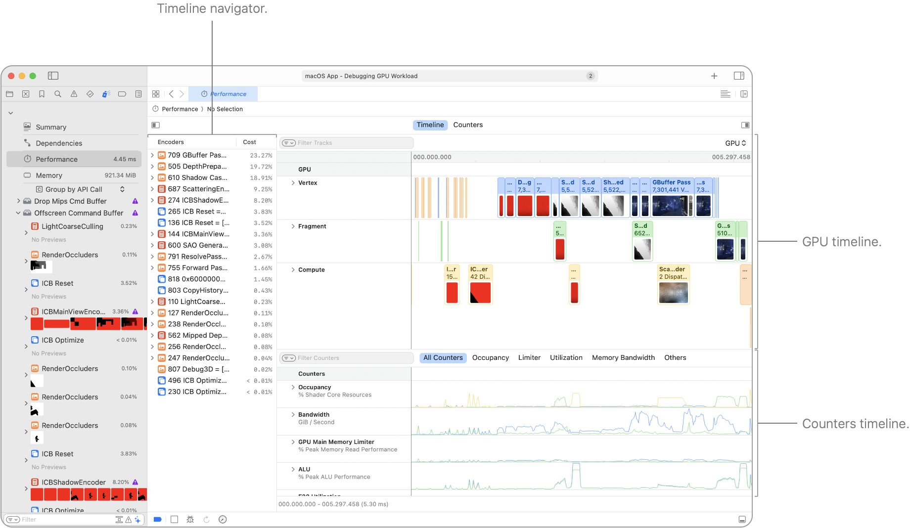
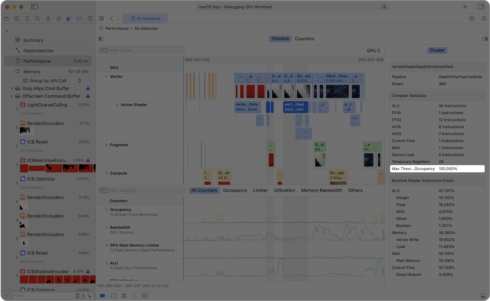
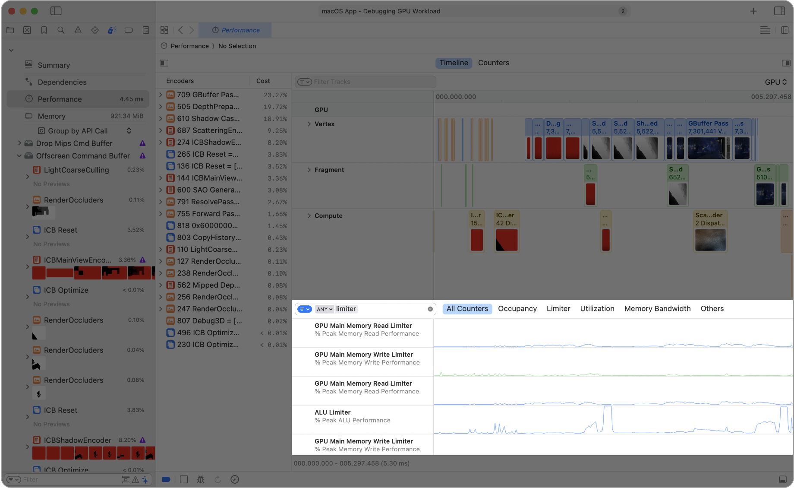

> 导航：[Technologies](../technologies.md) · [Xcode](../xcode.md) · [调试](debugging.md) · [Metal 调试器](metal-debugger.md)

# 使用可视化时间线分析 Apple GPU 性能

文章

使用 Performance 时间线定位性能问题。

## 概述

> [!important] 重要
> Performance 时间线功能仅适用于 Apple GPU。对于其他 GPU 架构，请参阅[使用计数器统计数据分析非 Apple GPU 性能](analyzing-non-apple-gpu-performance-using-counter-statistics.md)。

Apple GPU 会尽可能并行运行顶点、片元和计算任务。为了探索 Apple GPU 的并行特性，Performance 时间线可帮助你将同时运行的各种通道和阶段可视化。

Performance 时间线的屏幕截图，显示 Vertex、Fragment、Compute 和 Counters 轨道。其中选择了一个渲染通道，边栏显示其详细信息。

有关如何使用 Performance 时间线优化 Metal 工作负载，以及如何在不同 GPU 执行模式下对工作负载进行性能分析，请参阅[优化 GPU 性能](optimizing-gpu-performance.md)。

### 在时间线中查看着色器

顶部区域包含 Vertex、Fragment 和 Compute GPU 轨道，显示以重叠方式运行的各个通道的开始时间和持续时间。GPU 轨道下方是合并各个着色器的聚合着色器轨道。展开聚合着色器轨道后，你可以以瀑布式方式查看各个着色器的时间线。

底部区域包含独立的 Counters 时间线，其中有 Occupancy、Limiter 和 Bandwidth 等 GPU 计数器。计数器可帮助你诊断性能瓶颈。你可以在不同计数器标签页之间切换，聚焦于计数器的子集。

- **Occupancy** — GPU 能同时执行的线程数有一个上限。Occupancy 衡量 GPU 使用了多少此类容量。有关更多信息，请参阅[查找 Metal App 的 GPU 占用率](finding-your-metal-apps-gpu-occupancy.md)。
- **Limiter and utilization** — GPU 会并行处理多种操作，包括算术运算、内存访问和光栅化。Limiter 计数器包含 GPU 执行工作的时间，以及子系统中阻止 GPU 开始新工作的任何停顿时间。Utilization 计数器包含 GPU 在子系统中无停顿地执行工作的时间。有关更多信息，请参阅[减少着色器瓶颈](reducing-shader-bottlenecks.md)。
- **Bandwidth** — GPU Read Bandwidth 和 GPU Write Bandwidth 计数器衡量 GPU 访问系统内存的数据量和频率。有关更多信息，请参阅[测量 GPU 的内存带宽使用情况](measuring-the-gpus-use-of-memory-bandwidth.md)。

### 显示其他信息

点按 Performance 时间线中的任意轨道会将其选中，并在边栏中显示有关该轨道的其他信息。

- **GPU track** — 选择 Vertex、Fragment 或 Compute 等 GPU 轨道后，会显示汇总轨道中元素的表格。Performance 时间线会使用当前选择的时间范围筛选元素。你可以点按表格中的 Duration 列，按持续时间对元素排序。
- **Aggregated shader track** — 选择聚合着色器轨道后，会列出所有着色器及其持续时间。Performance 时间线会使用当前选择的时间范围筛选着色器。
- **Counter track** — 选择任意计数器轨道后，会在边栏中列出所有计数器及其平均值。Performance 时间线会使用当前选择的时间范围聚合平均值。

同样，点按 Performance 时间线中的任意元素会将其选中，并在边栏中显示有关该元素的其他信息。

- **Encoder** — 选择编码器后会显示其统计数据。对于渲染通道，还会显示渲染附件的预览。
- **Load and store action** — 选择加载或存储操作后，会显示相关渲染通道的元数据。
- **Shader** — 选择着色器后会显示其统计数据，例如编译器统计数据和运行时着色器指令开销。此外，编译器统计数据区域还包含着色器的 Max Theoretical Occupancy。有关占用率的更多信息，请参阅[查找 Metal App 的 GPU 占用率](finding-your-metal-apps-gpu-occupancy.md)。

Performance 时间线的屏幕截图，其中高亮显示了边栏中运行时着色器指令开销区域的 Max Theoretical Occupancy 行，该行显示为 100%。

### 使用筛选器限制范围

通过 GPU 时间线或 Counters 时间线底部的筛选栏调整轨道筛选条件。你可以在该栏中输入筛选词，GPU 时间线或 Counters 时间线会显示名称与这些词匹配的轨道。例如，在筛选栏中添加 “limiter”，可以将 Counters 时间线简化为仅显示 limiter 计数器。

Performance 时间线的屏幕截图，其中高亮显示 Counters 轨道。筛选条件包含 limiter 一词，Counters 时间线仅显示 limiter 计数器。

对于任意筛选词，你都可以点按它并选择包含或排除与该词匹配的轨道。

### 搜索特定元素

选择 Find \> Find，在 Performance 时间线上方显示搜索栏。你可以在搜索栏的文本栏中输入搜索词，以查找匹配的命令编码器和着色器。

对于任意搜索词，你都可以点按它并选择包含或排除与该词匹配的元素。

文本栏右侧的两个箭头按钮让你能够在时间线中移至上一个或下一个匹配元素。

### 聚焦于元素的时间范围

聚焦于某个元素的时间范围会折叠 Performance 时间线中不相关的时间范围：

- 要聚焦于编码器，请按住 Control 键点按时间线中的元素，然后选择 Focus on Encoder。
- 要聚焦于着色器，请按住 Control 键点按时间线中的元素，然后选择 Focus on Shader。

要退出聚焦模式，请点按 Performance 时间线底部的 Expand Timeline 按钮。

### 尽量减少性能瓶颈

- 查找异常长的通道。检查各项任务的 GPU 时间是否符合预期或超过预算时间。
- 尝试重叠 GPU 任务。Apple GPU 会尽可能并行运行顶点、片元和计算任务。例如，彼此独立的渲染通道和计算通道可以并行运行。如果观察到工作之间没有重叠，请检查 GPU 工作是否过度串行化。此外，请尽可能使用并发计算通道，以便接触不同资源的调度能够并发执行。
- 避免过多小型通道。通道之间存在设置时间，因此小型通道会增加延迟。
- 利用计数器提供的洞察改进关键路径中的通道。GPU 轨道下方提供的计数器轨道会显示几项关键性能指标。通过高效的 GPU 工作争取更高占用率。将 limiter 作为线索，把一部分工作转移到 GPU 中利用不足的子系统。此外，你可以按住 Control 键点按 Performance 时间线中的任意通道，然后选择 Reveal in Counters，以查看该通道更详细的计数器数据。有关计数器的更多信息，请参阅[查找 Metal App 的 GPU 占用率](finding-your-metal-apps-gpu-occupancy.md)和[减少着色器瓶颈](reducing-shader-bottlenecks.md)。
- 优先优化关键路径中的通道。检查某个通道时，可以聚焦于 GPU 轨道下方聚合着色器轨道中正在运行的着色器。此外，你可以按住 Control 键点按 Performance 时间线中的任意着色器，然后选择 Open Shader。在 Shader 编辑器中，你可以查找逐行着色器性能分析统计数据，以识别热点。

## 另请参阅

### Metal 工作负载分析

- [分析 Metal 工作负载](analyzing-your-metal-workload.md) — 使用 Metal 调试器调查 App 的工作负载、依赖项、性能和内存影响。
- [分析资源依赖项](analyzing-resource-dependencies.md) — 通过了解资源之间的关系，避免 Metal App 中不必要的工作。
- [分析内存使用情况](analyzing-memory-usage.md) — 通过检查资源来管理 Metal App 的内存使用情况。
- [使用计数器统计数据分析 Apple GPU 性能](analyzing-apple-gpu-performance-using-counter-statistics.md) — 通过检查各个通道和命令的计数器来优化性能。
- [使用性能热力图分析 Apple GPU 性能](analyzing-apple-gpu-performance-using-performance-heatmaps-a17-m3.md) — 通过检查源代码执行情况，深入了解 SIMD 组性能。
- [使用着色器开销图分析 Apple GPU 性能](analyzing-apple-gpu-performance-using-shader-cost-graph-a17-m3.md) — 通过检查管线状态，发现潜在的着色器性能问题。
- [使用计数器统计数据分析非 Apple GPU 性能](analyzing-non-apple-gpu-performance-using-counter-statistics.md) — 通过检查各个通道和命令的计数器来优化性能。
