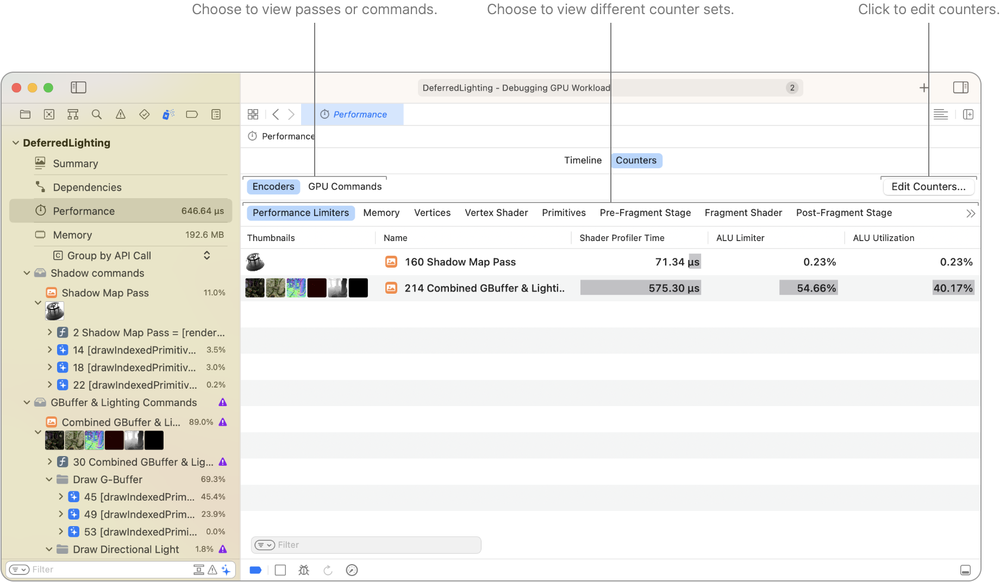
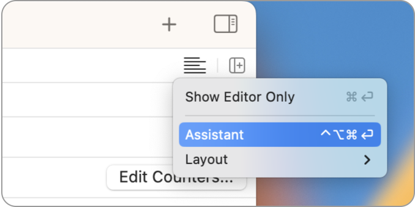
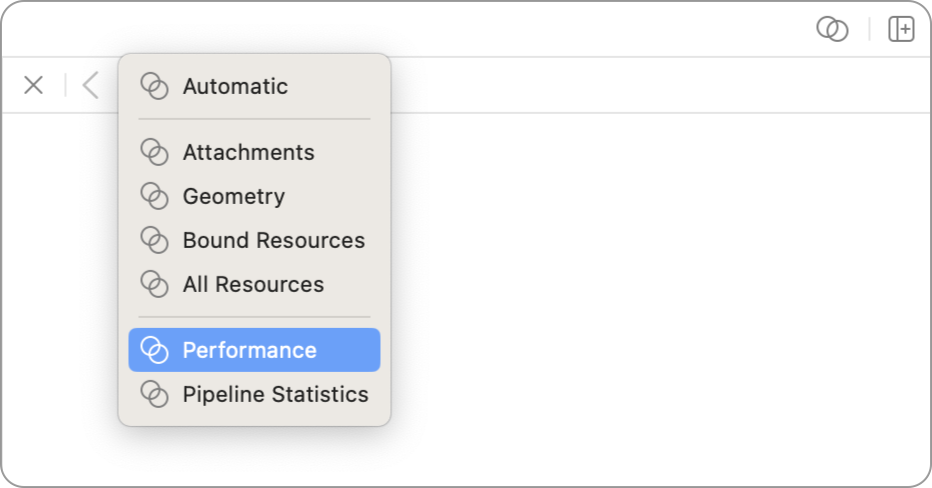
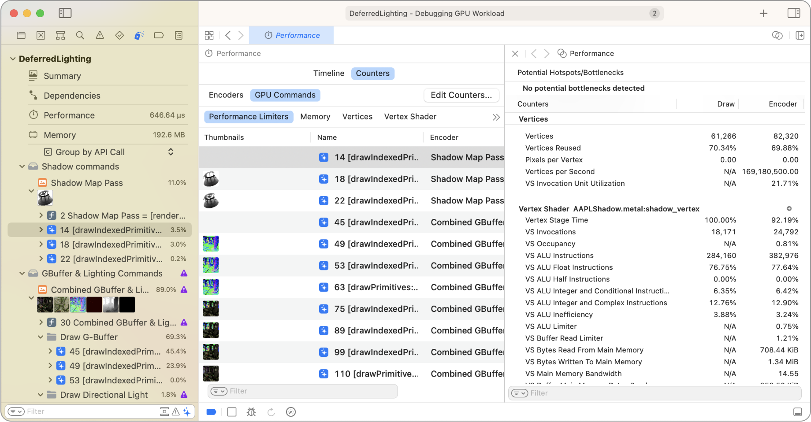
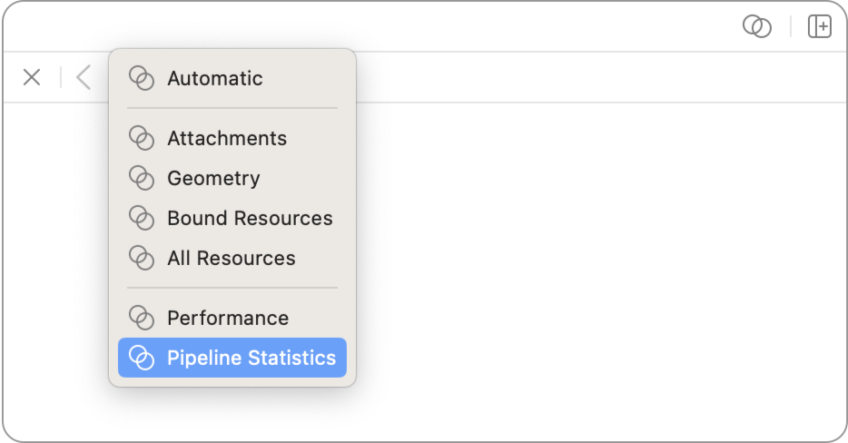
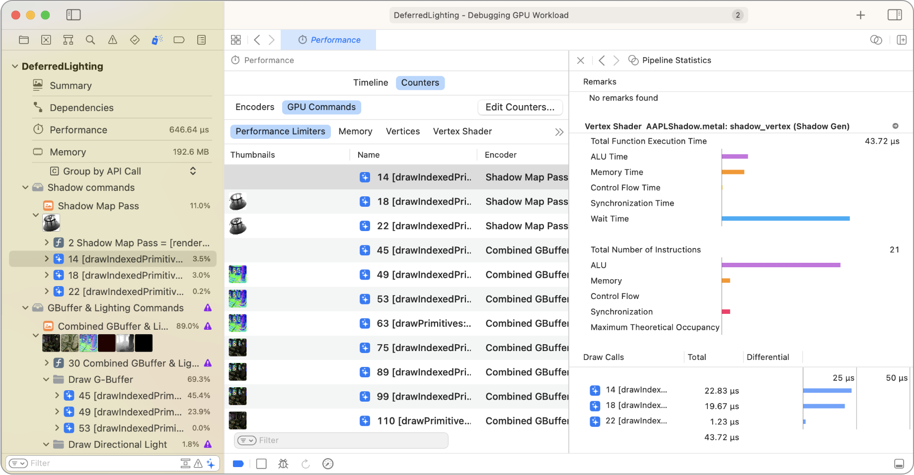

> 导航：[技术](../technologies.md) · [Xcode](../xcode.md) · [调试](debugging.md) · [Metal 调试器](metal-debugger.md)

# 使用计数器统计数据分析 Apple GPU 性能

文章

通过检查各个通道和命令的计数器来优化性能。

## 概述

> [!important] 重要
> Performance counters 功能仅适用于 Apple GPU。对于其他 GPU 架构，请参阅[使用计数器统计数据分析非 Apple GPU 性能](analyzing-non-apple-gpu-performance-using-counter-statistics.md)。

Performance counters 会显示 GPU 追踪中 App 各个通道或命令的性能统计数据。这些计数器测量 GPU 上与硬件有关的活动，范围涵盖内存带宽、顶点数量、光栅化片元数量，以及纹理筛选 limiter 和 utilization 百分比。

Metal 调试器会从无重叠运行的通道中收集数据，因此性能分析器测量性能时，设备上每次只运行一个通道。此外，它还包含不随时间变化的确定性计数器，例如渲染通道中的顶点数量。

### 查看通道或命令的不同计数器集合

在图表顶部，你可以点按 Encoders 或 GPU Commands 标签页，选择按通道或命令粒度查看计数器。然后，可以选择要用于查看计数器集合的计数器组。此外，点按右侧的 Edit Counters 按钮，可以创建计数器集合，或自定现有集合以适应你的性能优化工作流程。

### 在辅助编辑器中查看性能计数器

辅助编辑器让你能够查看各个通道和命令的其他信息。点按 Adjust Editor Options 按钮并选择 Assistant 选项，即可启用辅助编辑器。

选择通道或命令后，辅助编辑器会显示其性能计数器。如果看到的不是性能计数器，可以从编辑器左上角的下拉式菜单中选择 Performance。

辅助编辑器中的性能计数器让你能够检查特定通道或命令的所有计数器。通过分析可能成为热点的值，计数器可以提示 App 性能问题的具体原因。例如，如果顶点数量是预期值的两倍，很可能是代码中存在重复网格或重复的渲染编码器绘制调用。

有关更多信息，请参阅[使用 GPU 计数器分析绘制命令和计算调度性能](analyzing-draw-command-and-compute-dispatch-performance-with-gpu-counters.md)。

### 查看命令的管线统计数据

选择命令后，你可以在辅助编辑器中查看其管线统计数据。你可以从 Assistant Editor 下拉式菜单中选择 Pipeline Statistics，以查看有关管线状态及其性能统计数据的信息。

辅助编辑器中的管线统计数据让你能够查看编译器指标和执行时间。辅助编辑器区域顶部以不同类别列出每个管线阶段的完成耗时。下方则列出使用相同管线阶段的命令及其着色器 GPU 时间。

有关更多信息，请参阅[使用管线统计数据分析绘制命令和计算调度性能](analyzing-draw-command-and-compute-dispatch-performance-with-pipeline-statistics.md)。

### 优化工作负载

开始优化工作负载时，可以调查几项值得关注的指标：

- **Performance Limiters 计数器集合中的计数器** — 将 limiter 作为线索，把工作转移到 GPU 中利用不足的子系统，以帮助消除特定子系统中的停顿。有关更多信息，请参阅[减少着色器瓶颈](reducing-shader-bottlenecks.md)。

- **Vertices 计数器集合中的 Vertices 计数器** — 检查渲染通道或绘制命令产生的顶点数量是否符合预期。

有时，计数器数据可能只能提示问题所在，此时利用其他 Metal 工具会有所帮助。例如，如果片元着色器时间异常高，可以使用 Shader 编辑器来发现片元着色器中哪些具体代码行拖慢了执行速度。有关更多信息，请参阅[检查着色器](inspecting-shaders.md)。

## 另请参阅

### Metal 工作负载分析

- [分析 Metal 工作负载](analyzing-your-metal-workload.md) — 使用 Metal 调试器调查 App 的工作负载、依赖项、性能和内存影响。
- [分析资源依赖项](analyzing-resource-dependencies.md) — 通过了解资源之间的关系，避免 Metal App 中不必要的工作。
- [分析内存使用情况](analyzing-memory-usage.md) — 通过检查资源来管理 Metal App 的内存使用情况。
- [使用可视化时间线分析 Apple GPU 性能](analyzing-apple-gpu-performance-using-a-visual-timeline.md) — 使用 Performance 时间线定位性能问题。
- [使用性能热力图分析 Apple GPU 性能](analyzing-apple-gpu-performance-using-performance-heatmaps-a17-m3.md) — 通过检查源代码执行情况，深入了解 SIMD 组性能。
- [使用着色器开销图分析 Apple GPU 性能](analyzing-apple-gpu-performance-using-shader-cost-graph-a17-m3.md) — 通过检查管线状态，发现潜在的着色器性能问题。
- [使用计数器统计数据分析非 Apple GPU 性能](analyzing-non-apple-gpu-performance-using-counter-statistics.md) — 通过检查各个通道和命令的计数器来优化性能。
