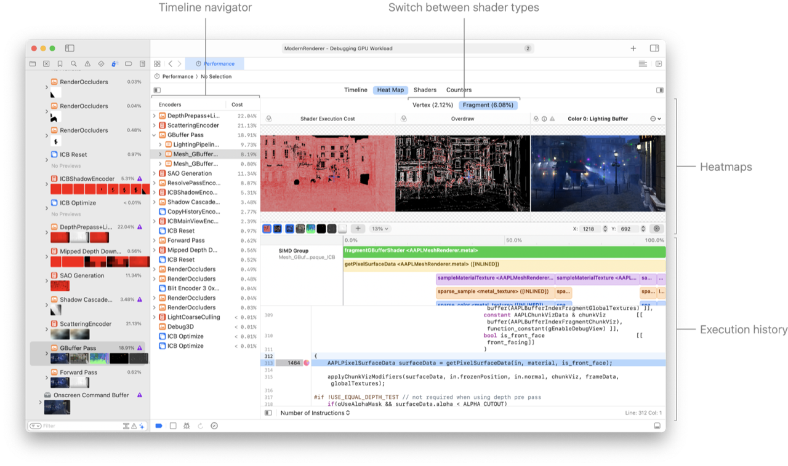
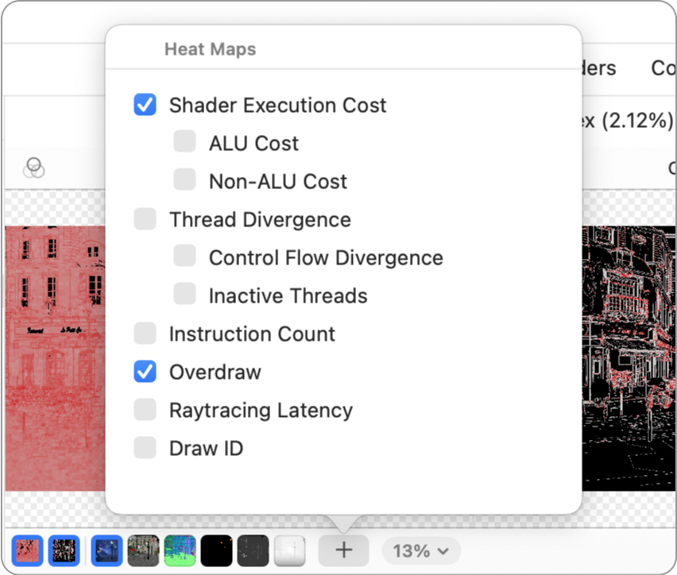
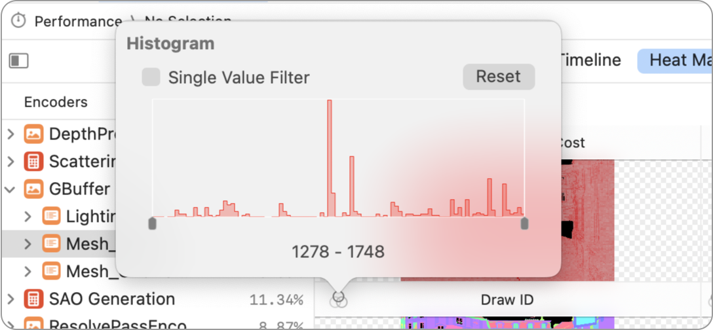
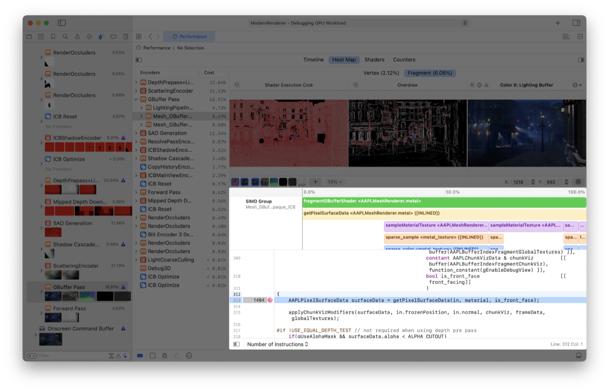

> 导航：[技术](../technologies.md) · [Xcode](../xcode.md) · [调试](debugging.md) · [Metal 调试器](metal-debugger.md)

# 使用性能热力图分析 Apple GPU 性能

文章

通过检查源代码执行情况，深入了解 SIMD 组性能。

## 概述

Metal 会将着色器的线程组织成单指令多数据（single-instruction, multiple-data，SIMD）组。性能热力图功能提供了一种快速查找开销较高或存在分歧的 SIMD 组的方法。你可以以图形方式检查 Apple GPU 如何执行这些组中的着色器源代码，并深入了解潜在的性能瓶颈。

> [!important] 重要
> 性能热力图功能适用于搭载 A17 Pro 或更新芯片的 iOS 设备，以及搭载 M3 或更新芯片的 Mac 电脑。

### 查看性能热力图

要打开性能热力图，请点按 Metal 调试器 Debug 导览器中的 Performance 按钮，然后点按 Performance 时间线上方的 Heat Map 标签页。

在 Timeline 导览器中选择编码器、管线状态或 GPU 命令时，对应工作的热力图会显示在右侧。

> [!note] 注意
> 性能热力图可用于渲染命令编码器、渲染管线状态和计算调度，但不支持计算命令编码器或计算管线状态。

此外，以下着色器类型也可使用性能热力图：

| 着色器类型 | 热力图像素位置 |
|---|---|
| 片元着色器 | 片元位置 |
| 对象着色器 | 线程位置 |
| 网格着色器 | 线程位置 |
| 计算着色器 | 线程位置 |

> [!note] 注意
> 对于计算、对象和网格着色器，当 x 轴或 y 轴的最大计算线程位置超过 8192 时，热力图中的每个像素表示一个 SIMD 组，而不是一个线程。

### 在着色器类型之间切换

默认情况下，选择渲染命令编码器、渲染管线状态或绘制命令会显示片元着色器热力图。选择计算调度命令会显示计算着色器热力图。

你可以使用热力图上方的 Vertex 和 Fragment 标签页，在不同着色器类型之间切换。

### 显示更多类型的性能热力图

默认情况下，渲染命令编码器、管线状态和绘制会显示 Shader Execution Cost 热力图及 Attachments。

点按热力图控制栏中的 Add 按钮（+），打开包含所有可用性能热力图的弹出窗口。你可以通过选择复选框来自定要显示的热力图。

点按热力图控制栏中的 Add 按钮后显示热力图选项的弹出式菜单屏幕截图，其中选择了 Shader Execution Cost 和 Overdraw 选项。

可用的性能热力图选项包括：

| 类型 | 描述 |
|---|---|
| Shader Execution Cost | 结合着色器执行时间和延迟隐藏，将着色器执行开销可视化。 |
| ALU Cost | 将着色器执行开销中的 ALU 部分可视化。 |
| Non-ALU Cost | 将着色器执行开销中的非 ALU 部分可视化。 |
| Thread Divergence | 将 SIMD 组中的 GPU 线程分歧程度可视化。 |
| Control Flow Divergence | 将 `IF` 条件等控制流差异引起的 GPU 线程分歧可视化。 |
| Inactive Threads | 将因几何体形状或计算调度网格尺寸而出现的非活动线程所引起的 GPU 线程分歧可视化。 |
| Overdraw | 将写入像素的 SIMD 组数量可视化。 |
| Instruction Count | 将每个像素或每个 SIMD 组的指令数量可视化。 |
| Raytracing Latency | 将经过光线追踪单元的光线追踪指令延迟可视化。 |
| Draw ID | 对渲染通道中的不同绘制进行颜色编码。 |

热力图中的颜色强度表示数值的重要程度。例如，在 Shader Execution Cost 热力图中，红色表示_开销更高_；在 Thread Divergence 热力图中，红色表示_分歧更大_。

### 查看并调整性能热力图的取值范围

点按标题栏中的 Histogram 按钮，可以筛选性能热力图并对其进行色调映射。

直方图弹出窗口会显示热力图的取值范围。你可以拖动控制柄调整范围，以筛除较小和较大的值。当你想查看特定取值范围时，这很有用，例如显示一个渲染通道中执行超过 100 条指令的像素。

### 检查 SIMD 组的执行历史

选择热力图中的一个像素，可以检查底层 SIMD 组。

如果一个渲染通道中有多个 SIMD 组接触该像素，系统会按开销百分位顺序显示 SIMD 组列表，让你选择要检查的组。在列表中选择 SIMD 组后，其执行历史会显示在热力图下方。

Execution History 时间线从左到右显示所选 SIMD 组的执行进度，并从上到下列出每个执行点的完整着色器调用栈。

Metal 调试器还会检测着色器指令流中的循环并将其可视化，帮助你更好地理解着色器执行情况。你可以在时间线中选择一个节点，源代码编辑器会跳转到包含该节点所执行指令的文件和代码行。

### 了解每行的指令数量

已执行指令的数量会显示在着色器源代码装订线中的代码行旁边。此数字是该行代码在整个 SIMD 组生命周期内执行汇编代码的总次数。

例如，如果某个循环迭代 10 次，在汇编代码量相同的情况下，循环内源代码行的指令数量会是循环外源代码行的 10 倍。

### 在逐行统计数据模式之间切换

在着色器源代码控制栏中，你可以为装订线中的逐行着色器性能分析统计数据选择不同模式。选项包括：

| 模式 | 描述 |
|---|---|
| Number of Instructions | 活动线程执行的汇编指令总数。 |
| Thread Divergence | 1 减去活动线程的指令总数除以系统理论上可执行的最大指令数。 |

如果所选 SIMD 组中有一个条件分支只有一半线程进入，你可能会看到线程分歧为 50%。

有关 M3 和 A17 Pro 的 Metal 性能分析工具的更多信息，请参阅[探索 M3 和 A17 Pro 的新 Metal 性能分析工具](https://developer.apple.com/videos/play/tech-talks/111374/)。

## 另请参阅

### Metal 工作负载分析

- [分析 Metal 工作负载](analyzing-your-metal-workload.md) — 使用 Metal 调试器调查 App 的工作负载、依赖项、性能和内存影响。
- [分析资源依赖项](analyzing-resource-dependencies.md) — 通过了解资源之间的关系，避免 Metal App 中不必要的工作。
- [分析内存使用情况](analyzing-memory-usage.md) — 通过检查资源来管理 Metal App 的内存使用情况。
- [使用可视化时间线分析 Apple GPU 性能](analyzing-apple-gpu-performance-using-a-visual-timeline.md) — 使用 Performance 时间线定位性能问题。
- [使用计数器统计数据分析 Apple GPU 性能](analyzing-apple-gpu-performance-using-counter-statistics.md) — 通过检查各个通道和命令的计数器来优化性能。
- [使用着色器开销图分析 Apple GPU 性能](analyzing-apple-gpu-performance-using-shader-cost-graph-a17-m3.md) — 通过检查管线状态，发现潜在的着色器性能问题。
- [使用计数器统计数据分析非 Apple GPU 性能](analyzing-non-apple-gpu-performance-using-counter-statistics.md) — 通过检查各个通道和命令的计数器来优化性能。
