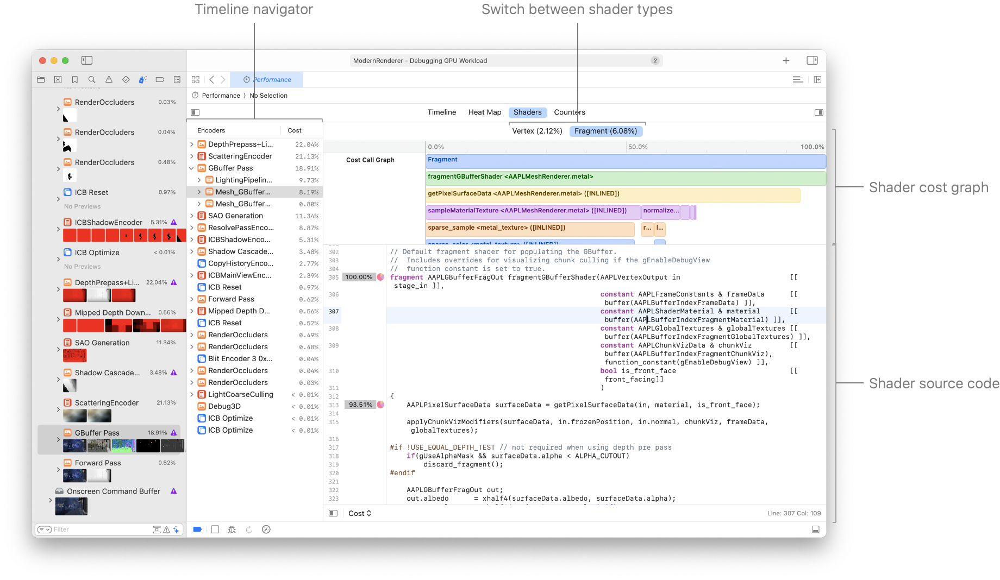
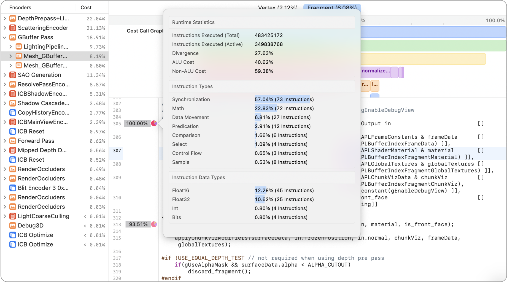

> 导航：[Technologies](../technologies.md) · [Xcode](../xcode.md) · [调试](debugging.md) · [Metal 调试器](metal-debugger.md)

# 使用着色器开销图分析 Apple GPU 性能

文章

通过检查管线状态，发现潜在的着色器性能问题。

## 概述

对性能瓶颈进行分类的一种关键方法，是查看开销最高的着色器，了解哪些函数和代码行开销最大。着色器开销图让你能够快速查找开销较高的管线状态和着色器，并对其进行分类。

> [!important] 重要
> 着色器开销图功能适用于搭载 A17 Pro 或更新芯片的 iOS 设备，以及搭载 M3 或更新芯片的 Mac 电脑。

### 查看着色器开销图

要打开着色器开销图，请点按 Metal 调试器 Debug 导览器中的 Performance 按钮，然后点按 Performance 时间线上方的 Shaders 标签页。

> [!note] 注意
> 着色器开销图仅适用于管线状态。

在 Timeline 导览器中选择管线状态时，该管线状态的着色器开销图会显示在右侧。

### 在着色器类型之间切换

默认情况下，选择渲染管线状态会显示片元着色器开销图。选择计算管线状态会显示计算着色器开销图。

你可以使用着色器开销图上方的 Vertex 和 Fragment 标签页，在不同着色器类型之间切换。

### 浏览着色器开销图

顶部区域中的着色器开销图会将开销最高的着色器函数调用靠左对齐，并从上到下显示函数调用栈。对应着色器类型的着色器源代码显示在图表下方。

你可以在着色器开销图中选择函数，在下方的源代码编辑器中查看其着色器源代码。

### 了解逐行开销

百分比权重显示在着色器源代码装订线中代码行的左侧。

每个权重右侧的饼图包含性能统计数据，可帮助你改进着色器代码。将指针悬停在饼图上，可以显示某一行指令的详细细分。

点按饼图图标后出现的弹出窗口屏幕截图。弹出窗口包含运行时统计数据、指令类型和指令数据类型的信息。

指令详细信息包含以下运行时统计数据：

| 运行时统计数据 | 描述 |
|---|---|
| Instructions Executed (Total) | 着色器所有 SIMD 组中的所有线程执行的指令总数，其中包括 Metal 因几何体形状或条件分支而遮蔽的线程。 |
| Instructions Executed (Active) | 着色器所有 SIMD 组中的活动线程执行的指令总数。 |
| Divergence | 1 减去活动指令数除以指令总数。 |
| ALU Cost | ALU 指令的开销百分比，例如浮点或整数乘法指令。 |
| Non-ALU Cost | 非 ALU 指令的开销百分比，例如纹理采样指令。 |

着色器源代码行可能由不同指令类型的多条指令组成。例如，对纹理进行采样可能涉及数学、采样和同步指令。指令详细信息包括以下可能的指令类型及其开销：

- Math
- Comparison
- Select
- Bit Manipulation
- Conversion
- Permute
- Reduce
- Control Flow
- Predication
- Sample
- Synchronization
- Load Store
- Load
- Store
- Atomic
- Barrier
- Fragment Feedback
- Vertex Processing
- Image Access
- Data Movement
- Ray Tracing
- Image Block Load
- Image Block Write
- Image Write

每条算术指令可能会处理不同的数据类型，例如半精度浮点数或整数。指令详细信息包括以下可能的数据类型及其开销：

- Float16
- Float32
- Integer
- Bits

### 在逐行指标模式之间切换

在着色器源代码控制栏中，你可以为装订线中的逐行着色器性能分析统计数据选择不同模式。选项包括：

| 模式 | 描述 |
|---|---|
| Cost | 汇编指令加权开销的总和。 |
| Number of Instructions | 活动线程执行的汇编指令总数。 |
| Thread Divergence | 1 减去活动线程的指令总数除以系统理论上可执行的最大指令数。 |

有关 M3 和 A17 Pro 的 Metal 性能分析工具的更多信息，请参阅[探索 M3 和 A17 Pro 的新 Metal 性能分析工具](https://developer.apple.com/videos/play/tech-talks/111374/)。

## 另请参阅

### Metal 工作负载分析

- [分析 Metal 工作负载](analyzing-your-metal-workload.md) — 使用 Metal 调试器调查 App 的工作负载、依赖项、性能和内存影响。
- [分析资源依赖项](analyzing-resource-dependencies.md) — 通过了解资源之间的关系，避免 Metal App 中不必要的工作。
- [分析内存使用情况](analyzing-memory-usage.md) — 通过检查资源来管理 Metal App 的内存使用情况。
- [使用可视化时间线分析 Apple GPU 性能](analyzing-apple-gpu-performance-using-a-visual-timeline.md) — 使用 Performance 时间线定位性能问题。
- [使用计数器统计数据分析 Apple GPU 性能](analyzing-apple-gpu-performance-using-counter-statistics.md) — 通过检查各个通道和命令的计数器来优化性能。
- [使用性能热力图分析 Apple GPU 性能](analyzing-apple-gpu-performance-using-performance-heatmaps-a17-m3.md) — 通过检查源代码执行情况，深入了解 SIMD 组性能。
- [使用计数器统计数据分析非 Apple GPU 性能](analyzing-non-apple-gpu-performance-using-counter-statistics.md) — 通过检查各个通道和命令的计数器来优化性能。
