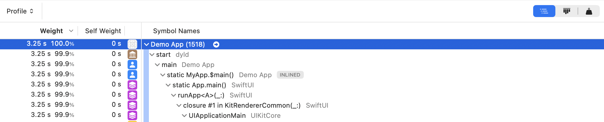
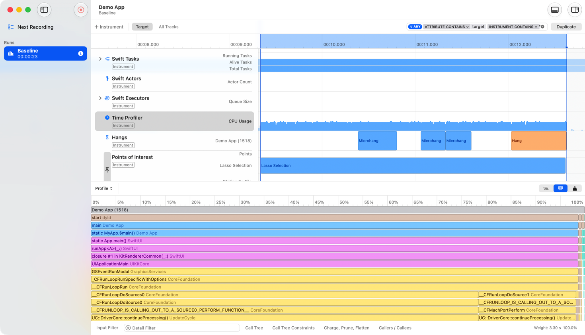
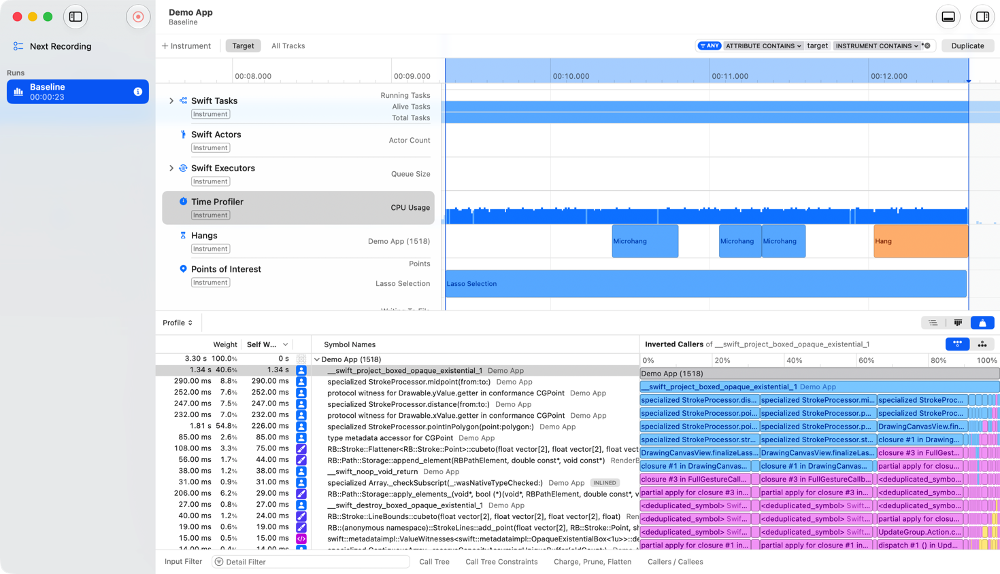
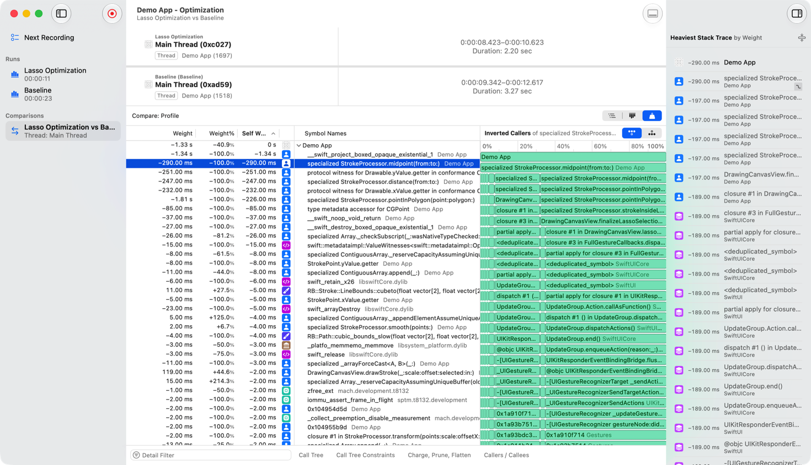

> 导航：[Technologies](../technologies.md) · [Xcode](../xcode.md) · [Performance and metrics](performance-and-metrics.md)

# 使用调用树视图分析 CPU 概况

<sub>文章</sub>

使用调用树可视化功能在 Instruments 中查找性能瓶颈。

## 概述

Instruments 会将性能分析数据组织成一棵调用树，以层级视图展示哪些函数消耗的时间最多。每个性能分析 instrument 都以自己的方式填充这棵调用树。大多数使用 CPU 采样，但也有一些使用其他技术，例如 Processor Trace，它从硬件的分支追踪指令中重建出调用树；又如 Swift Concurrency 中的 Task Creation Call Tree，它会在你的 App 每次创建任务时捕获一次回溯记录。

Instruments 提供三种方式来呈现同一份数据：标准调用树、火焰图和 Top Functions。每种模式呈现的规律模式各不相同，因此在它们之间切换有助于你发现单一视图中不明显的问题。

Run Comparison（运行对比）和 [OSSignposter](../os/ossignposter.md) 对调用树分析起到补充作用。借助 `OSSignposter`，你可以为代码标注具名的时间区间，这些区间会在 Instruments 中显示为带标签的时间段，你可以据此将调用树限定到某个特定操作上。Run Comparison 会生成两次独立录制之间调用树的差异，让你能够直接衡量某次代码更改是引入了衰退还是带来了改进。

## 在调用树视图模式之间切换

详细信息区域右上角的分段控制让你可以在三种调用树视图模式之间选择：Call Tree、Flame Graph 和 Top Functions。点按相应的按钮即可切换模式。切换模式时，底层的采样数据不会改变，只有呈现方式会变化。

在火焰图中：

1. 在触控板上做捏合手势，或在滚动时按住 Option 键，可进行水平缩放。
2. 缩放后滚动即可平移。
3. 点按某个色块以选中它，使用箭头键移动所选内容，用次按键点按可打开上下文菜单。



<sub>Instruments 详细信息视图的截图，以及用于在 Call Tree、Flame Graph 和 Top Functions 模式之间切换的分段控制。</sub>

## 使用火焰图探索性能概况

火焰图展示的数据与标准调用树相同，但以色块网格的形式对其进行可视化组织。x 轴代表样本所占的百分比。当某个调用栈位置上的某一帧被更多样本包含时，对应的色块就会更宽。纵轴代表调用栈深度，各帧按照它们在所记录调用栈中出现的顺序排列。

在每一层内，火焰图会遵循与调用树相同的排序原则——把较重（采样更多）的被调用函数放在左侧，较轻的放在右侧，就像调用树把最重的分支排在顶部一样。在调用树中，你可以点按列标题来反转排序方向，但火焰图始终把最重的排在左侧。

当调用树有多个权重列（例如 Time Profiler 中的 Weight 和 Self Weight）时，火焰图会使用调用树当前所依据的排序列。火焰图不支持自身权重（self-weight）列，因为要显示自身权重，就需要把更大的条形放在更小的条形下面。如果你在打开火焰图时正按某个自身权重列排序，Instruments 会自动切换到相应的总权重列。

火焰图是展开调查的良好起点，因为你可以一眼扫视整个庞大的性能概况，发现代表开销较大的帧的宽色块，并快速识别出与热点相对应的形状。当你选中某一帧时，右侧的检查器会显示该帧最重的调用栈跟踪——即占样本数最多的那条具体调用链。在许多情况下，这足以确定一个优化目标，而无需进一步探索调用层级结构。

标准调用树更适合对单个代码路径进行详细分析；它以展开的表格形式显示精确的样本计数，便于比较调用签名，或导览到你心中已有的某个具体调用树。这两种视图展示的是同一份数据，并且都支持完整的调用层级导览，因此在它们之间切换不会丢失任何信息。



## 使用 Top Functions 查找性能热点

Top Functions 会将整段录制过程中同一个符号的所有样本汇总在一起，无论是哪个调用者调用了该符号。在标准调用树中，一个被 10 个不同调用者调用的函数会出现 10 次，每个调用者下面各出现一次。而在 Top Functions 中，同一个函数只出现一次，其所有样本都合并到一行中。

这种汇总能揭示出标准调用树或火焰图可能掩盖的热点。一个在每个调用者下单独看开销都不大的函数，在把它的所有样本合并起来之后，可能会显得贡献巨大。Top Functions 让这种规律模式变得可见。

详细信息区域分为两栏：左侧是 Top Functions 表格，右侧是一幅火焰图。检查器会显示所选内容在相邻火焰图中最重的调用栈跟踪。

默认情况下，Instruments 会对 Top Functions 表格进行排序，把消耗 CPU 时间最多的函数放在最上面。这里只计算每个函数自身代码所花费的时间，不包括它等待所调用的其他函数所花费的时间。在表格中选中某个符号，即可在相邻的火焰图中填充记在该符号名下的所有样本。火焰图默认采用 Inverted Callers（反转调用者）配置，展示是谁调用了所选符号。切换到 Callees（被调用者）可查看所选符号调用了什么。当工具栏中的 Invert Call Tree 选项启用时，火焰图会显示 Callers 或 Inverted Callees，而不是常规的切换选项。底部工具栏中的所有过滤器和调用树选项都适用于 Top Functions。



<sub>Instruments 的一张截图，展示了 Top Functions 的分栏布局：左侧是 Top Functions 表格，右侧是相邻的火焰图。</sub>

## 标记性能区间

借助 [OSSignposter](../os/ossignposter.md)，你可以为代码标注具名的时间区间，Instruments 会将它们显示为时间线轨道中带标签的时间段。在时间线中选中某个时间段，会将活动时间范围设置为该区间，从而让所有调用树视图只过滤显示该时段内的样本。

从 [os](../os.md) 框架中创建一个带有 subsystem 和 category 的 `OSSignposter`，或者从现有的 [Logger](../os/logger.md) 初始化一个。在工作开始前调用 `beginInterval(_:id:)`，在工作结束时调用 `endInterval(_:_:)`。name 参数是一个 [StaticString](../swift/staticstring.md)，因此请使用字符串字面量，或者一个 `StaticString` 类型的 `let` 常量，如下所示：

```swift
let signposter = OSSignposter(subsystem: "com.example.myapp", category: .pointsOfInterest)
let state = signposter.beginInterval("renderFrame")
defer { signposter.endInterval("renderFrame", state) }
// Perform rendering work.
```

有关 signpost 类型、消除歧义，以及如何在 Instruments 中显示 signpost 数据的更多详情，请参阅[记录性能数据](../os/recording-performance-data.md)。

## 比较性能分析记录

Run Comparison 展示了同一份 Instruments 文档中两次不同录制的调用树视图之间的差异。当你想衡量某次代码更改是提升了还是拖累了某个特定操作的性能时，可以使用它。要比较多次录制，只需多次点按录制按钮，在同一份文档中录制至少两次运行。

为了在没有无关活动带来的环境噪声干扰的情况下进行准确比较，请在比较之前将两条跟踪记录都过滤到同一个 `OSSignpost` 区间。在每次运行的时间线中选中对应的 signpost 区间，以设置活动时间范围。这样可以确保比较反映的是同一个逻辑操作，而不是整段录制。

要打开比较弹出窗口，点按工具栏中的「比较」按钮（⇆）或按 Command-K。该弹出窗口列出了可供比较的、来自其他运行的调用树。系统会根据所选的轨道来匹配调用树。对于像 Time Profiler 这样的顶层 instrument 轨道，每一次包含该 instrument 的运行都会出现。对于其他轨道，例如进程或线程轨道，弹出窗口会列出每次运行中匹配的轨道。如果某次运行没有匹配的轨道，它就完全不会出现。从下拉菜单中选择基准运行以开始比较。

Instruments 会将候选运行（通常是较新的或测试用的构建版本）标注为 (+)，将基准运行（参照构建版本）标注为 (−)。每次运行使用不同的颜色：红色色块表示衰退，绿色色块表示改进。百分比反映的是两次运行之间的变化，而不是占总样本数的比例。只出现在候选运行中的节点显示为 +∞；只出现在基准运行中的节点显示为 −100%。

默认情况下，运行对比中的 Top Functions 会按排序把最大的衰退项放在最上面。要改为显示改进项，点按列标题即可反转排序方向。

比较火焰图为同一份数据提供了可视化概览。色块大小反映了两次运行之间变化的绝对幅度：表示衰退（候选运行中样本更多）的色块出现在右侧，表示改进（样本更少）的色块出现在左侧，中间的灰色色块表示变化接近于零。

在运行对比期间，所有调用树的过滤和操作选项都可用，包括 Charge、Prune、Flatten 以及调用树约束条件。这些选项有助于整理自动生成的比较结果，得到更有用的可视化效果。运行对比期间无法使用 Source 视图。



<sub>Instruments 的一张截图，以 Top Functions 模式显示了一次运行对比。详细信息视图左侧显示了符号名称及其权重对比，右侧是表示改进的绿色色块。</sub>

## 另请参阅

### 处理器使用情况

- [处理 CPU 瓶颈](addressing-cpu-bottlenecks.md) — 定位并修复流水线停滞、缓存未命中等性能问题。
- [使用 Processor Trace instrument 分析 CPU 使用情况](analyzing-cpu-usage-with-processor-trace.md) — 识别你 App 中低效使用 CPU 的代码。
