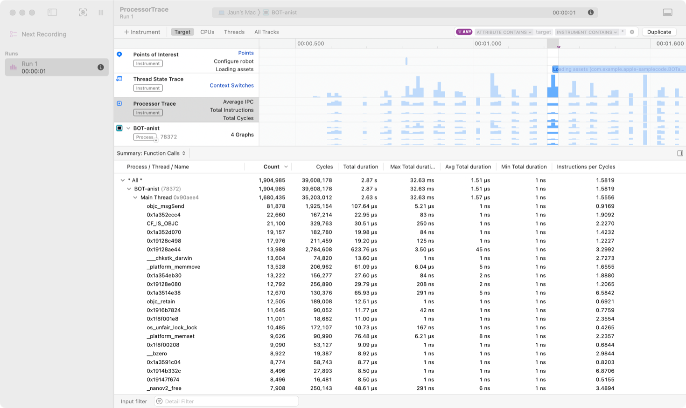
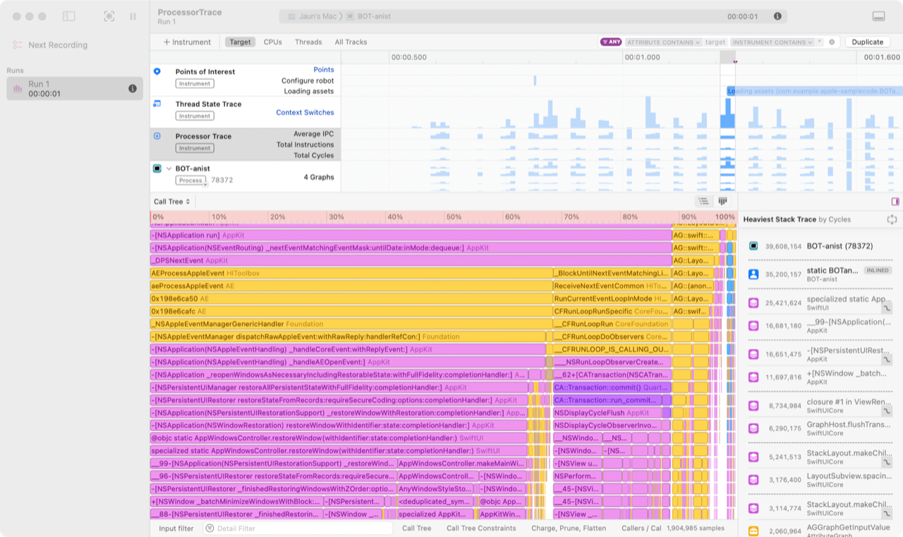
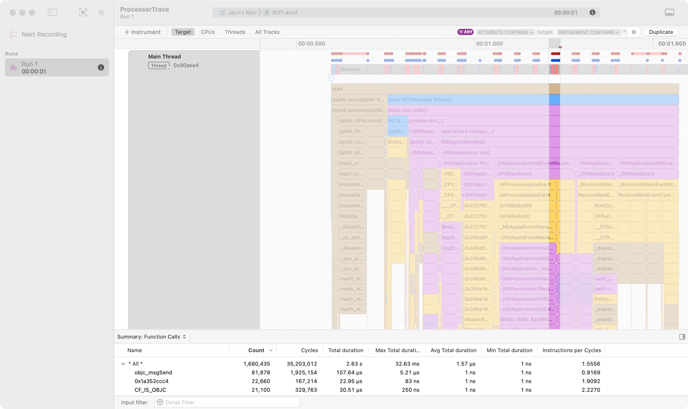
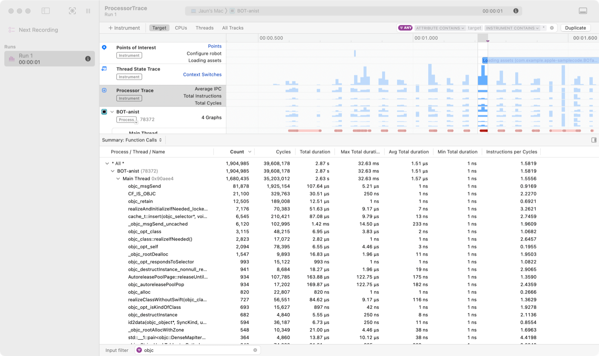
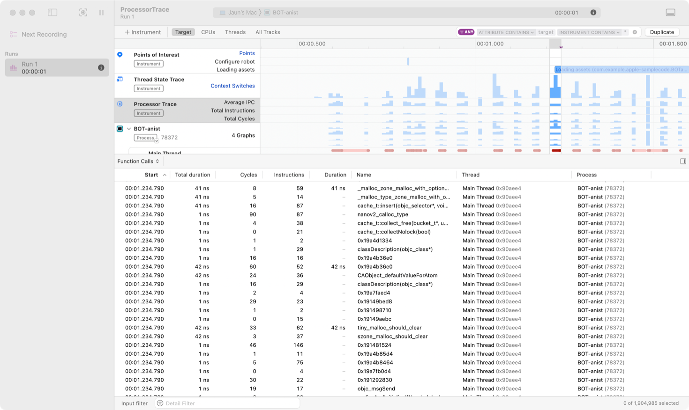
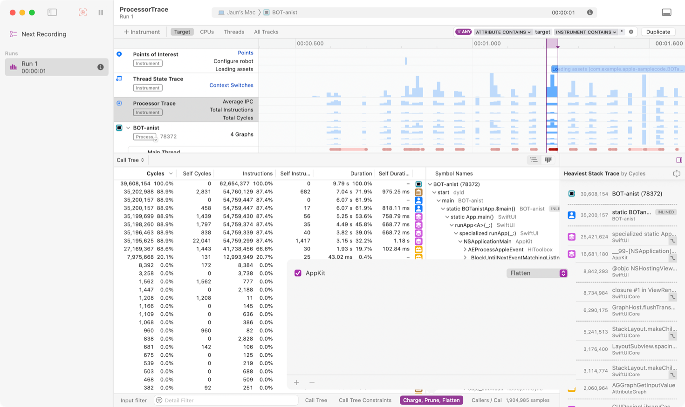

> 导航：[Technologies](../technologies.md) · [Xcode](../xcode.md) · [Performance and metrics](performance-and-metrics.md)

# 使用 Processor Trace instrument 分析 CPU 使用情况

文章

识别你 App 中低效使用 CPU 的代码。

## 概述

较新的 Apple 芯片设备可以捕获一份 _处理器跟踪记录（processor trace）_，其中 CPU 会存储有关其运行代码的信息，包括所采取的分支和跳转到的指令。CPU 会将这些信息流式传输到文件系统上的一个区域，以便你使用 Processor Trace instrument 对其进行分析。处理器跟踪记录能以极小的运行时开销捕获所有运行中线程的信息。你的设备在录制处理器跟踪记录时，速度通常比不录制时慢不到 1%。

> [!note] 注意
> 当你使用 Instruments 对 App 进行性能分析时，系统会执行其他跟踪活动，因此你看到的总运行时开销可能会超过 1%。

你可以在 Instruments 16.3 及更高版本中使用 Processor Trace instrument 来分析你 App 的处理器跟踪记录，并将你 App 执行的每一次函数调用可视化呈现出来。Processor Trace instrument 包含你 App 在所有函数中花费的时间，包括编译器生成的代码，例如 Swift 中的自动引用计数 (ARC) 内存管理代码，以及 C++ 中合成的构造函数和析构函数。

使用 Processor Trace instrument，在你于 App 中执行特定活动时收集有关你代码所运行函数的信息。分析运行缓慢或占用大量处理器资源的操作，以确定你的 App 是否有可能以更高效的方式处理其数据，例如使用不同的算法，或缓存计算结果以供再次使用。

## 使用受支持的硬件和软件

你可以使用以下硬件录制处理器跟踪记录：

- iPhone 16 及 iPhone 16 Pro 或更新机型
- 搭载 M4 或更新芯片的 iPad Pro
- 搭载 M4 或更新芯片的 Mac

请在 iOS 18.4 或更高版本、iPadOS 18.4 或更高版本，或 macOS 15.4 或更高版本上录制跟踪记录。

你可以在任何 Mac 上使用 Instruments 分析已保存的处理器跟踪记录文件，包括那些不支持_录制_处理器跟踪记录的 Mac。

## 录制处理器跟踪记录

在 Xcode 中按照以下步骤录制处理器跟踪记录：

1. 选择「Product」\> 「Profile」，选择 Processor Trace 模板，然后点按「Choose」。
2. 点按录制按钮。
3. 与你的 App 交互，执行你可能想要分析的任何特定功能。
4. 点按停止按钮。

Instruments 会处理跟踪数据，并显示该跟踪记录的时间线，其中包括 Processor Trace 和 Thread State Trace instrument 的轨道。你可以分析这些跟踪数据，或者保存跟踪文件以便稍后分析，或与你的团队共享。

一张 Instruments 截图，突出显示了 Processor Trace 时间线，并在时间线中选中了一个区域。详细信息视图显示了所跟踪 App 主线程的函数调用摘要。

要录制并分析你分发给客户的 App 构建版本的处理器跟踪记录，你需要生成并存储该构建版本的调试信息，以便 Instruments 能用它生成函数调用回溯记录。更多信息请参阅[构建包含调试信息的 App](building-your-app-to-include-debugging-information.md)。

要为你的 App 提供调试符号，请在 Instruments 中按照以下步骤操作：

1. 选择「File」\> 「Symbols」。
2. 在「Symbols」窗口中，点按右上角的「Add Symbols」下拉按钮，然后选择「Add Folder of dSYMs」。
3. 导览到包含你 App 调试符号文件的文件夹。
4. 点按「Add」。

> [!note] 注意
> 某些地址（例如编译器为支持不同库之间函数调用而创建的分支岛（branch island））没有函数名。即使你提供了 App 的全部调试符号，Instruments 仍会将这些地址显示为原始指针值。

## 分析处理器使用情况

在 Instruments 的时间线视图中，Processor Trace 轨道中的 Target 视图会显示三个直方图：

- **Average IPC** — 在运行 Instruments 所跟踪进程的代码期间，处理器每个时钟周期完成的平均指令数。较慢的指令（例如从不在处理器缓存中的内存位置读取数据，以及对变量进行原子更新）需要更多周期才能完成每条指令。
- **Total Instructions** — 在运行 Instruments 所跟踪进程的代码期间，处理器完成的指令数量。
- **Total Cycles** — 在运行 Instruments 所跟踪进程的代码期间，处理器完成的周期数量。

要聚焦于你感兴趣的某个区域，在时间线中的 Processor Trace 轨道上，从该区域的一端点按并拖动到另一端。时间线下方的详细信息视图会显示三种视图之一，你可以使用详细信息视图左上角的 Call Tree 弹出式按钮来选择。

Call Tree 视图以自上而下的树状结构，展示 Instruments 所跟踪进程运行期间的处理器周期和指令，并为每次调用提供汇总统计信息。你也可以使用 Call Tree 视图右上角的「Graph」按钮，切换为火焰图可视化效果。火焰图展示了被跟踪进程运行每个函数所花费时间的比例，并按每个函数在调用栈中的位置进行组织。使用 Call Tree 视图可以调查各函数在运行自身代码，以及运行它们所调用函数的代码时分别花费了多少时间。

Summary: Function Calls 视图展示了你 App 在录制期间运行的函数的汇总信息，以及包括 App 运行每个函数的次数、该函数的活跃时长，以及处理器运行每个函数所使用的指令数量在内的统计数据。函数列表既包含库代码，也包含编译器合成的函数。使用此视图可以概览你 App 的时间花在了哪里，并据此确定需要深入调查的具体函数的优先级。

Function Calls 视图展示了 Instruments 在录制期间跟踪到的所有函数的列表，以及它们的时长、运行所在的线程和指令数量。使用此视图可以探索对某些函数的单次调用的线程回溯记录，或者将 Instruments 的检查范围聚焦到某次函数调用的时长上。

## 查看按时间排序的函数调用流程

点按时间线中你目标进程名称旁边的显示三角形，即可查看 Instruments 在该进程中跟踪到的线程列表，以及时间线中每个线程内活跃函数的可视化展示。选中某个线程的时间线轨道，然后选择「View」\> 「Selected Track」\> 「Size to Fit」来展开该轨道，在时间线中的各条目里显示活跃函数的名称。使用此视图可以了解你 App 的线程中正在运行哪个函数，并将该信息与 Instruments 时间线中的其他事件相关联。

## 按函数、进程或线程过滤详细信息视图

在 Processor Trace instrument 的任意详细信息视图中，在「Input filter」字段中输入函数名，或按住 Control 键点按某个函数并选择「Add to Detail Filter」，即可过滤该视图，使其只显示与该函数有关的信息。你也可以通过将进程或线程的名称添加到详细信息过滤器中，按进程或线程进行过滤。

一张 Instruments 截图，Input filter 字段中输入了 objc 一词，Summary: Function Calls 视图只显示名称中包含 objc 的函数。

## 将检查范围设置为某次函数调用的生命周期

Processor Trace instrument 的详细信息视图，显示的是 Instruments 在你于时间线中所选检查范围内记录到的进程信息。要分析某个特定函数的行为，请将检查范围设置为对该函数某次调用的生命周期。

在 Function Calls 视图中，按住 Control 键点按某个函数的 Duration 值，并选择「Set Inspection Range」，即可将时间线中感兴趣的区域更改为从处理器开始运行该函数到该函数退出之间的这段时间。

一张 Instruments 截图，详细信息视图显示了被跟踪进程在时间线视图中所选检查范围内所进行的函数调用。

## 对函数概况进行记账、剪除和展平

你可以对函数进行记账（charge），以便从概况中隐藏库代码，同时在分析中继续把处理器运行该库代码所花费的时间计算在内。当你将某个函数记账给其调用者时，系统会把 CPU 在该函数及其所调用函数中运行所花费的指令数和周期数，加到调用函数的指令数和周期数统计中。按住 Control 键点按某个符号名，选择「Charge "[_函数名_]" to Callers」，即可从视图中移除对该函数及其所调用函数的调用，并将它们的概况信息计入其调用者所报告的统计数据中。你也可以按住 Control 键点按某个库中某个函数的符号名，选择「Charge "[_库名_]" to Callers」，将该库中的所有函数都记账给它们的调用者。

你可以剪除（prune）函数，以隐藏不感兴趣或不相关的代码，从而专注于你想要分析的代码。在 Profile 视图中，按住 Control 键点按某个符号名，选择「Prune "[_函数名_]"」，即可从视图中移除对该函数及其所调用函数的调用。

你可以将库调用展平（flatten）到边界帧，以便从概况中隐藏库的内部细节，而不会从你的分析中移除该库代码。按住 Control 键点按某个符号名，选择「Flatten "[_库名_]" to Boundary Frames」，即可只显示该库中那些被其他库中的函数调用、并且调用了其他库中函数的函数。

点按详细信息视图底部的 Charge、Prune、Flatten 按钮，即可查看并更改你的选择。

一张 Instruments 截图，详细信息视图显示了被跟踪 App 的调用概况，其中 AppKit 库中的函数被展平到了边界帧。

## 检视你 App 的处理器使用情况

主线程上长时间运行的操作会导致你 App 界面出现冻结和卡顿，用户会将其感知为 App 无响应。如果处理器跟踪记录显示你 App 的主线程上存在高水平的处理器活动，请找出可以借助 Swift 并发或调度队列将处理工作移到后台的机会。更多信息请参阅[了解用户界面响应能力](understanding-user-interface-responsiveness.md)。

## 另请参阅

### 处理器使用情况

- [处理 CPU 瓶颈](addressing-cpu-bottlenecks.md) — 定位并修复流水线停滞、缓存未命中等性能问题。
- [使用调用树视图分析 CPU 概况](analyzing-cpu-profiles-with-call-tree-views.md) — 使用调用树可视化功能在 Instruments 中查找性能瓶颈。
