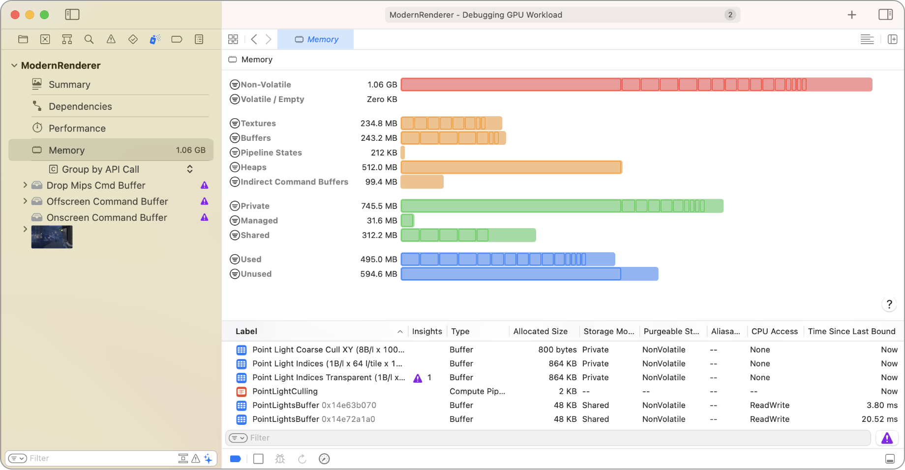
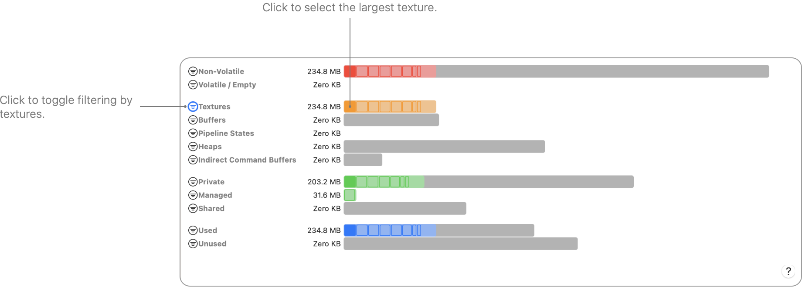
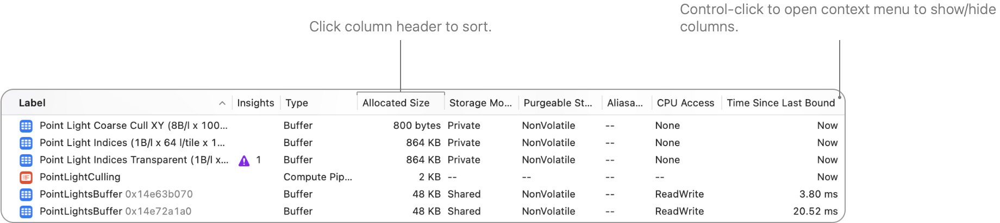
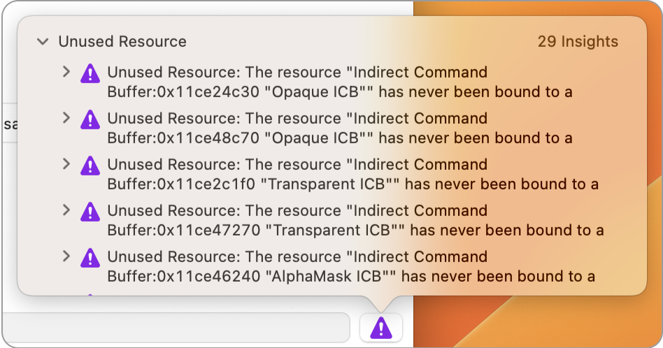

> 导航： [技术](../technologies.md) · [Xcode](../xcode.md) · [调试](debugging.md) · [Metal 调试器](metal-debugger.md)

# 分析内存使用情况

文章

通过检查 Metal App 的资源来管理内存使用。

## 概述

内存查看器（Memory viewer）提供了关于你的 App 在 Metal 中内存使用情况的全面信息。内存查看器的顶部区域按类别细分了内存使用情况，底部区域则显示了一个资源表。在表格中，你可以检查资源的内存大小、配置和其他特性。

内存查看器截图，顶部区域显示了汇总资源内存使用情况的条形图，底部区域是资源表。

Metal App 会创建许多资源，而这些资源会消耗大量内存。例如，要使用基于物理的渲染器来渲染一个动画角色，你可能需要缓冲区来保存顶点和动画数据，以及多个纹理来提供材质（material）属性。当把这些需求扩展到多个角色和更大的场景（scene）时，你的 App 的内存占用空间（memory footprint）会显著增长。

此外，在创建 Metal 资源时，精确指定其配置对性能有显著影响。Metal 调试器会分析你提供的配置，并使用它来创建资源的底层 GPU 表示。例如，如果你创建了一个私有存储模式的资源，Metal 可以针对 GPU 访问进行优化，并且不需要将数据存储在 CPU 可以直接访问的位置或格式中。

### 检查条形图

内存查看器顶部区域的类别组织了内存使用数据，并根据以下标准提供了内存总量：

- **易失性（Volatility）** ——此类别列出了_易失性（volatile）_和_非易失性_资源。非易失性内存总量是衡量你的 App 在 Metal 中已跟踪内存使用情况的一个良好指标。当你将一个资源标记为易失性时，你就是在允许 Metal 在内存不足时丢弃其内容。操作系统不会将易失性内存计入你的 App 的总内存占用空间。例如，在 iOS 中，较低的内存占用空间可以降低超出 jetsam 限制并被操作系统终止的风险。如果你认为将来可能会使用某个当前未使用的资源，请将其标记为易失性，而不是简单地释放它。这样，只有当 Metal 丢弃了这些内容时，你才需要重新创建资源内容。更多信息，请参阅 [setPurgeableState(_:)](<../metal/mtlresource/setpurgeablestate(__).md>)。
- **类型（Type）** ——此类别按类型列出资源——纹理、缓冲区等。检查此类别以确定你的 App 是否过度使用了某种特定类型的资源。
- **存储模式（Storage mode）** ——此类别按你在 [MTLStorageMode](../metal/mtlstoragemode.md) 中定义的模式列出资源。检查此类别以确定是否有过多的资源被标记为 [MTLStorageMode.shared](../metal/mtlstoragemode/shared.md) 或 [MTLStorageMode.managed](../metal/mtlstoragemode/managed.md)。
- **使用情况（Use）** ——此类别跟踪被捕获帧中的命令是否访问了资源。如果未使用的资源总量很大，则可能表明你需要释放某些资源或将其标记为易失性。

每个条形图由代表其所跟踪的最大资源的片段组成。每个条形图的最后一个片段显示其较小资源的总和。将指针悬停在一个片段上，可以查看一个弹出窗口，其中包含资源名称、大小和其他信息。点击一个片段可以获取关于该特定资源的更多信息。

内存查看器条形图截图，仅高亮显示纹理资源。消耗内存最多的纹理已被选中。

### 检查资源表

为了改进 App 创建和管理资源的方式，你需要了解其如何使用资源的数据。内存查看器提供了在捕获期间你的 Metal App 中活动资源的信息。

资源表为所有资源类型提供以下信息：

| 列 | 属性（Property） | 描述 |
|---|---|---|
| 标签（Label） | [label](../metal/mtlresource/label.md) | 创建资源时添加的标签。使用此信息在你的 App 中标识特定资源。要了解如何为资源命名，请参阅[命名资源和命令](naming-resources-and-commands.md)。 |
| 洞察（Insights） |  | 可能改善内存或资源使用的问题或优化建议。 |
| 类型（Type） |  | 资源的类型。对于纹理，此信息包括纹理的子类型。对于堆（heap），包括堆的子类型。 |
| 分配大小（Allocated Size） | [allocatedSize](../metal/mtlresource/allocatedsize.md) | 为资源分配的内存大小。 |
| 存储模式（Storage Mode） | [resourceOptions](../metal/mtlresource/resourceoptions.md) 或 [storageMode](../metal/mtlresource/storagemode.md) | 创建资源时选择的存储模式。 |
| 可清除状态（Purgeable State） |  | 资源的易失性。当你将资源标记为易失性时，系统可以在空闲内存不足时将其清除。操作系统在计算你的 App 的系统内存总量时不包含易失性资源。 |
| 可别名（Aliasable） | [isAliasable()](<../metal/mtlresource/isaliasable().md>) | 指示资源是否与同一堆上的另一个资源共享其关联内存。 |
| CPU 访问（CPU Access） |  | 指示你的 App 是否从 CPU 访问了该资源。 |
| 自上次绑定以来的时间（Time Since Last Bound） |  | 自上次将资源绑定到 Metal 命令编码器（command encoder）以来的时间。如果你从未绑定过该资源，或者已经很长时间没有绑定，可能可以释放该资源或将其标记为易失性。 |

对于纹理，你可以添加以下列：

| 列 | 属性（Property） | 描述 |
|---|---|---|
| 像素格式（Pixel Format） | [pixelFormat](../metal/mtltexture/pixelformat.md) | 创建纹理时选择的 Metal 像素格式。 |
| 宽度（Width） | [width](../metal/mtltexture/width.md) | 纹理基础 mipmap 的宽度，以像素为单位。 |
| 高度（Height） | [height](../metal/mtltexture/height.md) | 纹理基础 mipmap 的高度，以像素为单位。 |
| 深度（Depth） | [depth](../metal/mtltexture/depth.md) | 纹理基础 mipmap 的深度，以像素为单位。 |
| 数组长度（Array Length） | [arrayLength](../metal/mtltexture/arraylength.md) | 纹理数组中的切片数量。 |
| Mipmap 级别 | [mipmapLevelCount](../metal/mtltexture/mipmaplevelcount.md) | 纹理中的 mipmap 级别数量。 |
| 采样数（Samples） | [sampleCount](../metal/mtltexture/samplecount.md) | 每个像素中的采样数。 |
| 用途（Usage） | [usage](../metal/mtltexture/usage.md) | 指示着色器或 App 可以对纹理执行的操作。列表限制越多，Metal 可以对纹理应用的优化就越多。 |
| 无损压缩（Lossless Compression） |  | 指示纹理是否支持无损压缩。 |

对于缓冲区，你可以添加以下列：

| 列 | 属性（Property） | 描述 |
|---|---|---|
| 长度（Length） | [length](../metal/mtlbuffer/length.md) | 缓冲区的逻辑长度，以字节为单位。将此值与分配大小进行比较。为了向 GPU 提供可用内存，Metal 有时需要分配比你请求的更多的内存。如果你看到很多小缓冲区，请将系统一起使用的那些缓冲区合并到一个缓冲区中，或者在堆上分配这些缓冲区。这些替代分配策略可以节省内存，并且需要更少的工作来跟踪访问这些资源的命令之间的依赖关系。 |

对于堆，你可以添加以下列：

| 列 | 属性（Property） | 描述 |
|---|---|---|
| 大小（Size） | [size](../metal/mtlheap/size.md) | 堆的逻辑大小，以字节为单位。 |
| 已用大小（Used Size） | [usedSize](../metal/mtlheap/usedsize.md) | 堆为其他资源分配的字节数。 |
| 危险跟踪模式（Hazard Tracking Mode） | [resourceOptions](../metal/mtlheap/resourceoptions.md) 或 [hazardTrackingMode](../metal/mtlheap/hazardtrackingmode.md) | 堆上已分配资源的危险跟踪模式。 |

对于间接命令缓冲区，你可以添加以下列：

| 列 | 属性（Property） | 描述 |
|---|---|---|
| 大小（Size） | [size](../metal/mtlindirectcommandbuffer/size.md) | 系统用于保存编码命令的字节数。此总数不包括系统重置的任何命令的内存。将此大小与间接命令缓冲区的分配大小进行比较。根据你预期要在间接命令缓冲区内部执行的命令数量来选择其大小。 |

对于加速结构，你可以添加以下列：

| 列 | 属性（Property） | 描述 |
|---|---|---|
| 大小（Size） | [size](../metal/mtlaccelerationstructure/size.md) | 加速结构的逻辑长度，以字节为单位。 |

### 使用洞察（Insights）改进你的 Metal 工作负载

点击右下角的洞察按钮，打开一个包含资源推荐建议的弹出窗口。

### 使用筛选器限定范围

使用内存查看器底部的筛选器字段来调整筛选条件。将筛选词输入到字段中，资源表将显示其标签与这些筛选词匹配的任何资源。

你也可以点击筛选按钮来添加针对特定类型资源的筛选器，将表格限制为被捕获帧使用的资源，或者将表格仅限制为易失性资源。

当存在两个或更多筛选词时，你可以点击筛选按钮来选择是匹配任意一个还是所有词。对于任何筛选词，你可以点击它来选择是包含还是排除匹配该词的资源。

### 分组和排序资源以检测模式

默认情况下，资源表在一个列表中显示所有资源。你可以点击列标题，以按该列升序或降序对表格进行排序。你还可以按某些条件对资源进行分组。

按住 Control 键并点击表格中的条目，可以按以下任一条件对资源进行分组：

- **无（None）** ——恢复为默认行为，即在表格中显示所有资源而不进行分组。
- **类型（Type）** ——将资源分组为缓冲区、纹理、堆或间接命令缓冲区。
- **分配大小（Allocated Size）** ——按资源的实际大小进行分组。分组基于对数刻度。使用此条件来查找你的 App 中最大的资源。
- **存储模式（Storage Mode）** ——按创建每个资源时选择的存储模式进行分组。
- **命令缓冲区（Command Buffer）** ——根据哪些命令缓冲区引用了资源来进行分组。使用此条件来确定哪些命令正在引用哪些资源。
- **命令编码器（Command Encoder）** ——根据使用特定命令编码器的命令对资源进行分组。使用此条件来理解你的特定计算和渲染过程的行为。

从同一个上下文菜单中，你也可以选择按特定条件进行排序，这相当于点击列标题进行排序。

### 获取特定资源的更多信息

你也可以通过按住 Control 键并点击某个资源，然后选择“显示简介（Get Info）”来获取该资源的更多信息。

例如，对于纹理，附加信息会显示该纹理特有的详细信息，例如其像素格式和尺寸。要查看纹理的内容，请双击它。

### 导出内存报告

要共享内存查看器中的数据，你可以通过以下方式导出：

- 导出 GPU 跟踪：选择“文件（File）”>“导出（Export）”，然后选择一个位置来保存 GPU 跟踪文件。之后你可以打开该跟踪文件。
- 导出逗号分隔值（CSV）文件：选择“编辑器（Editor）”>“导出内存报告（Export Memory Report）”以生成 CSV 文件。生成的文件包含你在资源视图中看到的所有列。你可以在 Numbers 或其他电子表格 App 中打开此文件。

## 另请参阅

### Metal 工作负载分析

- [分析你的 Metal 工作负载](analyzing-your-metal-workload.md) ——使用 Metal 调试器调查你 App 的工作负载、依赖关系、性能和内存影响。
- [分析资源依赖关系](analyzing-resource-dependencies.md) ——通过了解资源之间的关系来避免 Metal App 中的不必要工作。
- [使用可视化时间线分析 Apple GPU 性能](analyzing-apple-gpu-performance-using-a-visual-timeline.md) ——使用性能时间线定位性能问题。
- [使用计数器统计数据分析 Apple GPU 性能](analyzing-apple-gpu-performance-using-counter-statistics.md) ——通过检查单个渲染过程和命令的计数器来优化性能。
- [使用性能热力图分析 Apple GPU 性能](analyzing-apple-gpu-performance-using-performance-heatmaps-a17-m3.md) ——通过检查源代码执行来深入了解 SIMD 组性能。
- [使用着色器成本图分析 Apple GPU 性能](analyzing-apple-gpu-performance-using-shader-cost-graph-a17-m3.md) ——通过检查管线状态来发现潜在的着色器性能问题。
- [使用计数器统计数据分析非 Apple GPU 性能](analyzing-non-apple-gpu-performance-using-counter-statistics.md) ——通过检查单个渲染过程和命令的计数器来优化性能。
