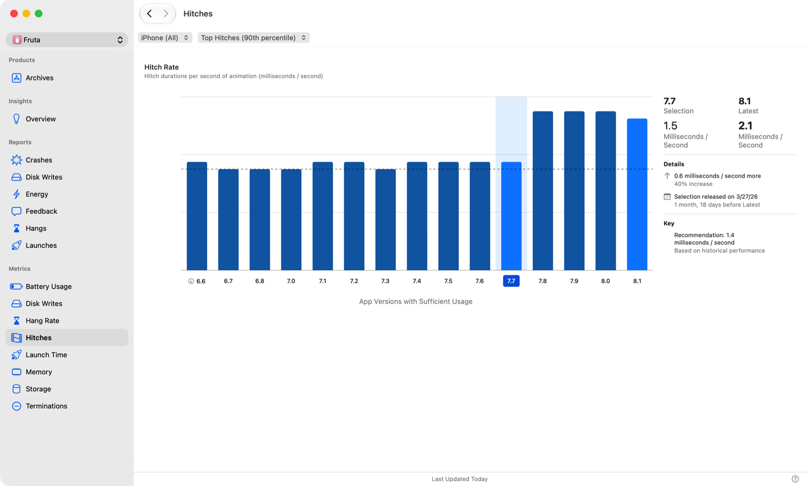
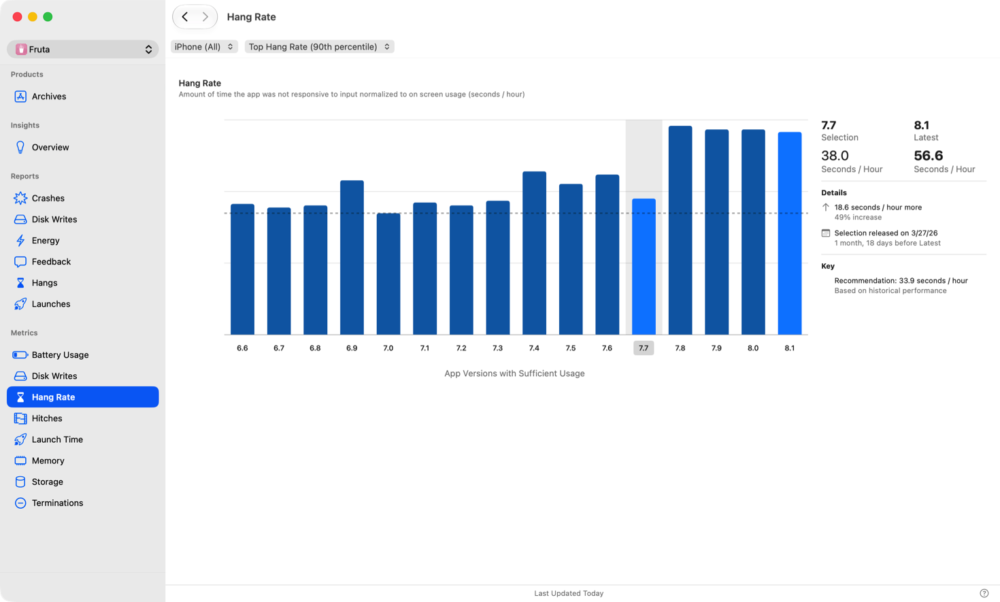
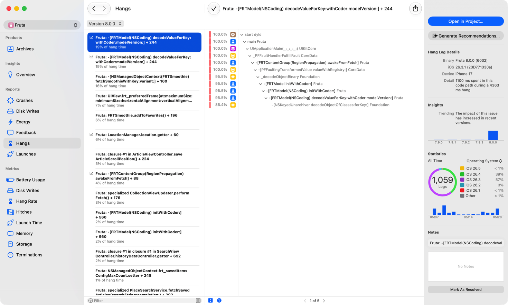

> 导航：[技术](../technologies.md) · [Xcode](../xcode.md) · [性能与指标](performance-and-metrics.md)

# 分析已发布 App 中的响应能力问题

文章

识别用户遇到的响应能力问题，并使用 Xcode Organizer 中的挂起（hang）和卡顿（hitch）数据确定最需要修复的问题。

## 概述

卡顿和挂起是两类会对 App 用户体验产生负面影响的响应能力问题。系统会监控运行中 App 的挂起和卡顿，并定期从统计样本中收集问题报告。Xcode Organizer 使用这些数据显示 App 的卡顿率、挂起率和单独的挂起报告。所有这些数据也可在 [MetricKit](../metrickit.md) 中获取，因此你可以在自己的基础设施中收集和汇总。有关挂起和卡顿的更多信息，请参阅[了解用户界面响应能力](understanding-user-interface-responsiveness.md)。

### 查看 App 的卡顿率

Xcode Organizer 窗口的 Hitches 面板会显示 App 卡顿率随时间变化的信息。卡顿率会跟踪 App 中所有动画交互的动画中断，包括滚动、过渡和其他连续运动。有关卡顿的更多信息，请参阅[了解 App 中的卡顿](understanding-hitches-in-your-app.md)。

一张 Xcode Organizer 窗口中 Hitches 指标面板的屏幕截图。从左到右依次为指标和报告列表、显示过去 15 个 App 版本卡顿率柱状图的指标 UI、所选版本、所选版本与最新版本的比较数据，以及目标键。

卡顿率数据仅适用于 iOS 和 iPadOS 设备。

> [!note] 注意
> Hitches instrument 和卡顿率指标不适用于 visionOS。请使用 Instruments 中的 RealityKit Trace 模板分析渲染性能和丢帧。有关更多信息，请参阅[分析 visionOS App 的性能](../visionos/analyzing-the-performance-of-your-visionos-app.md)。

### 查看 App 的挂起率

Xcode Organizer 以 App 每小时无响应的秒数报告挂起率，并且只统计持续 250 毫秒以上的无响应时段。Organizer 窗口会同时显示典型用户体验的挂起率中位数和极端的第 90 百分位挂起率。[MetricKit](../metrickit.md) 以直方图形式提供相同的挂起率指标。

一张 Xcode Organizer 窗口中 Hang Rate 指标面板的屏幕截图。从左到右依次为指标和报告列表、显示过去 16 个 App 版本挂起率柱状图的指标 UI、所选版本，以及所选版本与最新版本的比较数据。

Apple 操作系统支持种类广泛、硬件能力和性能特征各不相同的设备。在某种硬件型号上表现完美的代码，可能会在另一种型号上挂起。使用 Organizer 窗口顶部的设备筛选条件，按特定设备类型筛选挂起率，发现只在特定情况下出现的挂起。

挂起率数据适用于 iOS、macOS 和 visionOS 设备。

### 分析挂起报告以确定处理方案

挂起率提供特定 App 版本平均响应能力的一般信息，而挂起报告会突出显示各个挂起原因。当主线程（main thread）无响应达到 1 秒或更长时间时，系统还会对 App 进行采样以捕获回溯概要，突出显示 App 在挂起期间把时间花在了何处。对于同意与 App 开发者共享数据的用户，系统会向 Apple 发送包含挂起栈回溯（stack trace）的匿名诊断报告。Xcode Organizer 会汇总这些单独的挂起报告，并按相似回溯进行分组，以识别常见挂起原因。你也可以根据 [MetricKit](../metrickit.md) 收集的日志创建自己的报告。

Report List 中的每份报告都会显示产生挂起的函数调用，以及该调用在此发布版本总挂起时间中所占的百分比。Report List 按函数调用对 App 发布版本挂起时间的贡献从高到低排序。点按报告会显示主线程栈回溯样本，并在 Inspector 中显示其他详情，包括：

- iOS 版本
- 设备型号
- 收到的日志数量
- 14 天报告趋势
- 总挂起时间

iOS 版本、设备型号、收到的日志数量和 14 天报告趋势等详情针对报告，而总挂起时间等详情针对函数调用。

使用 Report List 中特定报告的函数调用以及相应的栈回溯，识别导致挂起的代码。

挂起报告仅适用于 iOS 和 iPadOS 设备。

### 获取针对挂起问题的编码助理建议

选择挂起报告后，点按 Inspector 中的 Generate Recommendations，在 Xcode 中获得辅助分类。选择工作区后，Xcode 会打开项目，并将调用路径和栈回溯粘贴到编码助理中，帮助你识别并处理挂起的根本原因。

### 重现问题以进行分析和修复

Xcode Organizer 中的指标可以让你检测已发布 App 何时出现问题，例如最新版本的卡顿率升高，但不一定能指出问题原因。若要确定问题来源，请考虑以下步骤：

- 按设备类型或 App 版本等多个维度筛选相关指标，以确定问题是否只发生在特定设备与 App 版本的组合上。
- 识别首次出现所查问题的 App 版本。然后使用版本控制系统确定 App 版本之间的更改，并将测试重点放在这些区域。

缩小 App 中可能发生问题的区域后，请集中测试以尝试重现问题。你可以使用 iOS 和 iPadOS 中的设备端挂起检测，在使用设备期间发生挂起时收到通知。也可以将设备连接到 Instruments，并使用 Time Profiler 模板分析 App，以便在跟踪中查看所有挂起，同时记录挂起期间 App 中发生情况的其他数据。然后按照[提高 App 响应能力](improving-app-responsiveness.md)中的步骤分析并修复问题。

## 另请参阅

### 响应能力

- [提高 App 响应能力](improving-app-responsiveness.md) — 消除 App 中的挂起和卡顿，打造响应迅速的用户体验。
- [了解用户界面响应能力](understanding-user-interface-responsiveness.md) — 通过检查事件处理和渲染循环（render loop），提高 App 的响应能力。
- [了解并提升 SwiftUI 性能](understanding-and-improving-swiftui-performance.md) — 识别并处理长时间运行的视图更新，并降低更新频率。
- [了解 App 中的挂起](understanding-hangs-in-your-app.md) — 通过检查主线程和主运行循环（main run loop），确定用户交互延迟的原因。
- [了解 App 中的卡顿](understanding-hitches-in-your-app.md) — 通过检查渲染循环，确定运动中断的原因。
- [及早诊断性能问题](diagnosing-performance-issues-early.md) — 在开发和测试期间，使用 Xcode 中的 Thread Performance Checker 工具诊断 App 中的潜在性能问题。
- [缩短 App 启动时间](reducing-your-app-s-launch-time.md) — 尽量减少启动耗时，打造响应更迅速的 App 体验。
- [减少 App 终止](reduce-terminations-in-your-app.md) — 处理常见的终止原因，尽量降低系统停止 App 的频率。
