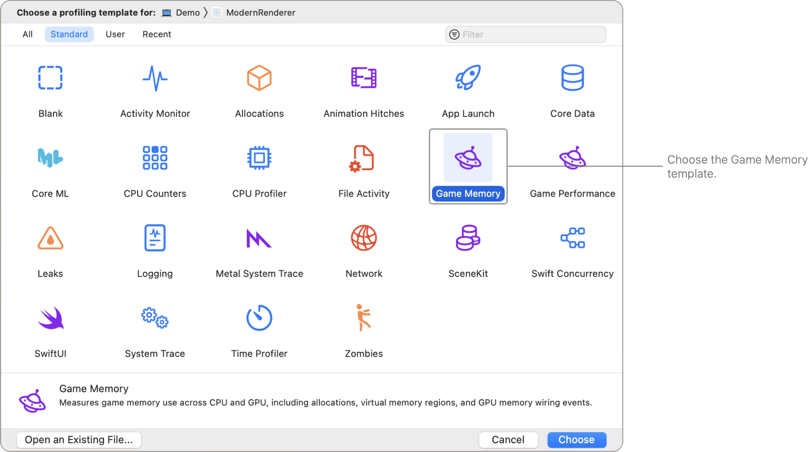
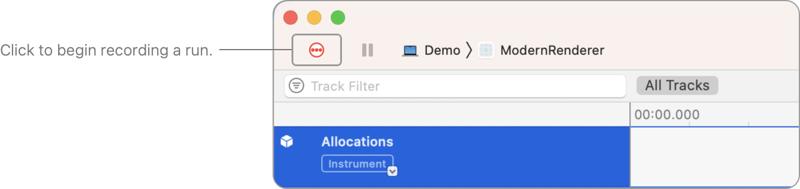
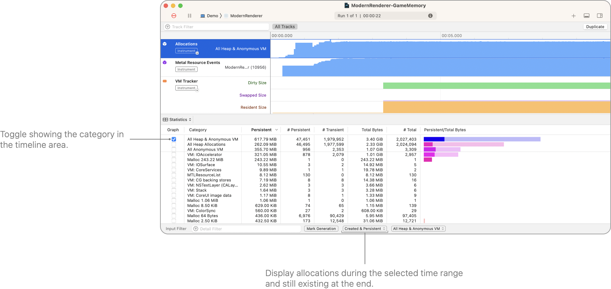
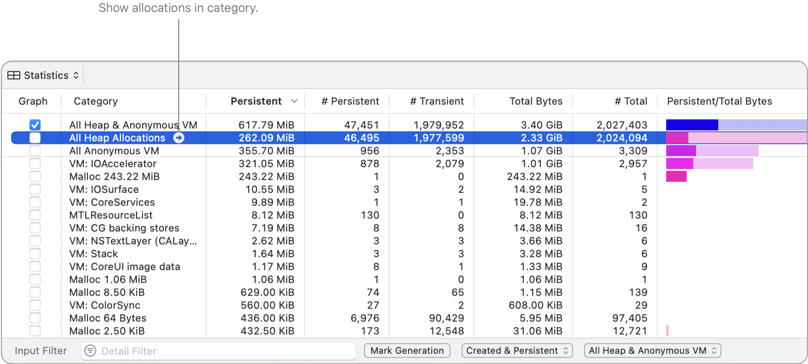
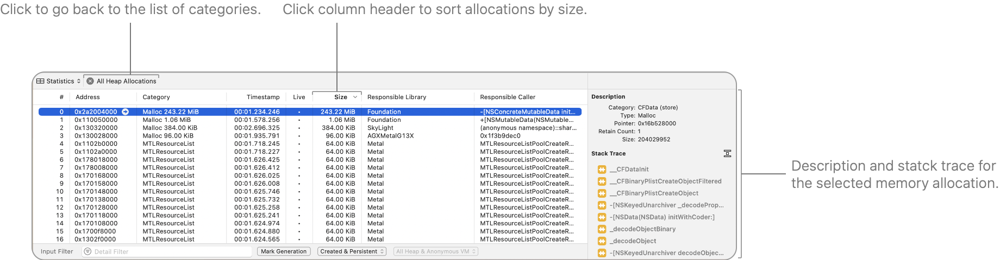
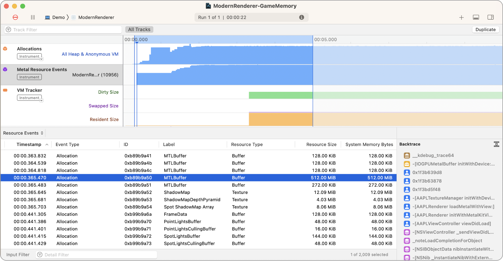
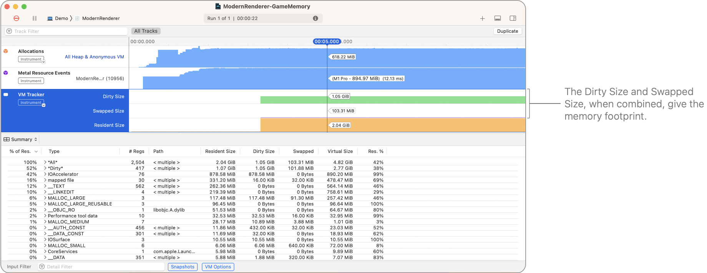
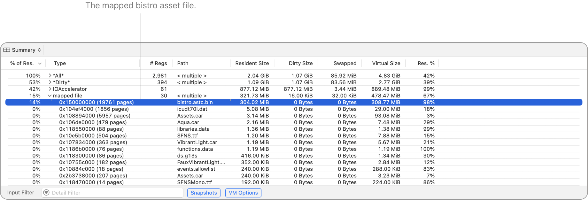

> 导航：[技术](../technologies.md) · [Xcode](../xcode.md) · [性能与指标](performance-and-metrics.md)

# 分析 Metal App 的内存使用情况

文章

通过管理内存占用空间，让你的 App 能在后台保持存活。

## 概述

Instruments 提供了“游戏内存”（Game Memory）模板，帮助你了解 Metal App 中的内存增长。保持较小的内存占用空间可以让系统在后台更长时间地保持 App 存活，尤其是在内存容量更有限的设备上。有关更多信息，请参阅[分析并优化游戏内存](https://developer.apple.com/videos/play/wwdc2022/10106/)。

### 打开“游戏内存”模板

从 Xcode 项目中启动内存分析：选取产品（Product）\> 性能分析（Profile），或按下 Command-I。或者，你也可以启动 Instruments，然后从下拉菜单中选择进程。

在“模板选择”（Template Selection）窗口中，选择“游戏内存”（Game Memory）。

### 了解各个工具

- **Allocations**（分配）——分析进程中已分配 block 的内存生命周期，并可记录引用计数事件。
- **Metal Resource Events**（Metal 资源事件）——记录 Metal GPU 资源分配，如纹理和缓冲区。
- **VM Tracker**（VM 跟踪器）——随时间跟踪进程的虚拟内存空间，按标签识别区域并报告使用统计信息。
- **Virtual Memory Trace**（虚拟内存跟踪）——跟踪每个线程的虚拟内存活动。
- **Metal Application**（Metal 应用）——记录 Metal App 事件。
- **GPU**——记录 GPU 事件。

### 录制 Instruments 捕获

点击“录制”（Record）按钮开始收集数据。

在你的 App 中，执行重现内存问题的操作，然后点击“录制”按钮停止录制。

### 分析 App 的内存分配

“游戏内存”模板会显示内存分配和内存占用空间。

内存分配占用虚拟内存地址空间中的空间。当你的 App 分配内存时，这些新分配可能不会立即占用物理内存上的空间。只有当你的 App 使用了这些分配，它们才会消耗物理内存。

“Allocations”（分配）轨道提供了内存分配、大小以及对象引用计数的详细视图。

> [!note] 注意
> Allocations 轨道不包含私有存储模式（private storage mode）的 Metal 资源——仅包含托管（managed）和共享（shared）存储模式。

Instruments 的截图，选中了 Allocations 轨道。底部的详细信息窗格显示了来自 Allocations 轨道的统计信息。

底部详细信息区域中的“统计信息”（Statistics）视图显示了内存分配的分类（categories）。在“分类”（Category）列的顶部，有三个概括所有分配的总体分类：

- **All Heap & Anonymous VM**（所有堆与匿名 VM）——包含所有内容。
- **All Heap Allocations**（所有堆分配）——包含可能含有资源的动态分配缓冲区。
- **All Anonymous VM**（所有匿名 VM）——包含可能为脏（dirty）的 VM 区域。你也可以在这里找到一些与 Metal 相关的内存。

在这些分类下方，你可以找到更详细的子分类。Metal 资源分配位于 `VM: IOAccelerator` 分类下，可绘制对象位于 `VM: IOSurface` 分类下。

要查看某个分类中的各个分配，请点击表格中该分类名称旁边的箭头按钮。

选择分类后，你可以按“大小”（Size）列对表格进行排序，以查找选定时间范围内最大的内存分配。

你还可以在列表中选择一个分配，以在右侧的检查器中查看其描述和堆栈跟踪。

### 分析 Metal 资源分配

“Metal Resource Events”（Metal 资源事件）轨道显示了所有 Metal 特定资源分配和释放的历史记录，以及它们的标签（请参阅[命名资源和命令](naming-resources-and-commands.md)）。

Instruments 的截图，选中了 Metal Resource Events 轨道。底部的详细信息窗格显示了资源事件列表。

底部详细信息区域中的“资源事件”（Resource Events）视图列出了资源分配和释放事件。它包含了选定时间范围内创建或销毁资源的事件。并非列表中的所有资源都会持续到时间范围结束。

### 分析 App 的总虚拟内存占用

Allocations 轨道和 Metal Resource Events 轨道都突出显示了内存分配。然而，分配并不总是意味着内存占用。VM Tracker 轨道显示了非压缩和压缩/交换出（compressed/swapped）的脏内存，它们共同构成了你的 App 的内存占用。

内存按页面粒度运行，这些页面可以是干净页面（clean）或脏页面（dirty）。

- **干净内存**——包含内存映射文件和只读框架。
- **脏内存**——包含堆分配内存和框架中的已写入符号。

为了节省你的 App 所使用的物理内存量，系统可能会压缩或换出一些你的 App 最近未访问过的脏页面。

> [!important] 重要
> 系统会将压缩/交换出的内存按其压缩前的原始大小计入你的 App 内存使用量。

Instruments 的截图，选中了 VM Tracker 轨道。底部的详细信息窗格显示了 VM 区域的摘要。

中央时间轴区域绘制了以下指标：

- **Dirty Size**（脏大小）——非压缩脏内存的量。
- **Swapped Size**（交换大小）——压缩/交换出的脏内存在压缩之前的原始大小。
- **Resident Size**（驻留大小）——驻留内存的量。

相应的列也在底部详细信息区域的“摘要”（Summary）视图中可用。在那里，你可以展开 VM 区域类型。在下面截图中的映射文件类型里，你可以看到 Modern Renderer App 加载的 bistro 场景的内存映射文件：

## 另请参阅

### 图形

- [分析 Metal App 的性能](analyzing-the-performance-of-your-metal-app.md)——通过分析 App 的帧时间确保一致、流畅的渲染。
