> 导航：[Technologies](../technologies.md) · [Xcode](../xcode.md) · [性能与指标](performance-and-metrics.md)

# 分析 Metal App 的性能

文章

通过分析 App 的帧时间，确保渲染始终流畅。

## 概述

帧率性能不佳会让用户觉得 App 迟缓或受到干扰，因此务必要消除暂时中断，也就是_停顿（stutter）_，以优化 App 的用户体验。要了解 App 帧率变慢的原因，可以使用 Instruments 中的 Game Performance 模板。该模板将线程和系统调用信息与 Metal system trace instrument 结合起来。Game Performance 模板会显示重要的 App 状态和渲染活动，帮助你推断为实现始终流畅的渲染而需要进行的更改。

### 打开 Game Performance 模板

在 Xcode 项目中选择 Product \> Profile，或按 Command-I，开始性能分析。你也可以启动 Instruments 并选择目标 App。

在 Template Selection 窗口中，选择 Game Performance 并点按 Choose。

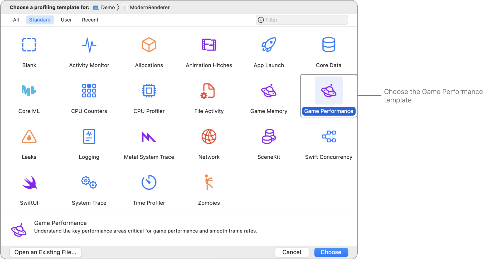

### 了解各个 instrument

Game Performance 模板包含以下 instrument：

- **Points of Interest** — 指明追踪中开发者可能需要特别关注的位置。
- **System Load** — 追踪系统的性能和当前负载。
- **Thread State Trace** — 追踪操作系统调度器每次作出可能影响 App 线程的决策。
- **System Call Trace** — 记录系统调用及其持续时间。
- **Virtual Memory Trace** — 按线程追踪虚拟内存活动。
- **Time Profiler** — 定期对 App 在所有核心上的运行线程进行性能分析。
- **Thermal State** — 记录设备的热状态。
- **Metal Resource Events** — 记录纹理和缓冲区等 Metal GPU 资源分配。
- **Metal Application** — 记录 Metal App 事件。
- **GPU** — 记录 GPU 事件。
- **Display** — 记录显示和垂直同步事件。

### 加入 performance limiter 或 utilization 计数器

默认情况下，Instruments 不会收集性能计数器数据。你可以选择为这些 instrument 加入此数据。点按并按住 Record 按钮，然后选择 Recording Options。

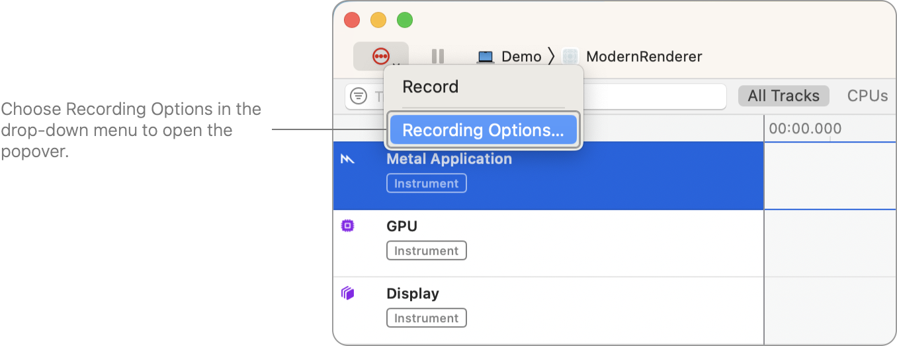

然后，在 Recording Options 弹出窗口中，从 Counter Set 菜单选择 Performance Limiters 选项。

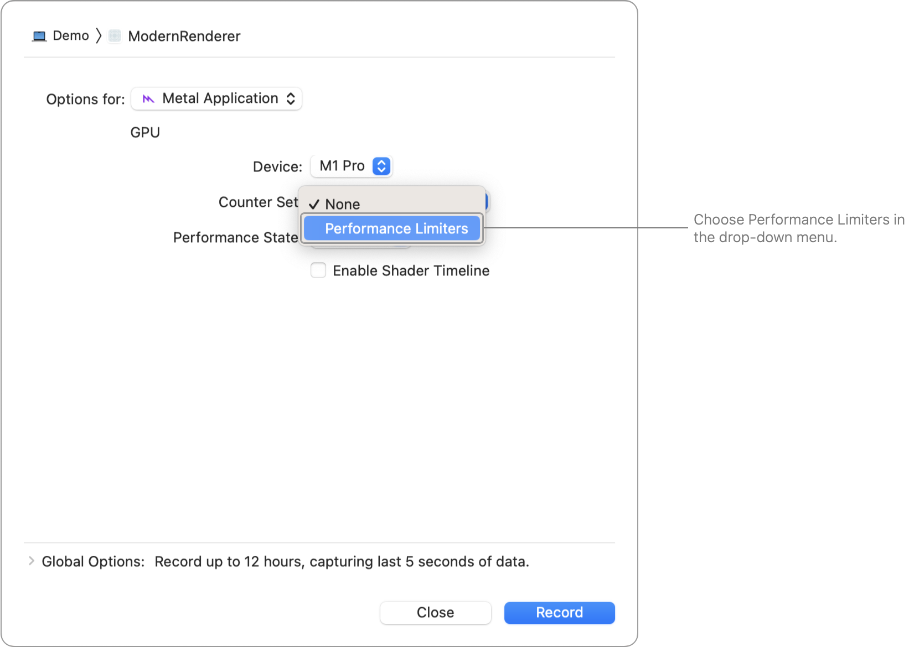

Recording Options 弹出窗口的屏幕截图，显示 Counter Set 下拉式菜单，其中高亮显示 Performance Limiters 菜单项。

记录 Instruments 追踪时，它会收集 performance limiter 和 utilization 计数器数据。

### 记录 Instruments 捕获

点按 Record 按钮，开始收集数据。

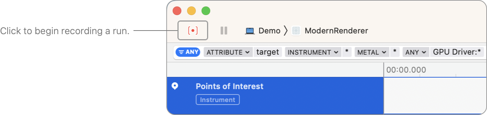

在 App 中执行可重现低帧率的操作，然后点按 Record 按钮停止记录。

### 识别性能异常

为了加快检查捕获结果的过程，请将关注范围缩小到帧率较低的时间附近。有时帧率异常是偶尔跳帧造成的，有时则是帧率持续不佳造成的。无论哪种情况，都可以通过查找 App 显示时间中意外出现的延迟来识别帧率异常。

在显示结果中，将指针悬停在某一帧上方以检查其持续时间。例如，在下面的屏幕截图中，显示实例的持续时间为 50 毫秒（ms）。在显示实例下方，可以检查 App 在此期间跳过了多少次垂直同步（vsync）事件。

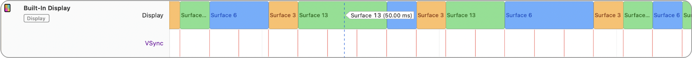

由于 50 ms 的显示实例明显长于周围的显示实例，因此可以将帧交付延迟视为一次停顿。相比之下，下面的屏幕截图显示了帧率保持稳定的 App：

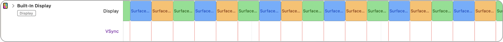

16.67 ms 的持续时间对应一个 60 fps 帧，而且其他所有帧都始终达到这一帧时长，因此没有可观察到的性能异常。

并非所有显示屏都使用约 16 ms 的帧间隔。例如，垂直同步可能以约 4 ms 的间隔发生。健康的帧率并不要求显示实例与垂直同步对齐。使用 20 ms 帧间隔的 App 只要能始终达到 50 fps，就具有健康的帧率。不过，50 ms 的延迟对于流畅动画来说过长。

### 检查 GPU 利用率

找到性能异常后，请检查该时间附近发生的 GPU 活动以查明原因。GPU Hardware 轨道会显示在着色器核心上运行的着色器管线阶段。轨道时间线中任何长时间运行的阶段或不一致的持续时间都可能表明存在利用率问题。例如，以下屏幕截图显示了一个显示实例跨越多个帧间隔的情况，这意味着 App 无意中跳过了帧：

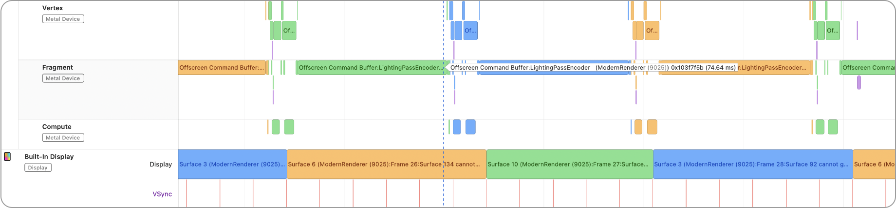

要开始调查着色器核心利用率是否可能是帧率不佳的原因，请执行以下操作：

1. 观察性能异常。在此示例中，显示实例跨越了多个帧间隔。
2. 检查顶点着色器。在此示例中，顶点着色器状态正常，因为它只用了帧间隔的一小部分时间便完成执行。
3. 将指针悬停在片元着色器上方，查看其持续时间。在此示例中，它运行了 74.64 ms，时间过长。

由于顶点着色器和片元着色器的总持续时间超过一个 60 fps 帧间隔（16.67 ms）的时长，App 跳过了一帧。在此示例中，顶点着色器运行很快，这意味着 App 的帧率问题完全是由片元着色器利用过度造成的。

以下是着色器核心利用过度的其他原因：

- **渲染通道过多：** 渲染器使 GPU 无法获得空闲时间即表明存在此问题。使用 Dependencies 查看器检查帧率不佳时发生的渲染通道数量。有关更多信息，请参阅[分析资源依赖项](analyzing-resource-dependencies.md)。
- **高分辨率：** 与将视口设置为较小尺寸时相比，在提交顶点数量相同的情况下，片元着色器活动显著增多即表明存在此问题。为了确保 App 视口与速度下降无关，请暂时减小视口尺寸，观察性能是否改善。
- **大型纹理：** 对片元着色器进行性能分析时同步时间很高即表明存在此问题。逐行性能分析结果显示等待内存所占时间比例很高。有关更多信息，请参阅[检查着色器](inspecting-shaders.md)。
- **大型网格：** App 提交的顶点数量很高即表明存在此问题。使用 Geometry 查看器检查受影响的帧。有关更多信息，请参阅[检查绘制命令的几何体](inspecting-the-geometry-of-a-draw-command.md)。
- **未优化的着色器代码：** 着色器普遍运行迟缓即表明存在此问题。如果能够修改 App 的着色器，请对其进行性能分析以识别热点。例如，可以通过减小数据类型或尽量减少控制结构的使用来优化着色器。在尝试之前，你不一定知道着色器是否能从优化中获益。有关更多信息，请参阅[检查着色器](inspecting-shaders.md)。

### 检查 CPU 利用率

检查着色器核心利用率时，还应查找表明 App CPU 利用率存在问题的迹象。下面的屏幕截图显示了跳帧似乎由着色器核心以外的因素造成的情况。请注意着色器核心在多个帧中处于空闲状态的间隙。

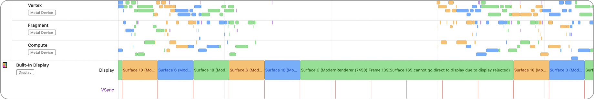

当 Display 轨道跨越多个帧间隔，且着色器核心时间线中存在间隙时，表明宿主 App 的代码运行时间过长。请检查 App 的 CPU 利用率，确定它是否导致帧率不佳。

要检查 App 的 CPU 利用率，请在线程状态轨道中识别渲染线程。在 CPU 利用率正常的情况下，App 的渲染线程通常会显示大量阻塞时间。以下屏幕截图显示选中了 App 的渲染线程，其阻塞时间约占每个约 16 ms 帧间隔的 75%：

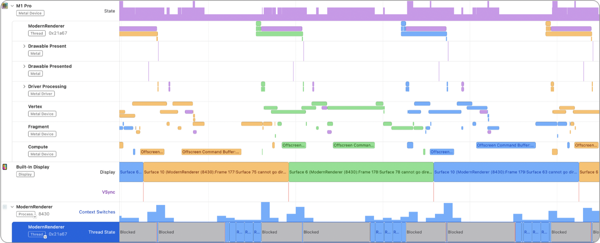

阻塞时间表示渲染器在帧间隔内提交完绘制命令后仍有剩余时间。由于上面的阻塞时间约占帧间隔的三分之二，宿主 App 为着色器核心在同一帧间隔内开始并完成工作留出了足够时间。

相反，如果渲染线程没有显示多少阻塞时间，App 很可能过度利用 CPU。要识别 App 是否过度利用 CPU 并确定原因，请执行以下步骤：

1. 观察一次停顿，其特征是显示持续时间超过 16.67 ms。
2. 确保着色器代码不是帧率低的原因。有关更多信息，请参阅上面的[检查 GPU 利用率](#Check-GPU-utilization)。
3. 检查显示为蓝色的 Running 线程状态。
4. 点按线程轨道将其选中。
5. 从 View Selection 菜单中选择 Profile。
6. 展开结果列表项并查找最高权重，以找到宿主 App 代码中耗时最多的方法。

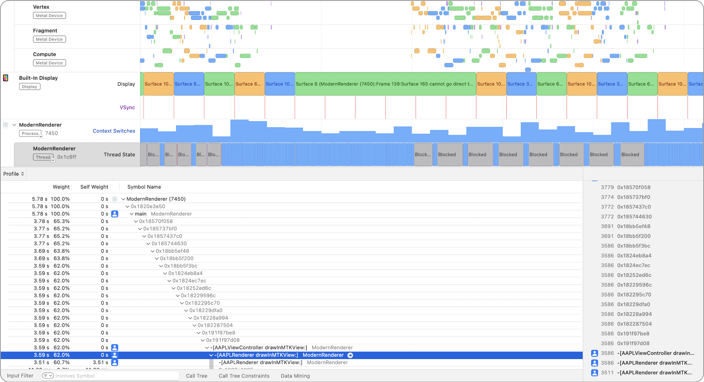

显示 CPU 上存在大量运行时间的屏幕截图。底部详细信息面板显示 Time Profiler 的调用树，其中高亮显示了 CPU 上长时间运行的方法。

> [!note] 注意
> 按住 Option 键点按显示三角形，可自动展开 App 的符号。

线程运行所花费的时间由时间线轨道中的一系列蓝色和橙色区域表示。如果某个帧间隔的阻塞时间很少，则表明 CPU 利用过度。要解决此问题，请集中优化运行缓慢的代码。由于长时间运行的方法位于宿主 App 中，你可以轻松确定是否能够优化它们，以及如何优化才能使其运行得更快。

### 检查 CPU 线程优先级

如果线程优先级配置不当，其他进程可能会抢占你的 App。要考虑此类与线程有关的流水线问题，请检查 System Load 轨道。

System Load 轨道中的橙色尖峰表示可运行线程的数量超过了可用于处理这些线程的 CPU 核心数。绿色区域表示相反的健康状态，即有足够的 CPU 核心可用于处理。要解决有问题的橙色状态，可以使用更少的线程，并提高 App 线程的优先级。

要确认低线程优先级是否影响 App 的帧率，请执行以下步骤：

1. 观察长时间运行的显示实例。
2. 直观确认存在多次跳帧。对于使用 60 fps 帧间隔的 App，你会看到垂直同步与显示没有对齐。
3. 选择 System Load 轨道。
4. 在底部详细信息区域中选择 App 的渲染线程。
5. 在时间线区域中将检查时间移动到所识别性能异常的附近，并在底部详细信息区域观察检查时间点的渲染线程状态和优先级。

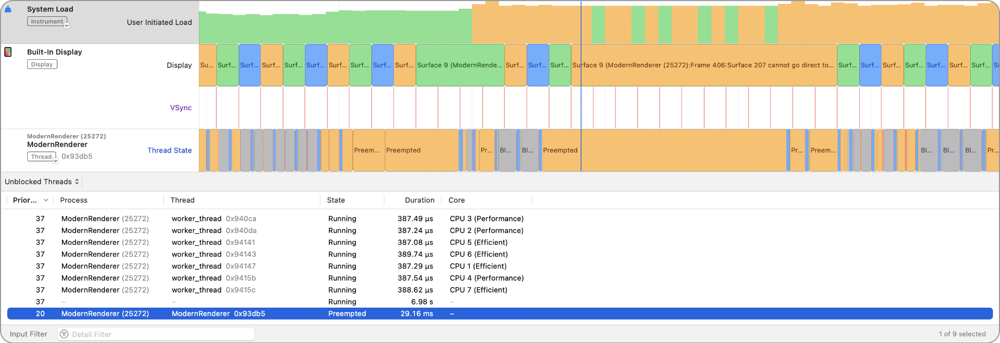

Instruments 的屏幕截图，其中选择了 System Load 轨道。底部详细信息面板以表格显示线程及其优先级。

在上面的屏幕截图中，Preempted 线程状态表示其他 Runnable 和 Running 线程让渲染线程得不到处理时间。低线程优先级说明配置不当的宿主 App 代码会如何导致低帧率。

建议为渲染线程使用优先级 45。要设置线程优先级，请先调用 `pthread_attr_setschedparam(_:_:)`，再使用 `pthread_create(_:_:_:_:)` 创建线程。有关线程优先级的更多信息，请参阅[为 Apple 芯片游戏调整 CPU 作业调度](https://developer.apple.com/videos/play/tech-talks/110147/)。有关 `pthread_create` 和 `pthread_attr_setschedparam` 的更多信息，请参阅[阅读 UNIX 手册页](../os/reading-unix-manual-pages.md)。

### 检查 CPU-GPU 重叠

除了着色器核心和 CPU 利用率外，帧率低还有一些更细微的原因，涉及 CPU-GPU 流水线。在此语境中，_流水线（pipelining）_是指 App 在保持稳定帧率的同时，协调 CPU 和 GPU 工作的程度。尽量减少 CPU 和 GPU 相互等待的时间，可以最大限度提高两个单元并行完成的工作量。这称为 _CPU-GPU 重叠_。

例如，如果渲染算法需要先取得计算通道的结果，再对渲染命令进行编码，Metal 会提供间接命令缓冲区（indirect command buffer，ICB）来增加重叠。通过使用 ICB 在 GPU 上生成渲染命令，可以避免 CPU 等待计算结果。有关更多信息，请参阅[在 GPU 上对间接命令缓冲区进行编码](../metal/encoding-indirect-command-buffers-on-the-gpu.md)。

## 另请参阅

### 图形

- [分析 Metal App 的内存使用情况](analyzing-the-memory-usage-of-your-metal-app.md) — 通过管理 App 的内存占用空间，让它在后台保持运行。
