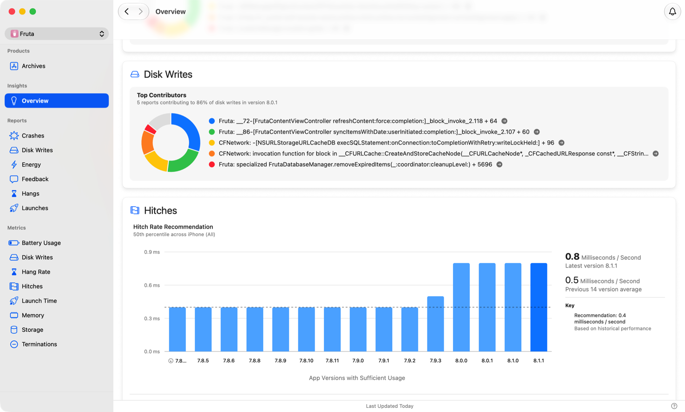
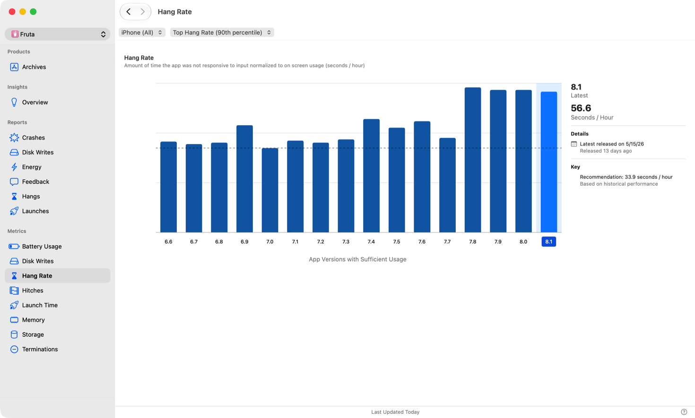
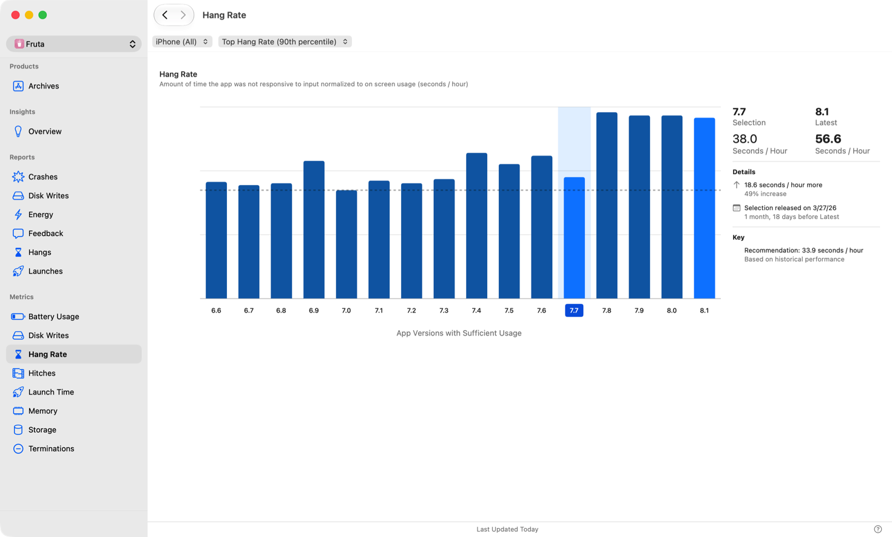
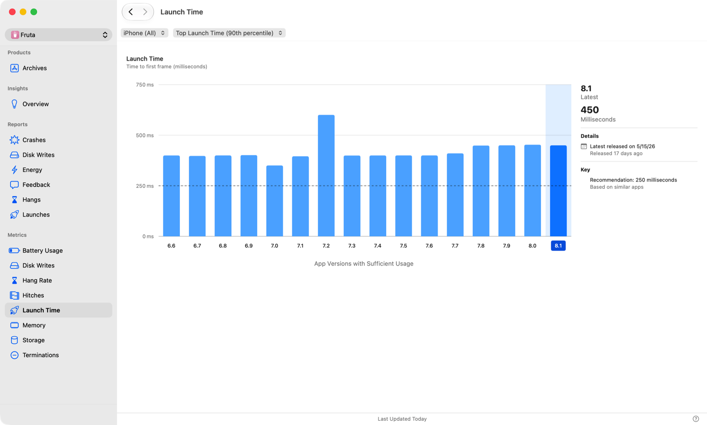

> 导航： [技术](../technologies.md) · [Xcode](../xcode.md) · [性能与指标](performance-and-metrics.md)

# 分析已上架 App 的性能

文章

查看你通过 App Store 分发的 App 的电源和性能指标。

## 概述

使用 Xcode Organizer 查看来自 App 用户的匿名性能数据，包括启动时间、内存用量、UI 响应性以及对电池的影响。利用这些数据来调优 App 的下一个版本，并捕获特定版本 App 中出现的性能衰退 (regression)。

在 Xcode 中，选择“窗口 (Window)”>“Organizer”打开 Organizer 窗口，然后选择所需的指标或报告。在某些情况下，面板会显示“可用使用数据不足”，因为参与的用户设备可能没有报告足够的匿名数据。若出现此情况，请几天后再回来查看。

当 Xcode 拥有足够的信息来确定某个指标的目标值时，图表会包含该目标值。利用此信息来规划并确定性能工程工作的优先级。

### 查看 App 的关键洞察

当你打开 Xcode Organizer 时，“洞察”概览会以统一视图呈现 App 中最为可行的性能信息。它会呈现性能衰退、最严重和最常出现的特征码，以及最可能需要你关注的指标，从而减少在单个指标和诊断报告页面之间切换所花的时间。

Xcode Organizer 中“洞察”概览的截图，展示了内存指标衰退，附有摘要图表、指标建议以及指向相关诊断页面的链接。

“洞察”概览会突出显示对 App 影响最大的指标，并显示每个指标的详细信息。当 Xcode 检测到衰退时，它会显示一个衰退图表，指出受影响的指标。当 Xcode 有足够的数据来计算某个指标的目标值时，无论是否存在衰退，它都会为该指标显示一个建议图表。单个指标可以同时显示衰退图表和建议图表。即使你的 App 没有衰退，“洞察”概览也会呈现你能够采纳的可行建议。你可以从这里跳转到相关的诊断报告和指标页面，进行进一步调查。

点击右上角的“通知”按钮，选择接收电源和性能衰退通知。当 Xcode 检测到高影响力的衰退时，它会针对你已上架的每个 App 的最新版本向你发送通知。如果性能数据可用，并且表明你的 App 最新版本相比 App Store 中前四个 App 版本的平均值衰退了 75% 或更多，则该衰退被视为高影响力。当 Xcode 运行时，Xcode 每 24 小时通知你一次。为将通知数量控制在最少，对于同一个 App 版本，Xcode 最多向你发送一次通知。“通知”按钮仅涵盖电源和性能指标的衰退。它不会针对“洞察”概览中列出的诊断特征码发送通知。

第一次打开 Organizer 时，它会打开“洞察”概览。在后续启动中，Organizer 会恢复你上次访问的部分。

### 读取指标数据

Xcode Organizer 会为每种类型的指标显示标题、描述和图表。在图表中，每个柱条代表你的 App 的一个版本。使用弹出菜单来按不同设备以及按中位值或高值过滤指标数据。如果你的 App 有可用的轻 App (App Clip)，请使用弹出菜单按 App 类型过滤，并在主 App 和轻 App 之间切换查看指标。

Xcode Organizer 中“挂起率 (Hang Rate)”指标面板的截图。从左到右依次为指标和报告列表、指标 UI（柱状图显示过去 16 个 App 版本的挂起率）以及最新 App 版本的数据。

在详细信息部分显示 _有限用量_ 的指标会包含相关的误差幅度，因为现有数据有限。使用此误差幅度确定显示值的上下限。误差幅度会随着数据增加而减小。此部分中的发布日期信息提供了所选 App 版本可发售的日期。

### 与之前的 App 版本进行性能比较

要探究某个指标在版本间的变化，例如下图中“挂起率”的变化，请点击所选版本的柱条。

所选版本和最新版本的数据会显示在图表右侧，两者中数值较高的会以粗体显示。这些版本的变化信息会显示在最新版本数据下方的详细信息部分。

Xcode Organizer 中“挂起率”指标面板里对比视图的截图。关键要素包括高亮显示的所选版本柱条、最新和所选 App 版本的数据，以及这两个版本之间的变化信息。

### 将 App 的指标与目标值进行比较

Xcode Organizer 会将你的 App 指标与两类目标进行比较：同类 App 目标和历史性能目标。同类 App 目标基于与你的 App 在功能和技术上相似的 App 的指标；历史性能目标则基于你 App 自身的历史数据。如果你的 App 有足够的指标数据可用，并且当前版本的指标值大于目标值，Xcode 会在 Xcode Organizer 的直方图上以虚线形式显示 _目标_。

对于支持它们的指标，同类 App 目标可以作为反映你的 App 真实技术概况的、切合实际且可操作的目标。对于屏幕电池用量和磁盘写入，同类 App 目标会按使用时间进行归一化，确保在使用量不同的 App 之间进行公平比较。

历史性能目标使用你 App 自身过去的指标值作为基线，帮助你检测衰退并跟踪随时间推移的改进。

Xcode Organizer 中“启动时间”指标面板的截图，显示了作为蓝色柱条的以前 App 版本以及指示同类 App 性能目标的虚线。

### 改善 App 的性能

有关如何使用 Organizer 面板中的数据来改进 App 下一个版本性能的更多详细信息，请参阅下面的主题。

## 另请参阅

### 相关文档

- [分析已上架 App 中的响应性问题](analyzing-responsiveness-issues-in-your-shipping-app.md) — 识别用户遇到的响应性问题，并使用 Xcode Organizer 中的挂起和卡顿 (hitch) 数据确定哪些问题最值得修复。
- [分析 App 的电池使用情况](analyzing-your-app-s-battery-use.md) — 通过降低 App 的功耗，增加 App 在一次电池充电后的可用使用时间。
- [改善 App 响应性](improving-app-responsiveness.md) — 通过消除 App 中的挂起和卡顿，创建响应迅速的用户体验。
- [监控 App 的存储指标](monitoring-your-app-s-storage-metrics.md) — 使用 Xcode Organizer 随时间跟踪 App 的存储占用空间，以捕获文稿与数据以及 App 大小方面的衰退。
- [减少磁盘写入](reducing-disk-writes.md) — 通过优化 App 将数据写入永久存储的方式来改善 App 的响应性。
- [缩短 App 的启动时间](reducing-your-app-s-launch-time.md) — 通过最小化启动所花费的时间，为 App 创造更具响应性的体验。
- [减少 App 的内存使用](reducing-your-app-s-memory-use.md) — 通过分析内存使用指标并做出更改以最大化内存效率，来改善 App 的性能。

### 基础

- [改善 App 的性能](improving-your-app-s-performance.md) — 通过使用持续改进循环来建模、测量和提升 App 的性能。
- [使用 Instruments 分析 App](../tutorials/instruments.md) — 使用 Instruments 分析 App 的性能、资源使用情况和行为。了解如何改善响应性、减少内存使用以及分析随时间变化的复杂行为。
- [为 visionOS App 制定性能计划](../visionos/creating-a-performance-plan-for-visionos-app.md) — 确定 App 的性能和功耗目标，并制定衡量和评估这些目标的计划。
