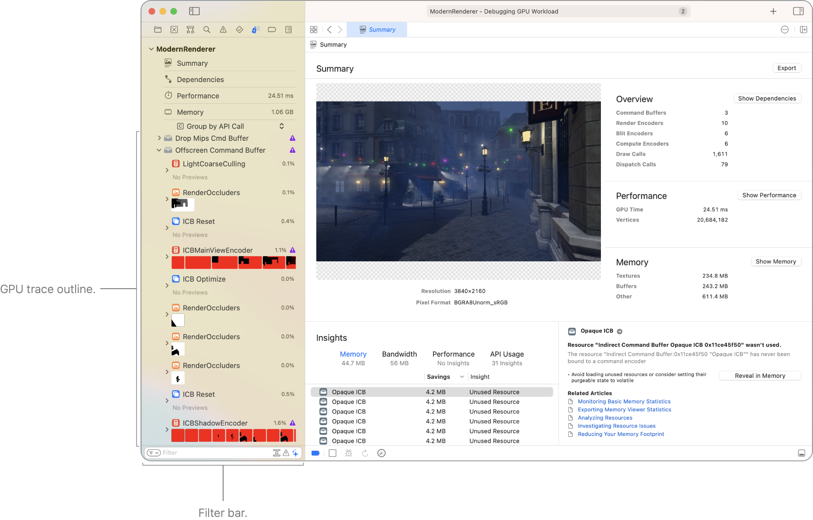
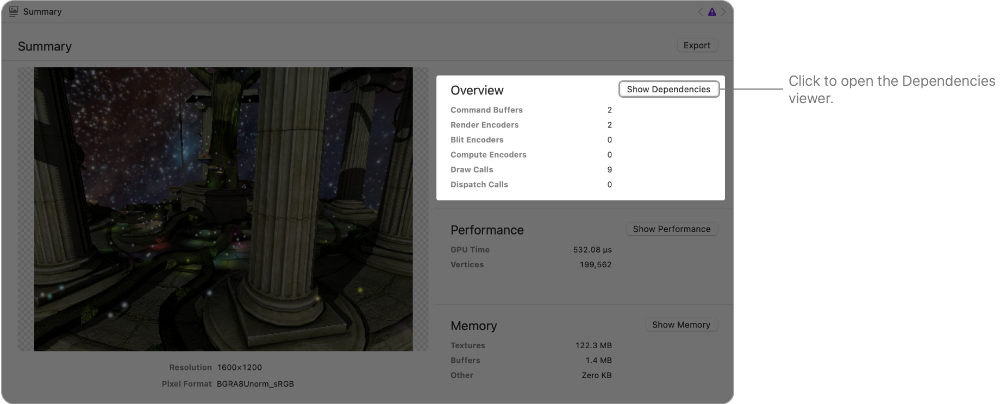
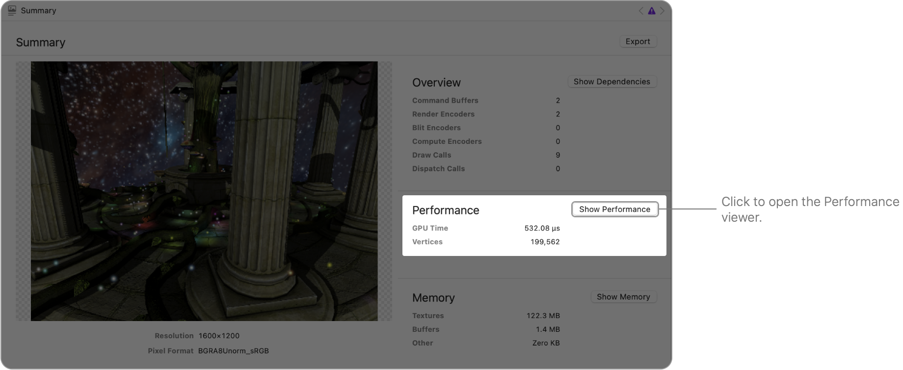
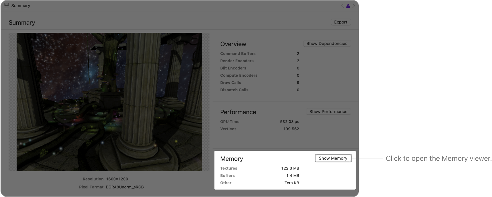
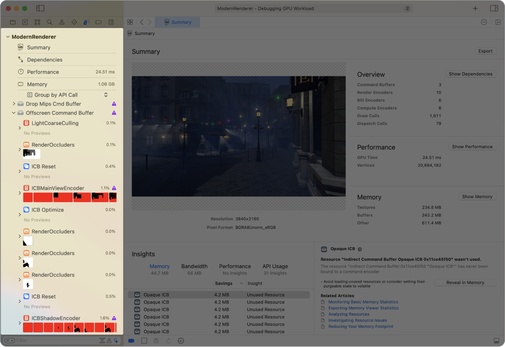
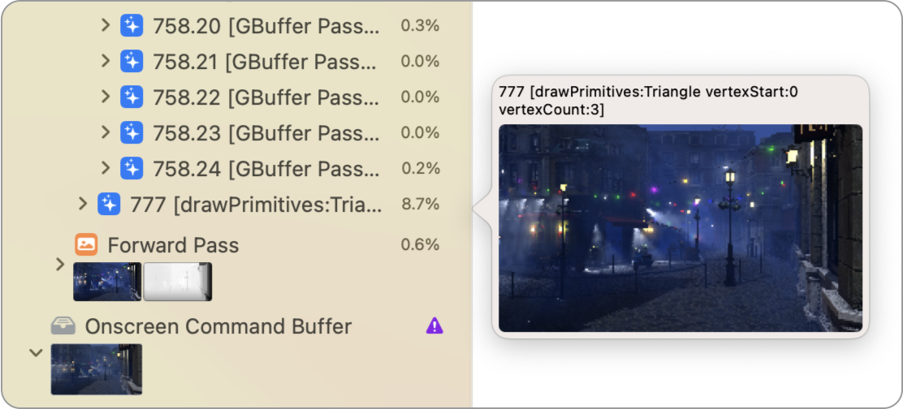
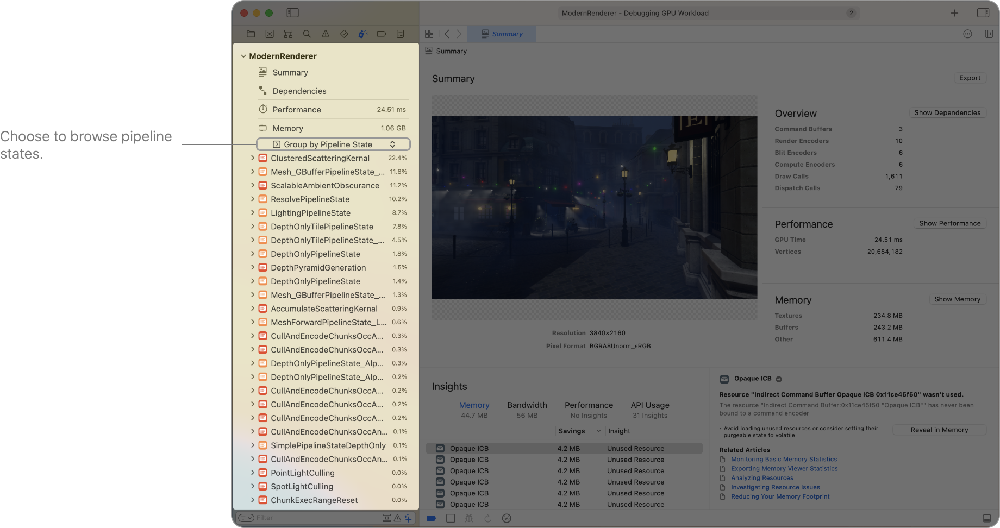
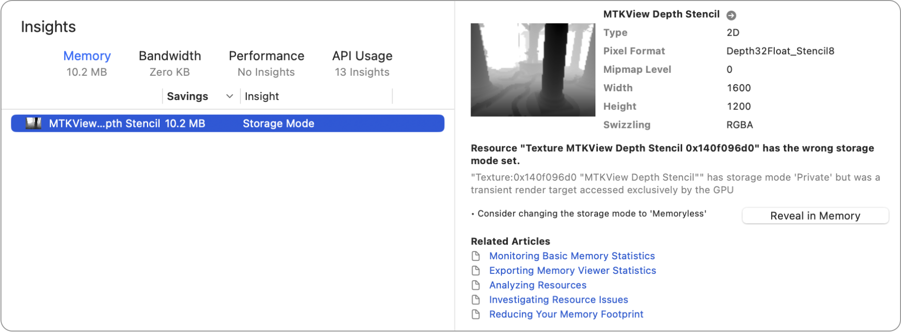
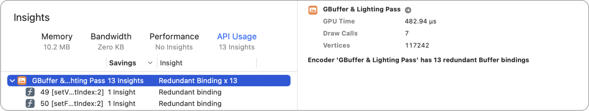
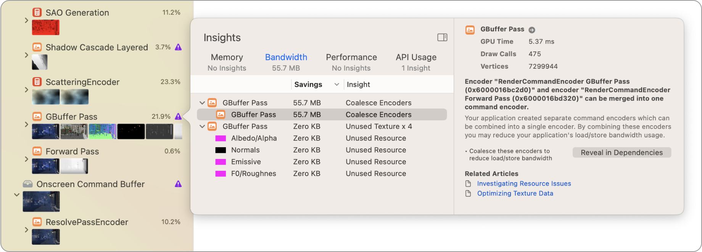

> 导航：[Technologies](../technologies.md) · [Xcode](../xcode.md) · [调试](debugging.md) · [Metal 调试器](metal-debugger.md)

# 分析 Metal 工作负载

文章

使用 Metal 调试器调查 App 的工作负载、依赖关系、性能和内存影响。

## 概述

Metal 调试器提供了实用工具，用于分析 App 使用 GPU 方式的多个方面。

捕获 Metal 工作负载（请参阅[在 Xcode 中捕获 Metal 工作负载](capturing-a-metal-workload-in-xcode.md)）或重放 GPU 跟踪（请参阅[重放 GPU 跟踪文件](replaying-a-gpu-trace-file.md)）后，Metal 调试器会呈现 Summary 查看器。Summary 查看器左侧包含 App 最后呈现的可绘制对象预览，右侧包含若干统计信息，底部则包含自动生成的建议列表，称为 Insights。

Summary 查看器左侧是 Debug 导览器，可以快速访问 Metal 工作负载的顶层信息。你可以探索捕获中的所有 GPU 命令，以及它使用的所有流水线状态。

Metal 调试器的截图，其中显示 Debug 导览器和 Summary 查看器。Debug 导览器包含顶层仪表、Outline 弹出式菜单、GPU 跟踪大纲和筛选栏。

### 查看 Metal 工作负载的统计信息

Metal 调试器会自动计算若干统计信息，并将其显示在 Summary 查看器右侧。

Overview 部分包含命令缓冲区、命令编码器以及绘制命令或计算调度的数量。编码命令会占用 CPU 时间，执行命令则会占用 GPU 时间。如果 App 创建了过多命令缓冲区或命令编码器，并开始对性能产生显著影响，请考虑减少工作负载。你可以点按 Show Dependencies 按钮打开 Dependencies 查看器，了解命令编码器如何相互连接（请参阅[分析资源依赖关系](analyzing-resource-dependencies.md)）。

Performance 部分包含 GPU 总用时和顶点数量。如果工作负载的 GPU 用时很高，请考虑优化其性能（请参阅[优化 GPU 性能](optimizing-gpu-performance.md)）。你还可以点按 Show Performance 按钮显示 Performance 时间线，并了解 Metal 工作负载的哪些方面耗时最多（请参阅[使用可视化时间线分析 Apple GPU 性能](analyzing-apple-gpu-performance-using-a-visual-timeline.md)）。

> [!note] 注意
> 如果未在 Metal Capture 弹出窗口中选择 Profile after Replay 复选框（请参阅[在 Xcode 中捕获 Metal 工作负载](capturing-a-metal-workload-in-xcode.md)），或未在 Replay 窗口中选择 Profile GPU Trace 复选框（请参阅[重放 GPU 跟踪文件](replaying-a-gpu-trace-file.md)），Performance 部分不会显示任何统计信息。要查看统计信息，请点按 Profile 按钮并等待性能分析完成。

没有显示任何性能分析数据时 Performance 部分的截图，其中突出显示 Profile 按钮。

Memory 部分包含不同资源类型（例如纹理和缓冲区）的 GPU 内存简要概览。如果 Metal 工作负载使用大量内存，请考虑优化内存用量。你还可以点按 Show Memory 按钮打开 Memory 查看器，并了解 Metal 工作负载的哪些方面使用了最多内存（请参阅[分析内存用量](analyzing-memory-usage.md)）。

### 浏览 API 调用

默认情况下，Metal 调试器会在 Debug 导览器中显示捕获到的 Metal 命令大纲，并按命令缓冲区、pass 和调试组进行分组。此外，对于渲染 pass，大纲还包含渲染附件缩略图列表。

渲染 pass 发出大量绘制命令是很常见的情况。你可以将指针移到各行上方来快速浏览绘制命令，从而迅速找到感兴趣的绘制命令。Metal 调试器会在弹出窗口中显示第一个附件的预览。

Debug 导览器的截图，其中显示指针悬停在大纲中任意命令上时出现的弹出窗口。

### 浏览流水线状态

除了查看 Metal 命令的层次结构外，你还可以从流水线状态开始探索捕获到的 Metal 工作负载。点按 Outline 弹出式菜单，然后选择 Group by Pipeline State。

Metal 调试器会显示流水线状态列表。展开流水线状态可以查看其中的着色器。进一步展开则会显示使用该流水线状态的所有绘制命令和计算调度。

有性能分析数据时，Debug 导览器会显示在运行允许重叠的工作负载时，每个流水线状态中着色器样本所占的百分比。对于受着色器限制的工作负载，这份排序后的流水线状态列表有助于识别开销最大的流水线状态。

### 使用 Insights 改善 Metal 工作负载

Metal 调试器会自动生成多项称为 Insights 的建议，并将它们放在 Summary 查看器底部，帮助你改善 Metal 工作负载。Insights 信息包含以下类别：

- **内存** — 内存 Insights 提供建议，用于减少工作负载使用的 GPU 内存量。默认情况下，Xcode 按节省的内存量对建议进行排序，以便你优先关注潜在收益最大的建议。在以下示例中，设置错误的存储模式会额外使用 10.2 MB GPU 内存。此 App 的开发者可以遵循建议，切换为 memoryless，从而节省这些内存。

- **带宽** — 带宽 Insights 提供建议，用于减少内存带宽用量，这一点在 Apple GPU 上尤为重要。与外部内存之间的数据传输通常会降低能效并减慢性能。要了解更多信息，请参阅[针对 Apple GPU 和基于图块的延迟渲染调整 App](../metal/tailor-your-apps-for-apple-gpus-and-tile-based-deferred-rendering.md)。
- **性能** — 性能 Insights 提供建议，通过避免渲染流水线中开销高昂且重复的操作来提高 App 性能。
- **API 用法** — API Usage Insights 提供建议，用于改善 Metal API 的使用方式。减少 API 调用可减少 CPU 用时。在以下示例中，可以看到顶点缓冲区和片段缓冲区为每个绘制命令重复绑定：

点按 Debug 导览器中命令旁边的 Insights 按钮，查看可能改善命令的深入详细信息和建议。

### 使用筛选器限定范围

使用 Debug 导览器底部的筛选栏调整筛选条件。你可以在筛选栏的文本栏中输入筛选词，Debug 导览器中的大纲将只显示标签与这些筛选词匹配的行。

当有两个或更多筛选词时，可以点按筛选按钮，选择匹配任一词还是全部词。对于任何筛选词，都可以点按它，选择包含或排除与该词匹配的资源。

右侧会出现以下其他筛选工具：

- **Show only related stack frames** — 捕获新的 GPU 跟踪后，你可以检查每条 Metal 命令的调用栈（call stack）。这样便可筛选项目中的栈帧（stack frame）。
- **Show only calls with issues** — 这样可以仅筛选包含 Metal 调试器 Insights 的 Metal 命令。
- **Show only markers and commands** — 这样可以筛选绘制命令、计算调度和 blit 操作等 Metal 命令。

## 另请参阅

### Metal 工作负载分析

- [分析资源依赖关系](analyzing-resource-dependencies.md) — 通过了解资源之间的关系，避免 Metal App 执行不必要的工作。
- [分析内存用量](analyzing-memory-usage.md) — 通过检查资源来管理 Metal App 的内存用量。
- [使用可视化时间线分析 Apple GPU 性能](analyzing-apple-gpu-performance-using-a-visual-timeline.md) — 使用 Performance 时间线定位性能问题。
- [使用计数器统计信息分析 Apple GPU 性能](analyzing-apple-gpu-performance-using-counter-statistics.md) — 检查各个 pass 和命令的计数器来优化性能。
- [使用性能热图分析 Apple GPU 性能](analyzing-apple-gpu-performance-using-performance-heatmaps-a17-m3.md) — 通过检查源代码执行情况，深入了解 SIMD 组性能。
- [使用着色器成本图分析 Apple GPU 性能](analyzing-apple-gpu-performance-using-shader-cost-graph-a17-m3.md) — 通过检查流水线状态，发现潜在的着色器性能问题。
- [使用计数器统计信息分析非 Apple GPU 性能](analyzing-non-apple-gpu-performance-using-counter-statistics.md) — 检查各个 pass 和命令的计数器来优化性能。
