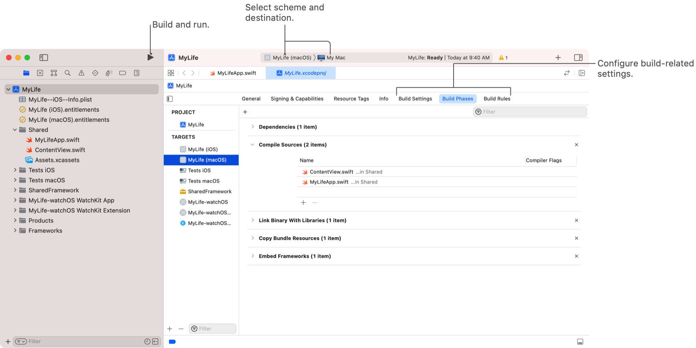

> 导航：[Technologies](../technologies.md) · [Xcode](../xcode.md)

# 构建系统

将代码编译为二进制格式，并自定义项目设置以构建代码。

## 概述

Xcode 构建系统管理将代码和资源文件转换为成品 App 的工具。当你要求 Xcode 构建项目时，构建系统会分析文件并使用项目设置来组织要执行的任务集。使用项目设置修改构建过程，并添加完成构建所需的任务。

## 主题

### 基础

- [在项目中配置新 target](configuring-a-new-target-in-your-project.md) — 配置项目以构建新产品，并添加产品所需的代码和资源。
- [配置多平台 App](configuring-a-multiplatform-app-target.md) — 在单个 App target 中跨平台共享项目设置和代码。

### 构建设置

- [配置 target 的构建设置](configuring-the-build-settings-of-a-target.md) — 指定用于编译、链接 target 并从中生成产品的选项，以及标识从项目或系统继承的设置。
- [向项目添加构建配置文件](adding-a-build-configuration-file-to-your-project.md) — 在纯文本文件中指定项目的构建设置，并为调试构建和发布构建提供不同设置。
- [构建设置参考](build-settings-reference.md) — 可控制或更改 target 构建方式的各项 Xcode 构建设置的详细列表。
- [识别并解决框架模块问题](identifying-and-addressing-framework-module-issues.md) — 使用模块验证器检测并修复框架模块中的常见问题。
- [了解 Xcode 中的构建产品布局变更](understanding-build-product-layout-changes.md)

### 构建自定义

- [自定义项目的构建方案](customizing-the-build-schemes-for-a-project.md) — 指定要构建的 target，并自定义 Xcode 用于构建、运行、测试这些 target 以及对其进行性能分析的设置。
- [自定义 target 的构建阶段](customizing-the-build-phases-of-a-target.md) — 指定构建期间要执行的任务，包括要编译的源文件、要运行的脚本，以及要包含在最终产品中的资源。
- [为自定义文件类型创建构建规则](creating-build-rules-for-custom-file-types.md) — 告诉 Xcode 如何构建项目的自定义文件类型，并提供依赖关系信息，以优化每个文件的构建过程。
- [在构建期间运行自定义脚本](running-custom-scripts-during-a-build.md) — 在构建过程中执行自定义 shell 脚本，并运行项目所需的工具或其他命令。
- [在特定平台或 OS 版本上运行代码](running-code-on-a-specific-version.md) — 在需要特定设备系列或最低操作系统版本才能运行的代码周围添加条件编译标记。

### 性能

- [配置项目以使用可合并库](configuring-your-project-to-use-mergeable-libraries.md) — 使用可合并动态库，使发布构建中的 App 启动时间接近静态链接，同时不损失调试构建中动态链接的构建速度。
- [提高增量构建速度](improving-the-speed-of-incremental-builds.md) — 告知 Xcode 构建系统项目中与 target 相关的依赖关系，并减少每个构建周期中的编译器工作量。
- [通过良好的编码实践提高构建效率](improving-build-efficiency-with-good-coding-practices.md) — 减少代码导出的符号数量，并向编译器提供所需的显式信息，从而缩短编译时间。
- [使用显式模块依赖项构建项目](building-your-project-with-explicit-module-dependencies.md) — 使用 Xcode 构建系统消除不必要的模块变体，从而缩短编译时间。

### 安全与隐私

- [验证 XCFramework 的来源](verifying-the-origin-of-your-xcframeworks.md) — 了解是谁对框架进行了签名，并在签名者发生变化时采取行动。
- [为 App 启用增强安全性](enabling-enhanced-security-for-your-app.md) — 检测越界内存访问、已释放内存的使用以及其他潜在漏洞。
- [创建增强安全性辅助扩展](creating-enhanced-security-helper-extensions.md) — 减少攻击者通过 App 扩展攻击 App 的机会。
- [采用类型感知型内存分配](adopting-type-aware-memory-allocation.md) — 减少在代码中将指针当作数据处理的机会。
- [遵循 Mach IPC 安全限制](conforming-to-mach-ipc-security-restrictions.md) — 避免与 Mach 消息相关的崩溃和潜在不安全情况。

## 另请参阅

### Xcode IDE

- [项目和工作区](projects-and-workspaces.md) — 管理用于为 Apple 平台构建 App、库和其他软件的代码与资源。
- [源代码控制管理](source-control-management.md) — 借助 Xcode 中的 Git 源代码控制支持，备份文件、与他人协作并标记发布版本。
- [功能](capabilities.md) — 启用 Apple 提供的服务，例如 App 内购买、推送通知、Apple Pay、iCloud 等。
- [命令行工具](command-line-tools.md) — 在终端中开发和自定义项目。
