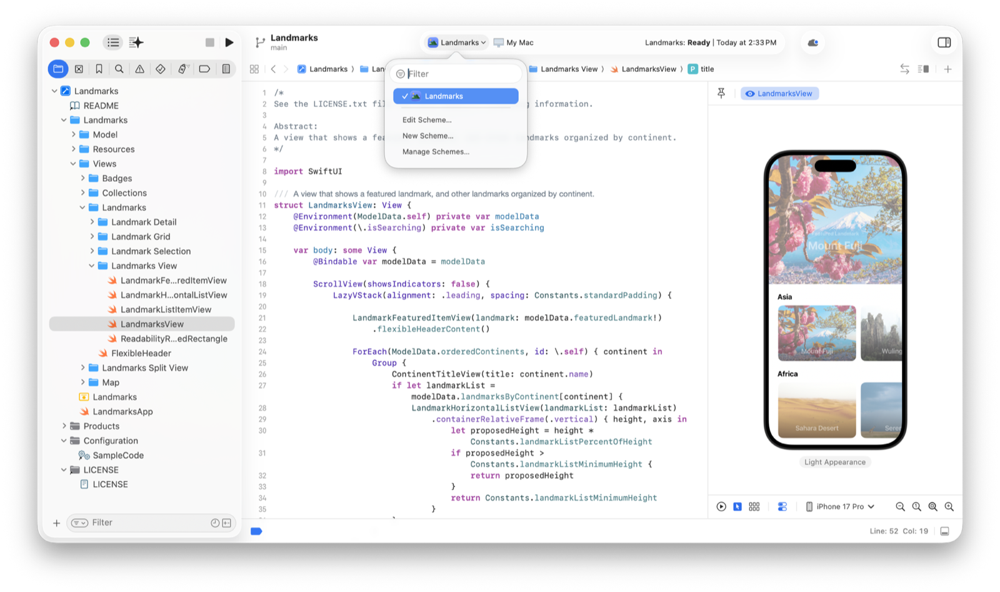
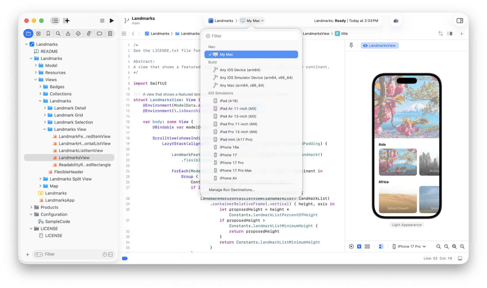

> 导航：[Technologies](../technologies.md) · [Xcode](../xcode.md)

# 构建和运行 App

文章

编译源文件并组装 App 软件包，以便在设备或模拟器上运行。

## 概述

在开发期间，你会多次构建并运行 App，以测试新功能和修复错误。每次构建时，Xcode 都会分析 App 的源文件，以确定需要重新编译哪些文件。Xcode 还会识别需要执行的其他任务，例如运行自定义脚本。根据项目状态，Xcode 会完整重新构建项目，或仅对发生更改的项目进行增量构建。

成功构建后运行 App 时，Xcode 会在你选择的设备上启动 App。Xcode 会在启动 Xcode 的同一台设备上运行 Mac App。Xcode 会在 Simulator 或你选择的已连接设备上运行 iOS、iPadOS、tvOS、visionOS 和 watchOS App。

### 为 App 配置 target

Xcode 根据项目的 target 信息确定如何构建 App 和其他产品。*target* 包含创建可执行文件所需的任务，以及构建时要使用的设置。例如，App target 可能包含要编译的文件列表、要复制到 App 软件包中的资源，以及配置 App 所需的其他步骤。

从模板创建新项目时，你会选择一个默认 target，Xcode 会使用你提供的信息配置该 target。你可以随时向项目添加新 target，以创建其他产品。

有关更多信息，请参阅[在项目中配置新 target](configuring-a-new-target-in-your-project.md)。

### 为 target 选择方案

*构建方案（build scheme）*是一组设置，用于指定要构建的 target、要使用的构建配置，以及所运行产品的可执行环境。Xcode 会自动为大多数 target 创建方案，你也可以创建其他方案来自定义构建和执行选项。例如，你可以创建新方案，以向 App 传递额外的启动实参。

要构建 App 或其他任何 target，请选择包含该 target 的方案。Xcode 会在项目窗口的工具栏中显示所选方案。要更改所选方案，请点按方案名称，然后从弹出式菜单中选择新方案。

一张项目编辑器截图，其中显示了工具栏中的方案弹出式菜单，并选中了用于构建 App 的方案。

有关方案的更多信息，请参阅[自定义项目的构建方案](customizing-the-build-schemes-for-a-project.md)。

### 告诉 Xcode 在哪里运行 App

选择要构建的方案后，在工具栏中点按方案名称旁边的运行目的位置名称，然后从弹出式菜单中选择模拟设备或实体设备。

一张项目编辑器截图，其中显示了工具栏中的运行目的位置弹出式菜单，并选中了 My Mac。

请选择可提供所需能力的运行目的位置。对于 Mac 产品，请选择 My Mac。对于其他平台，如果 App 不需要真实硬件，可以选择模拟器，在 Mac 上快速测试功能。如果 App 需要真实硬件，或你已准备好查看 App 在真实条件下的行为，请选择实体设备。

有关配置新模拟器或连接实体设备的信息，请参阅[在模拟设备或实体设备上运行 App](running-your-app-on-simulated-or-physical-devices.md)。

> [!important] 重要
> 交付任何代码前，请在实体设备上进行测试并收集指标。模拟器可以在开发期间提供快速的周转时间，但不会模拟目标设备的实际性能。

### 构建、运行和调试 App

要使用当前方案构建并运行代码，请选择 Product \> Run，或点按导览器上方工具栏中的 Run 按钮。

Xcode 会分析方案的 target，并按正确顺序进行构建。构建成功后，Xcode 会启动关联的 App。如果在方案编辑器的 Info 标签页中选择了 Debug executable 选项，Xcode 会在启动后立即将调试器附加到 App。要构建方案而不运行 App，请改为选择 Product \> Build。

如果 Xcode 在构建期间遇到错误，会停止构建 App，并在 Issue 导览器中报告错误。如果在 Xcode 设置的 General 标签页中取消选择“Stop build on first error”设置，Xcode 会继续构建项目中的其余文件并报告错误。要停止正在进行的构建，请选择 Product \> Stop，或点按工具栏中的 Stop 按钮。

方案的构建配置决定 Xcode 如何启动产品。对于构建 App 的方案，Xcode 会启动 App 本身。对于其他产品，你需要使用方案编辑器指定要启动的 App。你还可以使用方案编辑器指定启动实参、运行时数据和调试参数。

## 另请参阅

### 基础

- [为 App 创建 Xcode 项目](creating-an-xcode-project-for-an-app.md) — 从模板创建 Xcode 项目，开始开发 App。
- [使用 SwiftUI 创建 App 界面](creating-your-app-s-interface-with-swiftui.md) — 借助可让代码和布局保持同步的交互式预览，在 SwiftUI 中开发 App。
- [在 Xcode 中预览 App 界面](previewing-your-apps-interface-in-xcode.md) — 快速迭代设计，并在不同 Apple 设备上预览 App 显示效果。
- [Xcode 更新](../updates/xcode.md) — 了解 Xcode 的重要变更。
