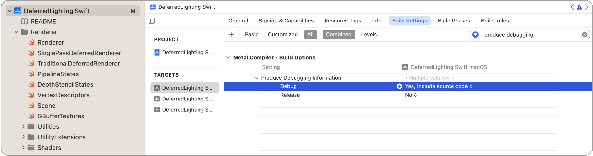

> 导航：[技术](../technologies.md) · [Xcode](../xcode.md) · [调试](debugging.md) · [Metal 开发者工作流](metal-developer-workflows.md)

# 使用嵌入式着色器源代码构建项目

文章

通过在构建中包含源代码，为调试项目的着色器做好准备。

## 概述

要在 Xcode 中调试着色器，请更改项目的构建设置，将构建配置为包含着色器源代码。在 Project 导览器中选择项目，点按 Build Settings 标签页，然后在 Metal Compiler Build Options 部分中搜索 Produce Debugging Information 设置。接着，将该设置的 Debug 条目更改为“Yes, include source code”。

一张 Xcode 截图，其中显示了项目 target 的 Build Settings，并突出显示 Produce Debugging Information 设置，其 Debug 条目设为 Yes, include source code。

或者，你也可以为项目中的每个 Metal 库生成单独的符号文件，从而调试为发布版本编译的着色器。有关此方法的更多信息，请参阅[生成并加载 Metal 库符号文件](../metal/generating-and-loading-a-metal-library-symbol-file.md)。

> [!important] 重要
> 为确保交付给客户的 App 中不包含调试信息，请务必在完成调试后，将 Release 的 Produce Debugging Information 选项重设为 No。

## 另请参阅

### 调试的项目准备

- [命名资源和命令](naming-resources-and-commands.md) — 使用标签和分组增强 Metal App 的调试体验。
- [创建和使用自定义捕获范围](creating-and-using-custom-capture-scopes.md) — 使用自定义捕获范围捕获特定 GPU 命令。
