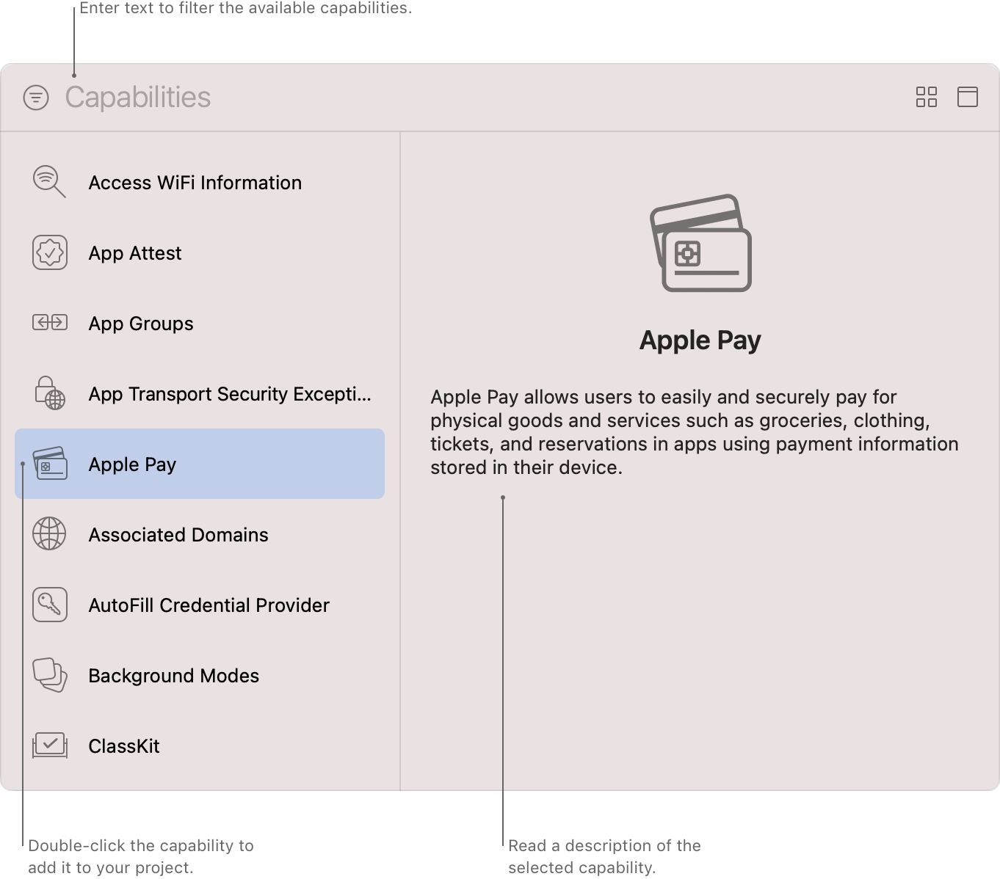

> 导航：[技术](../technologies.md) · [Xcode](../xcode.md)

# 功能

启用 Apple 提供的服务，例如 App 内购买（In-App Purchase）、推送通知（Push Notifications）、Apple Pay、iCloud 及许多其他服务。

## 概述

功能简化了 Apple 众多服务的配置过程，其中一些服务要求你配置特定的 [Entitlements](../bundleresources/entitlements.md) 或更改 App 的描述文件。当你向项目中的 App 或其他目标添加功能时，Xcode 会自动配置该目标以使用相应的服务。例如，Xcode 可能会将所需的 entitlement 添加到新的 entitlements 文件中，并配置项目使用这些 entitlements。当 Xcode 需要你提供额外信息时，它会显示一个简化的界面供你指定这些信息。

Xcode 的功能库截图。左侧是可用的功能列表，你可以双击或拖动某个功能以将其添加到选定的目标。右侧是所选功能的描述。顶部有一个文本框，可用于筛选功能列表。

> [!note] 注意
> 大部分功能可以直接从 Xcode 中添加，但某些 App 服务（例如 Game Center 和 App 内购买）需要在 App Store Connect 和你的开发者账户中进行额外设置。有关更多信息，请参阅下方相应功能的文档。

Xcode 会根据你添加到目标的功能，自动管理该目标的 entitlements 文件。如果你需要手动编辑该文件，请参阅[编辑属性列表文件](editing-property-list-files.md)。

## 主题

### 基础

- [向 App 添加功能](adding-capabilities-to-your-app.md) — 配置你的目标以包含和自定义功能，从而访问 Apple 的 App 服务。

### App 运行

- [配置后台运行模式](configuring-background-execution-modes.md) — 指明你的 App 在 iOS、iPadOS、tvOS、visionOS 和 watchOS 中继续在后台运行所需的后台服务。
- [配置自定字体](configuring-custom-fonts.md) — 将你的 App 注册为系统级自定字体的提供者或使用者。
- [配置游戏控制器](configuring-game-controllers.md) — 通过启用实体游戏控制器的发现、配置和使用来增强游戏输入体验。
- [配置 Maps 支持](configuring-maps-support.md) — 注册你的 iOS 导航 App，以向“地图”及其他 App 提供点到点路线。
- [配置 Siri 支持](configuring-siri-support.md) — 启用你的 App 及其 Intents 扩展，以解析、确认和处理用户通过 Siri 发起的针对你 App 服务的请求。

### 商务

- [配置 Apple Pay 支持](configuring-apple-pay-support.md) — 使用用户存储在设备上的付款信息在你的 App 中处理付款。
- [配置“通过 Apple 登录”支持](configuring-sign-in-with-apple.md) — 允许用户使用其 Apple 账户在你的 App 中创建账户并登录。
- [配置 Wallet 支持](configuring-wallet-support.md) — 访问用户的“钱包”以添加、更新和显示你 App 的凭证。

### 数据管理

- [配置关联域](configuring-an-associated-domain.md) — 在你的 App 和网站之间创建双向关联，以启用通用链接、Handoff、轻 App 和共享的 Web 凭据。
- [配置 App Group](configuring-app-groups.md) — 启用同一开发者创建的多个已安装 App 之间的通信和数据共享。
- [配置 iCloud 服务](configuring-icloud-services.md) — 在运行于不同设备上的同一 App 的多个实例之间共享用户或 App 数据。

### 网络

- [配置网络扩展](configuring-network-extensions.md) — 自定义 App 网络栈的各种功能，例如代理 DNS 查询或创建数据包隧道。
- [向 APNs 注册你的 App](../usernotifications/registering-your-app-with-apns.md) — 与 Apple 推送通知服务（APNs）通信，并接收标识你 App 的唯一设备令牌。
- [配置 Group Activities](configuring-group-activities.md) — 利用 FaceTime 基础设施创建用户可以共享的协调体验。
- [配置媒体设备发现](configuring-media-device-discovery.md) — 将第三方媒体设备或协议作为流媒体选项，添加到与隔空播放（AirPlay）相同的系统菜单中。

### 安全性

- [配置家人控制](configuring-family-controls.md) — 添加家人控制 entitlement，以在你的 App 及其“屏幕使用时间”API App 扩展中启用家长控制功能。
- [配置强化运行时](configuring-the-hardened-runtime.md) — 通过限制对敏感资源的访问和防止常见漏洞利用，保护 macOS App 的运行时完整性。
- [配置 macOS App Sandbox](configuring-the-macos-app-sandbox.md) — 通过限制对文件系统、网络连接等的访问，保护系统资源和用户数据免受被入侵 App 的侵害。
- [配置钥匙串共享](configuring-keychain-sharing.md) — 在属于同一开发者的多个 App 之间共享钥匙串项目。
- [在 macOS 上使用容器保护本地 App 数据](protecting-local-app-data-using-containers.md) — 保护 App 本地存储数据免受未经授权的访问和修改。
- [在现有 macOS App 中访问 App Group 容器](accessing-app-group-containers.md) — 确保你的 App 拥有 App Group 容器 entitlement，并且 macOS 可以对其进行授权。

### 用户数据

- [配置 HealthKit 访问](configuring-healthkit-access.md) — 读取和写入“健康”App 中的健康与活动数据。
- [配置 HomeKit 访问](configuring-homekit-access.md) — 发现兼容的配件，并与已配置的配件和服务进行通信以执行操作。

## 另请参阅

### Xcode IDE

- [项目和工作区](projects-and-workspaces.md) — 管理用于为 Apple 平台构建 App、库和其他软件的代码和资源。
- [源代码管理](source-control-management.md) — 利用 Xcode 中的 Git 源代码管理支持来备份文件、与他人协作以及标记你的发布版本。
- [构建系统](build-system.md) — 将你的代码编译为二进制格式，并自定义项目设置以构建代码。
- [命令行工具](command-line-tools.md) — 在“终端”中开发和自定义你的项目。
