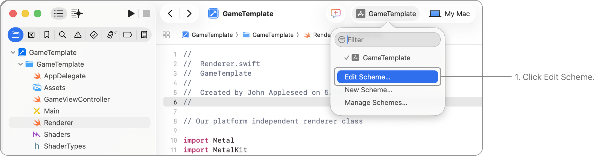
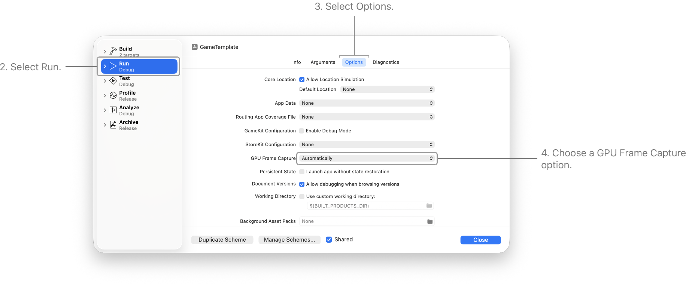
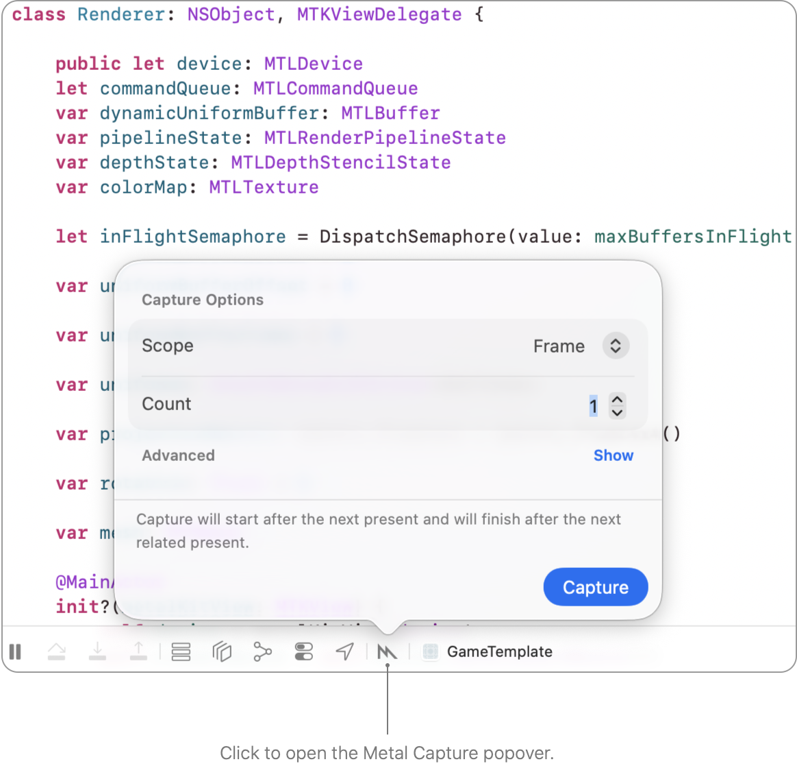
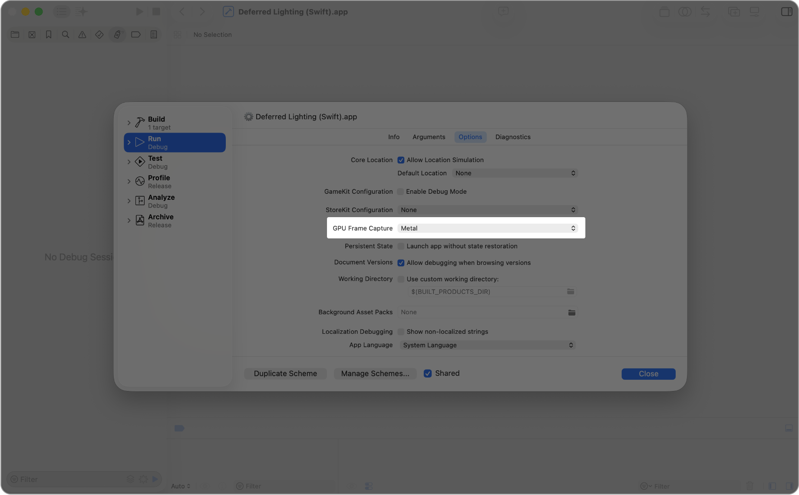
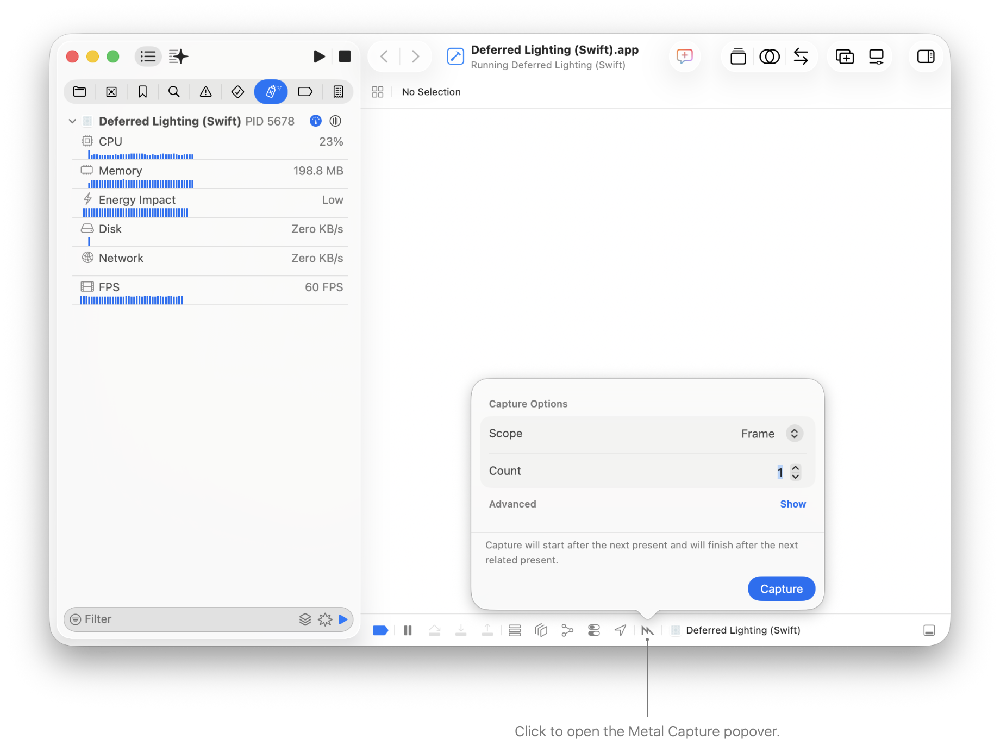
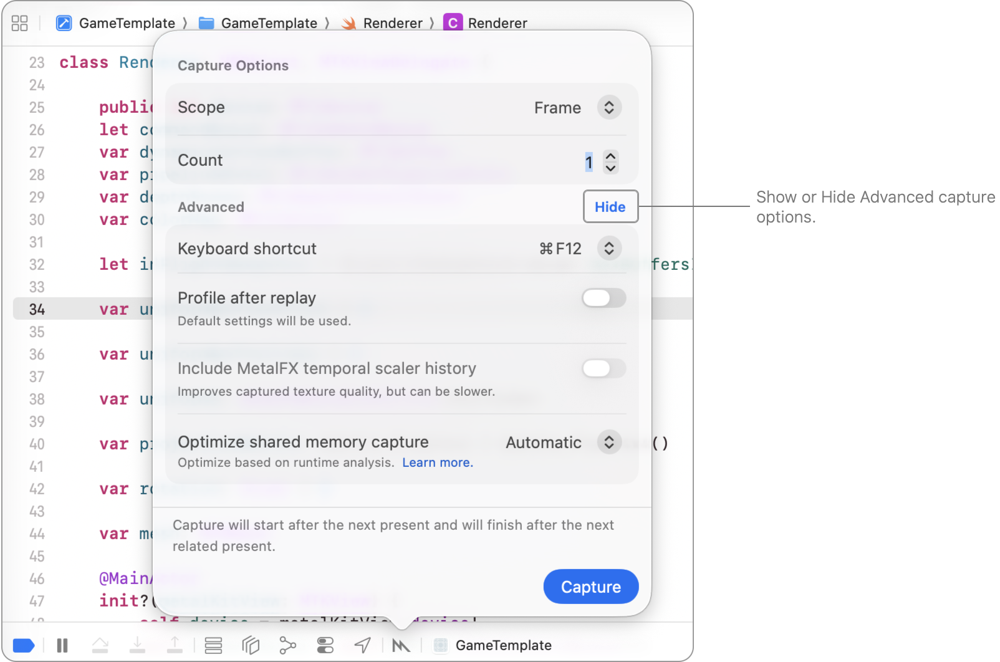

> 导航：[技术](../technologies.md) · [Xcode](../xcode.md) · [调试](debugging.md) · [Metal 调试器](metal-debugger.md)

# 在 Xcode 中采集 Metal 工作负载

文章

通过配置你的项目来使用 Metal 调试器，分析你的 App 的性能。

## 概述

你可以使用 Xcode 来采集你的 App 的 Metal 工作负载。首先，确保在运行时诊断选项中启用了 GPU Frame Capture（GPU 帧采集）选项。然后，当你的 App 正在运行时，点击调试栏中的 Metal Capture（Metal 采集）按钮，选择一个范围，然后点击 Capture。

### 配置 GPU Frame Capture 选项

如果你的 target 链接了 [Metal](../metal.md) 框架或任何其他使用 Metal API 的框架，Xcode 会自动启用 GPU Frame Capture 选项。如果你正在协作开发一个项目，可能其他人已经禁用了 GPU Frame Capture。为确保它已启用，请按照以下步骤操作：

1. 在 Xcode 工具栏中，从 Scheme 菜单中选取 Edit Scheme（编辑方案）。
2. 选择 Run（运行）这个 scheme 操作。
3. 选择 Options（选项）标签页。
4. 选择一个 GPU Frame Capture 选项并点击 Close。

GPU Frame Capture 选项包括以下几种：

- **Automatically（自动）** — 采集你 App 中的 Metal 或 OpenGL ES API 使用情况。如果你的 target 未链接 Metal 框架或 OpenGL ES 框架，Metal Capture 按钮就不会出现在调试栏中。如果你的 App 同时使用了 Metal API 和 OpenGL ES API，你可以点按并按住 Capture GPU Frame 图标来选择要采集哪种 API 的使用情况。
- **Metal** — 仅采集你 App 中的 Metal API 使用情况。如果你的 App 未使用 Metal API，Xcode 会禁用调试栏中的 Metal Capture 按钮。
- **Disabled（禁用）** — 不采集你 App 中的 Metal 使用情况。GPU Frame Capture 对你的 App 的 CPU 处理时间有微小但可衡量的影响，因此当你想要测试 App 的最大性能水平时，请选择此选项。

### 在调试时采集你的 Metal 工作负载

在调试你的 App 时，你可以按照以下步骤采集 GPU trace（GPU 跟踪）：

1. 点击调试栏中的 Metal Capture 按钮。
2. 选择你想要采集的范围。这可以是一个帧（frame）、Metal 图层（layer）、命令队列（command queue）、设备（device），或你之前设置的任何自定义范围。有关更多信息，请参阅《[创建和使用自定义采集范围](creating-and-using-custom-capture-scopes.md)》。
3. 选择计数。根据范围的不同，这可能包括帧数或命令缓冲区（command buffer）的数量。
4. 点击 Capture。

Xcode 会在范围开始时自动开始采集 GPU trace，然后根据你选择的范围和计数完成采集。要手动停止采集，你可以随时点击 Finish 按钮。

### 在部署后采集你的 Metal 工作负载

按照以下步骤，在部署你的 App 后采集 GPU trace：

1. 在 Xcode 中，选取 Debug（调试）\> Debug Executable（调试可执行文件）。
2. 在访达（Finder）中选择你的 App 并点击 Choose（选取）。Xcode 会自动调出方案编辑器。
3. 点击 Options 标签页，选择一个 GPU Frame Capture 选项，然后点击 Close。
4. 通过选取 Product（产品）\> Run 来运行你的 App。
5. 点击调试栏中的 Metal Capture 按钮。
6. 选择你想要采集的范围和计数。
7. 点击 Capture。

Xcode 会在范围开始时自动开始采集 GPU trace，然后根据你选择的计数完成采集。要手动停止采集，你可以随时点击 Finish 按钮。

### 配置高级采集选项

Metal Capture 气泡菜单包含一个 Advanced（高级）部分，其中包含用于控制采集行为的附加选项。要显示这些选项，请点击气泡菜单中 Advanced 旁边的 Show（显示）。

高级采集选项包括以下几种：

- **Keyboard shortcut（键盘快捷键）** — 选择一个键盘快捷键，以便在你的 App 位于前台时开始采集。此选项仅在 macOS 上可用。
- **Profile after replay（重放后分析）** — 在 Xcode 完成重放你采集的工作负载后，使用默认设置自动对其进行分析（profile）。分析对 Metal 调试器有初步的性能影响，因此仅在调试 App 的性能时启用此选项。你可以随时根据需要进行后续分析。
- **Include MetalFX temporal scaler history（包含 MetalFX 时间缩放器历史记录）** — 记录 MetalFX 时间缩放器的历史数据，以提高重放期间采集的纹理质量。启用此选项可能会使采集变慢。当你的 App 使用 MetalFX 时间缩放时，此选项可用。
- **Optimize shared memory capture（优化共享内存采集）** — 控制 Xcode 如何优化对使用共享内存存储的资源的 CPU 写入的采集，这可以提高采集性能并减少 GPU trace 在磁盘上的大小。 - **Automatic（自动）**：当 Xcode 能够确定环境安全支持该优化时，Xcode 会启用该优化，并在系统调用插桩（system call interposition）不可用时禁用它。
- **Always（始终）**：无论环境如何，都强制开启优化。当你拥有大型或缓慢的 GPU 帧采集，并且知道你的 App 不会通过系统调用写入共享内存缓冲区时，请使用此选项。
- **Never（永不）**：完全禁用优化。如果你怀疑优化产生了错误结果，请使用此选项。

### 将采集结果保存到你的电脑

要将你采集的 Metal 工作负载保存为 GPU trace 文件，请选取 File（文件）\> Export（导出）。有关重放 GPU trace 文件的更多信息，请参阅《[重放 GPU trace 文件](replaying-a-gpu-trace-file.md)》。

## 另请参阅

### 基础

- [以编程方式采集 Metal 工作负载](capturing-a-metal-workload-programmatically.md) — 通过调用 Metal 的帧采集来分析你的 App 的性能。
- [重放 GPU trace 文件](replaying-a-gpu-trace-file.md) — 在 Metal 调试器中使用 GPU trace 文件来调试和分析你的 App 的性能。
- [调查视觉伪像](investigating-visual-artifacts.md) — 使用 Metal 调试器发现、诊断并修复你 App 中的视觉伪像。
- [优化 GPU 性能](optimizing-gpu-performance.md) — 使用 Metal 调试器查找并解决性能瓶颈。
- [使用交互式命令行工具进行调试](debugging-with-interactive-command-line-tools.md) — 在不离开终端（Terminal）的情况下调查 GPU trace 中的渲染问题。
- [使用 AI 代理调查 GPU 问题](investigating-gpu-issues-with-ai-agents.md) — 通过将大型 GPU trace 交给 AI 代理进行自主调查，来查找问题的根本原因。
