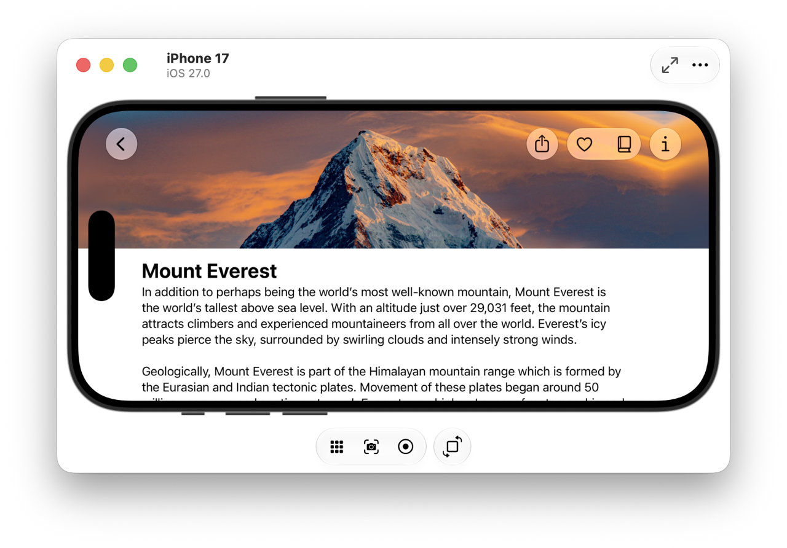

> 导航：[技术](../technologies.md) · [Xcode](../xcode.md) · [Device Hub](device-hub.md)

# 从设备上截取屏幕截图和录制视频

文章

录制交互并截取 App 的屏幕截图，以供分享、审核或提交至 App Store。

## 概述

使用 Device Hub 截取屏幕截图并录制 App 运行时的视频，以便：

- 帮助团队中的其他人理解某个 Bug 或设计问题。
- 记录你的 App 如何响应辅助功能（accessibility）更改。
- 验证不同语言的翻译和界面调整。
- 准备并更新你的 App Store 页面，以展示 App 的最佳功能。

> [!note] 注意
> 从 visionOS 模拟器上截取的屏幕截图和录制的视频，其尺寸和比例可能与从实体设备上获取的不同。为符合 App Store 的要求，你可以调整大小并进行裁剪。更多信息，请参阅 [Screenshot Specifications](https://developer.apple.com/help/app-store-connect/reference/screenshot-specifications) 和 [App Preview Specifications](https://developer.apple.com/help/app-store-connect/reference/app-preview-specifications)。

## 在模拟设备和实体设备上截取屏幕截图

要截取屏幕截图，请在 Device Hub 中于模拟设备或实体设备上运行你的 App。导览（navigation）至 App 中你想要截取屏幕截图的位置。然后点击画布中设备下方的“Screenshot”按钮。Device Hub 会以模拟设备或实体设备的完整分辨率截取屏幕截图，无论你 Mac 的显示分辨率是多少。Device Hub 会将屏幕截图保存到你 Mac 上的“Desktop”文件夹。

Device Hub 的截屏，显示了一个运行 Landmarks 示例代码 App 的 iPhone 模拟器的紧凑窗口，设备下方带有“Screenshot”和“Record”按钮。

## 在模拟设备上录制视频

要录制 App 的视频，请在 Device Hub 中于模拟设备上运行你的 App，并导览至你想要开始录制的位置。点击画布中设备下方的“Record”按钮，或选取 Controls > Record Screen（控制 > 录制屏幕）。然后开始与你的 App 进行交互，同时进行录制。要停止录制，请点击设备下方的“Stop”按钮，或选取 Controls > Stop Recording（控制 > 停止录制）。Device Hub 会将视频文件保存到你的“Desktop”文件夹。文件名的开头为 `Screen Recording`，后跟设备名称和时间戳。

## 另请参阅

### 设备交互

- [配置模拟设备的环境](configuring-the-environment-of-a-simulated-device.md) — 修改模拟设备的设置。
- [在 Device Hub 中与你的 App 交互](interacting-with-your-app-in-device-hub.md) — 使用 Device Hub 控制在模拟设备和实体设备上与你的 App 的交互。
