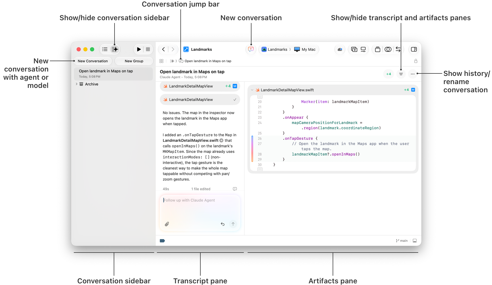

> 导航：[技术](../technologies.md) · [Xcode](../xcode.md)

# 编码智能

使用 Agent 帮助你探索代码、添加功能、优化界面，并利用本地化和辅助功能等技能。

## 概述

你可以通过输入一系列自然语言提示（prompt）来提问和下达指令，与你选择的 Agent 或大语言模型进行交互。Agent 或模型会基于先前的交互以及你提供的任何项目上下文来优化其对提示的响应。Xcode 会将响应及其对项目文件所做的更改呈现出来供你审阅。你可以输入新的提示或撤销更改，并且可以稍后将更改回滚到之前的状态。Xcode 会将你的所有交互保留在对话（conversation）中，供你参考和整理成组。

你可以在项目中的任何位置（包括源代码编辑器）访问 Xcode 智能功能，它能无缝融入你的工作空间。对话侧边栏的行为类似于项目导航器。你可以为对话记录（transcript）和产物（artifacts）面板布局并创建标签，类似于编辑器面板。你可以安排工作空间，在一个面板中编辑文件的同时并行运行多个 Agent。

项目窗口的截图，左侧是对话侧边栏，中间是对话记录，下方是消息文本栏，右侧是产物面板。

在开始之前，请在智能设置中设置一个 Agent 或模型，并在编码助手侧边栏中将其选中。有关更多信息，请参阅[设置编码智能](setting-up-coding-intelligence.md)。

## 主题

### 基础

- [设置编码智能](setting-up-coding-intelligence.md) — 启用你希望在 Xcode 中使用的智能工具。
- [在 Xcode 中使用智能功能编写代码](writing-code-with-intelligence-in-xcode.md) — 在 Xcode 中与 Agent 或模型开始对话，以生成代码、浏览不熟悉的代码库以及修复或重构现有代码。
- [在源代码编辑器中使用编码智能](using-coding-intelligence-in-the-source-editor.md) — 在你希望修改代码的同一位置提交提示。

### 技能与专长

- [使用 Agent 本地化你的 App](localizing-your-app-using-agents.md) — 使用基于 Agent 的编码工具将你的 App 中的字符串翻译成多种语言和地区格式。

### Agent 配置

- [扩展和自定义 Agent](extending-and-customizing-agents.md) — 针对你的特定需求和应用程序领域扩展 Agent 的功能。
- [授予外部 Agent 对 Xcode 的访问权限](giving-external-agents-access-to-xcode.md) — 使用模型上下文协议（Model Context Protocol）让 Agent 能够访问你的项目和 Xcode 功能。

## 另请参阅

### 代码

- [源代码编辑器](source-editor.md) — 使用源代码编辑器编辑源文件、定位问题并进行必要的更改。
- [Bundle 与框架](bundles-and-frameworks.md) — 在 Bundle 和框架中组织代码和资源。
- [Swift 包](swift-packages.md) — 创建可复用的代码，以轻量级方式组织它，并在 Xcode 项目之间以及其他开发者之间共享。
