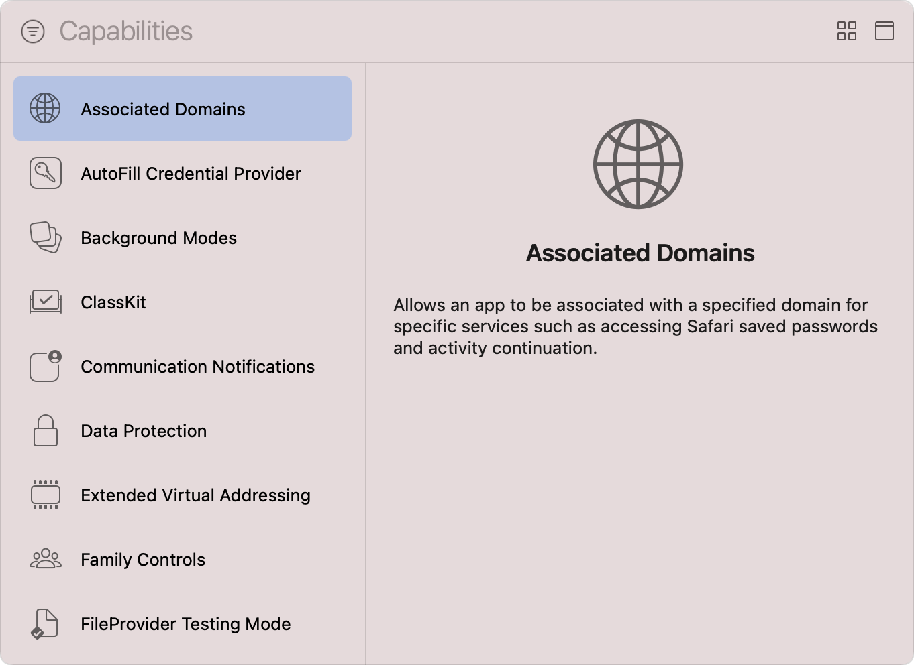
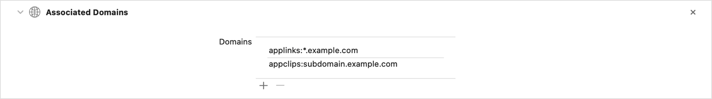
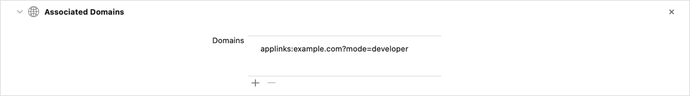

> 导航：[技术](../technologies.md) · [Xcode](../xcode.md) · [功能](capabilities.md)

# 配置关联域

<sub>文章</sub>

在你的 App 与网站之间建立双向关联，以启用通用链接、接力、轻 App 和共享网页凭据。

## 概述

系统使用关联域在你的 App 与特定域之间建立安全关联，使它们能够共享保存的密码、执行接力活动，并支持通用链接。通用链接让用户能够在特定上下文中打开你的 App，并快速完成当前任务。要创建这样的关联，请使用 Xcode 定义关联域，以所需 entitlement 配置你的 App，然后通过网页服务器提供一个特殊文件，供系统验证这些 entitlement。

在定义关联域及其提供的服务前，请按照[向 App 添加功能](adding-capabilities-to-your-app.md)中[添加功能](adding-capabilities-to-your-app.md#Add-a-capability)一节的步骤，将该功能添加到 App 的 target，并确保从 Xcode 的 Capabilities 资源库中选择 Associated Domains 功能。对于带有独立 WatchKit 扩展的 watchOS App，请将该功能添加到 WatchKit Extension target。



<sub>Xcode 的 Capabilities 资源库截图，左侧列出可用功能，右侧显示信息面板。列表展示了从 Associated Domains 到 FileProvider Testing Mode 的一系列功能，其中 Associated Domains 功能处于选中状态。信息面板中的文字说明，关联域允许你的 App 针对特定服务与特定域关联，例如访问 Safari 保存的密码和继续活动。</sub>

如果 target 的 entitlements 文件中尚不存在 [Associated Domains Entitlement](../bundleresources/entitlements/com.apple.developer.associated-domains.md)，Xcode 会更新该文件以包含它；这是一个数组，其中包含你定义的每个关联域。如果为 target 启用“Automatically manage signing”选项，Xcode 还会更新开发者账户中 App 的 App ID，并生成和下载更新后的预配描述文件。

> [!note] 注意
> 如果你之后在 Xcode 中移除 Associated Domains 功能，必须在开发者账户中手动更新 App ID 的配置，才能完全停用该功能。

### 定义服务及其关联域

如果希望你的 App 与一个或多个网站使用预定义服务进行交互，请执行以下步骤定义关联域。Xcode 会自动更新 target 的 entitlements 文件中的 `com.apple.developer.associated-domains` 数组，以包含你定义的关联域。

1. 在 Xcode 的项目导航器中选择你的项目。
2. 在 Targets 列表中选择 App 的 target。
3. 在项目编辑器中点按 Signing & Capabilities 标签页。
4. 找到 Associated Domains 功能。
5. 点按添加按钮（+），插入服务-域占位符。
6. 双击插入的占位符进行编辑。

更新占位符，使其包含 App 支持的服务及其关联域，格式必须如下：

```
<service>:<fully qualified domain>
```



<sub>将 Associated Domains 功能添加到 App target 后的截图。Domains 列表包含两个关联域，一个用于 applinks 服务，另一个用于 appclips 服务。</sub>

只应包含顶级域，并在必要时包含子域；不要包含路径和查询组成部分，也不要包含末尾斜杠。

> [!tip] 提示
> 对于轻 App 以外的服务，在域名前添加 `*.`，即可包括其所有子域。

下表介绍关联域支持的服务：

| 服务 | 说明 |
|---|---|
| `webcredentials` | 如果你的域支持共享网页凭据，请参阅[管理共享凭据](../security/managing-shared-credentials.md)了解更多信息。 |
| `authsrv` | 如果你的域需要认证用户，请参阅[通过网页服务认证用户](../authenticationservices/authenticating-a-user-through-a-web-service.md)了解更多信息。 |
| `applinks` | 如果你的域支持通用链接，请参阅[在 App 中支持通用链接](supporting-universal-links-in-your-app.md)了解更多信息。 |
| `activitycontinuation` | 如果你的域支持接力，请参阅[从网页浏览器接力到原生 App](https://developer.apple.com/library/archive/documentation/UserExperience/Conceptual/Handoff/AdoptingHandoff/AdoptingHandoff.html#//apple_ref/doc/uid/TP40014338-CH2-SW10)了解更多信息。 |
| `appclips` | 如果你的域支持轻 App，请参阅[将轻 App 与网站关联](../appclip/associating-your-app-clip-with-your-website.md)了解更多信息。 |

### 提供 Apple App Site Association 文件

当用户安装包含关联域的 App 时，系统会从 Apple 管理的内容分发网络（CDN）获取相应的 _Apple App Site Association_（AASA）文件，并使用其 JSON 内容验证这些关联域。如果 CDN 未存储该文件的副本，或其版本已过时，CDN 会自动连接你的服务器并获取最新版本。

在 Xcode 中定义 App 的关联域后，你必须创建此文件，并通过 HTTPS 从网站的 `.well-known` 目录提供该文件。有关更多信息，请参阅[将关联域文件添加到网站](supporting-associated-domains.md#Add-the-associated-domain-file-to-your-website)。

### 为无法访问的服务器启用替代模式

如果你在开发 App 时使用无法从公共互联网访问的私有网页服务器，请启用_替代模式（alternate mode）_。通过指定此选项，系统可以绕过 Apple 的 CDN，直接从你的网页服务器获取 AASA 文件。

按照以下步骤为特定关联域启用替代模式：

1. 在 Xcode 的项目导航器中选择你的项目。
2. 在 Targets 列表中选择 App 的 target。
3. 在项目编辑器中点按 Signing & Capabilities 标签页。
4. 找到 Associated Domains 功能。
5. 双击 Domains 列表中的关联域进行编辑。
6. 将字符串 `?mode=<alternate mode>` 附加到关联域。将 `<alternate mode>` 替换为下方列表所示的某种模式。
7. 按下 Return 键，保存更新后的关联域。



<sub>将 Associated Domains 功能添加到 App target 后的截图。Domains 列表包含一个使用 developer 替代模式的关联域。</sub>

下表介绍关联域支持的替代模式：

| 模式 | 说明 |
|---|---|
| `developer` | 可从启用了开发者模式的设备访问该域。你必须使用开发预配描述文件为 App 签名，并且用户必须在设备上启用“设置”\>“开发者”中的 Associated Domains Development 选项，以明确选择加入。 |
| `managed` | 可从使用移动设备管理（MDM）描述文件且已获得 MDM 管理员授权的设备访问该域。 |
| `developer+managed` | 只能从同时处于 `developer` 和 `managed` 模式的设备访问该域。 |

> [!important] 重要
> 仅在开发期间使用替代模式；将 App 提交到 App Store 前，必须从关联域中移除查询字符串。

## 另请参阅

### 数据管理

- [配置 App Group](configuring-app-groups.md) — 让同一开发者创建的多个已安装 App 能够相互通信和共享数据。
- [配置 iCloud 服务](configuring-icloud-services.md) — 在不同设备上运行的多个 App 实例之间共享用户或 App 数据。
