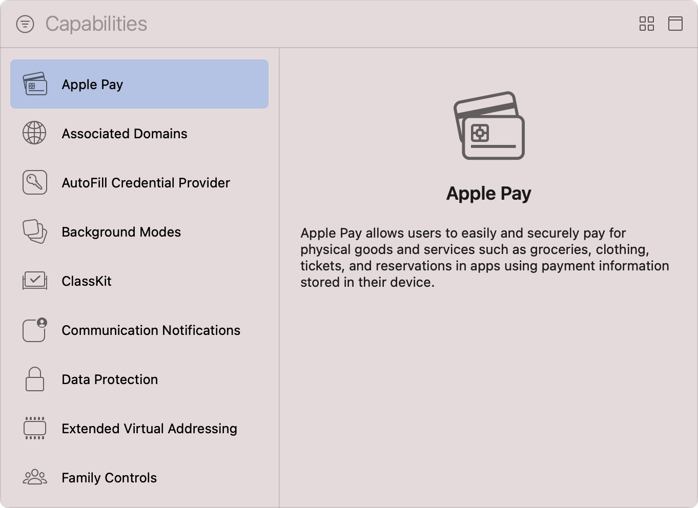
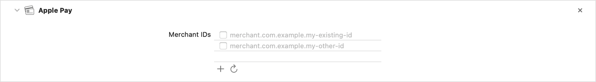
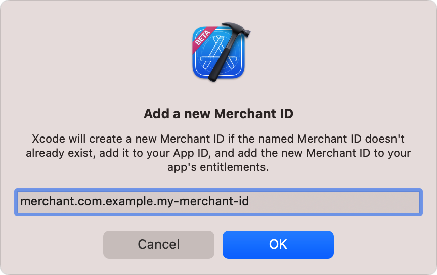
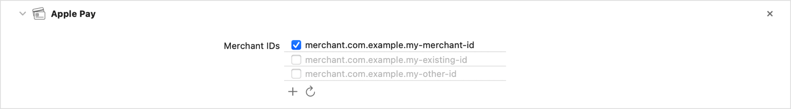

> 导航：[技术](../technologies.md) · [Xcode](../xcode.md) · [功能](capabilities.md)

# 配置 Apple Pay 支持

文章

使用用户存储在设备上的支付信息，在你的 App 中处理付款。

## 概述

Apple Pay 让用户可以在设备上存储支付信息，然后使用这些信息在你的 App 中快速购买商品和服务。你的 App 会创建支付请求，Apple Pay 在你的 App、Apple Pay 服务器和支付服务提供商之间传输该请求。Apple Pay 利用设备的安全元件（Secure Element）来帮助保护用户的支付信息。

要在 App 中使用 Apple Pay，请添加该功能，为 App 的 target 配置必要的 entitlement，并创建商家标识符和支付处理证书，以帮助保护交易数据。有关这些步骤的更多详细信息，请观看视频[为 Apple Pay 配置开发者账户](https://developer.apple.com/videos/play/tutorials/configuring-your-developer-account-for-apple-pay/)。

创建商家标识符或选择现有标识符前，请按照[向 App 添加功能](adding-capabilities-to-your-app.md)中[添加功能](adding-capabilities-to-your-app.md#Add-a-capability)一节的说明操作。进入 Capabilities 资源库后，选择 Apple Pay。对于带有独立 WatchKit 扩展的 watchOS App，请将该功能添加到 WatchKit Extension 的 target。Apple Pay 功能不适用于 tvOS App。

Xcode 的 Capabilities 资源库截图。顶部是过滤按钮，旁边的搜索字段包含占位文本 Capabilities。下方左侧面板中列出了 Associated Domains、ClassKit 和 Apple Pay 等功能，其中 Apple Pay 功能处于选中状态。右侧的信息面板包含文字，说明 Apple Pay 允许用户使用存储在设备中的支付信息，在 App 内轻松、安全地支付杂货、服装、票券和预订等实体商品与服务。

添加 Apple Pay 功能后，Xcode 会更新 target 的 entitlements 文件，使其包含 [Merchant IDs Entitlement](../bundleresources/entitlements/com.apple.developer.in-app-payments.md)。这是一个数组，其中包含你选择的商家标识符。如果你将 Xcode 配置为自动管理 App 签名，Xcode 此时还会为开发者账户中 App 的 App ID 启用 Apple Pay。

> [!note] 注意
> 如果你之后在 Xcode 中移除 Apple Pay 功能，必须在开发者账户中手动更新 App ID 的配置，才能停用 Apple Pay。

### 选择或创建商家标识符

_商家标识符（merchant identifier）_ 会向 Apple Pay 唯一标识你是能够接受付款的商家。要允许 App 提交支付请求，请在项目配置中指定至少一个商家标识符。添加 Apple Pay 功能后，Xcode 会从开发者账户获取所有现有商家标识符，并在该功能的 Merchant IDs 列表中显示它们。要获取账户商家标识符的更新列表，请点按列表下方的刷新按钮。

将 Apple Pay 功能添加到 target 后的截图。Merchant IDs 列表包含两个现有商家 ID，二者均未处于启用状态。

使用复选框启用列表中的一个或多个商家标识符。反之，取消选中某个商家标识符的复选框，即可禁止 App 使用它。Xcode 会更新 target 的 entitlements 文件中的 Merchant IDs 数组（`com.apple.developer.in-app-payments`），以反映你所做的任何更改，并在开发者账户中将选中的商家标识符与 App 的 App ID 关联。

> [!note] 注意
> 为避免破坏依赖该标识符关联关系的 App 线上版本，当你在该功能中取消选择某个商家标识符时，Xcode 不会自动解除它与 App ID 的关联。

要创建新的商家标识符，请执行以下步骤：

1. 在 Xcode 的项目导航器中选择你的项目。
2. 在 Targets 列表中选择 App 的 target。
3. 在项目编辑器中点按 Signing & Capabilities 标签页。
4. 找到 Apple Pay 功能。
5. 点按 Merchant IDs 列表下方的添加按钮（+）。
6. 在出现的对话框中输入商家标识符。最好让商家标识符以 `merchant.` 开头，然后附加一个采用反向 DNS 表示法的自定字符串。
7. 点按 OK 保存新的商家标识符。

点按添加按钮后出现的 Add a new Merchant ID 对话框截图。对话框中的文字说明，如果指定名称的商家 ID 尚不存在，Xcode 将创建新的商家 ID，并将其同时添加到你的 App ID 和 App 的 entitlements 文件中。

Xcode 会自动在开发者账户中注册商家标识符，将其添加到 target 的 entitlements 文件，并在 Merchant IDs 列表中选中它，表示你的 App 现在能够使用这个新商家标识符。

将 Apple Pay 功能添加到 target 后的截图。Merchant IDs 列表包含三个商家 ID，其中新商家 ID 处于启用状态。

### 创建支付处理证书

使用商家标识符前，必须生成_支付处理证书（payment processing certificate）_。这种数字证书可保护交易数据并证明其来源。Apple Pay 服务器使用证书的公钥加密支付数据，你或支付服务提供商则使用证书的私钥解密数据并处理付款。有关创建证书的更多信息，请参阅[创建支付处理证书](https://developer.apple.com/help/account/configure-app-capabilities/configure-apple-pay#create-a-payment-processing-certificate)。

> [!note] 注意
> 如果你使用电子商务平台或支付服务提供商，请联系对方，了解如何将其服务与 Apple Pay 配合使用。有关受支持的平台和提供商列表，请参阅[支付平台](https://developer.apple.com/apple-pay/payment-platforms/)。

创建商家标识符和支付处理证书后，请使用 PassKit 框架启用 App 内付款收集。有关更多信息，请参阅 [Apple Pay](../passkit/apple-pay.md) 文档和示例代码[在 App 中提供 Apple Pay](../passkit/offering-apple-pay-in-your-app.md)。

## 另请参阅

### 商务

- [配置“通过 Apple 登录”支持](configuring-sign-in-with-apple.md) — 允许用户使用 Apple 账户创建账户并登录你的 App。
- [配置“钱包”支持](configuring-wallet-support.md) — 访问用户的“钱包”，以添加、更新和显示你的 App 的凭证。
