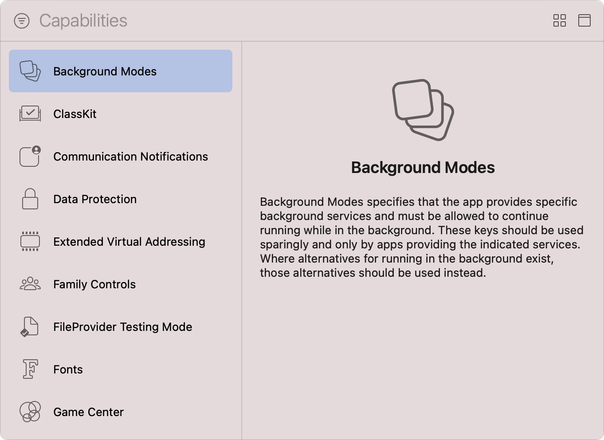

> 导航：[技术](../technologies.md) · [Xcode](../xcode.md) · [功能](capabilities.md)

# 配置后台运行模式

文章

指明你的 App 在 iOS、iPadOS、tvOS、visionOS 和 watchOS 中继续在后台运行所需的后台服务。

## 概述

通常，App 进入后台后会处于挂起状态。不过，App 可以支持的后台运行模式数量有限，这些模式可使其在后台运行，例如播放音频、接收位置更新或处理计划任务。对于采纳一种或多种此类模式的 App，系统会在后台启动或恢复 App，并为其提供时间来处理任何相关事件。

请谨慎使用后台运行模式，因为过度使用会对设备性能和电池续航造成负面影响。如果有在后台运行的替代方式，请改用该方式。例如，App 可以使用显著位置变化服务接收位置事件，而不使用 Location updates 后台模式。

在选择 App 所需的后台运行模式前，请按照[添加功能](adding-capabilities-to-your-app.md#Add-a-capability)中的步骤，将 Background Modes 功能添加到 App 的 target。

Xcode 的 Capabilities 资源库截图，左侧列出可用功能，右侧显示信息面板。列表展示了从 Background Modes 到 Game Center 的一系列功能，其中 Background Modes 功能处于选中状态。信息面板中的文字说明，借助 Background Modes，你的 App 可以提供需要在后台继续运行的特定后台服务。它还建议谨慎使用 Background Modes，并且只有提供所列服务的 App 才应使用。当存在后台运行的替代方式时，应改用这些替代方式。

添加该功能后出现的后台运行模式取决于 target 的平台。对于带有独立 WatchKit 扩展的 watchOS App，需要将该功能添加到 WatchKit Extension target。

> [!note] 注意
> Background Modes 功能不适用于 macOS App。

### 指定 App 所需的后台模式

在 App 能够利用一种或多种后台运行模式前，需要执行以下操作来声明所需模式：

1. 在 Xcode 的项目导航器中选择你的项目。
2. 在 Targets 列表中选择 App 的 target。
3. 在项目编辑器中点按 Signing & Capabilities 标签页。
4. 找到 Background Modes 功能。
5. 使用相应的复选框选择一种或多种后台运行模式。
6. 对于 watchOS App，从弹出式菜单中选择适当的会话类型。有关更多信息，请参阅[使用延长运行时间会话](../watchkit/using-extended-runtime-sessions.md)。

将 Background Modes 功能添加到 target 后的截图。可用模式列表包括 Audio, AirPlay, and Picture in Picture；Location Updates；Voice over IP；External accessory communication；Uses Bluetooth LE accessories；Acts as a Bluetooth LE accessory；Background fetch；Remote notifications；Background processing；Uses Nearby Interaction；以及 Push to Talk。其中 Background fetch 模式的复选框处于选中状态。

如果你的 App 的 `Info.plist` 文件中尚不存在 [UIBackgroundModes](../bundleresources/information-property-list/uibackgroundmodes.md) 数组，Xcode 会添加该数组，并使用你选择的模式将必要值填入其中。

Apple 平台支持以下后台运行模式：

| 模式 | 值 | 说明 | 平台 |
|---|---|---|---|
| 音频、隔空播放和画中画 | `audio` | App 在后台播放有声内容。有关更多信息，请参阅[配置 App 以播放媒体](../avfoundation/configuring-your-app-for-media-playback.md)。 | iOS、iPadOS、tvOS、visionOS |
| 音频 | `audio` | App 在后台播放有声内容。有关更多信息，请参阅[播放后台音频](../watchkit/playing-background-audio.md)。 | watchOS |
| 位置更新 | `location` | App 提供基于位置的信息，并且需要使用平台的标准定位服务。有关更多信息，请参阅[配置 App 以使用定位服务](../corelocation/configuring-your-app-to-use-location-services.md)。 | iOS、iPadOS、watchOS |
| IP 语音 | `voip` | App 提供 IP 语音服务。有关更多信息，请参阅 [CallKit](../callkit.md) 框架。 | iOS、iPadOS、visionOS、watchOS |
| 外部配件通信 | `external-accessory` | App 与定期提供数据的配件通信。有关更多信息，请参阅 [External Accessory](../externalaccessory.md) 框架。 | iOS、iPadOS |
| 使用 Bluetooth LE 配件 | `bluetooth-central` | App 在后台与 Bluetooth 配件通信。有关更多信息，请参阅 [Core Bluetooth](../corebluetooth.md) 框架。 | iOS、iPadOS、visionOS |
| 充当 Bluetooth LE 配件 | `bluetooth-peripheral` | App 使用外围设备模式与 Bluetooth 配件通信。有关更多信息，请参阅 [Core Bluetooth](../corebluetooth.md) 框架。 | iOS、iPadOS |
| 后台获取 | `fetch` | App 需要定期从网络获取新内容。有关更多信息，请参阅[使用后台任务更新 App](../uikit/using-background-tasks-to-update-your-app.md)。 | iOS、iPadOS、tvOS、visionOS |
| 远程通知 | `remote-notification` | App 使用推送通知作为有新内容可供下载的信号。有关更多信息，请参阅[向 App 推送后台更新](../usernotifications/pushing-background-updates-to-your-app.md)。 | iOS、iPadOS、tvOS、visionOS、watchOS |
| 后台处理 | `processing` | App 在后台执行计划任务。有关更多信息，请参阅 [BGTaskScheduler](../backgroundtasks/bgtaskscheduler.md)。 | iOS、iPadOS、tvOS、visionOS |
| 体能训练处理 | `workout-processing` | App 使用体能训练会话跟踪用户在 Apple Watch 上的活动。有关更多信息，请参阅[运行体能训练会话](../healthkit/running-workout-sessions.md)。 | watchOS |
| 使用 Nearby Interaction | `nearby-interaction` | App 定位附近设备并与之交互。有关更多信息，请参阅 [Nearby Interaction](../nearbyinteraction.md) 框架。 | iOS、iPadOS |
| 对讲 | `push-to-talk` | App 响应推送通知而启动，并在后台播放有声内容。有关更多信息，请参阅 [Push to Talk](../pushtotalk.md) 框架。 | iOS、iPadOS |

## 另请参阅

### App 运行

- [配置自定字体](configuring-custom-fonts.md) — 将你的 App 注册为系统范围自定字体的提供方或使用方。
- [配置游戏控制器](configuring-game-controllers.md) — 启用实体游戏控制器的发现、配置和使用，以增强游戏输入体验。
- [配置“地图”支持](configuring-maps-support.md) — 注册你的 iOS 路线规划 App，以向“地图”和其他 App 提供点对点路线指引。
- [配置 Siri 支持](configuring-siri-support.md) — 让你的 App 及其 Intents 扩展能够解析、确认并处理用户发起的针对你的 App 服务的 Siri 请求。
