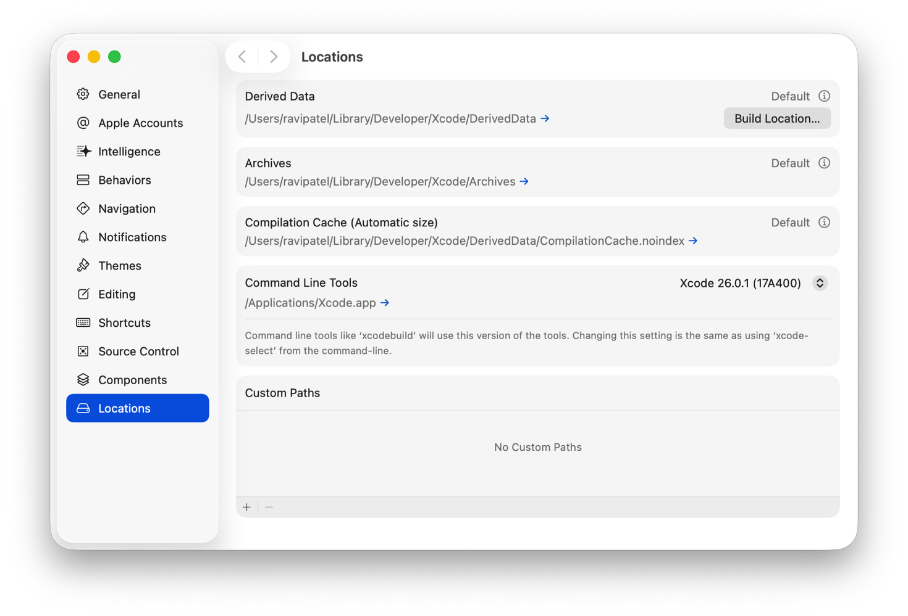
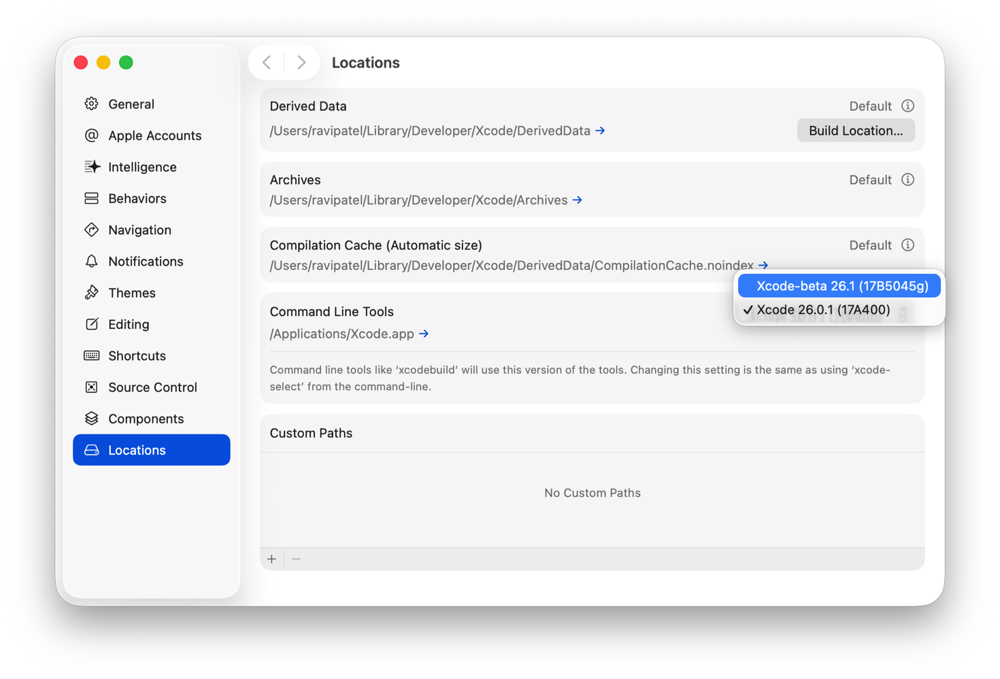

> 导航：[技术](../technologies.md) · [Xcode](../xcode.md) · [命令行工具](command-line-tools.md)

# 配置命令行工具设置

<sub>文章</sub>

在 Xcode 设置或“终端”中，选择你希望命令行工具使用的 Xcode 版本。

## 概述

如果你的 Mac 上安装了多个版本的 Xcode，可以选择命令行工具要使用的特定 App 版本。例如，你可能希望使用最新版 Xcode 发布 App，同时使用 beta 版本试用新 API。

你可以在 Xcode 设置中为命令行工具选择默认的 Xcode 版本，也可以通过命令行进行设置。要将更改应用到 Mac 上的每个用户账户，请使用 Xcode 设置或命令行。要仅将更改应用到当前 shell 会话，请使用命令行。

> [!note] 注意
> 要使用 Command Line Tools for Xcode 软件包中的命令，请在安装后选择该软件包。有关更多信息，请参阅[安装命令行工具](installing-the-command-line-tools.md)。

### 检查命令行工具默认使用的 Xcode App

要确定命令行工具默认使用的 Xcode App，请选择 Xcode \> Settings，然后在边栏中点按 Locations。Locations 面板的 Command Line Tools 部分会同时显示 Xcode 版本号和文件位置。

<sub>Xcode 设置中 Locations 面板的截图，展示 Archives、Compilation Cache (Automatic size)、Command Line Tools 和 Custom Paths 部分。</sub>

你也可以通过命令行确定 Xcode 版本。在“终端”中输入带 `--print-path` 选项的 `xcode-select`。此命令会返回 Xcode 当前活跃的开发者目录路径。例如，以下命令会输出包含某个 Xcode 版本的开发者目录路径：

```
% xcode-select --print-path
/Applications/Xcode.app/Contents/Developer
```

如果你安装 Command Line Tools for Xcode 软件包并将其设为活跃目录，`xcode-select --print-path` 命令会返回该软件包的路径，如下例所示：

```
% xcode-select --print-path
/Library/Developer/CommandLineTools
```

如果你的 macOS 电脑上没有活跃的开发者目录，此命令会输出以下消息：

```
% xcode-select --print-path
xcode-select: error: Unable to get active developer directory. Use 
sudo `xcode-select --switch <path/to/>Xcode.app` to set one 
(or see man xcode-select)
```

> [!important] 重要
> Xcode 的标准位置是 `/Applications/Xcode.app`。如果你将 Xcode 安装在非标准位置，例如 `/Applications/Xcode26/Xcode.app`，请使用 Xcode 设置或 `xcode-select` 选择该位置。

### 选择默认 Xcode App

要在 Xcode 中更改命令行工具默认使用的 Xcode App，请在 Locations 设置的 Command Line Tools 下，从弹出式菜单中选择其他 App 版本。弹出式菜单包含 Mac 上安装的每个 Xcode App 的名称和构建版本。



<sub>Xcode 设置的截图，其中选中了 Locations，并显示 Archives、Compilation Cache(Automatic size)、Command Line Tools 和 Custom Paths 部分。在 Command Line tools 下，</sub> 当系统提示你确认更改时，请输入管理员密码。

你也可以在“终端”中使用 `xcode-select` 命令，为命令行工具设置默认 Xcode App。在“终端”中输入带 `--switch` 选项的 `xcode-select`：

```
% sudo xcode-select --switch <path>
```

在此命令中，`<path>` 指定你要使用的 Xcode App 开发者目录或 Command Line Tools for Xcode 软件包的路径。

> [!note] 注意
> `--switch` 选项需要超级用户权限。如有必要，当系统提示你使用 `--switch` 选项时，请输入管理员密码。

例如，以下命令会选择 Xcode 的 beta 版本：

```
% sudo xcode-select --switch /Applications/Xcode-beta.app
```

要选择 Command Line Tools for Xcode 软件包，请运行以下命令：

```
% sudo xcode-select --switch /Library/Developer/CommandLineTools
```

### 临时选择默认 Xcode App

如果你想保留命令行工具默认使用的 Xcode App，同时使用另一 Xcode 版本中的命令，请在“终端”中调用该命令时设置 `DEVELOPER_DIR` 环境变量：

```
% env DEVELOPER_DIR="<path>" <command>
```

该环境变量会覆盖活跃的开发者目录，并且不需要超级用户权限。它接受你要使用的 Xcode App 开发者目录或 Command Line Tools for Xcode 软件包的路径。

例如，以下命令从已连接设备收集 sysdiagnose，并将其保存到指定位置：

```
% env DEVELOPER_DIR="/Applications/Xcode-beta.app" xcrun devicectl device sysdiagnose --device "Work iPad" --destination ~/Downloads --gather-full-logs 

```

## 另请参阅

### 基础

- [安装命令行工具](installing-the-command-line-tools.md) — 使用安装器软件包或“终端”App 安装 Xcode 命令行工具。
- [Xcode 命令行工具参考](xcode-command-line-tool-reference.md) — 使用需要安装 Xcode 并将该 App 设为活跃开发者目录的命令行工具。
