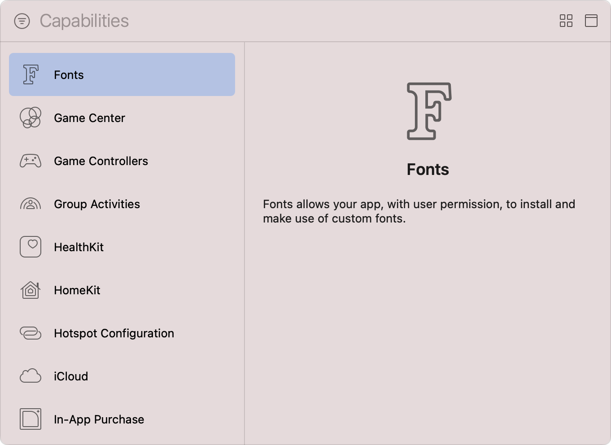

> 导航：[技术](../technologies.md) · [Xcode](../xcode.md) · [功能](capabilities.md)

# 配置自定字体

文章

将你的 App 注册为系统范围自定字体的提供方或使用方。

## 概述

在 iOS 13 及更高版本中，你的 iOS App 可以提供字体供整个系统使用，也可以利用其他 App 安装的字体。

当 App 尝试在系统范围内安装一种或多种字体时，iOS 会请求用户许可。如果用户同意，安装的字体会出现在“设置”\>“通用”\>“字体”中。如果你的 App 提供可安装字体，请加入一个界面，让用户能够浏览这些字体并管理其注册。

你必须将可安装字体存储在 App 套装中，或使用按需资源提供这些字体，因为系统禁止 App 安装任意字体。请提供 TTF、OTF 或 TTC 格式或其任意现代变体的字体，并将大型字体库打包为素材目录。

系统会根据可用系统资源限制已安装字体的数量。如果用户删除你的 App，系统会自动移除该 App 安装的所有字体。

要将 App 注册为系统范围自定字体的提供方或使用方，请按照[添加功能](adding-capabilities-to-your-app.md#Add-a-capability)中的步骤，将 Fonts 功能添加到 App 的 target。

Xcode 的 Capabilities 资源库截图，左侧列出可用功能，右侧显示信息面板。列表展示了从 Fonts 到 In-App Purchase 的一系列功能，其中 Fonts 功能处于选中状态。信息面板中的文字说明，Fonts 功能允许你的 App 在获得用户许可后安装和使用自定字体。

> [!note] 注意
> Fonts 功能仅适用于以 iOS 13 及更高版本为 target 的 iOS App。

### 选择所需权限

在你的 iOS App 能够安装一种或多种自定字体或使用其他 App 提供的字体之前，必须执行以下操作以启用必要权限：

1. 在 Xcode 的项目导航器中选择你的项目。
2. 从 Targets 列表中选择 iOS App 的 target。
3. 在项目编辑器中点按 Signing & Capabilities 标签页。
4. 找到 Fonts 功能。
5. 使用相应的复选框选择所需权限。

将 Fonts 功能添加到 iOS target 后的截图。Install Fonts 和 Use Installed Fonts 权限均处于启用状态。

> [!tip] 提示
> Fonts 权限并不互斥；你的 iOS App 可以提供字体供其他 App 使用，同时也能使用其他 App 在系统范围内安装的字体。

如果你的 App 的 entitlements 文件中尚不存在 `com.apple.developer.user-fonts` 数组，Xcode 会添加该数组，并使用你启用的权限将相应值填入其中。

启用所需权限后，更新你的 App 以执行以下一项或多项操作：

- 使用以下某个注册方法在系统范围内注册字体：

    - [CTFontManagerRegisterFontURLs(_:_:_:_:)](<../coretext/ctfontmanagerregisterfonturls(________).md>)
    - [CTFontManagerRegisterFontDescriptors(_:_:_:_:)](<../coretext/ctfontmanagerregisterfontdescriptors(________).md>)
    - [CTFontManagerRegisterFontsWithAssetNames(_:_:_:_:_:)](<../coretext/ctfontmanagerregisterfontswithassetnames(__________).md>)
- 使用以下某个取消注册方法移除已安装字体：

    - [CTFontManagerUnregisterFontURLs(_:_:_:)](<../coretext/ctfontmanagerunregisterfonturls(______).md>)
    - [CTFontManagerUnregisterFontDescriptors(_:_:_:)](<../coretext/ctfontmanagerunregisterfontdescriptors(______).md>)
- 使用 [CTFontManagerRequestFonts(_:_:)](<../coretext/ctfontmanagerrequestfonts(____).md>) 查询所有已安装字体
- 使用 [kCTFontManagerRegisteredFontsChangedNotification](../coretext/kctfontmanagerregisteredfontschangednotification.md) 监听字体更改通知

有关更多信息，请观看 WWDC 场次视频[字体管理与文本缩放](https://developer.apple.com/videos/play/wwdc2019/227)。

## 另请参阅

### App 运行

- [配置后台运行模式](configuring-background-execution-modes.md) — 指明你的 App 在 iOS、iPadOS、tvOS、visionOS 和 watchOS 中继续在后台运行所需的后台服务。
- [配置游戏控制器](configuring-game-controllers.md) — 启用实体游戏控制器的发现、配置和使用，以增强游戏输入体验。
- [配置“地图”支持](configuring-maps-support.md) — 注册你的 iOS 路线规划 App，以向“地图”和其他 App 提供点对点路线指引。
- [配置 Siri 支持](configuring-siri-support.md) — 让你的 App 及其 Intents 扩展能够解析、确认并处理用户发起的针对你的 App 服务的 Siri 请求。
