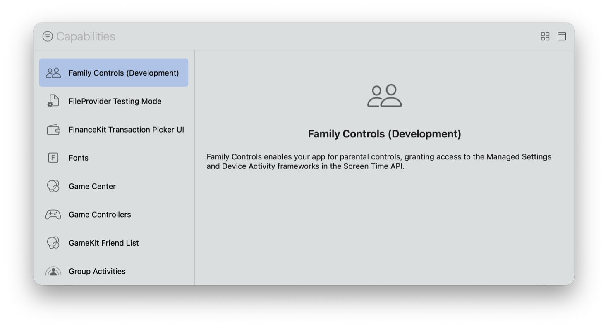

> 导航：[技术](../technologies.md) · [Xcode](../xcode.md) · [能力](capabilities.md)

# 配置 Family Controls

<sub>文章</sub>

添加 Family Controls entitlement，在你的 App 及其 Screen Time API App 扩展中启用家长控制功能。

## 概述

Family Controls 框架让你的 App 能够使用 Screen Time API App 扩展，通过 Managed Settings 和 Device Activity 框架实现家长控制。有关 Screen Time API 的更多信息，请参阅 [Screen Time 技术框架](../screentimeapidocumentation.md)。

若要启用 Family Controls 功能，请将该能力添加到你的 target。Xcode 会自动更新 App target 的 entitlements 文件，加入值设为 `true` 的 `com.apple.developer.family-controls` entitlement 键；在开发期间，你可以通过 Apple Developer Program 访问该 entitlement。请在 [Certificates, Identifiers & Profiles](https://developer.apple.com/account/resources/identifiers/list) 的 Capabilities 标签页下，为 App 及其 Screen Time API App 扩展的 App ID 配置此能力。

### 将 Family Controls 能力添加到 target

若要将该能力添加到 App target，请按照[向 App 添加能力](adding-capabilities-to-your-app.md)中[添加能力](adding-capabilities-to-your-app.md#Add-a-capability)一节的步骤操作，然后从 Xcode 的 Capabilities 库中选择 Family Controls。如果你在 Xcode 项目中使用 Device Activity Monitor、Device Activity Report、Shield Action 或 Shield Configuration 等 Screen Time API 扩展模板添加新 target，Xcode 会自动启用 Family Controls。此能力适用于 iOS 和 visionOS。 

<sub>Xcode Capabilities 库的屏幕截图，左侧是可用能力列表，右侧是信息面板。列表展示了从 Family Controls (Development) 到 Group Activities 的一系列能力，其中 Family Controls (Development) 能力处于选中状态。信息面板上的文字说明：此能力为 App 启用家长控制，并授予对 Screen Time API 中 Managed Settings 和 Device Activity 框架的访问权限。</sub>

如果你在 Xcode 中移除 Family Controls 能力，请在 Certificates, Identifiers & Profiles 中为 App 的 App ID 停用此能力，[重新生成预配描述文件（provisioning profile）](https://developer.apple.com/help/account/provisioning-profiles/edit-download-or-delete-profiles#regenerate-a-provisioning-profile)，并使用该描述文件重新签名 App。

### 添加 Family Controls entitlement 键

添加 Family Controls 能力时，Xcode 会自动更新 App target 的 entitlements 文件，加入值设为 `true` 的 `com.apple.developer.family-controls` entitlement 键：

```
<plist>
    <dict>
        <key>com.apple.developer.family-controls</key>
        <true/>
    </dict>
</plist>
```

如果 App target 不包含 entitlements 文件，请移除 Family Controls 能力，然后重新添加。

### 更新预配描述文件

在 Xcode 中将 Family Controls 能力添加到 App target 后，请生成预配描述文件，并使用该描述文件重新签名 App。使用自动签名可让 Xcode 为你管理签名。如果使用自动签名，Xcode 会自动在 [Certificates, Identifiers & Profiles](https://developer.apple.com/account/resources/identifiers/list) 中为 App 的 App ID 启用 Family Controls，并为 App 请求新的预配描述文件。有关更多信息，请参阅[编辑、下载或删除预配描述文件](https://developer.apple.com/help/account/provisioning-profiles/edit-download-or-delete-profiles)。

如果你手动签名 App，请在 [Certificates, Identifiers & Profiles](https://developer.apple.com/account/resources/identifiers/list) 中为 App 的 App ID 启用 Family Controls 能力，然后[重新生成预配描述文件](https://developer.apple.com/help/account/provisioning-profiles/edit-download-or-delete-profiles#regenerate-a-provisioning-profile)。有关更多信息，请参阅[启用 App 能力](https://developer.apple.com/help/account/identifiers/enable-app-capabilities)。重新生成描述文件后，下载该文件或从 Xcode 的 Provisioning Profile 下拉菜单中选择 Download Profile 进行安装。有关更多信息，请参阅[将 App 分发到注册设备](distributing-your-app-to-registered-devices.md)。

如果你的 App 包含 Screen Time API 扩展，请使用相同步骤更新该扩展的预配描述文件。

### 请求 Family Controls entitlement

若要分发 App，你需要一个启用分发的 entitlement。向 TestFlight 和 App Store 提交 App 时，请请求使用 [Family Controls](../bundleresources/entitlements/com.apple.developer.family-controls.md) entitlement 的权限。此 entitlement 支持用于开发、Ad Hoc 和 App Store 分发的预配描述文件。如果你的 App 包含 Screen Time API App 扩展，请为该扩展提交相同请求。

## 另请参阅

### 安全性

- [配置加固运行时](configuring-the-hardened-runtime.md) — 通过限制对敏感资源的访问并防止常见攻击，保护 macOS App 的运行时完整性。
- [配置 macOS App 沙盒](configuring-the-macos-app-sandbox.md) — 通过限制对文件系统、网络连接等内容的访问，保护系统资源和用户数据免受受损 App 的侵害。
- [配置钥匙串共享](configuring-keychain-sharing.md) — 在属于同一开发者的多个 App 之间共享钥匙串项目。
- [在 macOS 上使用容器保护本地 App 数据](protecting-local-app-data-using-containers.md) — 保护 App 的本地存储数据免受未经授权的访问和修改。
- [在现有 macOS App 中访问 App Group 容器](accessing-app-group-containers.md) — 确保你的 App 具有 App Group 容器 entitlement，且 macOS 可以对其授权。
