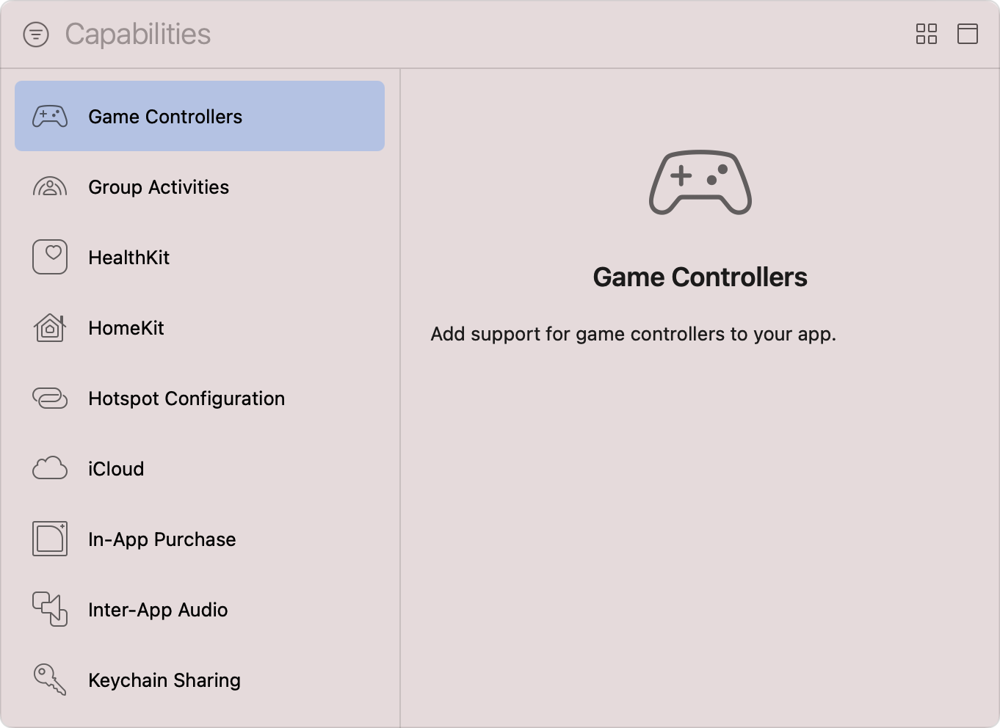
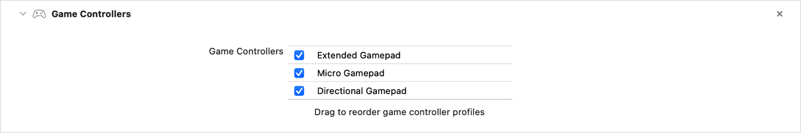

> 导航：[技术](../technologies.md) · [Xcode](../xcode.md) · [能力](capabilities.md)

# 配置游戏控制器

文章

通过启用实体游戏控制器的发现、配置和使用，增强游戏输入体验。

## 概述

游戏控制器提供用于触发游戏操作的实体控制。Apple 为 MFi 配件制造商指定这些控制的外观和行为，这意味着你可以信赖所有受支持游戏控制器所提供的一致、高质量控制组合。

支持游戏控制器的游戏会启用一个或多个不同的_游戏控制器配置文件（game-controller profile）_，例如 Extended、Micro 和 Directional；这些对象会将设备上的实体控制映射到游戏所需的输入。游戏还会指定使用这些配置文件的首选顺序。从连接的游戏控制器检索配置文件后，你的游戏会定期请求设备的当前值，或安装在这些值发生变化时由系统调用的处理程序。

在选择游戏支持的配置文件之前，请按照[添加能力](adding-capabilities-to-your-app.md#Add-a-capability)中的步骤，将 Game Controllers 能力添加到游戏的 target。

Xcode Capabilities 库的屏幕截图，左侧是可用能力列表，右侧是信息面板。列表展示了从 Game Controllers 到 Keychain Sharing 的一系列能力，其中 Game Controllers 能力处于选中状态。信息面板上的文字说明：Game Controllers 能力会为你的 App 添加游戏控制器支持。

将 Game Controllers 能力添加到游戏 target 后，Xcode 会向其 `Info.plist` 文件追加 [GCSupportsControllerUserInteraction](../bundleresources/information-property-list/gcsupportscontrolleruserinteraction.md) 键，并将值设为 `true`，以向系统表明你的游戏支持游戏控制器。

> [!note] 注意
> Game Controllers 能力仅适用于面向 iOS、iPadOS、tvOS 和 visionOS 的游戏。

### 选择受支持的游戏控制器配置文件

向 App 添加游戏控制器支持时，你无需与特定硬件集成，而是与 [Game Controller](../gamecontroller.md) 框架提供的一个或多个游戏控制器配置文件集成。每个配置文件都映射到 Apple 定义的控制布局，并描述一组硬件制造商保证控制器上可用的实体控制。

若要向系统表明游戏支持哪些游戏控制器配置文件，请执行以下步骤：

1. 在 Xcode 的 Project navigator 中选择项目。
2. 从 Targets 列表中选择游戏的 target。
3. 点按项目编辑器中的 Signing & Capabilities 标签页。
4. 找到 Game Controllers 能力。
5. 通过选择相应的复选框，选择适当的游戏控制器配置文件。

将 Game Controllers 能力添加到 target 后的屏幕截图。Extended Gamepad、Micro Gamepad 和 Directional Gamepad 配置文件均处于启用状态。

如果游戏的 `Info.plist` 文件中尚不存在 [GCSupportedGameControllers](../bundleresources/information-property-list/gcsupportedgamecontrollers.md) 数组，Xcode 会添加该数组，并使用所选游戏控制器配置文件的名称填充它。有关每个配置文件的更多信息，请参阅 [GCExtendedGamepad](../gamecontroller/gcextendedgamepad.md)、[GCMicroGamepad](../gamecontroller/gcmicrogamepad.md) 和 [GCDirectionalGamepad](../gamecontroller/gcdirectionalgamepad.md)。

硬件控制器可以支持多个配置文件；如果你启用了多个游戏控制器配置文件，请拖动这些配置文件并按首选顺序排列。例如，如果游戏同时支持 Extended 和 Micro 配置文件，但针对 Micro 配置文件优化了游戏体验，请将该配置文件放在列表顶部。

有关更多信息，请参阅视频[利用虚拟和实体游戏控制器](https://developer.apple.com/videos/play/wwdc2021/10081)和示例代码[支持游戏控制器](../gamecontroller/supporting-game-controllers.md)。

## 另请参阅

### App 执行

- [配置后台执行模式](configuring-background-execution-modes.md) — 指明你的 App 在 iOS、iPadOS、tvOS、visionOS 和 watchOS 中继续在后台执行所需的后台服务。
- [配置自定字体](configuring-custom-fonts.md) — 将你的 App 注册为系统范围自定字体的提供方或使用方。
- [配置地图支持](configuring-maps-support.md) — 注册 iOS 路线规划 App，以向地图和其他 App 提供点到点路线指引。
- [配置 Siri 支持](configuring-siri-support.md) — 让你的 App 及其 Intents 扩展能够解析、确认并处理用户发起的针对 App 服务的 Siri 请求。
