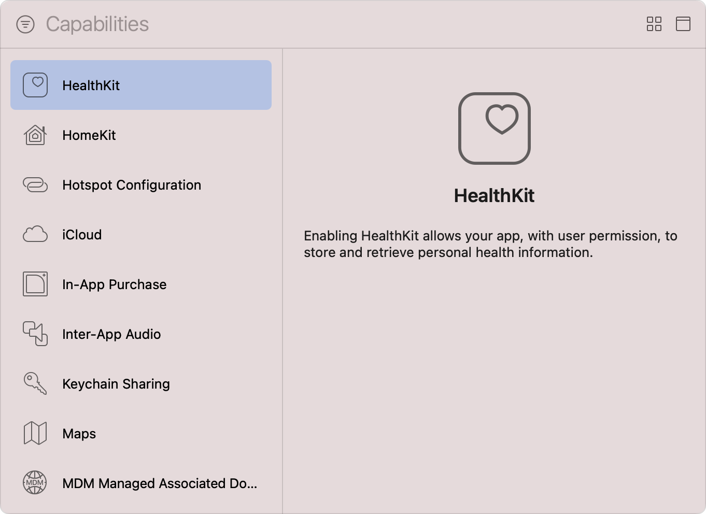
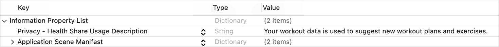
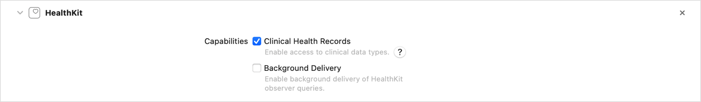
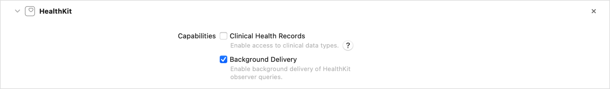

> 导航：[Technologies](../technologies.md) · [Xcode](../xcode.md) · [Capabilities](capabilities.md)

# 配置 HealthKit 访问

文章

在「健康」App 中读取和写入健康与活动数据。

## 概述

HealthKit 是 iOS 和 watchOS 中健康与健身数据的中央资料库。与 HealthKit 集成的健康类 App 可以请求用户许可，以便从该中央资料库读取健康数据并向其中写入数据。你的 App 写入 HealthKit 存储的数据会与用户的其他健康相关数据一起显示在「健康」App 中。

若要让你的 App 访问用户的 HealthKit 存储，必须将 HealthKit 能力添加到 App target，并在 target 的 `Info.plist` 文件中包含对 App 功能的简短描述。

### 将 HealthKit 能力添加到 target

按照[添加能力](adding-capabilities-to-your-app.md#Add-a-capability)中的步骤将该能力添加到 App target；请确保从 Xcode 的 Capabilities 库中选择 HealthKit 能力。对于带有独立 WatchKit 扩展的 watchOS App，你必须将该能力添加到 WatchKit Extension target。

> [!note] 注意
> HealthKit 能力适用于 iOS 和 watchOS App。watchOS App 只能访问某些健康数据，并且无法访问临床健康记录。

Xcode Capabilities 库的屏幕截图，左侧是可用能力列表，右侧是信息面板。列表展示了从 HealthKit 到 MDM Managed Associated Domains 的一系列能力，其中 HealthKit 能力处于选中状态。信息面板上的文字说明：启用 HealthKit 后，你的 App 可以在获得用户许可的情况下存储和检索个人健康信息。

添加 HealthKit 能力后，Xcode 会将 [HealthKit](../healthkit.md) 框架链接到 target，并更新 target 的 entitlements 文件，加入 [HealthKit Entitlement](../bundleresources/entitlements/com.apple.developer.healthkit.md)。如果 Xcode 自动管理 App 签名，它还会为 App 的 App ID 启用 HealthKit。

> [!note] 注意
> 如果你之后在 Xcode 中移除 HealthKit 能力，必须在开发者账户中手动更新 App ID 配置，以停用 HealthKit。

### 请求访问用户的健康数据

HealthKit 使用精细授权机制来帮助保护用户隐私；你的 App 必须针对它支持的每种样本类型请求读取权限，并可选择请求写入权限。有关更多信息，请参阅[授权访问健康数据](../healthkit/authorizing-access-to-health-data.md)。

在提示用户授予许可之前，必须配置 App 以包含一个或多个_用途字符串（purpose string）_，准确、简洁地说明 App 为何需要读取用户的健康数据、向其 HealthKit 存储写入健康数据，或同时执行这两项操作。对于与 HealthKit 集成的任何 App，App Store 都要求提供这些用途字符串。系统在请求用户许可时会向用户显示这些信息，以及 App 需要访问的特定样本类型，以帮助用户作出知情决定。

按照以下步骤向 App target 添加读取健康数据的用途字符串：

1. 在 Project navigator 中选择 target 的 `Info.plist` 文件。
2. 将鼠标指针移到“Information Property List”键上。
3. 点按出现的 Add 按钮（+）。
4. 选择“Privacy - Health Share Usage Description”。
5. 双击该键右侧的 Value 列，并输入 App 的用途字符串。

在 Xcode 属性列表编辑器中打开的 App Info.plist 文件屏幕截图。属性列表包含 Privacy - Health Share Usage Description 键，并以一个示例用途字符串作为其值。

如果你的 App 向 HealthKit 存储写入健康数据，请重复上述步骤并添加“Privacy - Health Update Usage Description”键。

请记住，用户随时可以在「设置」App 或「健康」App 中撤销许可。如果你的 App 需要访问某些健康数据，必须明确显示 App 需要访问用户健康数据的原因，并请求用户重新授权以授予 App 对 HealthKit 数据的访问权限。

你可以使用 [authorizationStatus(for:)](<../healthkit/hkhealthstore/authorizationstatus(for_).md>) 方法检查 App 的当前授权状态。如果 App 尝试未经授权地访问用户的健康数据，HealthKit 还会返回 [HKError.Code.errorAuthorizationDenied](../healthkit/hkerror/code/errorauthorizationdenied.md) 错误。

### 请求访问用户的健康记录

HealthKit 的临床记录支持让用户可以从受支持的医疗机构下载快速医疗保健互操作性资源（Fast Healthcare Interoperability Resources，FHIR）格式的记录。随后，HealthKit 会定期在后台更新这些记录。

由于健康记录的敏感性质，你的 App 必须具备特殊 entitlement 才能访问它们。按照以下步骤配置该 entitlement：

1. 在 Xcode 的 Project navigator 中选择项目。
2. 从 Targets 列表中选择 App target。
3. 点按项目编辑器中的 Signing & Capabilities 标签页。
4. 找到 HealthKit 能力。
5. 启用嵌套的 Clinical Health Records 能力。

将 HealthKit 能力添加到 target 后的屏幕截图。Clinical Health Records 能力处于启用状态。

Xcode 会将 [HealthKit Capabilities Entitlement](../bundleresources/entitlements/com.apple.developer.healthkit.access.md) 添加到 target 的 entitlements 文件，并向其中的数组追加 `health-records` 值。

启用该能力后，你还必须完成其他配置步骤，App 才能访问用户的健康记录，例如提供额外的用途字符串，以及声明 App 支持的健康记录类型。有关更多信息，请参阅[访问健康记录](../healthkit/accessing-health-records.md)。

### 在后台接收样本更新

HealthKit 观察者查询是长期运行的查询，它们会监视 HealthKit 存储中特定样本类型的变化，并在后台线程上将这些变化传递给 App。通常，观察者查询只会在 App 前台运行时提供这些变化。

不过，启用 Background Delivery 后，App 可以在后台继续接收并处理变化。请将每个执行的观察者查询与一次 [enableBackgroundDelivery(for:frequency:withCompletion:)](<../healthkit/hkhealthstore/enablebackgrounddelivery(for_frequency_withcompletion_).md>) 调用配对，并指定相同的样本类型。HealthKit 存储发生变化时，系统会唤醒 App——次数最多为你指定的每个更新频率一次——并将这些变化传递给相应的观察者查询。有关更多信息，请参阅[执行观察者查询](../healthkit/executing-observer-queries.md)。

若要让 HealthKit 在 App 位于后台时继续更新观察者查询，请执行以下操作：

1. 在 Xcode 的 Project navigator 中选择项目。
2. 从 Targets 列表中选择 App target。
3. 点按项目编辑器中的 Signing & Capabilities 标签页。
4. 找到 HealthKit 能力。
5. 启用嵌套的 Background Delivery 能力。

将 HealthKit 能力添加到 target 后的屏幕截图。Background Delivery 能力处于启用状态。

Xcode 会将 [com.apple.developer.healthkit.background-delivery](../bundleresources/entitlements/com.apple.developer.healthkit.background-delivery.md) entitlement 添加到 target 的 entitlements 文件。

## 另请参阅

### 用户数据

- [配置 HomeKit 访问](configuring-homekit-access.md) — 发现兼容配件，并与已配置的配件和服务通信以执行操作。
