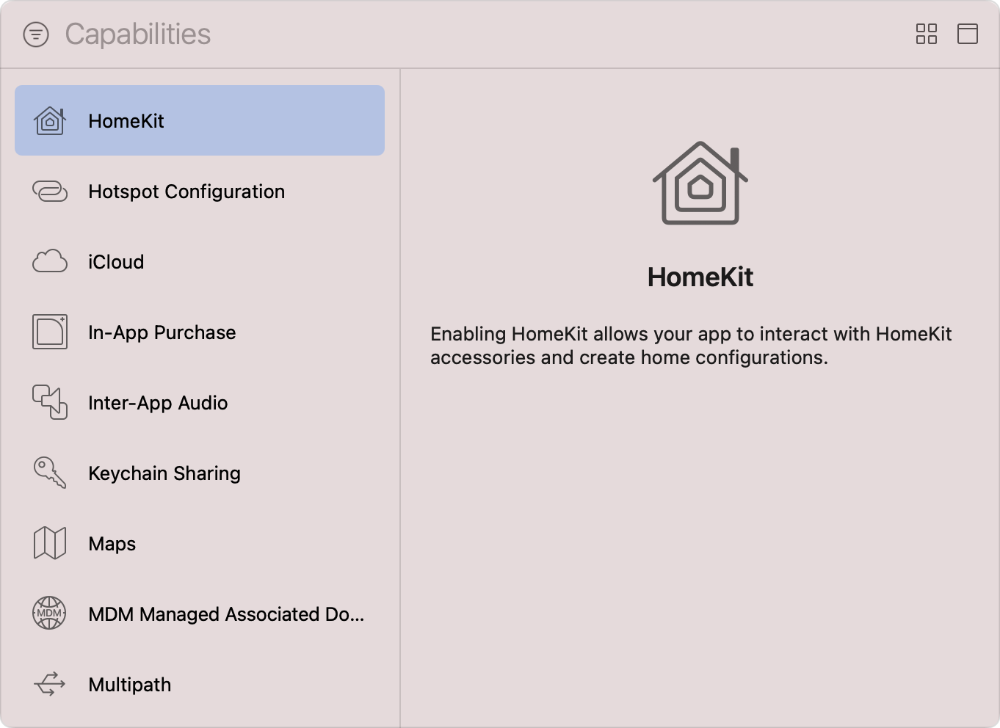
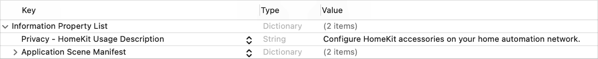
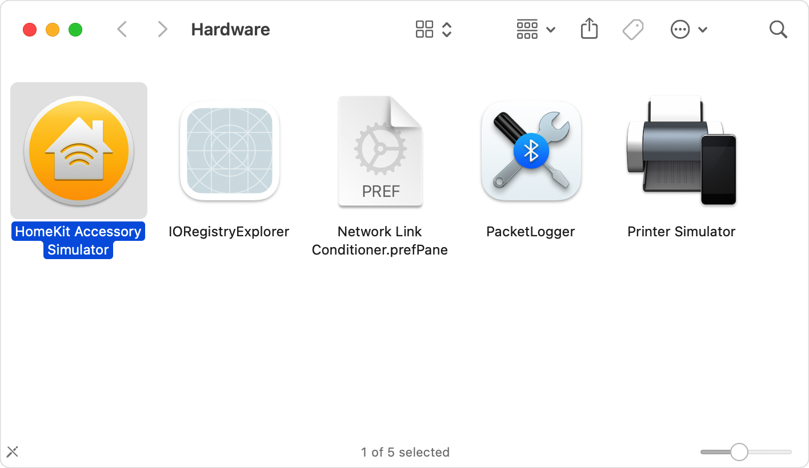

> 导航：[Technologies](../technologies.md) · [Xcode](../xcode.md) · [Capabilities](capabilities.md)

# 配置 HomeKit 访问

文章

发现兼容配件，并与已配置的配件和服务通信以执行操作。

## 概述

与 HomeKit 集成的 App 可以安全连接到用户的家居自动化网络，并访问兼容配件。App 连接到配件后，可以读取和更新该配件的状态，例如更改智能灯泡的环境光颜色。

若要让你的 App 控制用户的兼容配件，必须将 HomeKit 能力添加到 App target，并在 target 的 `Info.plist` 文件中包含对 App 功能的简短描述。

### 将 HomeKit 能力添加到 target

按照[添加能力](adding-capabilities-to-your-app.md#Add-a-capability)中的步骤将该能力添加到 App target；请确保从 Xcode 的 Capabilities 库中选择 HomeKit 能力。对于带有独立 WatchKit 扩展的 watchOS App，你必须将该能力添加到 WatchKit Extension target。此能力不适用于 macOS。

Xcode Capabilities 库的屏幕截图，左侧是可用能力列表，右侧是信息面板。列表展示了从 HomeKit 到 Multipath 的一系列能力，其中 HomeKit 能力处于选中状态。信息面板上的文字说明：启用 HomeKit 后，你的 App 可以与 HomeKit 配件交互并创建家庭配置。

添加 HomeKit 能力后，Xcode 会将 `HomeKit` 框架链接到 target，并更新其 entitlements 文件，加入 [HomeKit Entitlement](../bundleresources/entitlements/com.apple.developer.homekit.md)。如果 Xcode 自动管理 App 签名，它还会为 App 的 App ID 启用 HomeKit。

### 请求访问家居自动化网络

为帮助保护用户家居自动化网络的安全与隐私，你的 App 必须先获得用户的明确许可，才能控制该网络上的 HomeKit 配件。App 首次使用 HomeKit 框架时（即初始化 [HMHomeManager](../homekit/hmhomemanager.md) 时），系统会提示用户授予许可。

App Store 要求你的 App 包含一个_用途字符串（purpose string）_，准确、简洁地说明 App 需要访问用户网络的原因。系统在请求用户许可时会向用户显示这些信息，以帮助他们作出知情决定。按照以下步骤向 target 添加用途字符串：

1. 在 Project navigator 中选择 target 的 `Info.plist` 文件。
2. 将鼠标指针移到“Information Property List”键上。
3. 点按出现的 Add 按钮（+）。
4. 从下拉菜单中选择“Privacy - HomeKit Usage Description”。
5. 双击该键右侧的 Value 列，并输入 App 的用途字符串。

在 Xcode Property List Editor 中打开的 target Info.plist 文件屏幕截图。该文件包含 Privacy - HomeKit Usage Description 键，并以一个示例用途字符串作为其值。

> [!important] 重要
> 启用 HomeKit 但未包含用途字符串的 App 会在尝试使用该框架的 API 时崩溃。

请记住，用户随时可以在「设置」App 中撤销许可，你的 App 必须对此作出适当响应。你可以访问 [authorizationStatus](../homekit/hmhomemanager/authorizationstatus.md) 属性来检查 App 当前的授权状态。如果 App 尝试对该框架的任何 API 进行未经授权的调用，HomeKit 还会返回 [homeAccessNotAuthorized](../homekit/hmerror/homeaccessnotauthorized.md) 错误。

### 安装 HomeKit Accessory Simulator

与 HomeKit 集成并不要求你实际拥有 App 支持的每个配件。你可以改为安装 HomeKit Accessory Simulator，并模拟这些配件。按照以下步骤安装模拟器：

1. 在 target 的项目编辑器中打开 Signing & Capabilities 标签页。
2. 找到 HomeKit 能力。
3. 点按 Download HomeKit Simulator 按钮。
4. 在打开的 [More Downloads](https://developer.apple.com/download/all) 网页中，找到并下载最新的“Additional Tools for Xcode”DMG 文件。浏览器可能会要求你先登录 Apple 开发者账户。
5. DMG 文件下载完成后，双击它以在访达中装载磁盘映像。
6. 打开 Hardware 文件夹。
7. 将 HomeKit Accessory Simulator App 拖到 Mac 的 Applications 文件夹中。

访达的屏幕截图，显示已下载磁盘映像中 Hardware 文件夹的内容。HomeKit Accessory Simulator 处于选中状态。

使用该模拟器添加和移除模拟的 HomeKit 配件、服务与特征，并利用 Mac 的摄像头模拟联网摄像头和可视门铃。有关更多信息，请参阅[使用 HomeKit Accessory Simulator 测试 App](https://developer.apple.com/documentation/homekit/testing_your_app_with_the_homekit_accessory_simulator#3087266)的 Add Accessories, Services, and Characteristics 一节。

## 另请参阅

### 用户数据

- [配置 HealthKit 访问](configuring-healthkit-access.md) — 在「健康」App 中读取和写入健康与活动数据。
