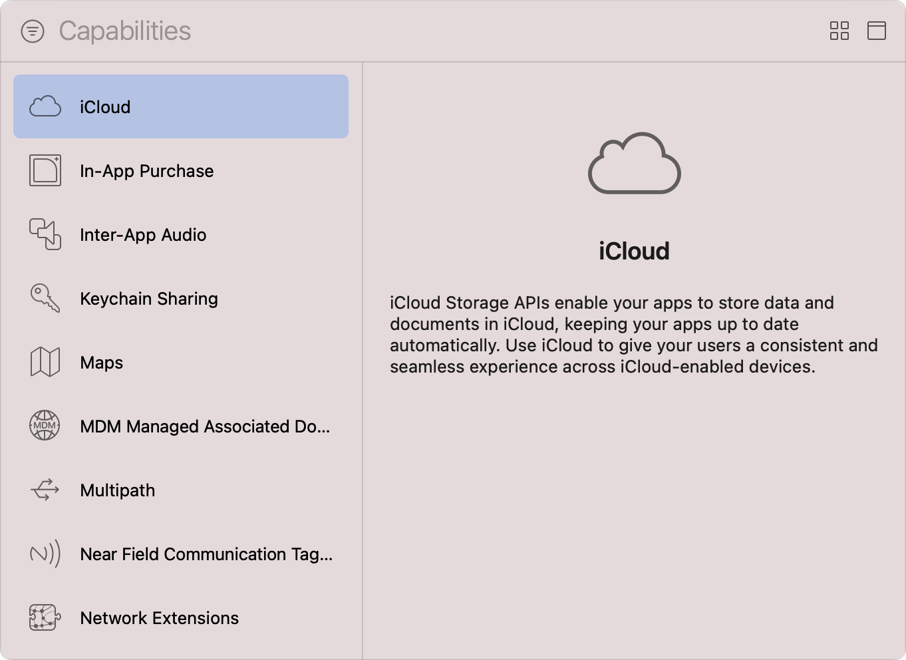
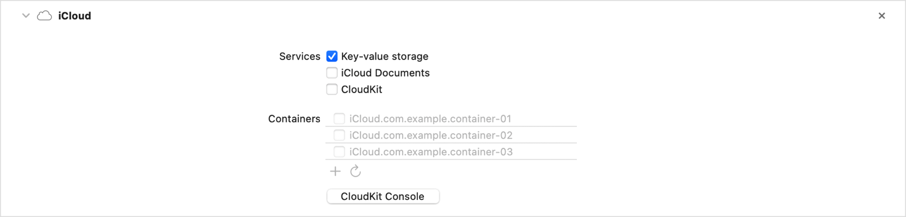
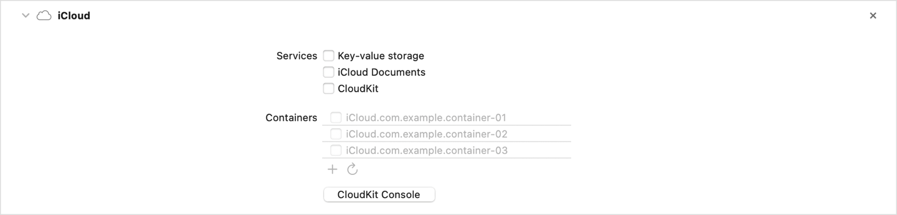
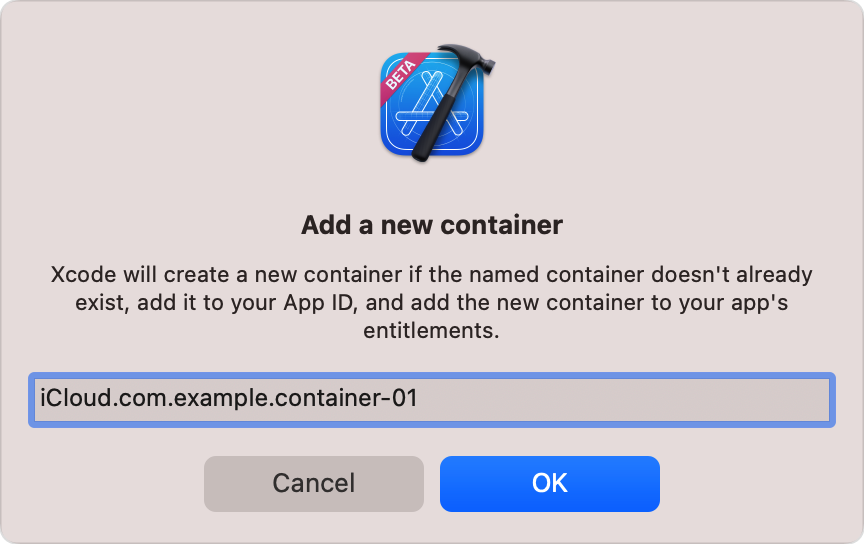
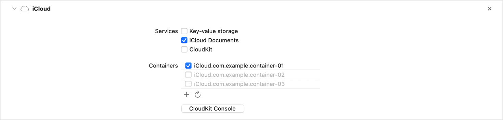

> 导航：[技术](../technologies.md) · [Xcode](../xcode.md) · [能力](capabilities.md)

# 配置 iCloud 服务

文章

在不同设备上运行的多个 App 实例之间共享用户或 App 数据。

## 概述

作为 App 开发者，你可以使用一个或多个 iCloud 服务，将用户数据安全地存储在 iCloud 服务器上，并让这些数据可用于用户所有启用 iCloud 的设备，从而无论用户使用哪台设备，都能提供无缝体验。

Xcode 的 iCloud 能力让你能够配置以下服务：

- Key-value storage 为 App 提供 1 MB 的 iCloud 存储空间，最多可包含 1024 个键值对，适合用于同步用户偏好设置等少量数据。有关更多信息，请参阅 [NSUbiquitousKeyValueStore](../foundation/nsubiquitouskeyvaluestore.md)。
- iCloud Documents 允许 App 将数据存储为文件，并在设备间同步这些文件；如果你的 App 已在使用 [UIDocument](../uikit/uidocument.md) 或 [NSDocument](../appkit/nsdocument.md)，此服务会很有用。有关更多信息，请参阅[针对 iCloud 中的文稿进行设计](https://developer.apple.com/library/archive/documentation/General/Conceptual/iCloudDesignGuide/Chapters/DesigningForDocumentsIniCloud.html#//apple_ref/doc/uid/TP40012094-CH2)。
- CloudKit 允许 App 在远程数据库中存储结构化对象及其关系，并让你能够完全控制这些数据库的架构。用户还可以选择与其他 iCloud 用户共享其数据。你可以直接使用 [CloudKit](../cloudkit.md) 框架；如果 App 使用 Core Data 持久化数据，也可以利用 CloudKit 在设备间同步这些数据。有关更多信息，请参阅[使用 CloudKit 镜像 Core Data 存储](../coredata/mirroring-a-core-data-store-with-cloudkit.md)。

iCloud Documents 和 CloudKit 都使用 _iCloud 容器_，但容器用途因服务而异。对于 iCloud Documents，容器也称为_泛在容器（ubiquity container）_，它用作相应 iCloud 存储的本地表示，是 App 在磁盘上存储文件的专用位置。对于 CloudKit，容器会隔离 App 在 iCloud 服务器上的数据库，并管理这些数据库的访问和操作。有关更多信息，请参阅 [CKContainer](../cloudkit/ckcontainer.md)。你还可以使用容器在同一开发者拥有的多个 App 之间共享文件和数据。

启用 iCloud 服务前，请按照[向 App 添加能力](adding-capabilities-to-your-app.md)中[添加能力](adding-capabilities-to-your-app.md#Add-a-capability)一节的步骤，将该能力添加到 App target，并从 Xcode 的 Capabilities 库中选择 iCloud 能力。对于带有独立 WatchKit 扩展的 watchOS App，请将该能力添加到 WatchKit Extension target。若要在轻 App 中访问公共 iCloud 数据库，请将该能力添加到轻 App target，并务必阅读[为轻 App 选择合适的功能](../appclip/choosing-the-right-functionality-for-your-app-clip.md)，了解有关在轻 App 中使用 iCloud 服务的更多信息。

Xcode Capabilities 库的屏幕截图，左侧是可用能力列表，右侧是信息面板。列表展示了从 iCloud 到 Network Extensions 的一系列能力，其中 iCloud 能力处于选中状态。信息面板上的文字说明：iCloud 存储 API 允许 App 在 iCloud 中存储数据和文稿，使 App 自动保持最新状态，并在用户启用 iCloud 的设备间提供一致、无缝的体验。

添加 iCloud 能力后，Xcode 会更新 target 的 entitlements 文件，加入 [iCloud Container Identifiers Entitlement](../bundleresources/entitlements/com.apple.developer.icloud-container-identifiers.md)，这是一个由你所选容器组成的数组。如果 Xcode 自动管理 App 签名，它还会在开发者账户中为 App 的 App ID 启用 iCloud 能力。

> [!note] 注意
> 如果你之后在 Xcode 中移除 iCloud 能力，必须在开发者账户中手动更新 App ID 配置，以停用 iCloud。

### 启用一个或多个 iCloud 服务

在使用 iCloud 服务跨设备同步用户数据之前，你必须在 Xcode 中启用该服务，以向 App 的 entitlements 文件添加必要 entitlement。使用 iCloud 能力 Services 部分中服务名称旁边的复选框来启用该服务。

将 iCloud 能力添加到 target 后的屏幕截图。Key-value storage 服务处于启用状态。

根据你启用的服务，Xcode 会添加以下额外 entitlement（如果尚不存在）。

| 服务 | Entitlement |
|---|---|
| Key-value storage | `com.apple.developer.ubiquity-kvstore-identifier` |
| iCloud Documents | `com.apple.developer.icloud-services` |
|  | `com.apple.developer.ubiquity-container-identifiers` |
| CloudKit | `com.apple.developer.icloud-services` |

有关更多信息，请参阅 [iCloud Key-Value Store Entitlement](../bundleresources/entitlements/com.apple.developer.ubiquity-kvstore-identifier.md) 和 [iCloud Services Entitlement](../bundleresources/entitlements/com.apple.developer.icloud-services.md)。

> [!note] 注意
> 如果你启用 CloudKit 服务，Xcode 会自动将 Push Notifications 能力添加到 target，因为 CloudKit 使用推送通知来告知 App 服务器端的数据更改。有关更多信息，请参阅[远程记录](../cloudkit/remote-records.md)。

### 管理 App 的 iCloud 容器

添加 iCloud 能力后，Xcode 会从开发者账户检索所有现有 iCloud 容器，并将它们显示在该能力的配置部分中。使用列表下方的 Refresh 按钮，可以随时重新获取账户的 iCloud 容器。

将 iCloud 能力添加到 target 后的屏幕截图。Key-value storage、iCloud Documents 和 CloudKit 服务均处于停用状态。容器列表显示了三个获取到的 iCloud 容器，它们均未启用。

使用列表中的复选框启用一个或多个 iCloud 容器。相反，取消选择容器的复选框可阻止 App 使用它。Xcode 会在开发者账户中将所选 iCloud 容器与 App 的 App ID 关联，并对 App 的 entitlements 文件进行以下更改：

- 对于启用 iCloud Documents，或同时启用 iCloud Documents 和 CloudKit 的 App，Xcode 会更新以下 entitlement 以包含所选容器：

    - `com.apple.developer.icloud-container-identifiers`
    - `com.apple.developer.ubiquity-container-identifiers`
- 对于仅启用 CloudKit 的 App，Xcode 只更新 `com.apple.developer.icloud-container-identifiers` entitlement。

> [!note] 注意
> 为避免破坏依赖容器关联的现有 App 版本，Xcode 不会自动在开发者账户中解除未选中容器与 App ID 的关联。

若要创建新的 iCloud 容器，请执行以下步骤：

1. 点按 iCloud 容器列表下方的 Add 按钮（+）。
2. 在出现的对话框中输入 iCloud 容器。容器名称必须以 `iCloud.` 开头，并使用反向 DNS 表示法中的唯一字符串。
3. 点按 OK 以保存新的 iCloud 容器。

点按 Add 按钮后出现的 Add a new container 对话框屏幕截图。对话框中的文字说明：如果指定名称的容器尚不存在，Xcode 会创建新容器，将其添加到 App ID，并将新容器添加到 App 的 entitlements。

Xcode 会自动在开发者账户中注册 iCloud 容器，将其添加到 App 的 entitlements 文件，并在容器列表中将其选中，表示 App 现在可以使用新容器。

将 iCloud 能力添加到 target 后的屏幕截图。iCloud Documents 服务处于启用状态，并且选中了一个 iCloud 容器。

选择所需容器后，请更新 App 以执行以下一项或多项操作：

- 对于基于文稿的 App，调用 [url(forUbiquityContainerIdentifier:)](<../foundation/filemanager/url(forubiquitycontaineridentifier_).md>) 以确定 App 泛在容器的位置。
- 对于 CloudKit App，使用 [init(identifier:)](<../cloudkit/ckcontainer/init(identifier_).md>) 初始化 [CKContainer](../cloudkit/ckcontainer.md) 实例，该实例提供对容器数据库的访问，并对这些数据库执行操作。
- 对于与 CloudKit 同步的 Core Data App，使用 [NSPersistentCloudKitContainerOptions](../coredata/nspersistentcloudkitcontaineroptions.md) 配置 Core Data 栈以使用新容器。

### 访问 CloudKit Console

如果 App 启用 CloudKit 服务，请使用基于网页的 CloudKit Console 管理 App iCloud 容器的所有方面，包括数据库架构、操作日志和性能遥测。有关更多信息，请参阅[使用 CloudKit Database App 管理 iCloud 容器](../cloudkit/managing-icloud-containers-with-cloudkit-database-app.md)。

按照以下步骤访问 CloudKit Console：

1. 点按 iCloud 能力中容器列表下方的 CloudKit Console 按钮。
2. 在打开的浏览器窗口中，使用与开发者账户相同的 Apple 账户登录 CloudKit Console。

你也可以通过 [icloud.developer.apple.com](https://icloud.developer.apple.com) 直接访问控制台。

## 另请参阅

### 数据管理

- [配置关联域](configuring-an-associated-domain.md) — 在 App 与网站之间创建双向关联，以启用通用链接、Handoff、轻 App 和共享网页凭据。
- [配置 App Group](configuring-app-groups.md) — 在同一开发者创建的多个已安装 App 之间启用通信和数据共享。
