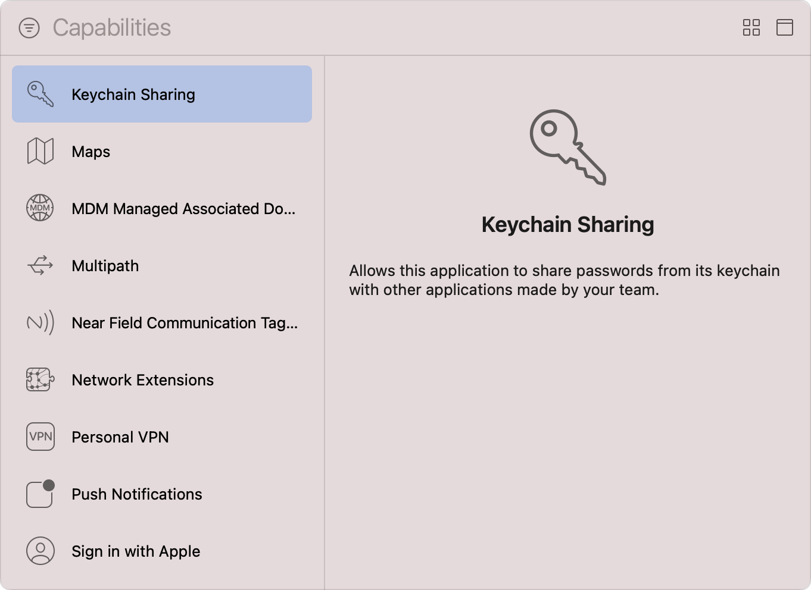
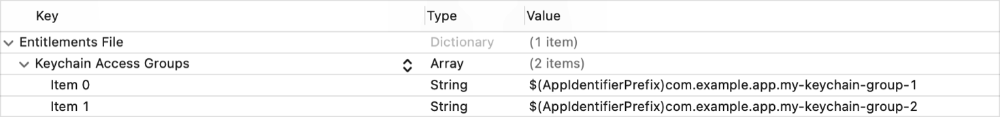

> 导航：[Technologies](../technologies.md) · [Xcode](../xcode.md) · [Capabilities](capabilities.md)

# 配置钥匙串共享

文章

在属于同一开发者的多个 App 之间共享钥匙串项目。

## 概述

在同一 App 的多个 target 之间，或同一开发者拥有的不同 App 之间共享钥匙串项目，需要使用_访问组（access group）_概念；访问组是共享同一钥匙串组的一组 target。当某个 target 想让访问组中的其他 target 能够访问某个钥匙串项目时，它会在向钥匙串写入该项目时指定共享钥匙串组。这对于需要共享账户凭据和其他敏感信息的 App 很有用。有关更多信息，请参阅[在一组 App 之间共享钥匙串项目访问权限](../security/sharing-access-to-keychain-items-among-a-collection-of-apps.md)。

在让 target 能够访问某个钥匙串组之前，请按照[向 App 添加能力](adding-capabilities-to-your-app.md)中[添加能力](adding-capabilities-to-your-app.md#Add-a-capability)一节的步骤，将 Keychain Sharing 能力添加到该 target。对于带有独立 WatchKit 扩展的 watchOS App，请将该能力添加到 WatchKit Extension target。

如果 target 的 entitlements 文件中尚不存在 [Keychain Access Groups Entitlement](../bundleresources/entitlements/keychain-access-groups.md)，Xcode 会更新该文件以加入此 entitlement；它是一个包含你指定的每个钥匙串组的数组。

### 让 target 能够访问钥匙串组

如果你希望两个或更多 target 共享常用钥匙串项目，请按照以下步骤，让它们都能访问同一个钥匙串组：

1. 在 Xcode 的 Project navigator 中选择项目。
2. 从 Targets 列表中选择 App target。
3. 点按项目编辑器中的 Signing & Capabilities 标签页。
4. 找到 Keychain Sharing 能力。
5. 点按 Keychain Groups 列表下方的 Add 按钮（+）。
6. 双击插入的钥匙串组进行编辑。
7. 输入钥匙串组的名称：可以是其他 App 已在使用的现有组名称，也可以是全新的组。新组的名称应使用反向 DNS 表示法。
8. 按下 Return 键以保存更新后的钥匙串组。

将 Keychain Sharing 能力添加到 target 后的屏幕截图。钥匙串组列表包含一个组。

> [!note] 注意
> 尽管界面上不可见，Xcode 会在每个钥匙串组名称前加上 `$(AppIdentifierPrefix)` 构建变量，并在构建时自动解析该变量。

让 target 能够访问某个钥匙串组后，你可以稍后选择相应的钥匙串组，然后点按 Keychain Groups 列表下方的 Remove 按钮（-）来撤销该访问权限。

随后，你可以将指定的钥匙串组用于 [Keychain services](../security/keychain-services.md) API，例如 [SecItemAdd(_:_:)](<../security/secitemadd(____).md>) 和 [SecItemCopyMatching(_:_:)](<../security/secitemcopymatching(____).md>)。

### 指定默认钥匙串组

编译期间，系统会将你指定的组、App 的唯一应用标识符以及配置的所有 App Group 串联起来，从而确定 App 可访问钥匙串组的规范列表；系统将该列表中的第一项视为默认钥匙串组。如果你在写入钥匙串项目时省略 [kSecAttrAccessGroup](../security/ksecattraccessgroup.md) 属性，系统会自动使用默认钥匙串组填充该属性，因此指定钥匙串组的顺序很重要。

若要更改钥匙串组的顺序，请按照以下步骤操作：

1. 在 Project navigator 中，按住 Control 键点按 target 的 entitlements 文件。
2. 选择 Open As \> Property List。
3. 展开 Keychain Access Groups 键。
4. 将数组中的嵌套项目拖到首选顺序。每个项目的值都是一个钥匙串组的名称。

在 Xcode plist 编辑器中打开的 App entitlements 文件屏幕截图。Keychain Access Groups 键处于展开状态，包含两个项目，每个项目表示不同的钥匙串组。

更改顺序后，选择 File \> Save 以存储这些更改，并使 Xcode 更新它在 target 的 Signing & Capabilities 标签页中显示组的顺序。

> [!note] 注意
> 尽管你可以使用 App Group 共享钥匙串项目，但它绝不能成为默认钥匙串组，因为 App 的唯一应用标识符始终具有更高优先级。

## 另请参阅

### 安全性

- [配置 Family Controls](configuring-family-controls.md) — 添加 Family Controls entitlement，在你的 App 及其 Screen Time API App 扩展中启用家长控制功能。
- [配置加固运行时](configuring-the-hardened-runtime.md) — 通过限制对敏感资源的访问并防止常见攻击，保护 macOS App 的运行时完整性。
- [配置 macOS App 沙盒](configuring-the-macos-app-sandbox.md) — 通过限制对文件系统、网络连接等内容的访问，保护系统资源和用户数据免受受损 App 的侵害。
- [在 macOS 上使用容器保护本地 App 数据](protecting-local-app-data-using-containers.md) — 保护 App 的本地存储数据免受未经授权的访问和修改。
- [在现有 macOS App 中访问 App Group 容器](accessing-app-group-containers.md) — 确保你的 App 具有 App Group 容器 entitlement，且 macOS 可以对其授权。
