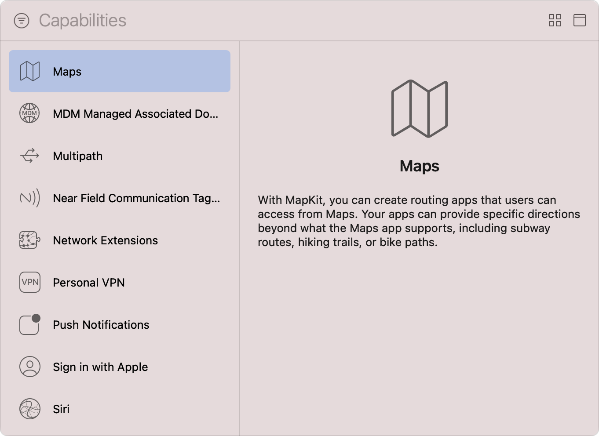

> 导航：[技术](../technologies.md) · [Xcode](../xcode.md) · [能力](capabilities.md)

# 配置地图支持

文章

注册你的 iOS 路线规划 App，以向地图和其他 App 提供点到点路线指引。

## 概述

能够显示点到点路线指引的 iOS App 可以注册为路线规划 App，并将这些指引提供给地图以及用户设备上的所有其他 App。注册为路线规划 App 可以改善用户体验，因为其他 App 能够访问你的 App 的路线规划信息，而无需提供自己的路线指引。此外，地图会显示 App Store 中提供路线指引的 App，因此将 iOS App 注册为路线规划 App 是让用户了解它的绝佳方式。

路线规划 App 可以在地图所支持的指引之外提供特定路线指引，例如地铁路线、徒步小径和自行车道。在选择 App 支持的路线规划模式之前，请按照[添加能力](adding-capabilities-to-your-app.md#Add-a-capability)中的步骤，将 Maps 能力添加到 App target。

Xcode Capabilities 库的屏幕截图，左侧是可用能力列表，右侧是信息面板。列表展示了从 Maps 到 Siri 的一系列能力，其中 Maps 能力处于选中状态。信息面板上的文字说明：通过 MapKit，你可以创建用户能从地图访问的路线规划 App。你的 App 可以在地图 App 所支持的指引之外提供特定路线指引，包括地铁路线、徒步小径或自行车道。

> [!note] 注意
> 此能力仅适用于 iOS 上的自定义路线规划 App。macOS App 无需添加 Maps 能力即可使用 MapKit 框架。

### 选择受支持的路线规划模式

系统在向你的路线规划 App 分发路线指引请求之前，你必须按照以下
步骤告知系统 App 支持的路线规划模式：

1. 在 Xcode 的 Project navigator 中选择项目。
2. 从 Targets 列表中选择 App target。
3. 点按项目编辑器中的 Signing & Capabilities 标签页。
4. 找到 Maps 能力。
5. 通过选择对应的复选框，选择相关路线规划模式。

将 Maps 能力添加到 target 后的屏幕截图。Airplane、Bus 和 Ferry 路线规划模式均处于启用状态。

如果 App 的 `Info.plist` 文件中尚不存在 [MKDirectionsApplicationSupportedModes](../bundleresources/information-property-list/mkdirectionsapplicationsupportedmodes.md) 数组，Xcode 会添加该数组，并使用你选择的模式填充必要值。

选择必要的路线规划模式后，你还必须完成其他配置步骤，App 才能开始提供点到点路线指引，例如指定路线指引请求文稿类型，以及声明 App 的地理区域。有关更多信息，请参阅[配置 App 以接受路线指引请求](https://developer.apple.com/library/archive/documentation/UserExperience/Conceptual/LocationAwarenessPG/ProvidingDirections/ProvidingDirections.html#//apple_ref/doc/uid/TP40009497-CH8-SW8)。

## 另请参阅

### App 执行

- [配置后台执行模式](configuring-background-execution-modes.md) — 指明你的 App 在 iOS、iPadOS、tvOS、visionOS 和 watchOS 中继续在后台执行所需的后台服务。
- [配置自定字体](configuring-custom-fonts.md) — 将你的 App 注册为系统范围自定字体的提供方或使用方。
- [配置游戏控制器](configuring-game-controllers.md) — 通过启用实体游戏控制器的发现、配置和使用，增强游戏输入体验。
- [配置 Siri 支持](configuring-siri-support.md) — 让你的 App 及其 Intents 扩展能够解析、确认并处理用户发起的针对 App 服务的 Siri 请求。
