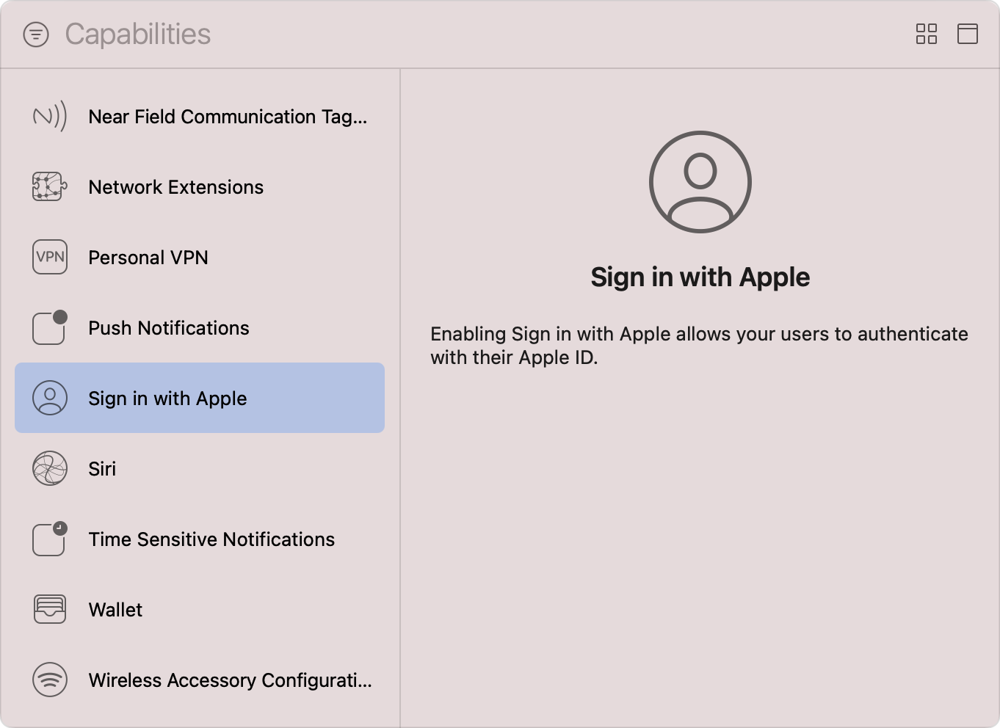

> 导航：[Technologies](../technologies.md) · [Xcode](../xcode.md) · [Capabilities](capabilities.md)

# 配置通过 Apple 登录支持

文章

允许用户使用他们的 Apple 账户创建账户并登录你的 App。

## 概述

通过 Apple 登录让你的用户可以选择使用他们现有的 Apple 账户登录你的 App，而不必创建单独的用户名和密码。所有 Apple 设备都支持通过 Apple 登录。有关在浏览器中使用此功能的信息，请参阅 [Sign in with Apple JS](../signinwithapplejs.md)。

要在你的 App 中使用通过 Apple 登录，需要在 Xcode 中配置 App 的 target 来添加该功能，设置用户界面和必要的授权，并向 Apple 的中继服务注册你的域名，以确保你可以向用户的个人收件箱发送电子邮件。

> [!note] 注意
> 如果你的 App 面向的操作系统版本早于通过 Apple 登录功能推出之前，请使用 JavaScript 库来提供同样的功能。有关更多信息，请参阅 [Incorporating Sign in with Apple into other platforms](../signinwithapple/incorporating-sign-in-with-apple-into-other-platforms.md)。

### 将通过 Apple 登录功能添加到你的 App

按照 [Adding capabilities to your app](adding-capabilities-to-your-app.md) 中 [Add a capability](adding-capabilities-to-your-app.md#Add-a-capability) 一节的说明操作。当你打开 Capabilities 库时，选择 Sign in with Apple。对于带有独立 WatchKit 扩展的 watchOS App，请将该功能添加到 WatchKit 扩展的 target 中。

Xcode 的 Capabilities 库截图。顶部是一个筛选按钮，旁边是一个包含占位文字 Capabilities 的搜索栏。下方左侧窗格中是一份功能列表，例如 Network Extensions、Wallet 和 Sign in with Apple。Sign in with Apple 功能处于选中状态。右侧的信息面板中显示文字：启用 Sign in with Apple 可让你的用户使用其 Apple 账户进行身份验证。

添加该功能后，Xcode 会更新 target 的 entitlements，加入 [Sign in with Apple Entitlement](../bundleresources/entitlements/com.apple.developer.applesignin.md)——这是一个数组，包含表示正常运行状态的值 `Default` 的单个字符串。如果你将 Xcode 配置为自动管理 App 签名，此时 Xcode 还会在你的开发者账户中为你的 App 的 App ID 启用通过 Apple 登录。

> [!note] 注意
> 如果你之后在 Xcode 中移除了通过 Apple 登录功能，你必须在开发者账户中手动更新 App ID 的配置，以停用通过 Apple 登录。

在 Apple 与你的 App 共享任何信息之前，用户必须先提供同意。如果你有多个相关联的 App——例如一个 iOS App 和一个 macOS App——请将它们的 App ID 分组，这样用户只需在首次使用的设备上提供同意即可。有关更多信息，请参阅 [Group Apps for Sign in with Apple](https://developer.apple.com/help/account/configure-app-capabilities/group-apps-for-sign-in-with-apple/)。

### 提示用户使用其 Apple 账户登录

将通过 Apple 登录功能添加到你的 Xcode 项目后，更新你的 App 的用户界面，让用户能够使用其 Apple 账户登录。有关以下步骤的参考实现，请参阅示例代码 [Implementing User Authentication with Sign in with Apple](../authenticationservices/implementing-user-authentication-with-sign-in-with-apple.md)。

- 使用 [ASAuthorizationAppleIDButton](../authenticationservices/asauthorizationappleidbutton.md) 或 [WKInterfaceAuthorizationAppleIDButton](../watchkit/wkinterfaceauthorizationappleidbutton.md) 将通过 Apple 登录按钮添加到你的 App 的用户界面中。
- 为该按钮添加一个处理程序，用于创建 [ASAuthorizationAppleIDRequest](../authenticationservices/asauthorizationappleidrequest.md) 的实例。请确保设置请求的 [requestedScopes](../authenticationservices/asauthorizationopenidrequest/requestedscopes.md) 属性。有关更多信息，请参阅 [ASAuthorization.Scope](../authenticationservices/asauthorization/scope.md)。
- 使用 [ASAuthorizationController](../authenticationservices/asauthorizationcontroller.md) 执行授权请求，提示用户使用其 Apple 账户登录，并同意 Apple 与你的 App 共享其详细信息。
- 实现 [ASAuthorizationControllerDelegate](../authenticationservices/asauthorizationcontrollerdelegate.md) 协议来确定授权请求的结果，如果成功，则接收 _credential_——[ASAuthorizationAppleIDCredential](../authenticationservices/asauthorizationappleidcredential.md) 的一个实例，包含有关用户的详细信息。

如果你的 App 将账户信息存储在远程服务器上，请将该凭据的内容发送到该服务器。远程服务器会在创建或更新用户账户之前，通过 Apple 账户服务器验证数据的合法性。有关更多信息，请参阅 [Authenticating users with Sign in with Apple](../signinwithapple/authenticating-users-with-sign-in-with-apple.md)。

### 接收有关 Apple 账户变更的更新

如果你的 App 使用远程服务器来管理用户账户，请开启服务器到服务器通知，这样当用户对其 Apple 账户进行更改时，Apple 账户服务器就会通知你。当用户更改其邮件转发首选项、删除其 App 账户，或永久删除其 Apple 账户时，Apple 账户服务器会发送通知。使用这些通知来维护一份规范的用户列表。有关更多信息，请参阅 [Enabling Server to Server Notifications](https://developer.apple.com/help/account/configure-app-capabilities/enabling-server-to-server-notifications/)。

### 向用户的隐藏收件箱发送电子邮件

如果你在提示用户进行授权时包含了 [email](../authenticationservices/asauthorization/scope/email.md) scope，系统会为该用户提供一个选项，让其隐藏真实的电子邮件地址，转而使用 Apple 提供的一个唯一、随机的转发电子邮件地址。为帮助防止垃圾邮件，并确保发往用户的电子邮件来自你注册的域名和电子邮件地址，请按照以下步骤操作：

- 注册你用于电子邮件通信的域名和子域名。
- 注册一份你用于发送电子邮件的唯一电子邮件地址列表。
- 使用发件人策略框架（Sender Policy Framework，SPF）和域名密钥识别邮件（DomainKeys Identified Mail，DKIM）协议对你注册的域名进行身份验证。

在能够向用户的隐藏收件箱发送电子邮件之前，你必须完成这些步骤。有关更多信息，请参阅 [Configure Private Email Relay Service](https://developer.apple.com/help/account/configure-app-capabilities/configure-private-email-relay-service/)。

## 另请参阅

### Commerce

- [Configuring Apple Pay support](configuring-apple-pay-support.md) — 使用用户存储在其设备上的支付信息，在你的 App 中处理付款。
- [Configuring Wallet support](configuring-wallet-support.md) — 访问用户的钱包，以添加、更新和显示你的 App 的通行证。
</content>
