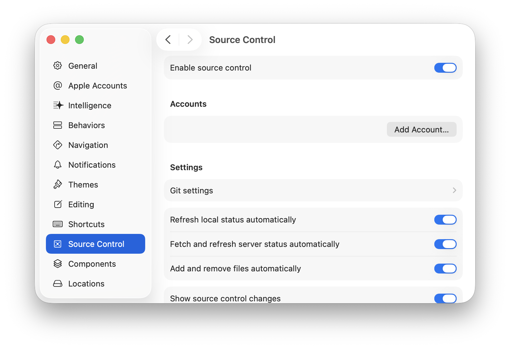
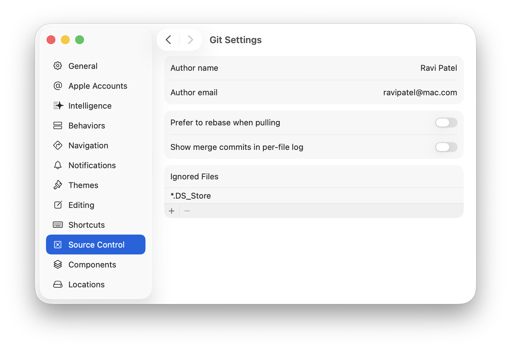

> 导航：[技术](../technologies.md) · [Xcode](../xcode.md) · [源代码管理](source-control-management.md)

# 在 Xcode 中配置源代码管理

文章

自定默认的 Xcode 设置，以便连接到 Git 仓库、应用代码更改以及配置更多源代码管理选项。

## 概述

Xcode 允许你自定许多处理源代码管理仓库的默认选项。要修改默认的源代码管理设置，请选取 Xcode >“设置”，然后在边栏中点按“源代码管理”。

### 启用源代码管理操作

在“源代码管理”设置中，选择“启用源代码管理”选项，可启用“集成”菜单和“源代码管理”导航器中的操作。启用源代码管理还会启用“设置”下的“Git 设置”选项，你可用该选项来配置 Git 集成选项。

Xcode 的“设置”对话框显示了“源代码管理”设置。“启用源代码管理”选项及其各个子选项均处于选中状态。“显示源代码管理更改”选项也已选中。

### 选取自动源代码管理行为

启用源代码管理后，你可以选择其他选项，以指定希望 Xcode 自动为你执行哪些源代码管理任务。

- 自动刷新本地状态：Xcode 会自动刷新受源代码管理文件在发生更改时的状态。
- 自动获取并刷新服务器状态：Xcode 会定期刷新远程仓库中已在服务器上更新的文件状态。（要手动刷新状态，请选取“集成”>“获取更改并刷新文件状态”。）
- 自动添加和移除文件：Xcode 会在你的项目中添加或移除文件时自动更新工作副本。

### 在源代码编辑器中显示代码更改

文本编辑设置会影响 Xcode 是否在源代码编辑器中指示代码更改。

- 显示源代码管理更改：Xcode 会在源代码编辑器的装订线中，在已更改行的旁边显示变更栏。
- 包含上游更改：Xcode 会在源代码编辑器的装订线中显示其他人提交的更改（可能与你的编辑相冲突）。

### 自定比较视图布局

比较视图设置指定了代码的本地版本在版本编辑器中出现的位置。要显示左侧的本地版本，请从弹出式菜单中选取“本地修订在左侧”；否则，请选取“本地修订在右侧”。

### 选取“源代码管理”导航器的排序选项

“源代码管理”导航器设置指定了 Xcode 如何对“源代码管理”导航器中的文件进行排序。要按名称排序，请从弹出式菜单中选取“按名称排序”；否则，请选取“按日期排序”。

### 自定 Git 设置

要为通过 Xcode 管理的 Git 仓库配置默认设置，请点按“Git 设置”。

Xcode 的“设置”对话框显示了“源代码管理”>“Git 设置”。“作者名称”和“作者电子邮件”栏中显示了示例值。

自定要在源代码管理历史记录中使用的“作者名称”和“作者电子邮件”。用户可按住 Control 键点按某个历史记录条目，以给作者发送电子邮件。

选取处理 Git 命令的其他选项：

- 拉取时首选变基：拉取更改时执行 Git 变基，而非合并。
- 在逐文件日志中显示合并提交：在项目历史记录中显示 Git 合并提交。

使用“忽略的文件”列表指定你不希望 Git 提交到源代码管理仓库中的文件。

- 要添加忽略的文件，请点按添加按钮 (+)。
- 要移除已忽略的类型，请在列表中选择一个项目，然后点按删除按钮 (–)。
- 要编辑某个项目，请连按它。

## 另请参阅

### Git

- [使用源代码管理整理代码更改](organizing-your-code-changes-with-source-control.md) — 使用 Git 分支和标签来简化协作，并管理功能和发布。
- [在源代码管理仓库中合并代码更改](combining-code-changes-in-a-source-control-repository.md) — 使用 Xcode 中的源代码管理工具集纳不同来源的代码更改，并解决不同版本代码之间的冲突。
