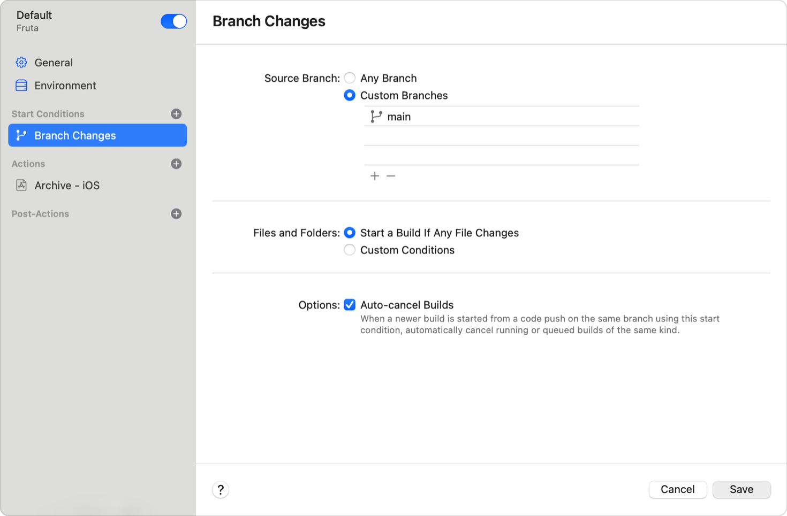
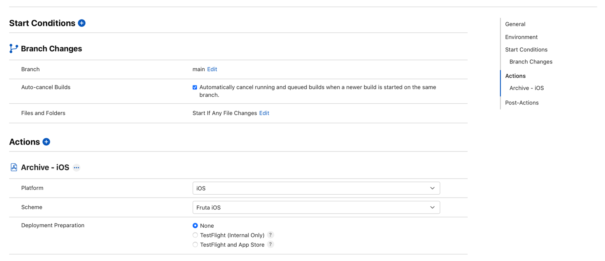
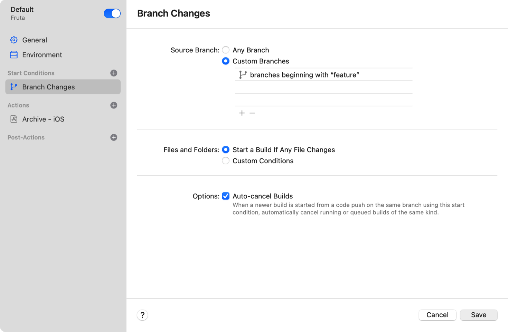
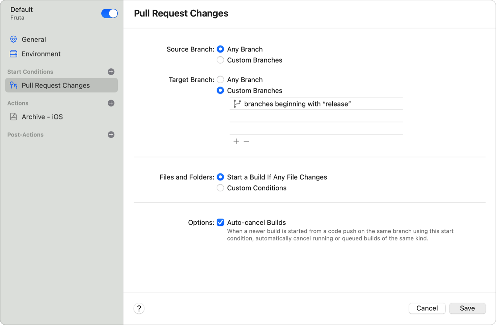
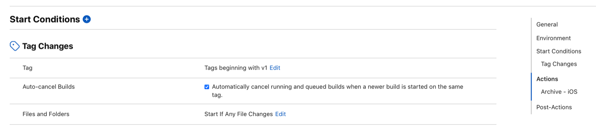
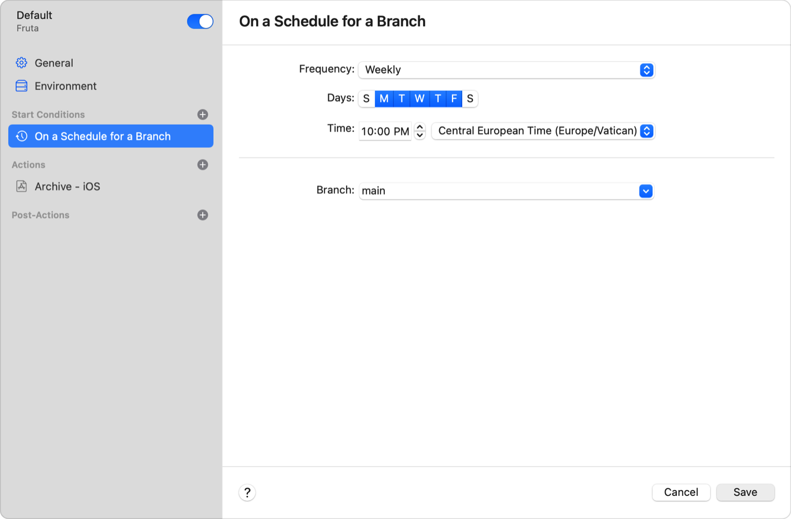

> 导航：[技术](../technologies.md) · [Xcode](../xcode.md) · [Xcode Cloud](xcode-cloud.md) · [Xcode Cloud 工作流程参考](xcode-cloud-workflow-reference.md)

# 配置启动条件

文章

配置 Xcode Cloud，使其在你更新分支、拉取请求或 Git 标签时，或按计划开始构建。

## 概述

Xcode Cloud 会监视你的 Git 仓库的变更，检查变更是否满足你为工作流程配置的启动条件，并在变更满足任一条件时开始构建。这使得配置启动条件成为你创建自定 Xcode Cloud 工作流程时的一项关键任务。

你可以使用以下任意启动条件来配置你的 Xcode Cloud 工作流程：

- **分支变更** — 如果任意分支、特定分支或几个已配置的分支发生变更，Xcode Cloud 即开始一次新的构建。
- **拉取请求变更** — 如果你创建了新的拉取请求（PR）或更新了现有的 PR，Xcode Cloud 即开始一次新的构建。
- **标签变更** — 如果你创建或更新了 Git 标签，Xcode Cloud 即开始一次新的构建。
- **按分支计划** — Xcode Cloud 会按照配置的计划开始一次新的构建。
- **手动开始** — 当你手动请求时，Xcode Cloud 即开始一次新的构建。

通过为一个工作流程配置多个启动条件，并在开发周期的不同时刻重复使用该工作流程，你可以减少需要维护的工作流程数量。例如，你可以配置一个工作流程来针对分支或拉取请求的每次变更执行验证，而无需配置两个独立的工作流程。

有关 Xcode Cloud 工作流程的更多信息，请参阅 [Xcode Cloud 工作流程参考](xcode-cloud-workflow-reference.md)、[探索 Xcode Cloud 工作流程](https://developer.apple.com/wwdc21/10268) 和 [自定你的高级 Xcode Cloud 工作流程](https://developer.apple.com/wwdc21/10269)。

## 编辑、添加和移除启动条件

要对工作流程的启动条件进行更改，请在 Xcode 中打开你的工作流程，在“启动条件”部分选择一个已配置的启动条件，或使用“启动条件”旁边的“添加”按钮（+）添加新的启动条件。

此外，你也可以在 [App Store Connect](https://appstoreconnect.apple.com) 网站的“Xcode Cloud”标签页中配置你的工作流程及其启动条件。如果你管理 Xcode Cloud 工作流程但无权访问 Xcode 项目（这在企业环境中很常见），这种方式尤其方便。

> [!note] 注意
> 你需要使用 Xcode 来初始配置你的项目或工作区以使用 Xcode Cloud。在开始第一次构建后，你可以在 Xcode 或 App Store Connect 中管理工作流程。

### 查看默认启动条件

当你创建新的工作流程时，Xcode 会配置一个默认工作流程，该工作流程使用“分支变更”启动条件来响应仓库默认分支的每次变更。即使工作流程完成所需的时间不长，为默认分支的每一次变更都开始一次新的构建也可能不切实际。例如，一个在多个模拟设备上运行 UI 测试的工作流程可能需要大量时间，从而拖慢你的开发周期。为了降低构建频率，请使用不同的启动条件，或按照下文[监控或忽略特定文件和文件夹](configuring-start-conditions.md#Monitor-or-ignore-specific-files-and-folders)所述，配置 Xcode Cloud 来监控或忽略特定文件或文件夹的变更。

### 监控自定分支的变更

默认情况下，工作流程对 Git 仓库的默认分支使用“分支变更”启动条件。然而，你可能希望配置 Xcode Cloud 来监控一个不同的分支、多个分支或每一个分支的变更。

首先，在 Xcode 或 App Store Connect 中打开你的工作流程。选择或添加“分支变更”启动条件，然后从以下设置中选择：

- 选择“任意分支”设置来监控每个分支的变更。请注意，除非你设置了“自动取消构建”设置或配置了自定条件，否则此设置可能会启动大量构建。
- 选择“自定分支”设置来添加一个或多个自定分支。输入时，已存在的分支会显示出来，如果你输入的远程 Git 仓库中不存在该分支，Xcode 和 App Store Connect 都会显示警告。

一张 Xcode 屏幕截图，展示了工作流程的“启动条件”部分，其中配置了以字符串“feature”开头的自定分支。

> [!tip] 提示
> 与其指定多个自定分支，不如配置一个工作流程，使其从每个以自定字符串开头的分支开始构建。例如，输入 `feature` 并选择“以 feature 开头的分支”。

你可以使用“自定条件”设置进一步自定义“分支变更”启动条件。更多信息，请参阅下文[监控或忽略特定文件和文件夹](configuring-start-conditions.md#Monitor-or-ignore-specific-files-and-folders)。

### 为拉取请求的变更开始构建

通过使用拉取请求，你可以采用协作式软件开发流程，这有助于发现错误。为了帮助检测 PR 中的问题，请将“拉取请求变更”启动条件添加到工作流程中。当你创建或更新 PR 时，Xcode Cloud 会开始一次新的构建。

当检测到新的或更新的 PR 时，Xcode Cloud 会检出 PR 的源分支（包含你的变更的分支）和 PR 的目标分支。然后，它会在临时环境中合并这两个分支，并执行工作流程中已配置的操作。

默认情况下，“拉取请求变更”条件会为每个新的或更新的 PR 开始一次新的构建。但是，你可以为“拉取请求变更”启动条件选择以下设置，以限制 Xcode Cloud 执行工作流程的时机：

- 配置“源分支”设置。选择“自定分支”并指定一个或多个自定分支。仅当拉取请求变更涉及指定的源分支时，Xcode Cloud 才会执行该工作流程。
- 配置“目标分支”设置。选择“自定分支”，以便仅当 PR 涉及一个或多个自定目标分支时才开始构建。

与其指定多个自定源分支和目标分支，不如配置一个工作流程，使其在 PR 涉及以自定字符串开头的分支时开始构建。例如，对“源分支”设置使用“任意分支”。然后，将“目标分支”设置改为“自定分支”并输入 `release`。这样，Xcode Cloud 就会为每个针对以 `release` 开头的分支的 PR 开始构建。

一张 Xcode 屏幕截图，展示了使用“拉取请求变更”启动条件的工作流程。用户已配置该条件，使其为涉及任意源分支以及以字符串 release 开头的目标分支的 PR 开始新的构建。

你可以使用“自定条件”设置进一步自定义“拉取请求变更”启动条件。更多信息，请参阅下文[监控或忽略特定文件和文件夹](configuring-start-conditions.md#Monitor-or-ignore-specific-files-and-folders)。

### 为新建或更新的 Git 标签开始构建

类似于你可以配置一个工作流程在分支发生变更时开始新的构建，你也可以配置 Xcode Cloud 在创建或更新 Git 标签时开始构建。在 Xcode 或 App Store Connect 中将“标签变更”启动条件添加到工作流程，并在以下选项中选择：

- **任意标签** — 此设置告诉 Xcode Cloud，每次创建或更新标签时都开始一次新的构建。
- **自定标签** — 此设置告诉 Xcode Cloud 监控一个或多个自定标签的变更。如果你输入的远程 Git 仓库中不存在该标签，Xcode 和 App Store Connect 都会显示警告。

一张 App Store Connect 的屏幕截图，展示了“标签变更”启动条件。用户已为该条件配置了以字符串 v1 开头的标签。

> [!tip] 提示
> 与其指定多个自定标签，不如配置一个工作流程，使其从每个以给定字符串开头的标签开始构建。例如，输入 `v1` 并选择“以 v1 开头的标签”。

你可以使用“自定条件”设置进一步自定义“分支变更”启动条件。

### 监控或忽略特定文件和文件夹

如果你将“分支变更”、“拉取请求变更”或“标签变更”启动条件添加到工作流程，Xcode Cloud 可能会过于频繁地开始构建。例如，你的团队可能为所有代码使用单一仓库，而并非每次变更都会影响你的 App。相反，你可能希望 Xcode Cloud 仅当特定文件或文件夹发生变更时才开始构建。为适应这些用例，请进一步配置启动条件，以忽略自定文件和文件夹的变更，或仅当指定文件或文件夹发生变更时才开始构建。

首先，在 Xcode 或 App Store Connect 中打开一个工作流程，并选择一个启动条件。将“文件和文件夹”设置改为“自定条件”。然后，添加一个或多个自定条件，以告诉 Xcode Cloud 忽略特定文件和文件夹的变更，或响应特定文件或文件夹的变更开始构建。

你可以配置一个自定条件，使其在以下情况下开始或跳过构建：

- 任意文件夹或自定文件夹中的任意文件发生变更。
- 任意文件夹或自定文件夹中的特定文件发生变更。
- 任意文件夹或自定文件夹中具有指定文件扩展名的文件发生变更。

例如：

- 选择“开始构建”，选择“任意文件”，然后选择一个文件夹，以便在选择文件夹的内容发生变更时开始构建。
- 选择“不开始构建”，选择“文件名”，输入文件名，然后选择任意文件夹，以配置工作流程不因任何匹配的文件名开始构建。
- 选择“开始构建”，选择“文件扩展名”，输入文件扩展名，然后选择一个文件夹，以便在具有输入文件扩展名的文件发生变更时开始构建。

如果选择“文件名”，请不要在文件名中包含通配符如 `*`。例如，不要输入 `Release-Notes-*.md`。如果你告诉 Xcode Cloud 监控特定文件夹的变更，它会递归监控指定文件夹中包含的文件。例如，如果你的代码组织在 `Source` 文件夹中，并告诉 Xcode Cloud 监控其变更，那么 `Source/iOS` 中文件的变更将开始一次新的 Xcode Cloud 构建。

> [!note] 注意
> 启动条件的“自定条件”设置要么开始构建，要么跳过构建，不能同时两者都做。

### 跳过构建

当你快速连续推送变更到你的 Git 仓库时——例如，在你的 App 早期开发阶段——你可能希望 Xcode Cloud 忽略某次变更，不开始构建。要告诉 Xcode Cloud 在你推送变更时跳过构建，请在你推送到远程仓库的最新提交的标题或消息中包含 `[ci skip]`。

如果你要求 Xcode Cloud 构建或操作成功才能让用户合并 PR，则 PR 的网站会指示 Xcode Cloud 跳过了最近一次变更的构建。要了解更多关于配置 PR 要求的信息，请参阅[配置合并拉取请求的要求](configuring-requirements-for-merging-a-pull-request.md)。

### 设置计划

除了在变更满足启动条件时开始构建外，你还可以配置一个工作流程按计划开始构建。例如，针对每次分支或拉取请求变更都通过 [TestFlight](https://developer.apple.com/testflight/) 向测试人员分发新版本的 App 会使你的测试人员不堪重负。相反，请按计划分发新版本；例如，每周一次。

要配置一个工作流程按计划开始构建，请添加“按分支计划”启动条件，并指定频率、时间和分支。

以下屏幕截图展示了一个工作流程，它会在每个工作日的中欧时间晚上 10:00 从 `main` 分支开始构建：

一张 Xcode 中的工作流程屏幕截图，该工作流程会在每个工作日的中欧时间晚上 10:00 从 main 分支开始构建。

### 手动开始构建

团队成员可以为配置了特定启动条件的工作流程手动开始 Xcode Cloud 构建。为了支持在不关联 Git 事件或计划的情况下手动开始构建，请添加“手动开始”条件，并配置其适用的特定分支、标签和拉取请求。
