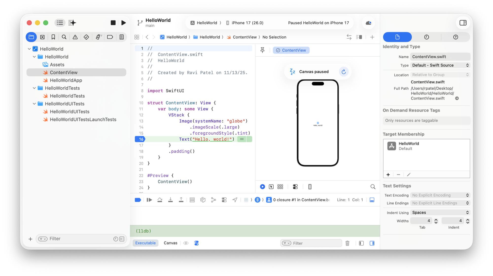
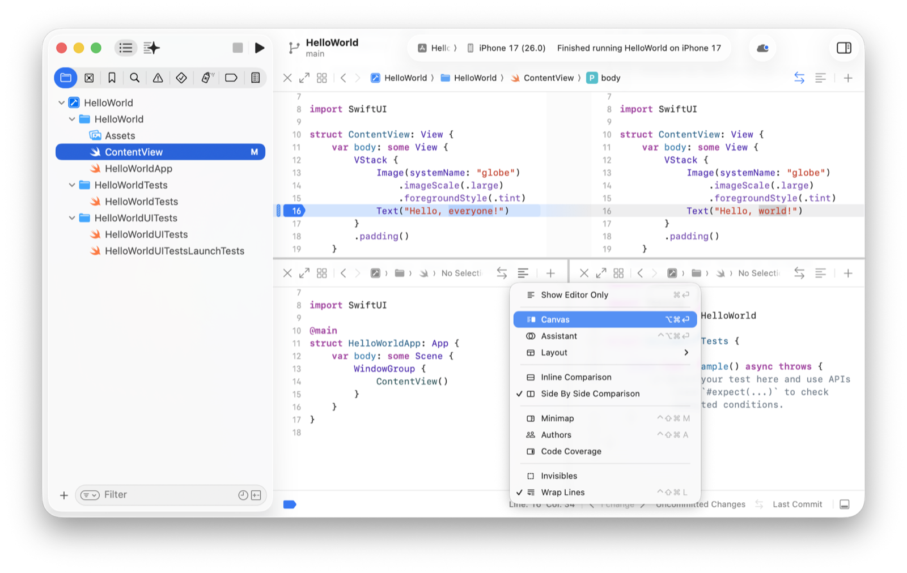
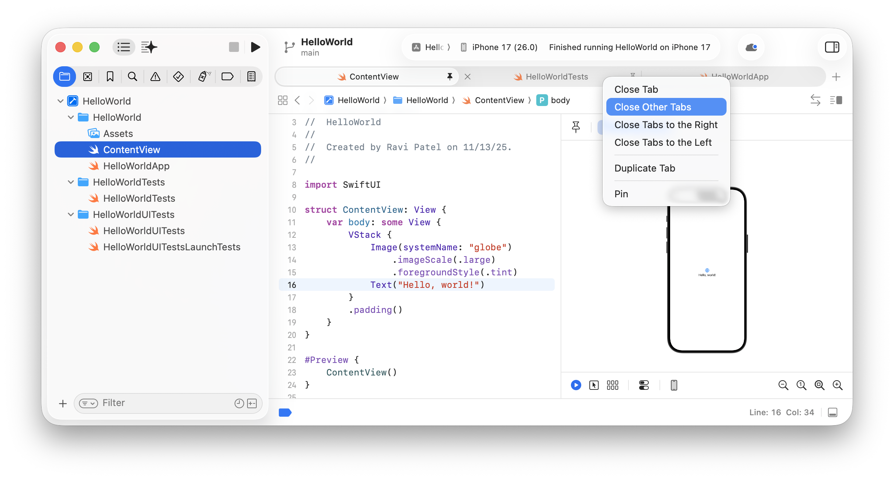

> 导航：[技术](../technologies.md) · [Xcode](../xcode.md) · [项目和工作区](projects-and-workspaces.md)

# 配置 Xcode 项目窗口

文章

自定义 Xcode 项目窗口和编辑器区域，以你偏好的配置来查看和编辑项目文件。

## 概述

Xcode **项目窗口（project window）**是你查看、编辑和管理项目所有部分的主要界面。你可以配置它以适应你的工作风格，并在处理不同任务时进行调整。配置编辑器区域尤其有用，因为你在其中花费大部分时间来修改文件。然后，使用诸如跳转栏（jump bar）、缩略图（minimap）和标签页栏（tab bar）等功能，在项目文件中快速导航。

当你创建或打开一个项目时，主窗口就会打开。要打开其他主窗口，请选取“文件”>“新建”>“窗口”。

Xcode 项目编辑器截图，显示了主窗口各区域的位置：顶部的工具栏（toolbar）、最左侧的导航器区域（navigator area）、中间的编辑器区域（editor area）和最右侧的检查器区域（inspector area）。在编辑器区域中，源代码编辑器在左侧，画布（canvas）在右侧，调试器（debugger）在下方。

主窗口的区域：

- **工具栏**——用于构建和运行你的 App、查看任务进度以及配置主窗口——位于窗口顶部。
- **编辑器区域**——用于查看和编辑项目的内容，包括代码、用户界面文件、属性列表、项目设置等——位于窗口中间。
- **导航器区域**——用于查看项目的各个部分，包括文件、符号、断点和构建信息——位于编辑器区域的左侧。
- **调试区域**——用于在调试时控制 App 运行状态，并显示变量、寄存器和状态信息——位于编辑器窗格下方。
- **检查器区域**——用于查看和编辑关于项目，或关于在导航器或编辑器区域中选中的对象的信息——位于编辑器区域的右侧。

要创建 Xcode 项目，请参阅[为 App 创建 Xcode 项目](creating-an-xcode-project-for-an-app.md)。

> [!note] 注意
> 你可以使用 Xcode 菜单栏（menu bar）中的相应菜单来执行本文档中描述的大多数命令。请参考这些菜单项来了解键盘快捷键。

### 显示和隐藏主窗口的区域

配置主窗口的区域，以专注于你的特定任务。要显示或隐藏导航器、检查器和调试区域：

- 点击工具栏最左侧的“Navigators”按钮。
- 点击工具栏最右侧的“Inspectors”按钮。
- 点击调试器工具栏右侧的“Debug Area”按钮。

要切换导航器，请点击导航器区域上方控制栏中的某个导航器。

关于编码助手（coding assistant）的信息——它会在你点击编码助手按钮后出现在导航器区域中——请参阅[在 Xcode 中智能编写代码](writing-code-with-intelligence-in-xcode.md)。

### 导航项目文件

你可以使用项目导航器（Project navigator）浏览项目文件的层级结构。在项目导航器中选择的文件会在编辑器区域中打开。具体打开的编辑器取决于你选择的文件类型。例如，如果你选择了一个源文件，Xcode 会在源代码编辑器中打开它。

然后，你可以使用编辑器上方工具栏中出现的相关菜单、箭头和跳转栏，在编辑器区域中查看或打开其他文件。

### 向编辑器区域添加多个编辑器窗格

使用编辑器工具栏上的控制项，在单独的编辑器窗格中打开多个文件。

- 要添加编辑器窗格，请点击编辑器工具栏最右侧的“Add”按钮 (+)，然后从弹出式菜单中选择“Editor Pane on Right”或“Editor Pane Below”。
- 要关闭编辑器窗格，请点击该窗格上方编辑器工具栏左侧的“X”按钮。
- 要将项目导航器和检查器的焦点切换到某个编辑器窗格，请点击该窗格。
- 要临时展开或折叠某个编辑器窗格，请点击编辑器工具栏左侧的“Focus/Unfocus this Editor Pane”按钮。

Xcode 项目编辑器截图，左侧是项目导航器，并且选中了一个源文件。右侧的编辑器区域上方显示了对比视图，下方并排显示两个源代码编辑器窗格，且“调整编辑器选项”（Adjust Editor Options）弹出式菜单中选中了“Canvas”菜单项。

### 选择编辑器选项和辅助视图

你可以使用编辑器工具栏上的控制项来配置编辑器窗格。使用编辑器工具栏右侧的“调整编辑器选项”（Adjust Editor Options）弹出式菜单，为编辑器窗格添加选项并更改其布局。你可以从以下编辑器选项中进行选择：

- **仅显示编辑器（Show Editor Only）**——隐藏辅助画布或助手，仅显示编辑器。
- **画布（Canvas）**——显示一个画布，用于展示源文件中预览和 playground 宏的效果。
- **助手（Assistant）**——显示一个助手，用于展示关于文件的信息。
- **布局（Layout）**——更改编辑器相对于辅助画布或助手的位置。
- **行内比较（Inline Comparison）**——在你启用代码审查（code review）时，在编辑器内显示受源代码管理的文件的更改。
- **并排比较（Side By Side Comparison）**——在你启用代码审查时，在编辑器旁边的单独视图中显示受源代码管理的文件的更改。
- **缩略图（Minimap）**——提供一个文件的微型版本，用于在文件中导航。
- **作者（Authors）**——显示受源代码管理的文件的提交历史。
- **代码覆盖率（Code Coverage）**——在你运行测试后显示关于源文件的统计数据，例如未测试的代码部分。
- **不可见字符（Invisibles）**——显示文件中的不可见字符。
- **自动换行（Wrap Line）**——对超出编辑器宽度的行进行换行。

### 将文件更改与先前版本进行比较

对于受源代码管理的文件，你可以将你的更改与先前的提交进行比较。要切换比较视图，请点击编辑器工具栏左侧的“Enable/Disable Code Review”按钮。

要在编辑器右侧显示先前的提交，请从“调整编辑器选项”弹出式菜单中选择“并排比较”（Side By Side Comparison）。要在编辑器内显示更改，请选择“行内比较”（Inline Comparison）。

然后，使用比较视图底部的控制项来选择要比较的文件版本。

### 使用标签页栏在文件间快速切换

可以使用出现在编辑器窗格上方的**标签页栏（tab bar）**来打开和固定你经常访问的文件。要显示标签页栏，请选取“View”>“Show Editor Tab Bar”。然后，添加、移除和固定文件：

- 要添加新标签页，请从标签页栏右侧的“Add”按钮弹出式菜单中选择“Tab”，然后在下方的“起始页”（Start Page）中输入文件名或选择一个最近使用的文件。
- 要在标签页中打开一个或多个文件，请在项目导航器中选择这些文件，然后选取“File”>“Open in New Tab”或“File”>“Open in New Tabs”。
- 要固定或取消固定标签页，请将鼠标悬停在标签页上，然后点击标签页右侧的固定图标。
- 要关闭标签页，请将鼠标悬停在标签页上，然后点击标签页左侧的“X”。

对于其他操作，请按住 Control 键点击标签页，然后从弹出式菜单中选择一个项目，例如“Close Other Tabs”。

Xcode 项目编辑器截图，左侧是项目导航器，并且选中了一个源文件。编辑器区域在右侧，其中右侧是源代码编辑器，左侧是画布。标签页栏出现在编辑器工具栏上方，并显示了一个标签页的上下文弹出式菜单，其中选中了“Close Other Tabs”菜单项。

## 另请参阅

### 导航

- [在项目中查找和替换内容](finding-and-replacing-content-in-a-project.md) — 搜索项目中部分或全部内容来查找文本字符串或符号名称，并使用正则表达式执行高级搜索。
