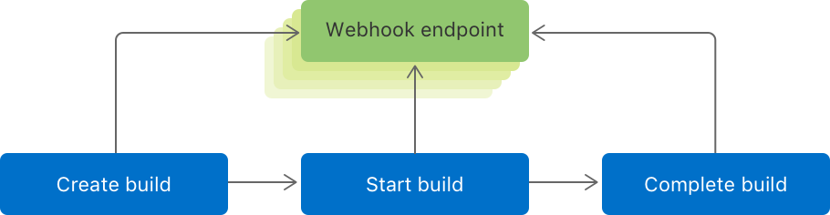

> 导航：[技术](../technologies.md) · [Xcode](../xcode.md) · [Xcode Cloud](xcode-cloud.md)

# 在 Xcode Cloud 中配置 webhook

<sub>文章</sub>

配置 webhook，将 Xcode Cloud 连接到其他服务和工具。

## 概述

你可能会在开发流程和项目管理目的中使用自定义服务和工具，并且需要将它们连接到 Xcode Cloud。例如，你可能希望在团队的仪表盘上显示来自 Xcode Cloud 的构建信息、自动执行拉取请求（PR）的合并流程、自动在你的问题跟踪工具中打开或关闭问题等。

要将 Xcode Cloud 与自定义工具或服务连接，你需要配置一个能够接收来自 Xcode Cloud 的 HTTP 请求的 HTTPS 端点，这个端点称为 *webhook*。通过配置 webhook，你使 Xcode Cloud 能够在构建过程中的特定时刻向其他服务或工具发送一个丰富的 JSON 有效负载。该服务或工具随后可以解析该 JSON 有效负载，并使用接收到的信息提供其功能。

> [!note] 注意
> 每个 Xcode Cloud 产品最多可以配置五个 webhook。

每次创建、启动和完成构建时，Xcode Cloud 都会向每个 webhook 配置的 HTTPS 端点发送一个 HTTP 请求。



<sub>一个示意图，展示了 Xcode Cloud 向配置的端点发送 JSON 有效负载的不同时刻：创建新的构建、启动构建和完成构建时。</sub>

有关在 Xcode Cloud 中创建 webhook 的更多信息，请参阅[自定义你的高级 Xcode Cloud 工作流程](https://developer.apple.com/videos/play/wwdc2021/10269)。

### 创建 Xcode Cloud webhook

要在 Xcode Cloud 中创建 webhook：

1. 在 [App Store Connect](https://appstoreconnect.apple.com) 中，选择一个 App 并选择“Xcode Cloud”标签页。
2. 在边栏中，选择“设置”>“Webhook”。
3. 点击“添加”按钮（+）以添加新的 webhook。
4. 为 webhook 选择一个唯一、易于识别的名称，例如“团队仪表盘”或“问题跟踪器”。
5. 输入能够接收并处理 HTTPS 请求的 App 或服务的 URL。

当你的服务或工具收到来自 Xcode Cloud 的请求时，请响应一个表示成功的 HTTP 状态码。如果你返回一个可重试的服务器错误，或者 Xcode Cloud 在 30 秒内没有收到响应，它将重新发送 webhook 请求，直到收到成功响应。

> [!note] 注意
> 你需要先将项目或工作区配置为使用 Xcode Cloud，之后才能创建 webhook。

### 调试 webhook

创建新的 webhook 时，建议花一些时间来确保你的服务或工具能够解析 Xcode Cloud 发送的 JSON 有效负载。为了帮助你调试集成问题，Xcode Cloud 会为它发送的每个 webhook 请求记录一份投递报告。其中包含详细的请求和响应元数据。

要访问 webhook 的投递报告：

1. 在 [App Store Connect](https://appstoreconnect.apple.com) 中，选择你的 App 并选择“Xcode Cloud”标签页。
2. 在边栏中，选择“设置”>“Webhook”。
3. 选择一个 webhook 并查看其投递报告。

### 查看有效负载

每次 webhook 请求中，Xcode Cloud 都会包含关于你在 App Store Connect 中配置的 App、启动构建的工作流程、构建本身、你的 Git 仓库等的详细信息。使用此信息在你的自定义工具或服务中提供功能。例如，使用有效负载信息在你的团队仪表盘上显示 Xcode Cloud 构建信息。

有关 webhook 有效负载的更多信息，请参阅 [Xcode Cloud webhook 有效负载参考](webhook-payload.md)。

以下代码片段显示了 Xcode Cloud 随请求发送的有效负载：

```json
{
    "webhook": {
        "id": "12345678-abcd-1234-5678-a12345bc4567",
        "name": "Issue Tracker",
        "url": "https://issues.example.com/webhooks"
    },
    "metadata" : {
        "type" : "metadata",
        "attributes" : {
            "createdDate" : "2021-06-07T10:00:00.000000-07:00",
            "eventType" : "BUILD_COMPLETED"
        }
    },
    "app": {
        "id": "12345678-abcd-1234-5678-a12345bc4567",
        "type": "apps"
    },
    "ciWorkflow": {
        "id": "12345678-abcd-1234-5678-a12345bc4567",
        "type": "ciWorkflows",
        "attributes": {
            "name": "Pull Requests",
            "description": "Starts Builds from Pull Requests.",
            "isEnabled": true,
            "isLockedForEditing": false
        }
    },
    "ciProduct": {
        "id": "12345678-abcd-1234-5678-a12345bc4567",
        "type": "ciProducts",
        "attributes": {
            "name": "Example App",
            "createdDate": "2021-06-07T10:00:00.000000-07:00",
            "productType": "APP"
        }
    },
    "ciBuildRun": {
        "id": "12345678-abcd-1234-5678-a12345bc4567",
        "type": "ciBuildRuns",
        "attributes": {
            "number": 12,
            "createdDate": "2021-06-07T10:00:00.000000-07:00",
            "sourceCommit": {
                "commitSha": "0123456789abcdefghij01234567890abcdefghi",
                "author": {
                    "displayName": "Anne Johnson"
                },
                "committer": {
                    "displayName": "Anne Johnson"
                },
                "htmlUrl": "https://example.com/commit/abcdef1234567890"
            },
            "destinationCommit": {
                "commitSha": "abcdefghij01234567890abcdefghi0123456789",
                "author": {
                    "displayName": "Juan Chavez"
                },
                "committer": {
                    "displayName": "Juan Chavez"
                },
                "htmlUrl": "https://example.com/commit/abcdef1234567890"
            },
            "isPullRequestBuild": true,
            "executionProgress": "COMPLETE",
            "completionStatus": "SUCCEEDED"
        }
    },
    "ciBuildActions": [{
        "id": "12345678-abcd-1234-5678-a12345bc4567",
        "type": "ciBuildActions",
        "attributes": {
            "name": "analyze",
            "actionType": "ANALYZE",
            "issueCounts": {
                "analyzerWarnings": 10,
                "errors": 0,
                "testFailures": 0,
                "warnings": 0
            },
            "executionProgress": "COMPLETE",
            "completionStatus": "SUCCEEDED",
            "isRequiredToPass": false
        },
        "relationships": {}
    }, {
        "id": "12345678-abcd-1234-5678-a12345bc4567",
        "type": "ciBuildActions",
        "attributes": {
            "name": "build",
            "actionType": "ARCHIVE",
            "issueCounts": {
                "analyzerWarnings": 0,
                "errors": 0,
                "testFailures": 0,
                "warnings": 3
            },
            "executionProgress": "COMPLETE",
            "completionStatus": "SUCCEEDED",
            "isRequiredToPass": true
        },
        "relationships": {
            "builds": {
                "id": "12345678-abcd-1234-5678-a12345bc4567",
                "type": "builds",
                "attributes": {
                    "platform": "IOS"
                }
            }
        }
    }],
    "scmProvider": {
        "type": "scmProviders",
        "attributes": {
            "scmProviderType": {
                "scmProviderType": "GITHUB_CLOUD",
                "displayName": "GitHub",
                "isOnPremise": false
            },
            "endpoint": "https://github.com/example/example.git"
        }
    },
    "scmRepository": {
        "id": "12345678-abcd-1234-5678-a12345bc4567",
        "type": "scmRepositories",
        "attributes": {
            "httpCloneUrl": "https://github.com/example/test.git",
            "sshCloneUrl": "ssh://git@github.com/example/test.git",
            "ownerName": "example",
            "repositoryName": "example app"
        }
    },
    "scmPullRequest": {
        "id": "12345678-abcd-1234-5678-a12345bc4567",
        "type": "scmPullRequests",
        "attributes": {
            "title": "Add accessibility labels.",
            "number": 123,
            "htmlUrl": "https://example.com/example/example-app/pull/123",
            "sourceRepositoryOwner": "example",
            "sourceRepositoryName": "example source repository name",
            "sourceBranchName": "annejohnson/new-features",
            "destinationRepositoryOwner": "example",
            "destinationRepositoryName": "example destination repository name",
            "destinationBranchName": "main",
            "isClosed": false,
            "isCrossRepository": false
        }
    },
    "scmGitReference": {
        "id": "12345678-abcd-1234-5678-a12345bc4567",
        "type": "scmGitReferences",
        "attributes": {
            "name": "annejohnson/new-feature",
            "canonicalName": "refs/heads/annejohnson/new-feature",
            "isDeleted": false,
            "kind": "BRANCH"
        }
    }
}
```

## 另请参阅

### 通知

- [Xcode Cloud webhook 有效负载参考](webhook-payload.md) — 查看 Xcode Cloud 发送的 webhook 有效负载的详细信息，包括与之关联的产品、工作流程、构建、操作、结果和 SCM 元数据。
- [将 Xcode Cloud 连接到 Slack](connecting-xcode-cloud-to-slack.md) — 将 Xcode Cloud 连接到 Slack，让你的团队了解最新的 Xcode Cloud 构建信息。
