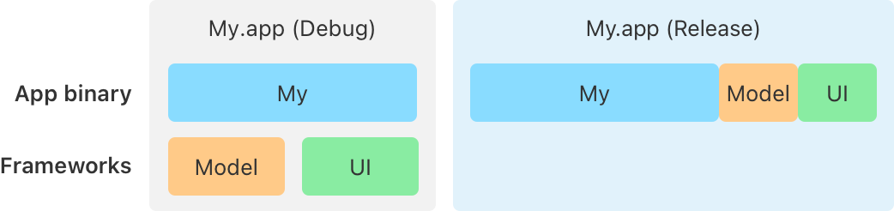

> 导航：[Technologies](../technologies.md) · [Xcode](../xcode.md) · [Build system](build-system.md)

# 配置你的项目以使用可合并库

文章

使用可合并动态库，在发布构建中获得与静态链接相近的 App 启动时间，同时不会在调试构建中失去动态链接带来的构建时间优势。

## 概述

在 Xcode 14 或更早版本中，你使用静态链接或动态链接的方式，将来自某个独立库的代码包含到你的目标中。构建目标时，你会把一个静态库链接到你的 App 中，这可能会同时增加你的构建时间和 App 体积。当你运行目标时，动态加载器会解析可执行文件中的动态符号，使其指向动态库中相应的地址，这可能会增加你 App 的启动时间。

在 Xcode 15 或更高版本中，对于 macOS 和 iOS 的 App 与框架目标，你可以引入来自一个独立的、_可合并的_ 动态库中的符号。可合并动态库包含额外的元数据，使 Xcode 能够将该库合并进另一个二进制文件中，这与使用 `-all_load` 链接静态库的方式类似。当你启用自动合并时，Xcode 会启用一些构建设置，使 App 启动更快，同时让调试与开发构建的时间保持较快。

在此语境下，调试或开发构建是未经优化的，此时 `clang` 的调试格式为 `-O0`，或 `swiftc` 的调试格式为 `-Onone`。发布构建则使用优化。Xcode 用一个新的构建设置 `IS_UNOPTIMIZED_BUILD` 来表示调试构建。

在调试构建中，Xcode 15 或更高版本会将可合并依赖当作普通动态库处理，而不产生创建可合并元数据以及合并所有库的开销。在发布构建中，Xcode 会在你的动态库中创建可合并元数据，并将依赖合并进目标二进制文件中。

在发布构建中，二进制文件会略大一些，但避免了在运行时加载动态链接的开销。

> [!note] 来自 WWDC23 的相关场次
> 场次 10268：[Meet mergeable libraries](https://developer.apple.com/videos/play/wwdc2023/10268)

### 在 Xcode 中自动合并库

要自动合并库，首先在 Xcode 15 或更高版本中打开你的项目。然后，为你的 App 目标添加 `MERGED_BINARY_TYPE` 构建设置，并将其值设为 `automatic`。有了这个构建设置，Xcode 会在调试构建中将可合并依赖当作普通动态库处理，但在发布模式下会执行相应步骤，自动处理直接依赖的合并。关于 `MERGED_BINARY_TYPE` 构建设置的更多信息，请参阅 [Create Merged Binary](build-settings-reference.md#Create-Merged-Binary)。

_直接依赖_ 是满足以下两个条件的库：

- 该库列在你目标的 Link Binary with Libraries 构建阶段中。
- 该库是你项目中另一个目标的产物。

_间接依赖_ 是指任何不满足上述两个条件的其他库依赖——例如，一个预构建的库，或某个库的依赖项。

在发布构建中：

- Xcode 会将合并二进制目标的直接依赖构建为可合并的。这包括框架和动态库（dylib）目标。
- Xcode 会将可合并库合并进合并后的二进制文件中。
- Xcode 还会合并你目标的 Link Binary with Libraries 构建阶段中列出的任何可合并的预构建 XCFramework。
- Xcode 会将可合并的目标产物嵌入到合并后的二进制产物中，或者嵌入到包含该合并二进制产物的某个产物（例如某个 App）中。Xcode _不会_ 在嵌入副本中包含来自这些库的二进制文件。

> [!note] 注意
> Xcode 不会在发布构建中自动将间接依赖构建为可合并的。要为合并配置间接依赖，请参阅下方的 [手动配置合并](#Manually-configure-merging) 一节。

在调试构建中：

- Xcode 会正常构建合并二进制目标的直接依赖，而不生成使它们可合并所需的元数据。
- 合并二进制目标会链接由直接依赖产生的、要被重新导出的 dylib。
- Xcode 会从任何预构建的可合并 XCFramework 中剥离可合并元数据。
- Xcode 会将这些目标依赖产物嵌入到合并后的二进制产物中，或者嵌入到包含该合并二进制产物的某个产物中。Xcode 不会在嵌入副本中包含它们的二进制文件（这与发布构建的行为相同）。
- Xcode 还会将目标依赖产物复制到合并后的二进制产物中的一个特殊位置。这个特殊位置只包含目标依赖产物的二进制文件。合并后的二进制产物有一个额外的 `@rpath` 指向该特殊位置。

### 手动配置合并

在某些情况下，你可能希望手动配置你的 App 或框架目标与其依赖库之间的合并。例如，如果你担心某个 App 扩展的二进制体积，你可能不希望自动合并你在 App 与该 App 扩展之间共享的依赖项。要设置手动合并，请先配置你的 App 或框架目标，然后再配置你的依赖库。

在你的 App 或框架目标中，添加构建设置 `MERGED_BINARY_TYPE` 并将其设为 `manual`。为你的目标添加该设置后：

- 在发布构建中，Xcode 会使用链接器标志 `-merge_framework`、`-merge-l` 等，合并任何已启用 `MAKE_MERGEABLE` 的直接依赖的产物。
- 在调试构建中，Xcode 会使用链接器标志 `-reexport_framework`、`-reexport-l` 等，链接你目标中任何已启用 `MERGEABLE_LIBRARY` 但未启用 `MAKE_MERGEABLE` 的直接依赖。
- 对于未启用 `MERGEABLE_LIBRARY` 的目标，Xcode 会使用正常的链接方式。这与 Xcode 对静态库，或不可合并的动态库所使用的链接方式相同。

对于每一个你想要使用合并的依赖库，添加构建设置 `MERGEABLE_LIBRARY`，并将其设为 `YES`。关于 `MERGEABLE_LIBRARY` 构建设置的更多信息，请参阅 [Build Mergeable Library](build-settings-reference.md#Build-Mergeable-Library)。

### 使用分组库减少依赖

要创建一个分组库，用于在你的顶层框架或 App 项目中组织依赖项：

- 在你的项目中为分组库创建一个新目标。
- 确认你的分组库已将构建设置 `MERGED_BINARY_TYPE` 设为 `automatic`。
- 将可合并库添加为你分组库的依赖项。
- 将你的分组库添加为你 App 或框架目标的依赖项。
- 从你 App 或框架目标的依赖项中，移除你已添加到分组库中的各个单独库。

### 创建预构建的可合并库

要创建一个可以作为二进制包（而非源代码）分发的可合并库：

- 在你的库目标上启用 Build Mergeable Library 构建设置。
- 从你库的归档创建一个 XCFramework。更多信息请参阅 [Creating a multiplatform binary framework bundle](creating-a-multi-platform-binary-framework-bundle.md)。

当你将可合并库包含在某个 XCFramework 中时，Xcode 会在该 XCFramework 的 `Info.plist` 文件中添加 `MergeableMetadata` 键，向其他项目表明该 XCFramework 中的库是可合并的。只有 Xcode 15 及更高版本才能使用带有可合并元数据的 XCFramework；在更早的版本中，Xcode 会返回一个构建错误。

要使用包含可合并元数据的 XCFramework，请将其添加到某个已配置为自动或手动合并的目标的 Link Binaries 构建阶段中。更多信息请参阅 [Link against additional frameworks and libraries](customizing-the-build-phases-of-a-target.md#Link-against-additional-frameworks-and-libraries)。

## 另请参阅

### 性能

- [Improving the speed of incremental builds](improving-the-speed-of-incremental-builds.md) — 让 Xcode 构建系统了解你项目中与目标相关的依赖关系，减少每个构建周期中编译器的工作量。
- [Improving build efficiency with good coding practices](improving-build-efficiency-with-good-coding-practices.md) — 通过减少你代码导出的符号数量，并向编译器提供其所需的显式信息，缩短编译时间。
- [Building your project with explicit module dependencies](building-your-project-with-explicit-module-dependencies.md) — 使用 Xcode 构建系统消除不必要的模块变体，从而缩短编译时间。
