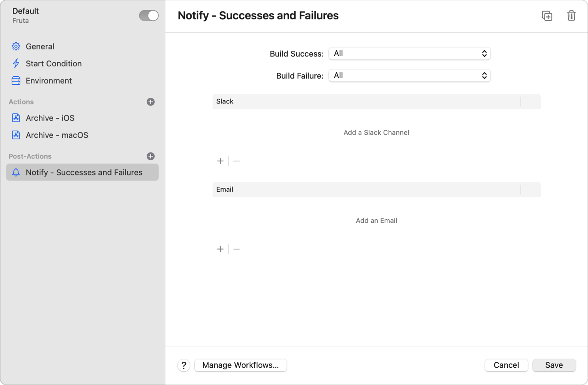

> 导航：[Technologies](../technologies.md) · [Xcode](../xcode.md) · [Xcode Cloud](xcode-cloud.md)

# 将 Xcode Cloud 连接到 Slack

文章

将 Xcode Cloud 连接到 Slack，让你的团队及时了解最新的 Xcode Cloud 构建情况。

## 概述

许多团队使用 [Slack](https://slack.com) 进行协作，并期望其他工具能支持并与 Slack 集成。由于协作是使用 Xcode Cloud 的重要一环，你可以轻松将它连接到 Slack，并在团队的 Slack 工作区中接收它的通知。

将 Xcode Cloud 连接到 Slack 后，你可以：

- 在 Slack 中接收包含构建状态以及构建报告链接的 Xcode Cloud 通知。
- 将 Xcode Cloud 配置为以私信形式向你发送通知，或选择一个 Slack 频道用于团队级通知。
- 为不同的工作流使用不同的 Slack 频道。

使用 Xcode 或 [App Store Connect](htts://appstoreconnect.apple.com) 将 Xcode Cloud 连接到单个 Slack 工作区。

> [!note] 注意
> 根据你团队 Slack 工作区的设置，你可能需要请团队的 Slack 管理员来将 Xcode Cloud 连接到 Slack。更多信息请参阅[使用 App Store Connect 为 Xcode Cloud 安装 Slack App](connecting-xcode-cloud-to-slack.md#Install-the-Slack-app-for-Xcode-Cloud-using-App-Store-Connect)。

### 使用 Xcode 为 Xcode Cloud 安装 Slack App

要将 Xcode Cloud 连接到 Slack，你需要在团队的 Slack 工作区中安装 Apple 提供的 Slack App。该 App 负责管理对团队 Slack 工作区的访问。

要使用 Xcode 安装 Slack App：

1. 选择“Integrate” > “Manage Workflows”打开“Manage Workflows”表单。
2. 双击某个工作流将其打开。
3. 点按“Post-Actions”旁边的添加按钮（+），选择“Notify”，添加一个用于发送通知的后置操作。

  
4. 点按你添加的后置操作中 Slack 部分的添加按钮。
5. 提供你团队 Slack 工作区的名称，然后点按“Connect”。这会在你的浏览器中打开团队的 Slack 工作区。
6. 如果尚未登录，请登录你的 Slack 工作区，然后查看 Xcode Cloud 的 Slack App 请求的权限。
7. 点按“Allow”，将该 App 安装进你的 Slack 工作区。这会带你回到 Xcode，此时你就可以按照[选择一个 Slack 频道](connecting-xcode-cloud-to-slack.md#Choose-a-Slack-channel)中所述，配置“Notify”后置操作，将构建通知发送到团队的 Slack 频道。

> [!tip] 提示
> 将 Xcode Cloud 配置为以私信（DM）形式在 Slack 中向你自己发送构建通知。前往 App Store Connect 中的你的账户，选择“Xcode Cloud”标签页，在边栏中选择“Notifications”，然后勾选“Slack”旁边的复选框。

### 使用 App Store Connect 为 Xcode Cloud 安装 Slack App

另一种将 Xcode Cloud 配置为向 Slack 发送通知的方式，是在 [App Store Connect](https://appstoreconnect.apple.com) 中设置这个连接。如果你需要让团队的 Slack 管理员来协助将 Xcode Cloud 连接到 Slack，这种方式尤为方便，因为他们不必熟悉 Xcode。

如果你要与团队的 Slack 管理员协作，请将他们添加到你的 Apple Development 团队中，并为他们分配以下角色之一：App Manager、Admin 或 Account Holder。在 App Store Connect 中设置了合适的角色后，他们就可以将 Xcode Cloud 连接到 Slack。

要在 App Store Connect 中将 Xcode Cloud 连接到团队的 Slack 工作区：

1. 前往你 App 在 App Store Connect 中的页面，选择“Xcode Cloud”标签页。
2. 在边栏中选择“Manage Workflows”，点按某个工作流的名称将其打开。
3. 点按“Post-Actions”旁边的添加按钮，选择“Notify”，添加一个用于发送通知的后置操作。
4. 点按你添加的后置操作中 Slack 部分的“Edit”。
5. 输入你团队 Slack 工作区的名称，然后点按“Connect”。这会打开你团队的 Slack 工作区。
6. 如果尚未登录，请登录你的 Slack 工作区，然后查看 Xcode Cloud 的 Slack App 请求的权限。
7. 点按“Allow”，将该 App 安装进你的 Slack 工作区。这会带你返回 App Store Connect 中你的工作流，此时你就可以配置“Notify”后置操作，将构建通知发送到团队的 Slack 频道。

你也可以点按 App Store Connect 网站右上角的账户，选择“Edit Profile”，来将 Xcode Cloud 连接到 Slack。在你的个人资料设置中，选择“Xcode Cloud”标签页，然后点按“Slack”旁边的“Connect”，将 Xcode Cloud App 安装进你的 Slack 工作区。

### 授予 Xcode Cloud 访问你 Slack 账户的权限

如果是你本人将 Xcode Cloud 连接到 Slack 的，你可以将 Xcode Cloud 配置为向团队的 Slack 频道发送构建状态通知。你也可以选择以私信形式接收构建状态通知。不过，可能是其他人将 Xcode Cloud 连接到了 Slack；例如，你团队 Slack 工作区的管理员。在这种情况下，你会在团队成员所配置的 Slack 频道中收到构建状态通知，但在你对某个工作流的“Notify”后置操作进行更改之前，需要先授权 Xcode Cloud 使用你的 Slack 账户。

要授权 Xcode Cloud 访问你的 Slack 账户：

1. 在 Xcode 或 App Store Connect 中打开一个工作流。
2. 前往“Notify”后置操作。
3. 按照 Xcode 或 App Store Connect 提供的指引，授予 Xcode Cloud 访问你 Slack 账户的权限。

在授权 Xcode Cloud 访问你的 Slack 账户后，你就可以对工作流的“Notify”后置操作进行更改，并为 Slack 配置个人构建通知。

### 选择一个 Slack 频道

根据你的项目，你可以将所有 Xcode Cloud 通知都导向同一个 Slack 频道，也可以设置不同的 Slack 频道来分别接收通知。例如，如果你是独立开发者，或者你的团队只开发一个 App，就可以为所有 Xcode Cloud 通知使用单个 Slack 频道。相比之下，大型团队可能会为每个 App 使用一个 Slack 频道，或者为来自拉取请求的构建、分发每夜构建的工作流等分别使用不同的 Slack 频道。

要将某个工作流配置为向某个 Slack 频道发送构建通知：

1. 在 Xcode 或 App Store Connect 中打开一个工作流。
2. 点按添加按钮并选择“Notify”来添加一个后置操作，或者选择一个已有的“Notify”后置操作。
3. 点按该后置操作 Slack 部分的添加按钮。
4. 在弹出窗口中选择一个频道，然后点按“OK”。如果你加入了很多 Slack 频道，可以筛选频道以找到你要找的那一个。
5. 配置任何通知设置；例如，选择只在构建失败时接收通知，然后保存你的更改。

> [!note] 注意
> 如果你将 Xcode Cloud 配置为向一个私密 Slack 频道发送构建状态通知，对于不属于该私密频道成员的团队成员，Xcode Cloud 会隐去该频道的名称。

## 另请参阅

### Notifications

- [Configuring webhooks in Xcode Cloud](configuring-webhooks-in-xcode-cloud.md) — 配置将 Xcode Cloud 与其他服务和工具连接起来的 webhook。
- [Xcode Cloud webhook payload reference](webhook-payload.md) — 查看 Xcode Cloud 发送的 webhook 负载的详细信息，包括与其关联的产品、工作流、构建、操作、结果和 SCM 元数据。
