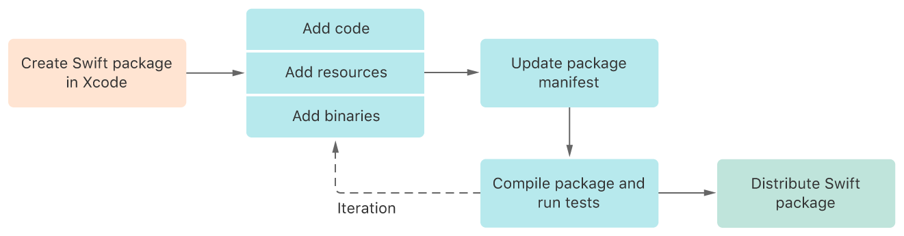
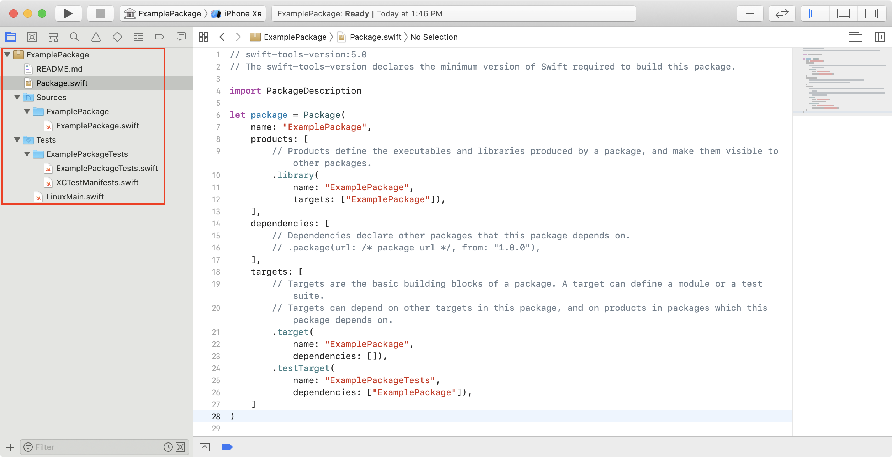
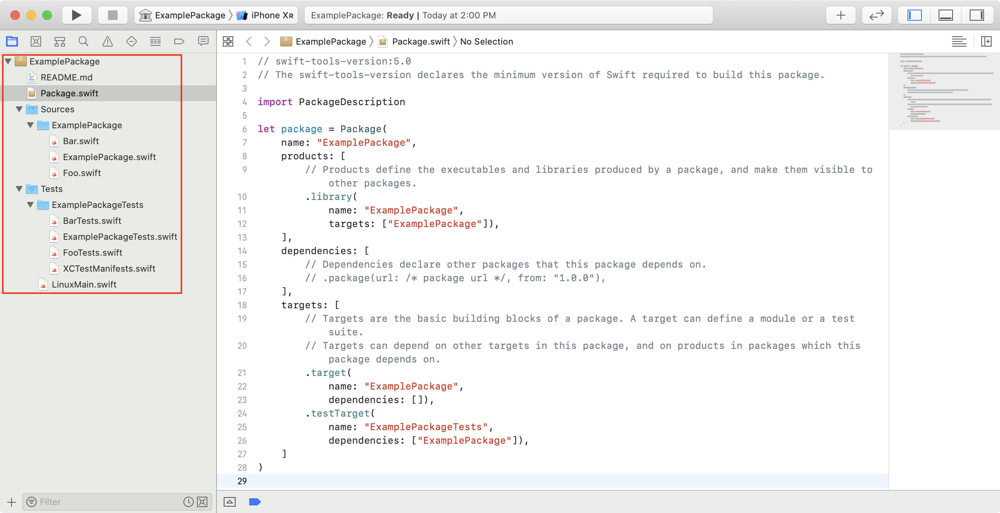

> 导航：[技术](../technologies.md) · [Xcode](../xcode.md) · [Swift 包](swift-packages.md)

# 使用 Xcode 创建独立的 Swift 包

<sub>文章</sub>

将可执行或可共享的代码打包成一个独立的 Swift 包。

## 概述

Swift 包是 Swift、Objective-C、Objective-C++、C 或 C++ 代码的可复用组件。它们可以捆绑资源，以二进制文件形式提供其代码，或依赖其他包。使用 Swift 包来打包可执行代码（例如脚本）作为*可执行产品*，或创建一个包以*库产品*的形式提供可共享的代码。提供库产品的包有助于促进代码的模块化，轻松与他人共享代码，并使其他开发者能够为其 App 添加功能。

使用 Xcode，你可以创建一个新的 Swift 包，添加代码、资源文件和二进制文件，构建该 Swift 包，并运行其单元测试。



### 创建一个 Swift 包

要创建一个新的 Swift 包，请打开 Xcode 并选择“文件”>“新建”>“包”。选择一个名称并选择文件位置。选择“在我的 Mac 上创建 Git 仓库”以将你的包置于版本控制之下。完成后，Swift 包会在 Xcode 中打开，看起来类似于标准的 Xcode 项目。Xcode 在创建 Swift 包时会生成所有必要的文件和文件夹：

- `README.md` 文件位于包的根级别。它描述了你的 Swift 包的功能。
- `Package.swift` 文件，即*包清单*，描述了 Swift 包的配置。你可以在“访达”中双击它以在 Xcode 中打开该包。包清单使用 Swift 和 PackageDescription 框架来定义包的名称、产品、目标、对其他包的依赖关系等。
- 源文件位于名为 `Sources` 的文件夹中，并按[目标](../packagedescription/target.md)进行范围划分。一个 Swift 包可以包含多个目标，按照惯例，每个目标的代码都位于其自己的子文件夹中。
- 单元测试目标位于名为 `Tests` 的文件夹中，并且遵循与标准目标相同的约定，每个测试目标的代码都位于其自己的子文件夹中。



<sub>屏幕截图显示了一个名为 ExamplePackage 的新创建的独立 Swift 包。编辑器（Editor）区域显示包的清单文件，导航器（Navigator）区域显示包的内容，实用工具（Utilities）区域显示有关包清单的信息。</sub>

### 配置你的 Swift 包

Swift 包不使用 `.xcodeproj` 或 `.xcworkspace`，而是依赖其文件夹结构并使用包清单进行额外配置。以下代码清单显示了一个简单的包清单。它声明了 MyLibrary 目标，并将其作为同名的库产品提供。

```swift
// swift-tools-version:5.3
import PackageDescription

let package = Package(
    name: "MyLibrary",
    platforms: [
        .macOS(.v10_14), .iOS(.v13), .tvOS(.v13)
    ],
    products: [
        // 产品定义了包生成的可执行文件和库，并让它们对其他包可见。
        .library(
            name: "MyLibrary",
            targets: ["MyLibrary", "SomeRemoteBinaryPackage", "SomeLocalBinaryPackage"])
    ],
    dependencies: [
        // 依赖项声明了该包依赖的其他包。
    ],
    targets: [
        // 目标是包的基本 building block。一个目标可以定义一个模块或一个测试套件。
        // 目标可以依赖此包中的其他目标，以及此包所依赖包中的产品。
        .target(
            name: "MyLibrary",
            exclude: ["instructions.md"],
            resources: [
                .process("text.txt"),
                .process("example.png"),
                .copy("settings.plist")
            ]
        ),
        .binaryTarget(
            name: "SomeRemoteBinaryPackage",
            url: "https://url/to/some/remote/binary/package.zip",
            checksum: "The checksum of the XCFramework inside the ZIP archive."
        ),
        .binaryTarget(
            name: "SomeLocalBinaryPackage",
            path: "path/to/some.xcframework"
        )
        .testTarget(
            name: "MyLibraryTests",
            dependencies: ["MyLibrary"]),
    ]
)
```

包清单必须以字符串 `// swift-tools-version:` 开头，后跟一个版本号，例如 `// swift-tools-version:5.3`。

Swift 工具版本声明了：

- PackageDescription 框架的版本
- 用于处理清单的 Swift 语言兼容性版本
- 使用该包所需的 Swift 工具的最低版本

每个 Swift 版本都可能引入对 PackageDescription 框架的更新，但声明了较早 Swift 工具版本的包也可以使用以前的 API 版本。此行为使你可以利用 Swift、Swift 工具和 PackageDescription 框架的新版本，而无需更新包清单，也不会失去对现有包的支持。

要了解有关 `PackageDescription` 框架的更多信息，请参阅 [Package](../packagedescription/package.md)。

> [!note] 注意
> 当你编辑包清单时，Xcode 会提供代码补全。

### 添加你的代码

按照惯例，源文件位于包 `Sources` 目录的一个子文件夹中，该子文件夹的名称与其所属的目标相同。请注意，上面的包清单声明了 `MyLibrary` 目标。其源文件位于 `Sources/MyLibrary` 中，而测试的源文件位于 `Tests/MyLibraryTests` 中。你可以使用额外的子文件夹来组织它们。默认情况下，Xcode 会包含目标文件夹内所有有效的源文件。如果你希望显式声明包含的源文件，可以在初始化 [Target](../packagedescription/target.md) 时使用 [sources](../packagedescription/target/sources.md) 参数传递它们。你也可以传递目录的路径。



要向 Swift 包添加源文件，请使用你已经熟悉的工作流程。例如，你可以通过将源文件拖入项目导航器（Project navigator），或使用“文件”>“将文件添加到 _[packageName]_”菜单，将源文件添加到包中。目标可以包含 Swift、Objective-C/C++ 或 C/C++ 代码，但单个目标不能混合使用 Swift 和 C 系列语言。例如，一个 Swift 包可以有两个目标，一个包含 Objective-C、Objective-C++ 和 C 代码，另一个包含 Swift 代码。

### 添加对另一个 Swift 包的依赖

与 App 一样，Swift 包也可以有*包依赖项*。要声明对远程包的依赖，请使用以远程包的 URL 作为参数之一的函数。要将本地包添加为依赖项，请使用以本地包的路径作为参数之一的函数。以下代码片段显示了这两种选项：

```swift
dependencies: [    
    // 依赖项声明了该包依赖的其他包。
    .package(url: "https://url/of/another/package.git", from: "1.0.0"),
    .package(path: "path/to/a/local/package/", "1.0.0"..<"2.0.0")],
```

有关声明包依赖项的所有可能方式，请参阅 [Package.Dependency](../packagedescription/package/dependency.md)。当你添加依赖项时，你可以将其提供的产品用作 [Target.Dependency](../packagedescription/target/dependency.md)，或使其成为包的 [Product](../packagedescription/product.md) 的一部分。

### 以 Swift 包形式分发二进制文件

你可以选择以二进制文件形式分发，而不是分发提供源文件的 Swift 包。例如，专有闭源库的创建者通常会将其作为二进制文件提供。请参阅[以 Swift 包形式分发二进制框架](distributing-binary-frameworks-as-swift-packages.md)以了解更多信息。

### 添加包资源

在你的清单文件中声明 Swift 工具版本为 5.3 或更高版本，以将资源文件作为包资源添加到你的 Swift 包。例如，Swift 包可以包含使用 Asset Catalog、Storyboard、`.strings` 文件等的用户界面组件。请参阅[使用 Swift 包捆绑资源](bundling-resources-with-a-swift-package.md)以了解更多信息。

### 让你的 Swift 包跨平台兼容

虽然 Swift 包本质上是独立于平台的，并且例如将 Linux 作为目标平台，但 Swift 包也可以是特定于平台的。使用条件编译 block（conditional compilation block）来处理特定于平台的代码并实现跨平台兼容性。以下示例展示了如何使用条件编译 block：

```swift
#if os(Linux)

// 特定于 Linux 的代码

#elseif os(macOS)

// 特定于 macOS 的代码

#endif

#if canImport(UIKit)

// 特定于可使用 UIKit 的平台的代码

#endif
```

此外，你可能需要定义最低部署目标。请注意，下面的包清单通过将最低部署目标作为值传递给 [Package](../packagedescription/package.md) 初始化器的 `platforms` 参数来声明它们。但是，将最低部署目标传递给初始化器并不会将包限制在列出的平台上。

```swift
// swift-tools-version:5.3
import PackageDescription

let package = Package(
    name: "MyLibrary",
    platforms: [
        .macOS(.v10_14), .iOS(.v13), .tvOS(.v13)
    ],
    products: [
        // 产品定义了包生成的可执行文件和库，并让它们对其他包可见。
        .library(
            name: "MyLibrary",
            targets: ["MyLibrary", "SomeRemoteBinaryPackage", "SomeLocalBinaryPackage"])
    ],
    dependencies: [
        // 依赖项声明了该包依赖的其他包。
    ],
    targets: [
        // 目标是包的基本 building block。一个目标可以定义一个模块或一个测试套件。
        // 目标可以依赖此包中的其他目标，以及此包所依赖包中的产品。
        .target(
            name: "MyLibrary",
            exclude: ["instructions.md"],
            resources: [
                .process("text.txt"),
                .process("example.png"),
                .copy("settings.plist")
            ]
        ),
        .binaryTarget(
            name: "SomeRemoteBinaryPackage",
            url: "https://url/to/some/remote/binary/package.zip",
            checksum: "The checksum of the XCFramework inside the ZIP archive."
        ),
        .binaryTarget(
            name: "SomeLocalBinaryPackage",
            path: "path/to/some.xcframework"
        )
        .testTarget(
            name: "MyLibraryTests",
            dependencies: ["MyLibrary"]),
    ]
)
```

> [!tip] 提示
> 如果你计划发布一个不支持所有平台的 Swift 包，请考虑在你的 `README.md` 文件中提及支持的平台。此外，考虑添加对其他平台的支持以扩大其受众。

### 构建你的目标并运行单元测试

Xcode 会为包清单中的每个产品创建一个 Scheme（方案）。选择一个方案作为包的构建和运行目标，并像构建 App 目标一样构建它。每个源目标通常至少有一个对应的测试目标。如果你的包包含多个产品，Xcode 会创建一个名为 _[packageName]_-Package 的额外方案，用于构建所有目标并运行所有单元测试。

## 另请参阅

### 包创建

- [使用 Swift 包捆绑资源](bundling-resources-with-a-swift-package.md) — 将资源文件添加到你的 Swift 包并在代码中访问它们。
- [本地化包资源](localizing-package-resources.md) — 确保你的 Swift 包为多种语言区域提供本地化资源。
- [以 Swift 包形式分发二进制框架](distributing-binary-frameworks-as-swift-packages.md) — 通过创建包含一个或多个 XCFramework 的 Swift 包，使其他开发者可以使用二进制文件。
- [与 App 协同开发 Swift 包](developing-a-swift-package-in-tandem-with-an-app.md) — 将你已发布的 Swift 包作为本地包添加到你的 App 项目中，并协同开发该包和 App。
- [使用本地包组织你的代码](organizing-your-code-with-local-packages.md) — 通过将你的 App 代码组织到本地 Swift 包中，简化维护、促进模块化并鼓励复用。
- [PackageDescription](../packagedescription.md) — 创建可复用代码，以轻量级方式进行组织，并在你的项目以及其他开发者之间共享。
