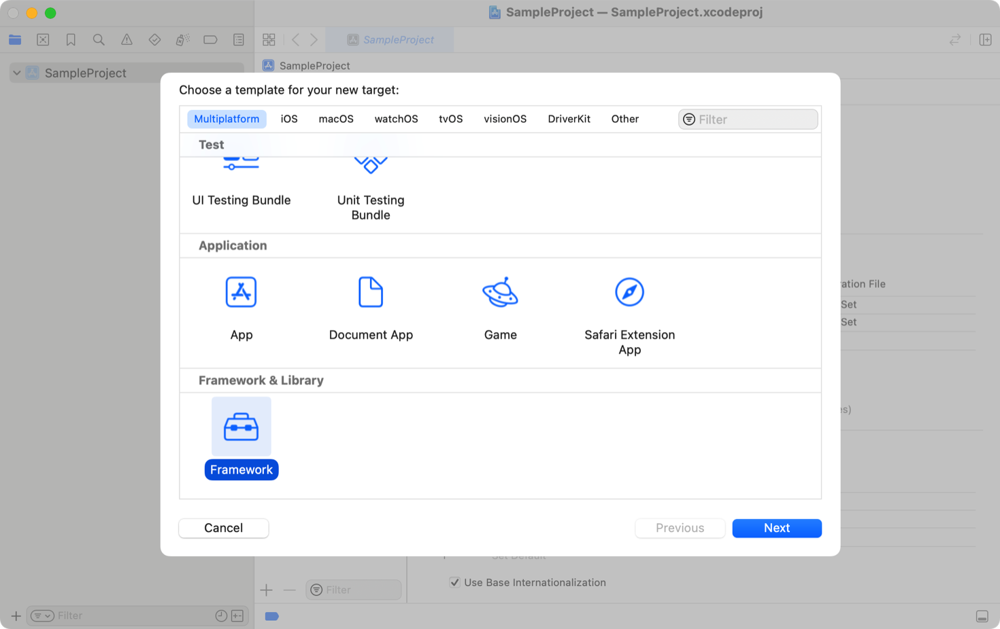
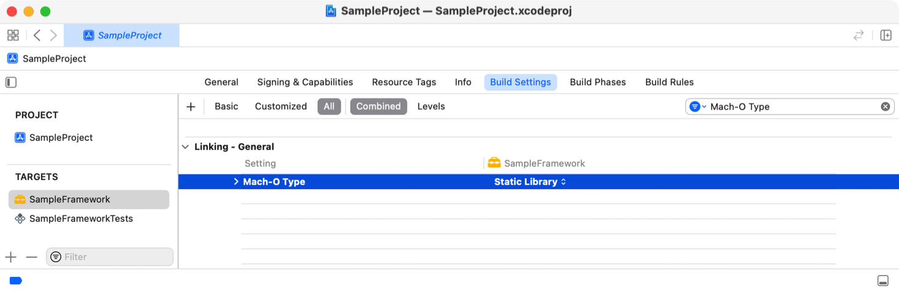
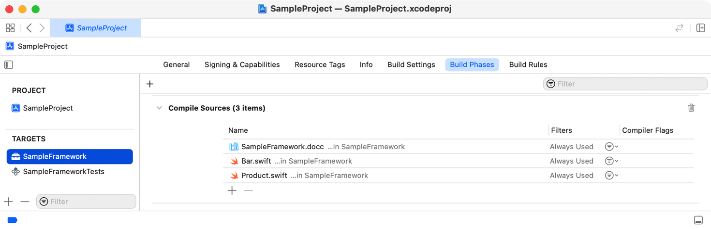
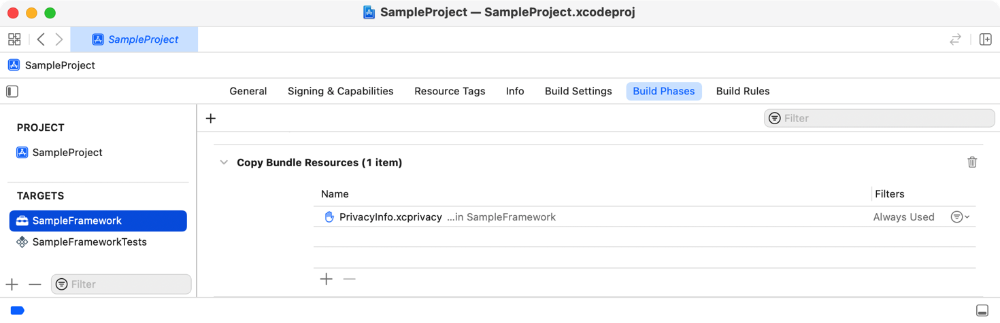
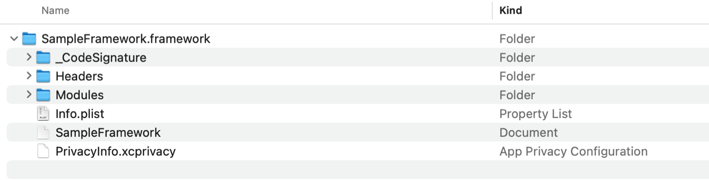
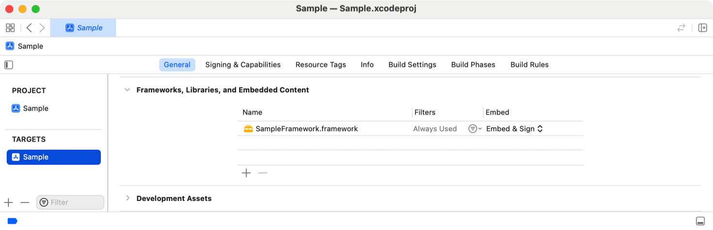

> 导航：[技术](../technologies.md) · [Xcode](../xcode.md) · [Bundle 与框架](bundles-and-frameworks.md)

# 创建静态框架

<sub>文章</sub>

配置你的项目以构建新的静态框架。

## 概述

在 Xcode 15 或更高版本中，你可以使用静态框架将资源与静态库捆绑在一起。静态框架是一种框架 bundle，其主要二进制文件是静态归档。当客户端链接并嵌入该框架时，Xcode 15 或更高版本会从嵌入的框架 bundle 中省略主二进制文件，因为它已静态链接到客户端。要在 Xcode 中创建静态框架，请创建一个新的框架 target，将新 target 配置为静态框架 target，然后将所有源文件和资源添加到新框架 target。为你支持的每个平台构建、分析并测试你的静态框架。

要分发你的静态框架，请在 Xcode 中为其 target 配置分发设置，然后为你支持的每个平台创建框架的归档。将所有变体打包成一个可签名的 XCFramework bundle。有关配置和归档静态框架以进行分发以及创建 XCFramework bundle 的更多信息，请参阅[创建多平台二进制框架 bundle](creating-a-multi-platform-binary-framework-bundle.md)。Xcode 会验证你的静态框架的代码签名是否被篡改或失效。有关验证 XCFramework 的更多信息，请参阅[验证 XCFramework 的来源](verifying-the-origin-of-your-xcframeworks.md)。

### 向项目添加新的框架 target

你可以将新的框架 target 添加到现有的 Xcode 项目。创建一个支持单个平台或多个平台的框架。

要添加新的框架 target：

1. 选取“文件” \> “新建” \> “Target”。
2. 在出现的表单（sheet）中，选取你希望支持的平台。要创建支持单个平台的框架，请在表单中选取该平台。要创建支持多个平台的框架，请在表单中选取“多平台”。
3. 向下滚动到“框架与库”部分。
4. 选择“Framework”模板。
5. 点按“下一步”。
6. 指定框架的名称，并配置语言及其他选项。
7. 点按“完成”。



当你从模板创建新的框架 target 时，Xcode 会添加一个默认构建动态框架的 target。它还会向该 target 添加一个伞状头文件。该头文件的名称由你的框架名称后跟一个句点（`.`）和字母 `_h` 生成。例如，如果你将框架命名为 SampleFramework，Xcode 会自动向 target 添加一个名为 `SampleFramework.h` 的头文件。

### 将新的框架 target 从动态转换为静态

将新的框架 target 添加到 Xcode 项目后，将其 Mach-O 类型构建设置设置为“静态库”，以将其从动态转换为静态。有关 Mach-O 类型构建设置的更多信息，请参阅[构建设置参考](build-settings-reference.md)。

要编辑 Mach-O 类型构建设置：

1. 在项目编辑器中，选择新的框架 target，然后点按“构建设置”。
2. 在搜索栏中输入“Mach-O Type”以找到 Mach-O 类型构建设置。
3. 从设置值列表中选择“静态库”。



### 向框架 target 添加源文件

有了静态框架 target 后，向该 target 添加新的或现有的源文件（例如 Swift 文件）。添加后，检查这些文件是否出现在静态框架 target 的“编译源文件”构建阶段中。有关向 target 添加新文件或现有文件的更多信息，请参阅[管理 Xcode 项目中的文件和文件夹](managing-files-and-folders-in-your-xcode-project.md)。



### 向框架 target 添加资源

你可以将资源（如资源目录、故事板、图像文件和 privacy manifest）添加到静态框架。资源文件会出现在静态框架 target 的“拷贝 Bundle 资源”构建阶段中。下图显示了一个静态框架的“拷贝 Bundle 资源”构建阶段，该框架包含一个 privacy manifest 文件：



要了解如何在 Xcode 中为你的静态框架添加 privacy manifest，请参阅[Privacy manifest files](../bundleresources/privacy-manifest-files.md)。

### 向框架 target 添加公共和私有头文件

如果你的静态框架 target 包含你希望提供给外部客户端的公共或私有头文件，请向你的 target 添加一个“头文件”构建阶段，然后将这些文件拖入“头文件”。有关向 target 添加公共和私有头文件的更多信息，请参阅[自定义 target 的构建阶段](customizing-the-build-phases-of-a-target.md)。

此外，请将你的公共头文件添加到框架的伞状头文件中。

### 构建、分析和测试框架

为你支持的每个平台构建、分析和测试静态框架。以下示例显示了在为 iOS 构建后 `SampleFramework` 的 bundle 结构：

**图像**



**Bundle 结构**

```shell
SampleFramework.framework/
    _CodeSignature/
        ...
    Headers/
        ...
    Modules/
        ...
    Info.plist 
    SampleFramework
    PrivacyInfo.xcprivacy
    ...
```

要测试你的静态框架，请创建框架的发布构建，然后将其嵌入到使用它的 App 中。有关创建静态框架发布构建的更多信息，请参阅[测试发布构建](testing-a-release-build.md)。构建并运行测试 App。

### 将框架嵌入到 App 中

要将静态框架嵌入到 App 中：

1. 在项目编辑器中，选择 App target，然后点按“通用”。
2. 展开“框架、库和嵌入内容”部分。
3. 点按添加按钮（+），选择“添加其他”，然后选取“添加文件”以找到你的静态框架。
4. 点按“打开”。
5. 从该静态框架的“嵌入”值列表中选择“嵌入并签名”选项。



## 另请参阅

### 框架

- [创建多平台二进制框架 bundle](creating-a-multi-platform-binary-framework-bundle.md) — 将二进制框架或库的变体组合成一个支持多个平台的 XCFramework bundle。
- [识别并解决框架模块问题](identifying-and-addressing-framework-module-issues.md) — 使用模块验证器检测并修复框架模块中常见的错误。
