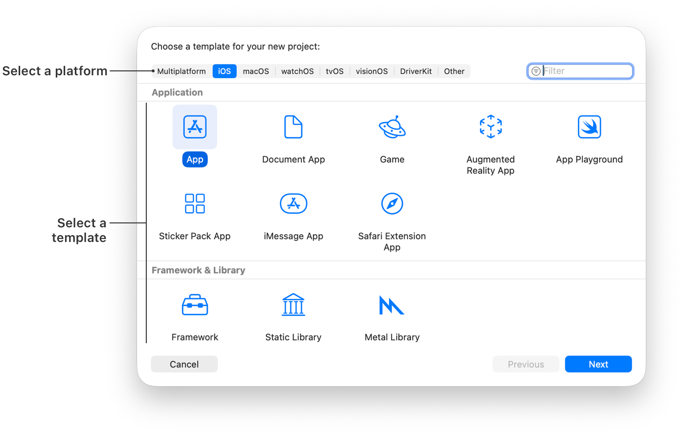
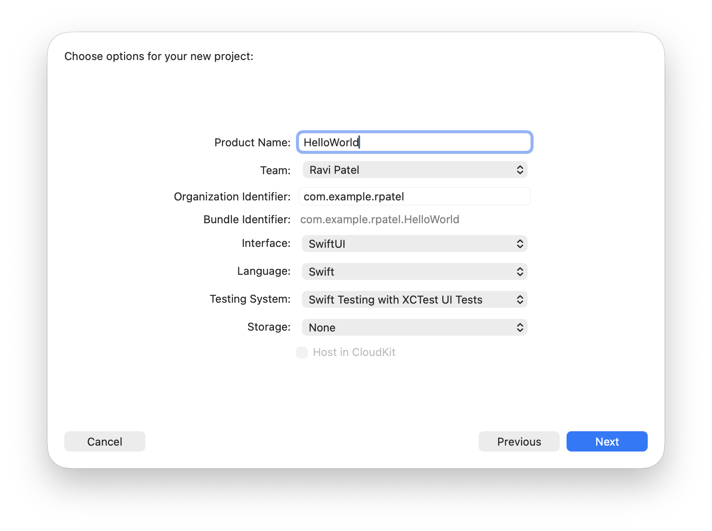
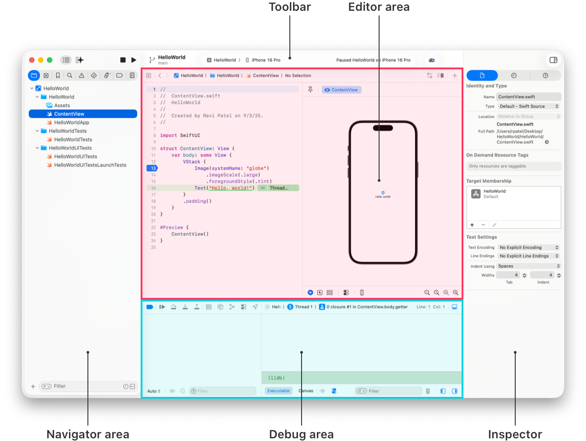
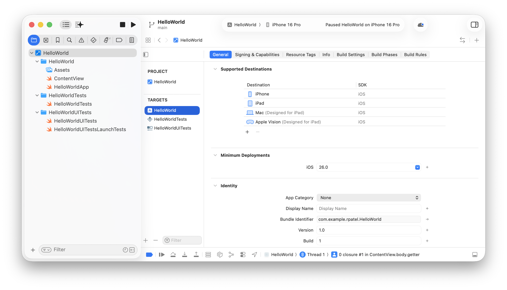

> 导航：[技术](../technologies.md) · [Xcode](../xcode.md)

# 为 App 创建 Xcode 项目

文章

通过从模板创建 Xcode 项目来开始开发你的 App。

## 概述

为了快速开始编写代码，可以从一个包含目标平台和 App 类型所需的基本项目配置与文件的模板来创建 Xcode 项目。例如，你可以选择一个模板及相关选项，用于开发多平台 SwiftUI App、macOS 命令行工具、iOS 增强现实 App，或 visionOS 沉浸式环境 App。

### 准备配置信息

在创建项目之前，请收集 Xcode 用于标识你的 App 和你（作为开发者）所需的信息：

- **产品名称（Product Name）。** App 的名称，你希望它在 App Store 中以及在用户安装后设备上显示的名称。选择一个长度不少于 2 个字符且不超过 30 个字符的产品名称，并且与你稍后在 App Store Connect 中输入的 App 名称相似。更多信息，请参见 App Store Connect 帮助中的 [App 信息](https://developer.apple.com/help/app-store-connect/reference/app-information)。
- **团队（Team）。** 作为开发者使用的 Apple 账户的电子邮件或电话号码（如果你尚未将其添加到 Xcode > 设置 > Apple 账户中）。
- **组织标识符（Organization Identifier）。** 一个反向 DNS 字符串，用于唯一标识你的组织。如果你没有公司标识符，请使用 `com.example.` 后跟你的组织名称，并在分发 App 前替换它。

> [!important] 重要
> 组织标识符默认是捆绑标识符（bundle identifier）（[CFBundleIdentifier](../bundleresources/information-property-list/cfbundleidentifier.md)）的一部分。当你首次在设备上运行 App 时，Xcode 会使用捆绑标识符来注册一个 App ID。如果你不是 Apple Developer Program 的成员，App ID 的数量是有限的，并且在将构建版本上传到 App Store Connect 后无法更改 App ID，因此请谨慎选择组织标识符。

### 创建项目

启动 Xcode，然后在 Xcode 窗口中点按“创建新项目”（Create New Project），或选取“文件”（File）>“新建”（New）>“项目”（Project）。在出现的表单（sheet）中，为要在所有平台上运行的 App 选择特定平台或“多平台”（Multiplatform）。然后根据你选择的平台，在“Application”下选择一个模板。

展示新项目模板选项的 Xcode 窗口屏幕截图。顶部是可供选择的平台列表，包括多平台、iOS 和 macOS。窗口下半部分显示了 App 类型的选项，例如游戏和增强现实 App。

如果你看到横幅提示你缺少对某个平台的支持，你可以创建项目，但无法在设备上构建并运行它。要立即安装该平台，请点按横幅右侧的“获取”（Get）按钮。或者，你可以稍后在“组件”（Components）设置中管理下载内容（请参阅[下载并安装额外的 Xcode 组件](downloading-and-installing-additional-xcode-components.md)）。

在随后的表单（sheet）中，输入**产品名称**和**组织标识符**，Xcode 会使用它们来创建捆绑标识符，该标识符会在整个系统中标识你的 App。你还可以从“团队”（Team）弹出菜单中选择一个账户（可选），Xcode 会用它来对你的 App 进行代码签名。

屏幕截图，展示新项目选项，输入产品名称和组织标识符，并根据模板选择团队及其他选项。

在随后出现的表单（sheet）中，根据你所选模板从弹出菜单中选择其他选项，例如测试系统、存储、界面和语言。在最后一个表单中，为你的项目选择一个位置，选择其他选项，然后点按“创建”（Create）。

### 在主窗口中管理文件

创建项目或打开现有项目时，**主窗口**会出现，显示开发 App 所需的文件和资源。

你可以从左侧的**导航器（Navigator）区域**访问项目的不同部分。使用**项目导航器（Project Navigator）**选择要在**编辑器（Editor）区域**中编辑的文件。例如，在项目导航器中选择一个 Swift 文件时，该文件会在**源代码编辑器（Source Editor）**中打开，你可以在其中修改代码并设置断点。

屏幕截图，展示主窗口各区域的位置：顶部的工具栏、最左侧的导航器区域、中间的编辑器区域、右侧的画布区域、下方的调试区域以及最右侧的检查器区域。

所选文件的详细信息也会出现在右侧的**检查器（Inspector）区域**。在检查器区域中，你可以选择“文件检查器”（File Inspector）来编辑文件的属性。如果你想隐藏检查器以为编辑器腾出更多空间，请点按工具栏右上角的“隐藏或显示检查器”（Hide or show the Inspectors）按钮。

你可以使用**工具栏**在模拟器或真实设备上构建并运行你的 App。对于 iOS App，从工具栏的运行目标菜单中选取 App 目标以及一个模拟器或连接的设备，然后点按“运行”（Run）按钮。对于 macOS App，只需点按“运行”按钮。

当你的 App 启动时，**调试（Debug）区域**会打开，你可以在其中控制 App 的执行并检查变量。当 App 在断点处暂停时，使用调试区域中的控件单步执行代码或继续执行。当你结束运行 App 时，点按工具栏中的“停止”（Stop）按钮。

如果你使用 SwiftUI，在创建 App 时可以查看用户界面的交互式预览。Xcode 会将你在源文件、右侧画布和检查器中所做的更改保持同步。你还可以使用预览中的控件配合调试器运行 App。更多信息，请参阅[使用 SwiftUI 创建 App 的界面](creating-your-app-s-interface-with-swiftui.md)。

要更改创建项目时输入的属性，请在项目导航器中点按顶部的项目名称，此时**项目编辑器**会在编辑器区域中打开。你输入的大部分属性会出现在项目编辑器的**通用（General）**面板上。

> [!note] 注意
> 大多数模板预配置了一个用于 App 图标的素材目录（Asset Catalog），但你也可以使用支持 [Liquid Glass](../technologyoverviews/liquid-glass.md) 的多层 Icon Composer 文件作为替代。更多信息，请参阅[使用 Icon Composer 创建 App 图标](creating-your-app-icon-using-icon-composer.md)。

## 另请参阅

### 基础

- [使用 SwiftUI 创建 App 的界面](creating-your-app-s-interface-with-swiftui.md) — 在 SwiftUI 中开发 App，借助交互式预览保持代码与布局同步。
- [在 Xcode 中预览 App 界面](previewing-your-apps-interface-in-xcode.md) — 快速迭代设计，并在不同 Apple 设备上预览 App 的显示效果。
- [构建并运行 App](building-and-running-an-app.md) — 编译源文件并组装 App 捆绑包，以便在设备或模拟器上运行。
- [Xcode 更新](../updates/xcode.md) — 了解 Xcode 的重要变更。
