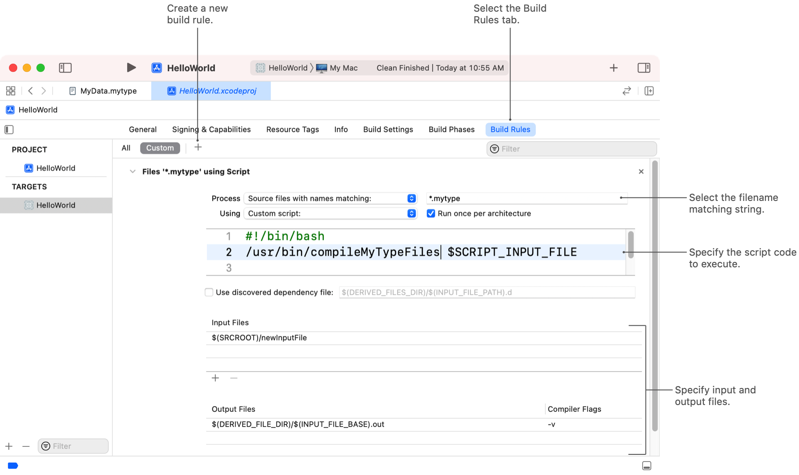

> 导航：[技术](../technologies.md) · [Xcode](../xcode.md) · [构建系统](build-system.md)

# 为自定义文件类型创建构建规则

文章

告诉 Xcode 如何构建项目中的自定义文件类型，并提供依赖信息以优化每个文件的构建流程。

## 概述

项目中的代码和资源文件通常采用可编辑的格式，而运行中的 App 无法直接使用这些格式。在构建过程中，Xcode 会将你一直在编辑的文件转换为合适的运行时格式。例如，它将你的代码文件编译为特定设备的机器指令。每次转换都需要特定的工具，Xcode 会使用你项目的构建规则或内建构建规则来为每种文件类型选择合适的工具。

构建规则（build rule）将特定文件类型映射到 Xcode 生成该文件所需输出所使用的工具。例如，有一条构建规则使用 Swift 编译器将 `.swift` 文件编译为可执行代码。Xcode 包含许多文件类型的内建规则，包括代码文件和资源文件。你可以创建额外的规则来将其他文件类型转换为适当的最终形式，或覆盖内建规则以使用不同的工具。

> [!note] 注意
> 构建规则是处理彼此独立的文件的首选方式。构建系统使用单独的任务来处理每个文件，这样可以实现更高的并行度。如果你希望构建系统在单个操作中作为一个组来处理你的文件，则应创建自定义的“运行脚本”构建阶段（Run Script build phase），具体做法在[在构建过程中运行自定义脚本](running-custom-scripts-during-a-build.md)中进行了描述。

### 为自定义文件类型添加新的构建规则

如果你的项目中包含 Xcode 内建构建规则未涵盖的文件类型，你可以添加新的构建规则来处理这些类型。要创建新的构建规则：

1. 在项目编辑器中，选择包含你的自定义文件的目标。
2. 点击“构建规则”（Build Rules）标签页。
3. 点击添加按钮（+）以创建新规则。
4. 在“处理”（Process）字段中，指定一个文件名匹配字符串。
5. 在脚本文本字段中，指定你的自定义脚本代码。

构建规则可以使用自定义的 shell 脚本或现有工具来处理文件。如果你使用现有工具来处理自定义文件类型，则从构建规则的“使用”（Using）字段中选择该工具。例如，如果你的输入文件包含内建编译器可以处理的源代码，请从列表中选择该编译器。

### 指定源文件的匹配条件

要匹配自定义文件类型，请在“处理”字段中选择“名称匹配的源文件”（Source files with names matching）选项，并指定自定义模式字符串。指定的模式字符串应遵循标准 C 库中 `fnmatch` 函数的相同规则。例如，要匹配所有名为 `myfile.c` 和 `myfile.h` 的文件，请指定字符串 `*/myfile.c */myfile.h`。在构建过程中，Xcode 会将每个项目文件的完整路径与指定模式进行比较。当匹配发生时，系统会执行你的自定义脚本代码。

> [!important] 重要
> 避免选择与其他文件类型所使用的扩展名重叠的文件名扩展名。Xcode 会选择匹配给定文件的第一个规则，因此任何重叠都可能导致 Xcode 运行错误的工具。

有关使用 `fnmatch` 函数进行模式匹配的信息，请参阅该函数的 man 手册页。

### 指定 shell 脚本的输入文件和输出文件

当 Xcode 检测到你的某个自定义文件类型时，它会执行与匹配的构建规则相关联的 shell 脚本。在你的脚本中，从 `SCRIPT_INPUT_FILE` 环境变量中获取源文件的路径，并开始处理该文件。如果你的脚本需要额外的输入数据，例如构建配置文件，请在构建规则的“输入文件”（Input Files）部分指定这些文件，并使用环境变量来访问它们。

你的脚本代码接收输入源文件并生成适当的输出文件。例如，一个编译源代码的脚本可能会生成一个包含机器指令的目标文件。你在构建规则的“输出文件”（Output Files）部分为脚本指定输出文件。大多数脚本只生成一个输出文件，但你可以酌情指定多个文件。Xcode 根据你声明的输出文件来确定何时需要重建你的源文件。当源文件比输出文件更新时，Xcode 会重建它。如果你没有指定任何输出文件，Xcode 每次都会构建你的源文件，无论源文件是否更改。

当你在构建规则中指定输入文件和输出文件时，请使用以下变量来组成路径和文件名信息。例如，你可以使用 `$(DERIVED_FILE_DIR)/$(INPUT_FILE_BASE).compiledData` 来指定一个基于原始源文件名称的输出文件。

| 变量 | 描述 |
|---|---|
| `PROJECT_DIR` | 项目源文件的根目录。 |
| `DERIVED_FILE_DIR` | 用于放置生成的输出文件的目录。构建系统管理此目录，并可以在需要时清理它。 |
| `INPUT_FILE_BASE` | 脚本输入文件的基本名称。例如，如果输入文件的路径是 `$PROJECT_DIR/Images/Default.png`，则该变量包含值 `Default`。 |
| `INPUT_FILE_NAME` | 输入文件的名称，包括文件名扩展名。例如，如果输入文件的路径是 `$PROJECT_DIR/Images/Default.png`，则该变量包含值 `Default.png`。 |
| `INPUT_FILE_DIR` | 包含输入文件的目录。例如，如果输入文件的路径是 `$PROJECT_DIR/Images/Default.png`，则该变量指向项目中的 `Images` 目录。 |
| `INPUT_FILE_PATH` | 输入文件的完整路径。 |

> [!important] 重要
> 将脚本的输出文件放置在 `DERIVED_FILE_DIR` 变量所表示的目录中。如果你将它们放在其他位置，你的版本控制系统可能无法找到它们，或者 Xcode 可能无法在清理构建操作期间删除它们。

### 从环境变量访问脚本相关文件

Shell 脚本可以访问当前目标的构建设置以及与构建规则关联的输入和输出文件。在执行构建规则的脚本之前，Xcode 会使用多个环境变量配置 shell 环境。要访问构建规则的输入和输出文件，请使用下表中的环境变量。

| 变量 | 描述 |
|---|---|
| `SCRIPT_INPUT_FILE` | 要处理的文件的绝对路径。 |
| `OTHER_INPUT_FILE_FLAGS` | 你在“编译源文件”（Compile Sources）构建阶段中分配给该文件的额外命令行标志。 |
| `SCRIPT_INPUT_FILE_COUNT` | 构建规则中“输入文件”部分包含的路径数量。 |
| `SCRIPT_INPUT_FILE_`_n_ | 构建规则中“输入文件”部分某个文件的绝对路径。Xcode 会为每个文件创建一个环境变量，从 `SCRIPT_INPUT_FILE_0` 开始，并依次为列表中的后续文件递增数字值。 |
| `SCRIPT_OUTPUT_FILE_COUNT` | 构建规则中“输出文件”部分包含的路径数量。 |
| `SCRIPT_OUTPUT_FILE_`_n_ | 构建规则中“输出文件”部分某个文件的绝对路径。Xcode 会为每个文件创建一个环境变量，从 `SCRIPT_OUTPUT_FILE_0` 开始，并依次为列表中的后续文件递增数字值。 |
| `SCRIPT_HEADER_VISIBILITY` | 一个表示头文件可见性的字符串。如果当前文件位于目标“头文件”（Headers）构建阶段的公共或私有部分，则该字符串包含值 `public` 或 `private` 来表示其位置。 |
| `HEADER_OUTPUT_DIR` | 用于复制头文件的目录。如果当前文件位于“头文件”构建阶段，请将该文件复制到此环境变量中的位置。 |

> [!important] 重要
> 在你的 shell 脚本中，在将环境变量作为参数传递给其他脚本或工具之前，请将它们放在引号中。当变量包含空格或特殊字符时，引号可以防止解析错误。

有关构建设置环境变量的列表，请参阅[构建设置参考](build-settings-reference.md)。

### 为源文件指定额外的构建依赖

为了提高增量构建（incremental builds）的性能，Xcode 只重建那些需要重建的文件。要确定某个文件是否需要重建，Xcode 会评估以下条件：

- 源文件的内容是否已更改？
- 源文件是否依赖于其他任何已更改的文件？

Xcode 通过比较源文件的修改日期与其输出文件的修改日期来确定源文件是否已更改。如果源文件较新，或者输出文件不存在，Xcode 会构建该源文件。

分析源文件之间的依赖关系更为复杂，但对于确保构建的正确性非常重要。如果源文件导入了头文件或其他文件，则构建该源文件的工具会向 Xcode 报告这种关系。对于你的自定义文件类型，你需要通过生成一组供 Xcode 执行的 makefile 规则来报告依赖关系。

要为你的自定义源文件报告依赖规则，请在你的构建规则中启用“使用已发现的依赖文件”（Use discovered dependency file）选项。Xcode 会为你的依赖文件建议一个默认的命名模式，但你可以更改名称以匹配你的工具输出。在你的脚本代码中，在每个构建周期内创建依赖文件，并使用适当的名称保存该文件。

在构建自定义文件时，在你的脚本代码中创建实际的文件。用一组 makefile 规则填充每个依赖文件的内容。Xcode 构建系统会在构建时分析这些规则，以确定是否需要重建匹配的源文件。

## 另请参阅

### 构建自定义

- [自定义项目的构建方案](customizing-the-build-schemes-for-a-project.md) — 指定要构建的目标，并自定义 Xcode 用于构建、运行、测试和分析这些目标的设置。
- [自定义目标的构建阶段](customizing-the-build-phases-of-a-target.md) — 指定在构建过程中要执行的任务，包括要编译的源文件、要运行的脚本以及要包含在最终产品中的资源。
- [在构建过程中运行自定义脚本](running-custom-scripts-during-a-build.md) — 在构建过程中执行自定义的 shell 脚本，并运行项目所需的工具或其他命令。
- [在特定平台或操作系统版本上运行代码](running-code-on-a-specific-version.md) — 在需要特定设备系列或最低操作系统版本才能运行的代码周围添加条件编译标记。
