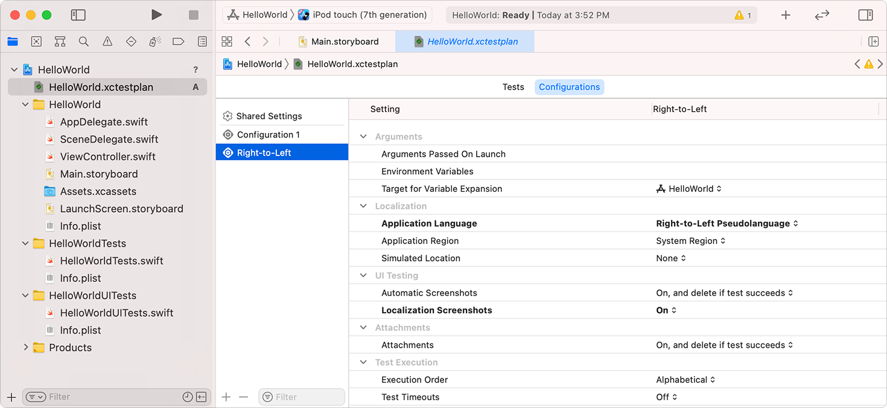

> 导航：[技术](../technologies.md) · [Xcode](../xcode.md) · [本地化](localization.md)

# 为本地化人员创建你的 App 的屏幕快照

文章

与本地化人员分享你的 App 的屏幕快照，为翻译提供上下文。

## 概述

在运行你的本地化的 UI 测试时，你可以生成屏幕快照，放进交给本地化人员的导出本地化文件夹中。这些屏幕快照为界面中的可本地化字符串和资源提供了上下文。你可以从项目的测试计划或 Test scheme 生成屏幕快照。

要将屏幕快照收录进 Xcode 本地化目录（一个以 `.xcloc` 为扩展名的文件夹），请参阅[导出本地化](exporting-localizations.md)。

### 创建测试计划

如果你的项目添加了许多本地化，测试计划是生成屏幕快照的理想选择，因为你可以为每种本地化创建一个配置。测试计划（一个以 `.xctestplan` 为扩展名的文件）指定要运行哪些测试，以及如何将它们运行一次或多次。

你可以使用现有的测试计划，也可以新建一个。要添加测试计划，请在 Xcode 中选取 Product \> Test Plan \> New Test Plan。输入测试计划的名称，然后点按 Create。

如果你想把项目从使用 scheme 转换为使用测试计划，选取 Product \> Scheme \> Convert Scheme to use Test Plans，选择“Create Test Plan from scheme”，然后点按 Convert。在下一个对话框中，你可以更改测试计划的名称，然后点按 Save。测试计划会出现在编辑器区域中。

### 添加本地化配置

在测试计划中为每种本地化添加一个配置。在项目导航器中选择测试计划，然后点按 Configurations。在左侧，点按底部的添加按钮 (+)。选中出现的新配置，并输入该本地化的名称。

编辑本地化测试的配置文件。在 Localization 下，将 Application Language 和 Application Region 设置设为相应本地化对应的语言和地区。在 UI Testing 下，把 Localization Screenshots 从 Off 切换到 On。

项目编辑器的屏幕快照：导航器中选中了一个测试计划，详情区域选中了名为 Right-to-Left 的配置，显示 Application Language 与 Application Region 在 Localization 下方的位置。

### 运行测试以生成屏幕快照

下次运行测试（选取 Product \> Test）时，Xcode 会把每种本地化的屏幕快照保存到磁盘。在测试导航器中，每张屏幕快照旁边都有一个属性列表（Localizable Strings Info），把字符串映射到它在屏幕快照中出现的边框位置。属性列表包含字符串 ID（会出现在导出的 XLIFF 文件中）和边框位置。

### 使用 scheme 生成屏幕快照

或者，如果你不使用测试计划，也可以对 Test scheme 做类似的修改来生成屏幕快照。在 Xcode 中选取 Product \> Scheme \> Edit Scheme，点按 Test scheme，然后点按 Options。从弹出菜单中选择语言和地区，然后勾选“Gather screenshots for localization”。

## 另请参阅

### 翻译与改编

- [导出本地化](exporting-localizations.md) — 把项目中的可本地化文件提供给本地化人员。
- [编辑 XLIFF 和字符串目录文件](editing-xliff-and-string-catalog-files.md) — 为你从项目导出的语言和地区翻译或改编可本地化文件。
- [导入本地化内容](importing-localizations.md) — 把你为某个语言和地区翻译或改编的文件导入项目。
- [锁定 Storyboard 和 XIB 文件中的视图](locking-views-in-storyboard-and-xib-files.md) — 在本地化面向用户的字符串时，防止对 Interface Builder 文件的改动。
