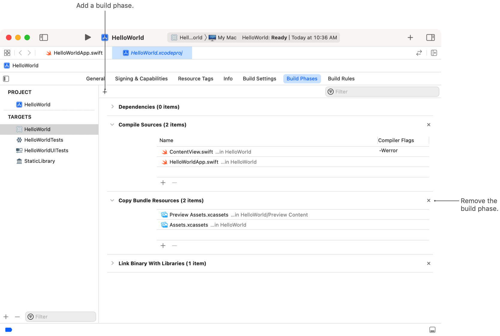
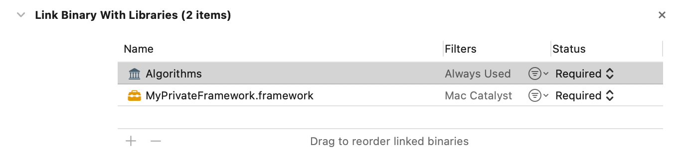
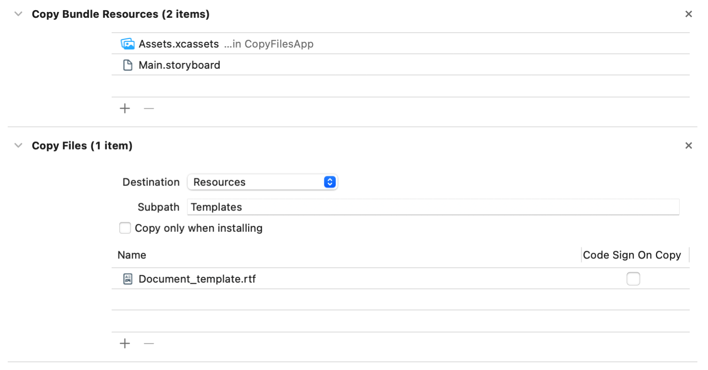

> 导航：[技术](../technologies.md) · [Xcode](../xcode.md) · [构建系统](build-system.md)

# 自定义目标的构建阶段

文章

指定在构建过程中执行的任务，包括要编译的源文件、要运行的脚本以及要包含在最终产品中的资源。

## 概述

在 Xcode 项目中构建目标时，构建系统会执行一组特定的任务来生成结果产品。在 Xcode 中，你可以使用构建阶段来指定目标的文件和脚本。然后，构建系统会使用该信息以及其他构建设置来确定构建目标所需的任务。

Xcode 会在创建时为每个目标配置初始的构建阶段，但你之后可以添加或修改这些构建阶段。你可能会添加构建阶段来将额外的文件复制到你的 App 捆绑包，或者执行自定义的 shell 脚本。你还可以检查构建阶段以诊断潜在的问题。例如，你可以确保 Xcode 正在将你的代码与你的代码所使用的第三方库进行链接。

### 查看目标并添加构建阶段

要查看目标的构建阶段，请选择该目标并导览至“构建阶段（Build Phases）”标签页，如下图所示。要添加新的构建阶段，请点击“添加（+）”按钮，然后从弹出菜单中选择合适的构建阶段。Xcode 会禁用任何无效的菜单选项。例如，如果你的目标已包含一个编译源文件的构建阶段，Xcode 会禁用“编译源文件（Compile Sources）”构建阶段。

Xcode 支持以下构建阶段：

- **依赖（Dependencies）。** 指定在构建当前目标之前，Xcode 必须先构建的其他目标（位于同一项目中或引用的项目中）。目标的顺序指示 Xcode 开始构建它们的顺序。在可能的情况下，Xcode 会并行构建多个依赖目标。有关如何配置依赖的信息，请参阅[在项目中配置新目标](configuring-a-new-target-in-your-project.md)。
- **编译源文件（Compile Sources）。** 包含要编译的源文件列表。此构建阶段通常包含 Swift 和 Objective-C 文件，但也可以包含任何其他可编译的源文件。你可以为每个源文件指定不同的编译器标志。一个目标只能包含一个此类型的构建阶段。你不能将此类构建阶段包含在聚合目标（Aggregate）和外部构建工具目标（External Build Tool Target）中。
- **将二进制文件与库链接（Link Binary with Libraries）。** 将你编译后的源文件与其他框架和库进行链接。通过此构建阶段，Xcode 会将你的代码与 Apple 框架、平台库以及你明确列出的任何其他框架和库进行链接。一个目标只能包含一个此类型的构建阶段。你不能将此类构建阶段包含在聚合目标和外部构建工具目标中。有关更多信息，请参阅[链接额外的框架和库](#Link-against-additional-frameworks-and-libraries)。
- **复制捆绑包资源（Copy Bundle Resources）。** 将文件复制到指定用于资源的捆绑包目录。在 macOS 上，指定的资源目录是 `Contents\Resources` 目录。在 iOS 上，捆绑包将全局资源存储在捆绑包的 `Contents` 目录中。作为复制操作的一部分，构建系统可以先处理文件，然后将结果复制到捆绑包中。一个目标只能包含一个此类型的构建阶段，并且该目标必须有一个捆绑包目录。有关更多信息，请参阅[将文件复制到成品](#Copy-files-to-the-finished-product)。
- **头文件（Headers）。** 将公共、私有或项目头文件与目标关联。公共和私有头文件定义了目标对外部客户端公开的 API。Xcode 会将这些头文件复制到构建产品中的 `Headers` 和 `PrivateHeaders` 子文件夹中。项目头文件包含目标使用的 API，但 Xcode 不会向外部客户端公开这些 API。一个目标只能包含一个此类型的构建阶段。有关更多信息，请参阅[为目标添加公共和私有头文件](#Add-public-and-private-headers-to-a-target)。
- **复制文件（Copy Files）。** 将文件和其他构建产品复制到指定的目标位置。构建系统通常不会处理你使用此构建阶段指定的文件，但你可以通过启用 `APPLY_RULES_IN_COPY_FILES` 构建设置来更改此行为。在复制其他产品时，此构建阶段会在必要时对这些产品进行签名。一个目标可以包含多个此类构建阶段。有关更多信息，请参阅[将文件复制到成品](#Copy-files-to-the-finished-product)。
- **运行脚本（Run Script）。** 运行自定义的 shell 脚本，你可以使用它在构建过程中的特定点执行自定义工具和逻辑。一个目标可以包含多个此类构建阶段。有关创建和管理构建脚本的更多信息，请参阅[在构建过程中运行自定义脚本](running-custom-scripts-during-a-build.md)。

> [!note] 注意
> 对于某些操作，Xcode 会自定义现有构建阶段的名称以反映相应的操作。例如，当你在 App 中嵌入一个框架时，Xcode 会配置一个标题为“嵌入框架（Embed Frameworks）”的复制文件构建阶段。

添加构建阶段后，请配置其内容。对于大多数构建阶段，你需要添加一个或多个与相关任务关联的文件。在某些情况下，你还可以配置其他设置。例如，在编译源文件构建阶段，你可以为单个文件添加编译器标志。

Xcode 最初会将新的构建阶段添加到列表末尾。你可以在编辑器中通过拖拽来重新排列构建阶段，但 Xcode 仍然会按照依赖顺序执行任务。要从目标中移除构建阶段，请点击该构建阶段旁边的关闭按钮 (x)。

### 链接额外的框架和库

大多数目标都包含一个“将二进制文件与库链接”的构建阶段，该阶段会解析你的代码中对框架、库、外部 XCFramework 以及 Swift 包中的库产品的引用。如果你的项目依赖自定义库，请将它们添加到此构建阶段并指定链接类型。对于每个库，你可以指定以下详细信息。

- 对于多平台目标，请使用“过滤器（Filters）”控件来指定要支持的平台。
- 指定库是必需的还是可选的（optional）。此选项反映了某些框架的旧版链接选项。在现代项目中，请不要更改此设置。

Xcode 会自动将你的 Swift 代码与 Apple 框架和库进行链接，因此你无需将它们包含在此构建阶段中。对于 C、C++ 和 Objective-C 代码，只有当 `CLANG_MODULES_AUTOLINK` 构建设置（默认已启用）启用时，Xcode 才会与 Apple 框架和库进行链接。请将来自你自己项目的任何第三方库或自定义库添加到此构建阶段。

### 为目标添加公共和私有头文件

框架和库通常会公开 API 供外部客户端调用，其他目标也可以公开 API。如果你的目标向外部客户端公开了任何 API，请使用“头文件”构建阶段将相应的头文件添加到构建产品中。客户端会使用你的头文件来了解并调用可用的 API。

在“头文件”构建阶段中，将文件拖拽到以下三个部分之一：

- 将包含公开支持符号的文件拖拽到“公开（Public）”部分。公共头文件代表了你的代码与任何访问它的客户端之间的公共约定。Xcode 会将这些文件放入捆绑包内的 `Headers` 目录中。
- 将包含私有符号的文件拖拽到“私有（Private）”部分。私有头文件包含你提供给客户端的额外接口，但这些接口不一定属于你的代码与客户端之间的公共约定的一部分。Xcode 会将这些文件放入捆绑包内的 `PrivateHeaders` 目录中。
- 将包含内部项目接口的文件拖拽到“项目（Project）”部分。Xcode 不会将这些文件复制到构建产品中。

当 Xcode 将文件复制到构建产品时，“头文件”构建阶段通常不会修改文件。但是，如果你启用了 `COPY_HEADERS_RUN_UNIFDEF` 构建设置，Xcode 会对你头文件运行 `unifdef` 工具以移除预处理器的条件代码。

### 将文件复制到成品

要将自定义资源或数据文件复制到捆绑包中，请为你的目标添加一个“复制文件”或“复制捆绑包资源”构建阶段。Xcode 使用“复制捆绑包资源”构建阶段来将 storyboard 和 asset catalog 复制到资源对应的目录（因平台而异）。Xcode 还使用“复制文件”构建阶段的实例来将框架、App 扩展（App Extension）、轻 App（App Clip）和其他内容嵌入到你的捆绑包中。你可以使用这些构建阶段将其他项目文件复制到捆绑包中。例如，你可能会将新文稿（document）的模板复制到你的 App 捆绑包中。

“复制捆绑包资源”构建阶段会将文件放置在捆绑包指定的资源目录中。“复制文件”构建阶段支持以下目标目录：

- 产品目录（Products Directory）：将项目放置在构建产品所在的同一目录中。
- 包装器（Wrapper）：将项目放置在捆绑包目录的根目录。
- 可执行文件（Executables）：将项目放置在捆绑包主二进制文件所在的同一目录。
- 资源（Resources）：将项目放置在特定于平台的资源目录中。
-  Java 资源（Java Resources）：将项目放置在 `Resources/Java` 子文件夹中。
- 框架（Frameworks）：将项目放置在 `Frameworks` 子文件夹中。
- 共享框架（Shared Frameworks）：将项目放置在 `SharedFrameworks` 子文件夹中。
- 共享支持（Shared Support）：将项目放置在 `SharedSupport` 子文件夹中。
- 插件（Plugins）：将项目放置在 `Plugins` 子文件夹中。
- XPC 服务（XPC Services）：将项目放置在 `XPCServices` 子文件夹中。
- 系统扩展（System Extensions）：将项目放置在 `Library/SystemExtensions` 子文件夹中。
- 轻 App（App Clips）：将项目放置在 `AppClips` 子文件夹中。

对于每个构建阶段，你可以提供一个子路径字符串，将文件复制到目标文件夹的特定子目录中。例如，如果你为 Mac App 选择“资源”目标文件夹，并包含子路径字符串 `Templates`，则 Xcode 会将文件复制到 App 捆绑包中的 `Resources/Templates` 子文件夹。

> [!note] 注意
> “复制文件”构建阶段支持对你放置在捆绑包中的任何资源进行签名。通常，你在将构建产品（例如 App 扩展）复制到捆绑包时使用此选项。

有关特定于平台的捆绑包目录位置的详细信息，请参阅[在捆绑包中放置内容](../bundleresources/placing-content-in-a-bundle.md)

## 另请参阅

### 构建自定义

- [自定义项目的构建方案](customizing-the-build-schemes-for-a-project.md) — 指定要构建的目标，并自定义 Xcode 用于构建、运行、测试和分析这些目标的设置。
- [为自定义文件类型创建构建规则](creating-build-rules-for-custom-file-types.md) — 告诉 Xcode 如何构建项目的自定义文件类型，并提供依赖信息以优化每个文件的构建过程。
- [在构建过程中运行自定义脚本](running-custom-scripts-during-a-build.md) — 在构建过程中执行自定义的 shell 脚本，并运行项目所需的工具或其他命令。
- [在特定平台或 OS 版本上运行代码](running-code-on-a-specific-version.md) — 在需要特定设备系列或最低操作系统版本才能运行的代码周围添加条件编译标记。
