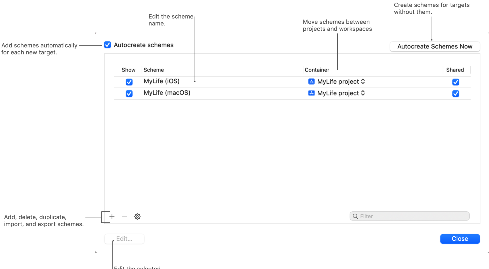
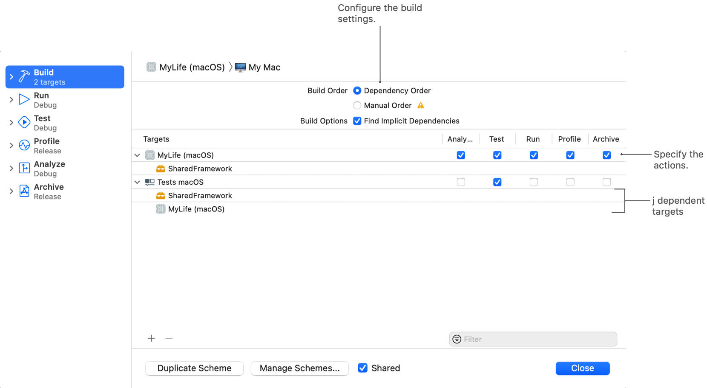
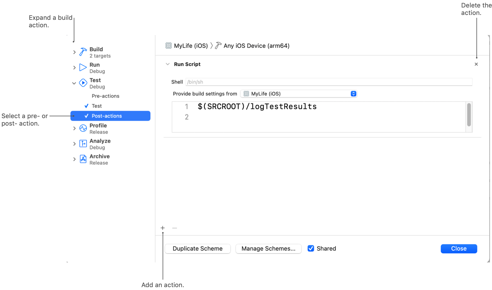

> 导航：[技术](../technologies.md) · [Xcode](../xcode.md) · [构建系统](build-system.md)

# 自定义项目的构建方案

文章

指定要构建的目标，并自定 Xcode 用于构建、运行、测试和性能分析这些目标的设置。

## 概述

当你构建、运行、测试、性能分析或归档项目的一部分时，Xcode 会使用选定的构建方案来决定要做什么。构建方案包含要构建的目标列表，以及影响所选操作的任何配置和环境详细信息。例如，当你构建并运行一个 App 时，方案告诉 Xcode 要向 App 传递哪些启动参数。Xcode 为大多数目标提供了默认方案，你可以根据需要自定这些方案或创建新方案。

要查看项目的当前方案，请点按项目窗口工具栏中的方案名称。Xcode 会显示一个弹出式菜单，顶部是当前方案的列表，底部是编辑、创建和管理方案的命令。

要查看和修改项目的当前方案，请选择“管理方案”。例如，可以禁用为新目标自动创建方案，并更改方案特性（attribute），例如方案所属的项目。默认情况下，Xcode 会与其他团队成员共享方案。

### 指定方案目标的构建选项

当你让 Xcode 构建一个方案时，Xcode 会分析你的项目并生成构建该方案目标所需的任务列表。为了加快构建速度，Xcode 会尽可能并行执行多个任务，充分利用可用的资源。为了确保产品正确构建，当任务之间存在依赖关系时，Xcode 会串行执行这些任务。例如，Xcode 会先构建一个私有框架，然后再构建链接到该框架的 App。

要查看方案的当前目标列表，请编辑方案并选择“构建”页面。使用此页面可以添加或删除目标，并配置其他构建选项。

下表列出了你可以为方案配置的构建选项。

| 构建选项 | 描述 |
|---|---|
| 依赖顺序 | 根据依赖关系并行构建目标。请选择此选项，而非“手动顺序”。 |
| 手动顺序 | 按照方案中列出的顺序串行构建目标，这无法充分利用 Mac 的多处理器。此选项已废弃，请勿使用。 |
| 查找隐式依赖 | 在构建期间收集有关额外依赖关系的信息。构建系统使用此信息来帮助安排与构建相关的任务。 |

### 指定启动参数和环境变量

如果你的产品使用命令行参数或环境变量进行自我配置，请在“运行”、“测试”或“性能分析”构建方案操作的“参数”标签页中指定这些信息。

- Xcode 在运行进程之前会配置并导出环境变量。
- Xcode 将命令行参数直接传递给已启动的进程。

### 配置构建产品的运行时环境

在“运行”、“测试”和“性能分析”构建方案操作的“信息”标签页中，包含了关于如何启动和运行产品的高阶信息。有些选项适用于所有构建操作，但有些选项特定于当前构建操作。下表列出了可用的选项。

| 操作 | 特性 | 描述 |
|---|---|---|
| 运行、测试、性能分析 | 构建配置 | 使用配置允许项目根据配置名称自定其构建设置。调试（debug）配置通常会禁用代码优化以加快构建速度，并启用调试信息的生成。发布（release）配置则会启用代码优化以获得更好的运行时性能，并禁用调试信息生成以减小 App 大小。 |
| 运行、性能分析 | 可执行文件 | 构建成功后要运行的可执行文件。对于 App，此特性包含 App 本身。对于其他产品，请指定要启动的 App。 |
| 运行、测试 | 调试可执行文件 | 一个在启动时附加调试器的选项。 |
| 运行 | Siri 意图查询 | 馈送给 Siri 以发起查询的字符串。将此字段留空可在设备上使用 Siri 界面发起查询。 |
| 运行、测试 | LLDB 初始化文件 | 要加载的 LLDB 设置文件。请指定命令别名和其他与调试器相关的设置。 |
| 运行 | 启动 | 启动行为。通常，Xcode 在成功构建后会自动启动 App，但你可以指定一个在不同的时间点启动 App。 |
| 测试 | 调试进程身份 | 用于调试的系统账户。 |
| 性能分析 | 仪器 | 要在 Instruments App 中收集的性能指标。 |

Xcode 使用“选项”标签页中的信息来配置产品的运行时环境。使用这些选项可以覆盖语言设置，或指定模拟的设备数据，例如当前位置。下表列出了可用的选项。

| 操作 | 特性 | 描述 |
|---|---|---|
| 运行 | 核心定位 | 模拟位置数据的选项。请从弹出式菜单中选择一个默认起始位置。 |
| 运行 | App 数据 | 一个包含 App 容器（container）目录初始内容的 `.xcappdata` 包。请从“设备和模拟器”窗口创建 App 数据包。在你的设备上安装 App，使其出现在该窗口中。选择 App 并使用控制项下载 App 的当前容器。根据需要修改下载的 `.xcappdata` 文件内容，并将该文件添加到你的项目中。 |
| 运行 | 路由 App 覆盖范围文件 | 一个定义 App 所覆盖地理区域的 GeoJSON 文件。 |
| 运行 | StoreKit 配置 | 一个包含你的 App 可供购买项目的 `.storekit` 数据文件。使用此文件来测试你的 App 对 StoreKit 的支持。更多信息，请参阅[在 Xcode 中设置 StoreKit 测试](setting-up-storekit-testing-in-xcode.md)。 |
| 运行 | GPU 帧捕获 | 一个捕获 App 的 Metal 使用情况诊断信息的选项。更多信息，请参阅[在 Xcode 中捕获 Metal 工作负载](capturing-a-metal-workload-in-xcode.md)。 |
| 运行 | 后台获取 | 一个模拟 App 从后台事件启动的选项。使用此选项来测试你的后台执行（background execution）工作流程。 |
| 运行 | 本地化调试 | 一个在 App 中高亮显示未本地化字符串的选项。 |
| 运行、测试 | App 语言 | 测试期间使用的语言。选择“系统语言”以使用设备的默认语言。 |
| 运行、测试 | App 地区 | 测试期间使用的区域设置。选择“系统区域”以使用设备的默认地区。 |
| 运行 | XPC 服务 | 调试 XPC 服务的选项。 |
| 运行 | 视图调试 | 一个收集 App 视图层级（view hierarchies）信息的选项。 |
| 运行 | 队列调试 | 一个记录调度队列（dispatch queues）回溯信息的选项。 |
| 运行 | Interface Builder | 一个自动连接到远程工具的选项。 |
| 测试 | UI 测试 | 作为测试产品 UI 一部分的截屏捕获选项。 |
| 测试 | 附件 | 一个在测试成功时删除附件的选项。 |
| 测试 | 代码覆盖率 | 一个为你的测试目标收集代码覆盖率指标的选项。 |
| 性能分析 | 可测试性 | 一个在性能分析测试时启用可测试性的选项。 |

### 在你的目标上运行诊断

Xcode 包含用于验证代码稳定性和消除潜在缺陷（bug）的工具。这些工具会用运行时检查来注解你的代码，以检查特定类型的操作。例如，有一个工具可以检测 App 线程（threads）之间的潜在竞态条件（race conditions）。请从构建方案的“诊断”标签页启用这些检查。

下表列出了支持的诊断选项。

| 操作 | 特性 | 描述 |
|---|---|---|
| 运行、测试 | 运行时清理 | 检测内存损坏、竞态条件以及产生未定义结果的代码的选项。更多信息，请参阅[及早诊断内存、线程和崩溃问题](diagnosing-memory-thread-and-crash-issues-early.md)。 |
| 运行、测试 | 运行时 API 检查 | 一个检测系统 API 在主线程（main thread）以外的线程上错误运行的选项。更多信息，请参阅[及早诊断内存、线程和崩溃问题](diagnosing-memory-thread-and-crash-issues-early.md)。 |
| 运行、测试 | 内存管理 | 检测缓冲区溢出和其他与内存相关错误的选项。 |
| 运行 | Metal | 验证你的 App 对 Metal API 和着色器使用情况的选项。更多信息，请参阅[Metal 开发者工作流程](metal-developer-workflows.md)。 |

为了检测与内存相关的问题，Xcode 支持以下诊断：

- Malloc Scribble 会将 `0x55` 值写入已释放内存块（memory block）的每个字节。此操作有助于你检测访问已释放块的代码。
- Malloc Guard Edges 会在较大的内存分配前后添加保护页。这些页面可以检测超出已分配内存块边界的代码写入。
- Guard Malloc 使用多种技术，在发生内存错误时使你的 App 崩溃。
- Zombie Objects 检测尝试访问已被释放的对象的代码。
- Malloc Stack Logging 会在每次内存分配时捕获函数调用栈信息。
- Memory Graph on Resource Exception 会捕获内存图谱的信息。你可以在调试器中查看这些信息。

### 在方案操作之前或之后运行任务

对于方案中的每个操作，你可以使用前置操作（pre-actions）和后置操作（post-actions），在 Xcode 执行该操作之前或之后运行脚本或发送电子邮件。例如，你可能使用一个后置操作，在每次运行代码时将测试结果记录到自定义服务器。与构建阶段不同，Xcode 只在你从“产品”菜单中选择相应命令时才执行你的操作。

要添加前置操作或后置操作：

1. 点按该操作的展开三角。
2. 选择“前置操作”或“后置操作”。
3. 点按添加按钮（+）并选择要添加的操作类型。
4. 配置操作的详细信息。

对于脚本操作，Xcode 会暴露方案中某个选定目标的构建设置。请使用环境变量来访问这些变量的值。有关可用构建设置的列表，请参阅[构建设置参考](build-settings-reference.md)。

## 另请参阅

### 自定构建

- [自定目标的构建阶段](customizing-the-build-phases-of-a-target.md) — 指定构建期间要执行的任务，包括要编译的源文件、要运行的脚本以及要包含在最终产品中的资源。
- [为自定义文件类型创建构建规则](creating-build-rules-for-custom-file-types.md) — 告诉 Xcode 如何构建项目中的自定义文件类型，并提供依赖信息以优化每个文件的构建过程。
- [在构建期间运行自定义脚本](running-custom-scripts-during-a-build.md) — 在构建过程中执行自定义的 shell 脚本，并运行项目所需的工具或其他命令。
- [在特定平台或 OS 版本上运行代码](running-code-on-a-specific-version.md) — 在需要特定设备系列或最低操作系统版本才能运行的代码周围添加条件编译标记。
