> 导航：[技术](../technologies.md) · [Xcode](../xcode.md) · [调试](debugging.md) · [Metal 调试器](metal-debugger.md)

# 调试绘制命令或计算调度中的着色器

文章

使用着色器调试器识别并修复 App 中有问题的着色器。

## 概述

如果运行 App 时发现任何视觉瑕疵，例如几何体缺失或像素无效，可以使用着色器调试器调查有问题的着色器。逐步执行着色器源代码并检查变量值，直到发现问题。然后，只需编辑着色器源码并重新加载着色器，即可验证修复结果。

> [!important] 重要
> 捕获 Metal 工作负载时请包含源代码，因为着色器调试器需要源码才能正常工作。有关更多信息，请参阅[构建嵌入着色器源码的项目](building-your-project-with-embedded-shader-sources.md)。

### 调试着色器

要开始调试着色器，请在 Debug 导览器中选择关注的绘制命令或计算调度。然后点按调试栏中的 Shader Debugger 按钮，开始调试与当前绑定管线状态关联的任意着色器。

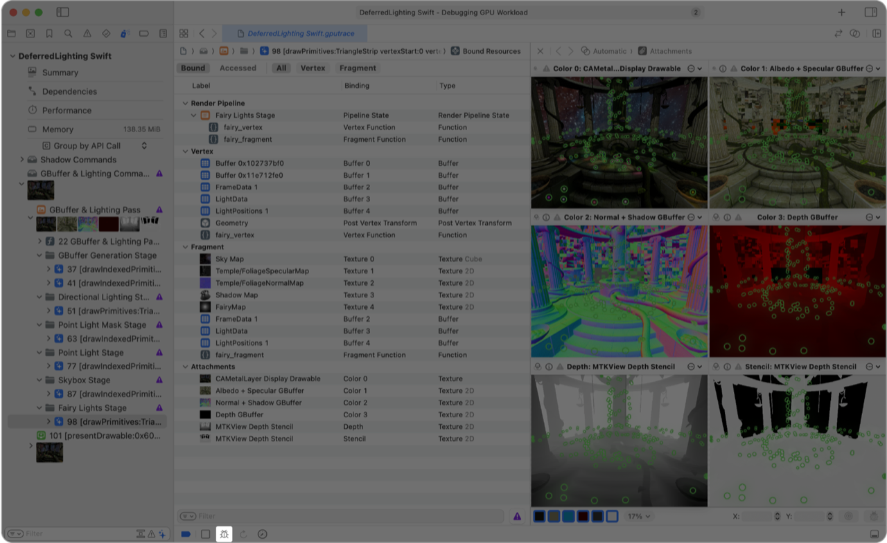

着色器调试器会打开一个对话框，其中为每种正在使用的着色器类型提供一个标签页，便于你选择着色器的感兴趣区域（region of interest）。例如，如果绘制命令包含顶点着色器和片段着色器，对话框中会包含 Vertex 和 Fragment 标签页。

Vertex 标签页会显示绘制命令的几何体。着色器调试器会自动选择第一个顶点，因此可以点按右下角的 Debug 按钮，立即开始调试顶点着色器。

有关更多信息，请参阅[检查绘制命令的几何体](inspecting-the-geometry-of-a-draw-command.md)。

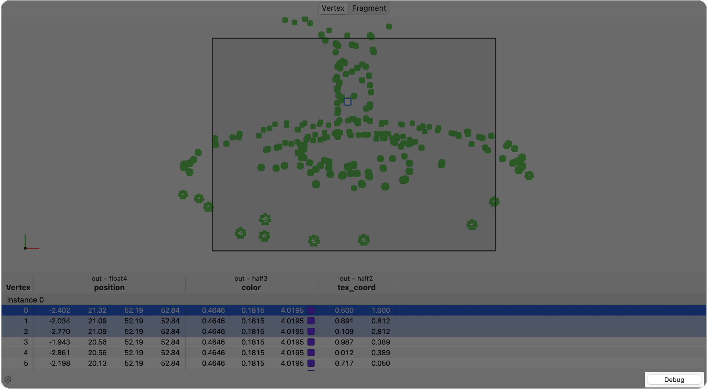

如果绘制命令使用基于网格的管线状态，对话框会包含 Mesh 和 Object 标签页，而不是 Vertex 标签页。

Mesh 和 Object 标签页会显示绘制命令的几何体。着色器调试器会自动选择第一个 mesh grid 及其中的第一个网格，因此可以点按右下角的 Debug 按钮，立即开始调试网格着色器或对象着色器。

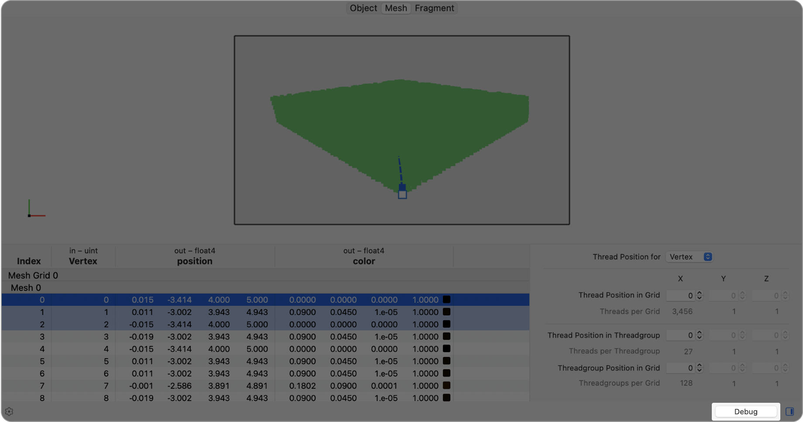

点按 Mesh 标签页并在表格或几何体视图中选择一个网格，可以在线程选择器中设置生成该网格的线程组位置。也可以选择 Thread Position for Vertex，并在表格或几何体视图中选择一个顶点，以设置生成网格中该顶点的线程位置。还可以选择 Thread Position for Primitive or Index，设置生成网格中某个图元或索引的线程位置。

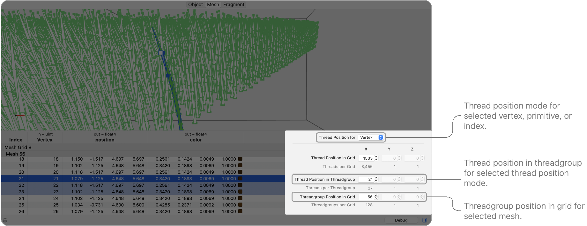

Metal 调试器中 Mesh 标签页的截图，其中突出显示了右下角的对话框，该对话框显示用户在场景中选择的特定网格的详细信息。对话框顶部的 Thread Position of 下拉式菜单设为 Vertex。对话框的详细信息包括网格中的线程位置、线程组中的线程位置，以及网格中的线程组位置等字段。

点按 Object 标签页并在表格或几何体视图中选择一个 mesh grid，可以在线程选择器中设置生成该 mesh grid 的线程组位置。

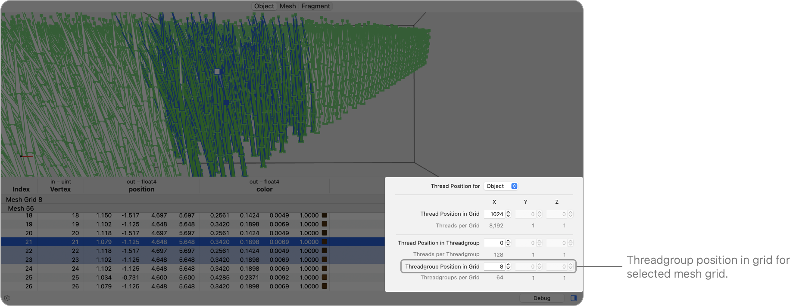

Metal 调试器中 Object 标签页的截图，其中突出显示了右下角的对话框，该对话框显示用户在场景中选择的特定 mesh grid 的详细信息。对话框的详细信息包括网格中的线程位置、线程组中的线程位置，以及网格中的线程组位置等字段。

有关更多信息，请参阅[检查绘制命令的几何体](inspecting-the-geometry-of-a-draw-command.md)。

Fragment 标签页会显示绘制命令的第一个附件，并默认隐藏其他附件。着色器调试器会自动选择可调试区域内的一个像素，因此可以点按右下角的 Debug 按钮，立即开始调试片段着色器。也可以选择其他像素、更改可见附件等。

有关更多信息，请参阅[检查绘制命令的附件](inspecting-the-attachments-of-a-draw-command.md)。

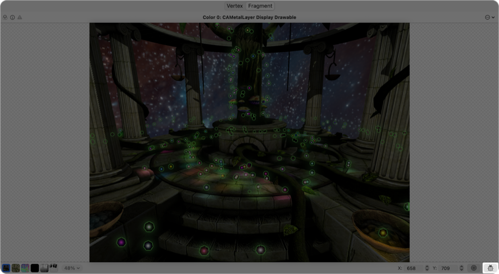

如果选择的是计算调度而非绘制命令，着色器调试器会自动选择第一个线程组，因此可以点按右下角的 Debug 按钮，立即开始调试计算着色器。

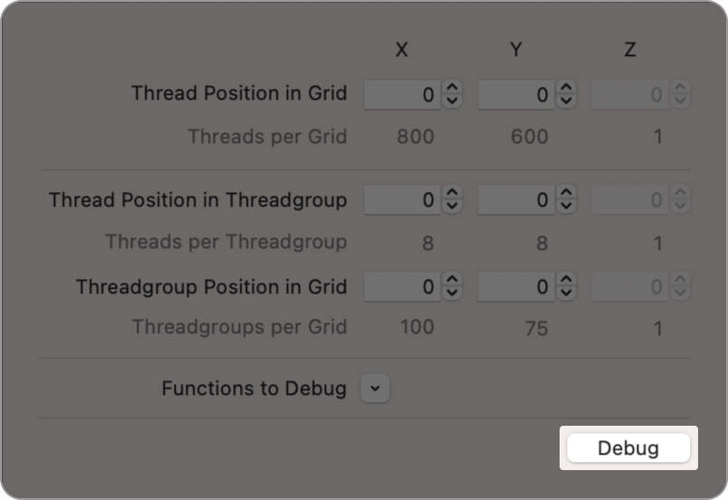

还可以展开 Functions to Debug 选项，以选择着色器源码中的函数子集。使用函数子集可以大幅减少着色器调试器的初始处理量。

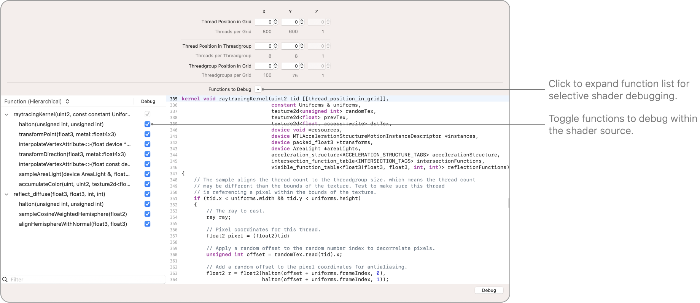

在 Vertex、Mesh、Object 和 Fragment 标签页中，也可以按住 Option 键并点按 Debug 来选择函数子集。

### 逐步执行着色器代码

点按 Debug 按钮后，着色器调试器会在 Shader 编辑器中显示着色器源码（请参阅[检查着色器](inspecting-shaders.md)）。
左侧的调用树显示着色器中执行的每一行。变量值显示在 Shader 编辑器中着色器各行源码的右侧。例如，在下面的截图中，可以看到 `in` 变量的值包含 `721.5`、`815.5` 等数值。

着色器调试器的截图，其中 Shader 编辑器和 Attachments 查看器并排显示。左侧的 Debug 导览器显示感兴趣区域和调用树。

如果着色器生成的结果不正确，可以逐行检查变量值，直到发现指示问题原因的意外值。使用调用树快速检查着色器：

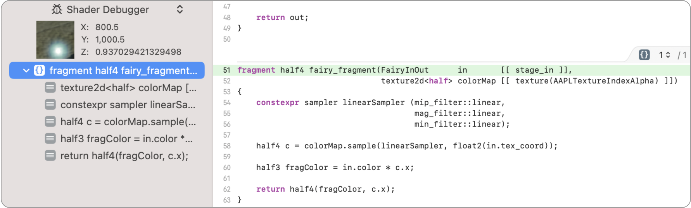

着色器调试器中有一个活动着色器调试会话的截图。调用树中的顶层函数已被选中，右侧 Shader 编辑器中对应的源码行被突出显示。

在调用树中选择一行时，右侧 Shader 编辑器中对应的源码行会以绿色突出显示。此行也称为_播放头（playhead）的位置_。在调用树中使用键盘箭头键，逐行向前移动播放头。逐步浏览调用树时，Shader 编辑器源码中的播放头也会随之移动。

| 箭头键 | 步进方向 |
|---|---|
| 向下箭头 | 向前一步 |
| 向上箭头 | 向后一步 |
| 向右箭头 | 步入 |
| 向左箭头 | 步出 |

也可以点按 Shader 编辑器中的任意一行来更改播放头位置，着色器调试器会移到调用树中的相应函数。

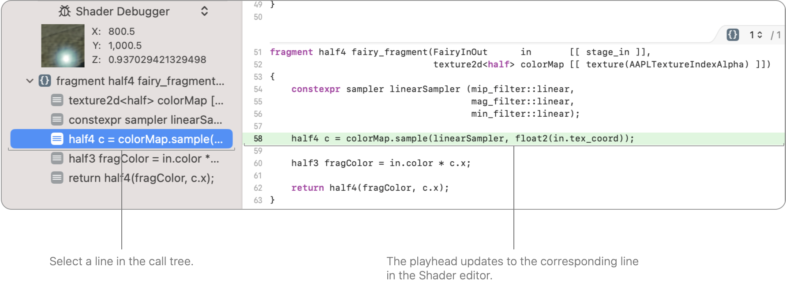

着色器调试器中有一个活动着色器调试会话的截图。调用树中选中了一行代码。

### 迭代循环

与传统 CPU 调试器不同，着色器调试器会同时显示所有变量的值，无需步进到下一行。如果决定不使用调用树迭代循环，可以直接在 Shader 编辑器中切换可见的循环迭代。在循环上方右侧、变量边栏之前，点按 Loop Iteration 标签页。选择其他迭代时，边栏中的变量会更新，以反映这些变量在该次迭代中的值。

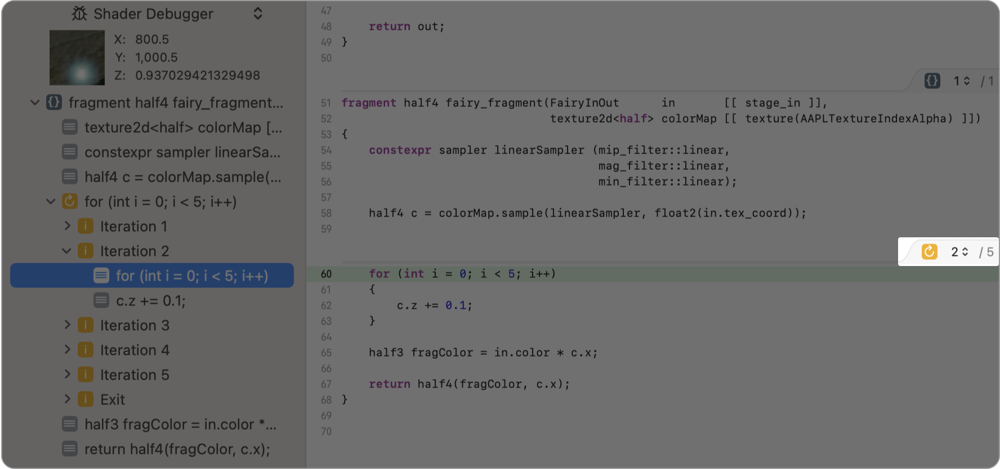

着色器调试器中有一个活动着色器调试会话的截图。Loop Iteration Selection 菜单已打开，并选中了第 5 次迭代。

### 检查变量值

要检查变量值，请将指针移到变量上。例如，在下面的截图中，将指针悬停在 `linearSampler` 上会在弹出窗口中显示采样器属性。

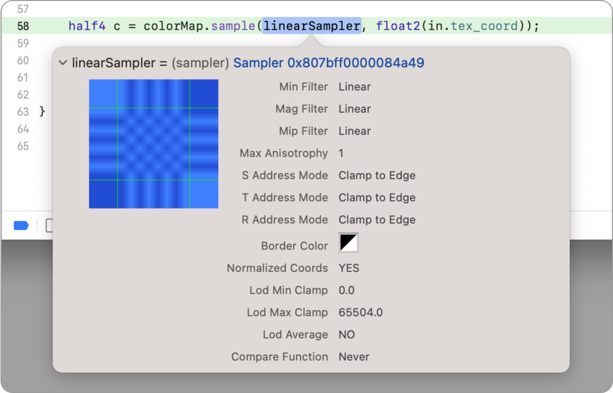

也可以切换变量边栏中的 Preview 按钮，在源码内联位置显示值。如果希望同时比较多个变量的值，此功能非常有用。

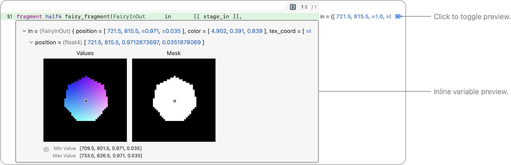

如果变量具有嵌套属性，可以逐级将其展开。

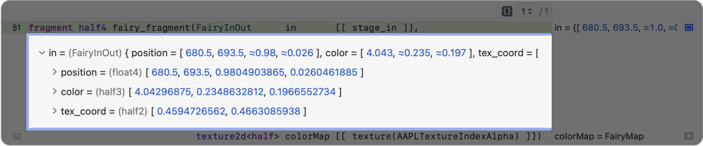

这样可以显示 Shader 编辑器右侧边栏无法容纳的更多内容，从而深入查看对象数据。

除了所选像素或线程外，着色器调试器还会在所谓的_感兴趣区域_中显示附近像素或线程组内其他线程的变量值。展开变量预览时，着色器调试器会显示感兴趣区域中所有像素或线程的变量值。

> [!tip] 提示
> 感兴趣区域在 Attachments 查看器中显示为荧光橙色方块（请参阅[检查绘制命令的附件](inspecting-the-attachments-of-a-draw-command.md)），在 Geometry 查看器中则显示为橙色顶点（请参阅[检查绘制命令的几何体](inspecting-the-geometry-of-a-draw-command.md)）。

使用这种渲染方式直观检查变量是否为预期值。对于图形数据，与单独查看数值数据相比，可视化结果可能更容易验证。将指针移到像素或线程上，可以查看相应变量值。然后，可以点按该像素或线程将其选中。Shader 编辑器会自动更改变量边栏中的变量，以反映着色器使用新选择的像素或线程执行时这些变量的值。

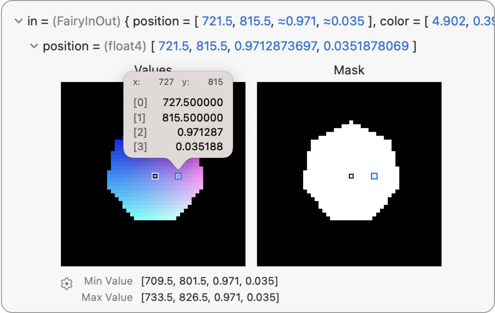

在预览中，蒙版会显示感兴趣区域内执行了该行代码的像素或线程。请看下面的示例，其中片段着色器会根据顶点输入位置进行分支。在蒙版中，感兴趣区域内满足条件的像素显示为白色，不满足条件的像素显示为黑色。

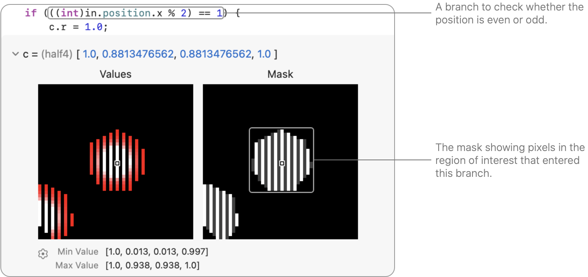

### 更新着色器

更改着色器后，可以点按调试栏中的 Reload Shaders 按钮，使用新源代码更新捕获帧。

更新捕获帧后，着色器调试器会执行以下操作：

- 更新变量视图以显示新值。
- 在助理编辑器中重新绘制附件。
- 保持你在捕获帧中的位置，提供一个改善着色器开发和调试体验的交互式环境。

> [!important] 重要
> 对着色器源码的更改只存在于着色器调试器中，原始源代码不会发生变化。如果重新加载着色器后结果看起来正确，请务必将更改复制到原始着色器源代码中。

如果着色器生成的结果正确，但运行耗时较长，请考虑对 Metal 工作负载进行性能分析，并在 Shader 编辑器中检查着色器源码。有关更多信息，请参阅[检查着色器](inspecting-shaders.md)。

## 另请参阅

### Metal 命令分析

- [检查命令的绑定资源](inspecting-the-bound-resources-for-a-command.md) — 通过检查编码器中任意位置的绑定资源来发现问题。
- [检查绘制命令的几何体](inspecting-the-geometry-of-a-draw-command.md) — 通过检查当前几何体，找出 App 的顶点函数、对象函数或网格函数中的问题。
- [检查绘制命令的附件](inspecting-the-attachments-of-a-draw-command.md) — 通过检查单个像素和样本来发现附件问题。
- [使用 GPU 计数器分析绘制命令和计算调度性能](analyzing-draw-command-and-compute-dispatch-performance-with-gpu-counters.md) — 通过检查性能计数器来识别帧捕获中的问题。
- [使用管线统计信息分析绘制命令和计算调度性能](analyzing-draw-command-and-compute-dispatch-performance-with-pipeline-statistics.md) — 通过检查管线统计信息来识别帧捕获中的问题。
