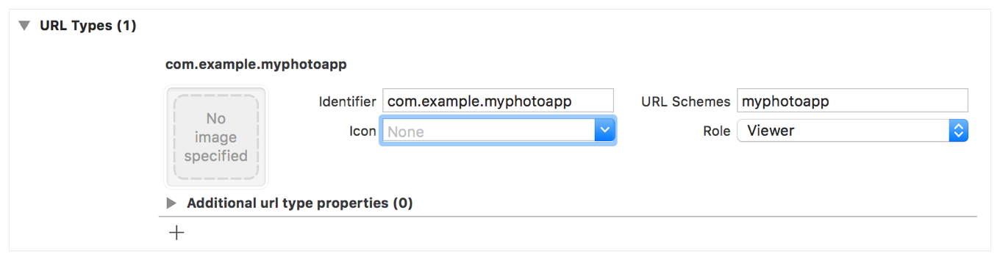

> 导航：[Technologies](../technologies.md) · [Xcode](../xcode.md) · [Projects and workspaces](projects-and-workspaces.md) · [Allowing apps and websites to link to your content](allowing-apps-and-websites-to-link-to-your-content.md)

# 为你的 App 定义自定义 URL scheme

<sub>文章</sub>

使用格式特殊的 URL 来链接到你 App 内部的内容。

## 概述

自定义 URL scheme 提供了一种引用你 App 内部资源的方式。例如，用户点按电子邮件中的自定义 URL 时，会以指定的上下文启动你的 App。其他 App 也可以携带特定的上下文数据触发你的 App 启动；例如，一个照片库 App 可能会显示指定的图像。

虽然自定义 URL scheme 是一种可以接受的深层链接（deep linking）形式，但更推荐使用通用链接（universal link）。关于通用链接的更多信息，请参阅 [Allowing apps and websites to link to your content](allowing-apps-and-websites-to-link-to-your-content.md)。

Apple 支持与系统 App 关联的常见 scheme，例如 `mailto`、`tel`、`sms` 和 `facetime`。你可以定义自己的自定义 scheme，并注册你的 App 来支持它。

> [!warning] 警告
> URL scheme 为攻击你的 App 提供了潜在的入口，因此务必验证所有 URL 参数，并丢弃任何格式不正确的 URL。此外，将可用的操作限制在不会危及用户数据的范围内。例如，不要允许其他 App 直接删除内容或访问用户的敏感信息。在测试你的 URL 处理代码时，请确保你的测试用例中包含格式不正确的 URL。

要支持自定义 URL scheme：

1. 定义你 App 的 URL 格式。
2. 注册你的 scheme，以便系统将相应的 URL 定向到你的 App。
3. 处理你 App 接收到的 URL。

URL 必须以你的自定义 scheme 名称开头。为你 App 支持的任何选项添加参数。例如，一个照片库 App 可能会定义一种 URL 格式，其中包含要显示的相册的名称或索引。这种 scheme 的 URL 示例可能包括以下内容：

```other
myphotoapp:albumname?name="albumname"
myphotoapp:albumname?index=1
```

客户端根据你的 scheme 构造 URL，并通过调用 [UIApplication](../uikit/uiapplication.md) 的 [open(_:options:completionHandler:)](<../uikit/uiapplication/open(__options_completionhandler_).md>) 方法，请求你的 App 打开这些 URL。客户端可以要求系统在你的 App 打开该 URL 时通知它们。

```swift
let url = URL(string: "myphotoapp:Vacation?index=1")

UIApplication.shared.open(url!) { (result) in
    if result {
       // 该 URL 已成功送达！
    }
}
```

### 注册你的 URL scheme

URL scheme 注册用于指定哪些 URL 应重定向到你的 App。在 Xcode 中，从项目设置的 Info 标签页注册你的 scheme。按照下图所示，更新 URL Types 部分，声明你 App 支持的所有 URL scheme。

- 在 URL Schemes 框中，指定你 URL 所使用的前缀。
- 为你的 App 选择一个角色：对于你自己定义的 URL scheme 使用 editor 角色，对于你 App 采用但并非由其定义的 scheme 使用 viewer 角色。
- 为你的 App 指定一个标识符。



你为 scheme 提供的标识符，用来将你的 App 与其他声明支持同一 scheme 的 App 区分开。为确保唯一性，请指定一个融合了公司域名和 App 名称的反向 DNS 字符串。尽管使用反向 DNS 字符串是一种最佳实践，但它并不能阻止其他 App 注册相同的 scheme 并处理相关联的链接。请使用通用链接而不是自定义 URL scheme，来定义与你网站唯一关联的链接。

> [!note] 注意
> 如果多个 App 注册了相同的 scheme，系统实际定向到的 App 是不确定的。没有机制可以改变这个 App，也没有机制可以改变各 App 在共享面板中出现的顺序。

一些 URL scheme 是系统保留使用的。系统会将已知类型的 URL 定向到相应的系统 App，将已知的基于 `http–` 的 URL 定向到诸如地图、YouTube 和音乐等特定 App。关于 Apple 支持的 scheme 的信息，请参阅 [Apple URL Scheme Reference](https://developer.apple.com/library/archive/featuredarticles/iPhoneURLScheme_Reference/Introduction/Introduction.html#//apple_ref/doc/uid/TP40007899)。

### 处理传入的 URL

当另一个 App 打开一个包含你自定义 scheme 的 URL 时，系统会在必要时启动你的 App，并将其带到前台。系统通过调用你 App 委托的 [application(_:open:options:)](<../uikit/uiapplicationdelegate/application(__open_options_).md>) 方法，将该 URL 传递给你的 App。在该方法中添加代码，解析 URL 的内容并采取相应的操作。为确保该 URL 被正确解析，请使用 [NSURLComponents](../foundation/nsurlcomponents.md) API 来提取各个组成部分。关于该 URL 的其他信息，例如是哪个 App 打开了它，可以从系统提供的 options 字典中获取。

```swift
func application(_ application: UIApplication,
                 open url: URL,
                 options: [UIApplicationOpenURLOptionsKey : Any] = [:] ) -> Bool {

    // 确定 URL 是谁发送的。
    let sendingAppID = options[.sourceApplication]
    print("source application = \(sendingAppID ?? "Unknown")")

    // 处理该 URL。
    guard let components = NSURLComponents(url: url, resolvingAgainstBaseURL: true),
        let albumPath = components.path,
        let params = components.queryItems else {
            print("Invalid URL or album path missing")
            return false
    }

    if let photoIndex = params.first(where: { $0.name == "index" })?.value {
        print("albumPath = \(albumPath)")
        print("photoIndex = \(photoIndex)")
        return true
    } else {
        print("Photo index missing")
        return false
    }
}
```

系统也会使用你 App 委托的 [application(_:open:options:)](<../uikit/uiapplicationdelegate/application(__open_options_).md>) 方法，来打开你 App 支持的自定义文件类型。

如果你的 App 已经采用了[Scenes](../uikit/scenes.md)，并且你的 App 尚未运行，系统会在启动后将该 URL 传递给 [scene(_:willConnectTo:options:)](<../uikit/uiscenedelegate/scene(__willconnectto_options_).md>) 委托方法；而当你的 App 正在运行或在内存中处于挂起状态时打开某个 URL，系统则会将其传递给 [scene(_:openURLContexts:)](<../uikit/uiscenedelegate/scene(__openurlcontexts_).md>)。

```swift
func scene(_ scene: UIScene, 
           willConnectTo session: UISceneSession, 
           options connectionOptions: UIScene.ConnectionOptions) {

    // 确定 URL 是谁发送的。
    if let urlContext = connectionOptions.urlContexts.first {

        let sendingAppID = urlContext.options.sourceApplication
        let url = urlContext.url
        print("source application = \(sendingAppID ?? "Unknown")")
        print("url = \(url)")

        // 以与 UIApplicationDelegate 示例类似的方式处理该 URL。
    }

    /*
     *
     */
}
```
