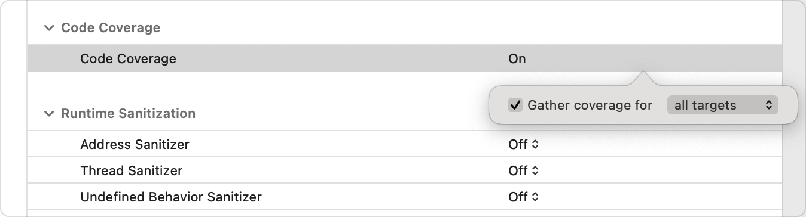
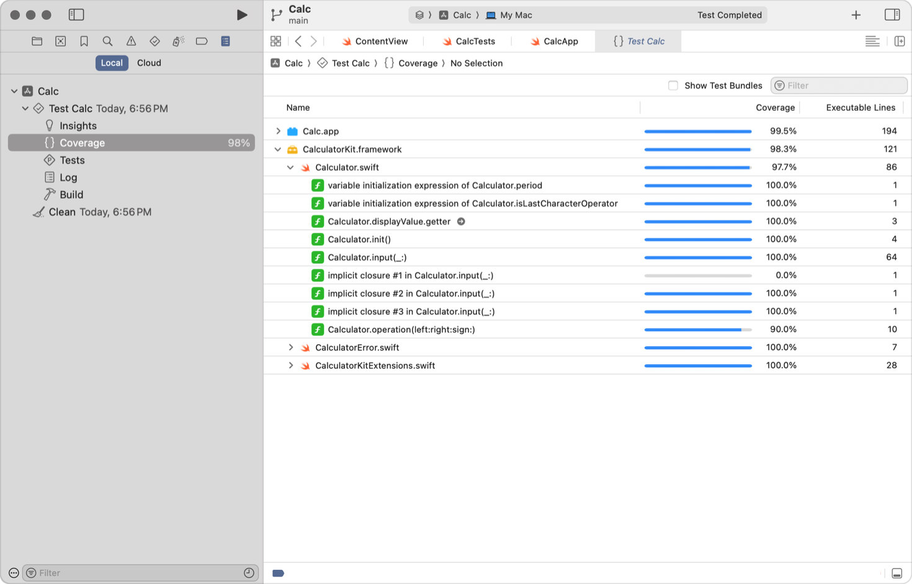
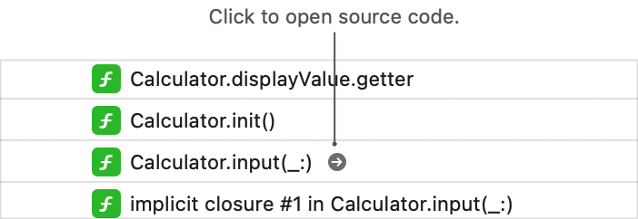
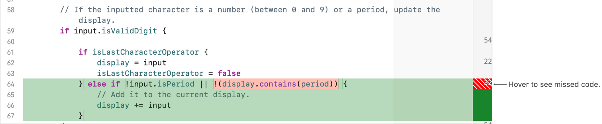

> 导航：[技术](../technologies.md) · [Xcode](../xcode.md) · [测试](testing.md)

# 确定测试覆盖了多少代码

文章

使用代码覆盖率，将新测试的开发重点放在缺乏充分测试的区域。

## 概述

通过实施代码覆盖率，你可以直观呈现并测量实际测试了多少代码。在开发期间使用它，可识别测试遗漏的区域。虽然获得较高的覆盖率是一个很好的目标，但仅有代码覆盖率并不能确保测试发挥作用，也不能确保测试足以应对意外行为。请务必将高代码覆盖率与编写良好的测试相结合。

代码覆盖率可以回答：

- 执行测试时，实际运行了哪些代码？
- 你没有测试代码的哪些部分？
- 你是否编写了足够多的测试，以确保检查所有代码？

### 在测试计划中启用代码覆盖率

代码覆盖率是可为测试计划配置的测试选项。启用代码覆盖率后，构建系统会指示代码根据方法和函数的调用频率收集覆盖率数据。无论是单元测试还是用户界面测试，代码覆盖率选项都可以收集数据，报告正确性测试和性能测试的情况。

> [!note] 注意
> 收集代码覆盖率数据会影响代码性能。即使影响很显著，它也是线性的，因此两次启用代码覆盖率的运行结果仍然具有可比性。不过，在严格评估测试中例程的性能时，请考虑这种影响。

请按照以下步骤，在测试计划的「Configurations」面板中启用代码覆盖率：

1. 从项目导览器或方案（scheme）编辑器中打开一个测试计划。有关创建测试计划的更多信息，请参阅[通过将测试组织到测试计划中来改进代码评估](organizing-tests-to-improve-feedback.md)。
2. 点按「Configurations」标签页。
3. 选择一个特定配置，或者选择「Shared Settings」以对所有配置启用测试。
4. 向下滚动到「Code Coverage」部分。
5. 点按「Code Coverage」的值，然后在弹出窗口中选中「Gather coverage for」复选框。
6. 使用弹出式菜单中的选项，选择要从哪些目标收集信息。

### 检查代码覆盖率结果

完成一次测试运行后，Xcode 会使用覆盖率数据在报告导览器的「Coverage」面板中创建报告。覆盖率报告显示测试运行的摘要信息、源文件和文件内函数的列表，以及各自的覆盖率百分比。

源代码编辑器会显示文件中每行代码的计数，并高亮标记未执行的代码。它会高亮标记需要覆盖的代码区域，而不是已经覆盖的区域。

例如，将指针置于上方覆盖率报告中的 `Calculator.input(_:)` 方法上时，会显示一个按钮，可将你带到带注解的源代码。

覆盖率注解显示在右侧，表明测试执行特定代码部分的次数。你可以将指针悬停在红色高亮区域上，以识别测试未覆盖的代码。

根据上方屏幕截图中的计数，测试频繁调用了 `Calculator.input(_:)` 方法。不过，该方法中仍有一些部分未被测试调用。这份报告数据表明，你可以为遗漏的条件编写测试，以确保错误处理按预期工作。

> [!note] 注意
> Swift Testing 和 XCTest 支持标识需要跳过的测试，或因为已知问题而预期失败的测试。代码覆盖率指标不包括已跳过的测试，但会包括运行时标记有已知问题或预期失败的测试。评估代码覆盖率时请考虑这一点，并尽快尝试解决问题。

## 另请参阅

### 测试开发

- [向 Xcode 项目添加测试](adding-tests-to-your-xcode-project.md) — 添加测试目标，构建用于测试函数逻辑、检查集成问题、自动执行用户界面工作流和测量性能的代码。
- [更新现有代码库以适应单元测试](updating-your-existing-codebase-to-accommodate-unit-tests.md) — 移除组件之间的耦合，以提高测试覆盖率和可靠性。
- [通过将测试组织到测试计划中来改进代码评估](organizing-tests-to-improve-feedback.md) — 通过创建和配置测试计划，控制软件工程流程不同阶段从测试中获得的信息。
