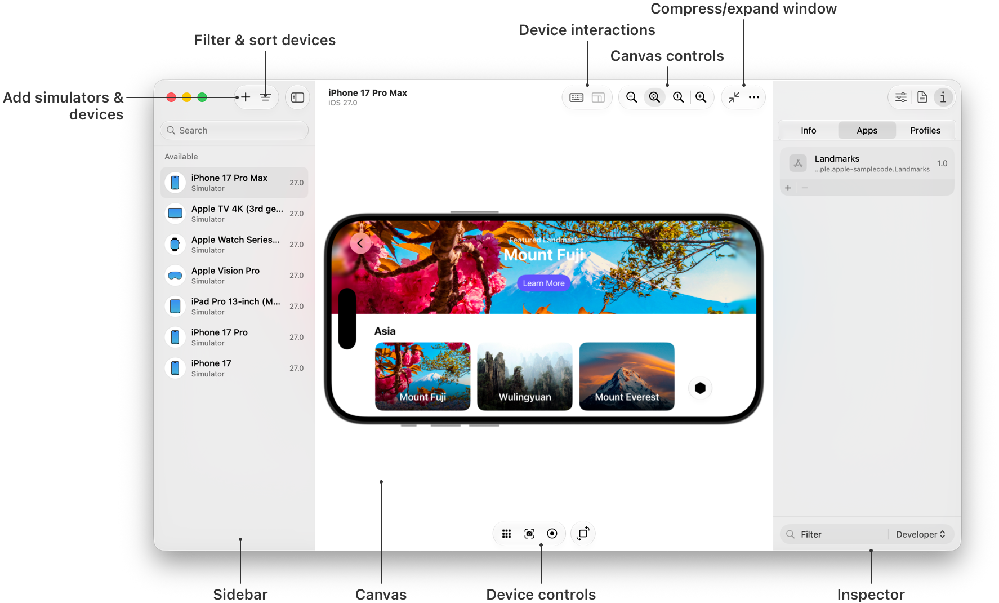

> 导航：[技术](../technologies.md) · [Xcode](../xcode.md)

# Device Hub 概览

管理你用于测试 App 的模拟设备和实体设备。

## 概述

你可以使用 Device Hub 管理在 Xcode 中显示为运行目标的所有设备。

在 Device Hub 中的模拟设备上运行你的 App，可以快速评估新功能、修复错误，并查看界面在你无法实际使用的设备上如何工作。在实体设备上运行 App，可以测试依赖硬件的功能或服务，或者调查性能问题。有关更多信息，请参阅[在模拟设备或实体设备上运行你的 App](running-your-app-on-simulated-or-physical-devices.md)。

Device Hub 展开窗口的屏幕截图，左侧边栏显示可用设备，中间画布正在运行 iPhone 模拟器，右侧检查器显示了一个已安装的 App。

在 Xcode 中，当你在模拟设备或实体设备上运行 App 时，Device Hub 会打开一个紧凑窗口，在设备屏幕上显示你的 App，你可以使用 Mac 上的控制方式与其交互。对于实体设备，你可以同时与 Device Hub 中的视图和实体设备进行交互。有关更多信息，请参阅[在 Device Hub 中与你的 App 交互](interacting-with-your-app-in-device-hub.md)。

若要使用更多控制项，请展开 Device Hub 紧凑窗口，分别显示边栏、画布和检查器区域。使用检查器可更改设备外观、获取基本信息（例如名称、操作系统版本和设备 ID）、下载诊断文件等。

若要管理模拟设备和实体设备，请在边栏中选择设备以在画布中查看其状态。若要添加实体设备，请使用 Device Hub 通过无线方式或连接到 Mac 的线缆配对设备。有关更多信息，请参阅[在 Device Hub 中管理模拟设备和实体设备](managing-your-simulated-and-physical-devices-in-device-hub.md)。

## 主题

### 基础

- [在模拟设备或实体设备上运行你的 App](running-your-app-on-simulated-or-physical-devices.md) — 在模拟的 iOS、iPadOS、tvOS、visionOS 或 watchOS 设备上，或者在与你的 Mac 配对的实体设备上启动你的 App。
- [在 Device Hub 中管理模拟设备和实体设备](managing-your-simulated-and-physical-devices-in-device-hub.md) — 添加自定模拟器并将实体设备与你的 Mac 配对，以便在 Xcode 中将其选为运行目标。
- [在设备上启用开发者模式](enabling-developer-mode-on-a-device.md) — 在 iOS、iPadOS、watchOS 和 visionOS 中允许或拒绝本地安装的 App 运行。

### 设备交互

- [配置模拟设备的环境](configuring-the-environment-of-a-simulated-device.md) — 修改模拟设备的设置。
- [在 Device Hub 中与你的 App 交互](interacting-with-your-app-in-device-hub.md) — 使用 Device Hub 控制与模拟设备和实体设备上的 App 的交互。
- [从设备捕捉屏幕截图和视频](capturing-screenshots-and-videos-from-devices.md) — 录制交互并捕捉 App 的屏幕截图，以便共享、审查或提交到 App Store。

## 另请参阅

### 调优与调试

- [调试](debugging.md) — 使用 Xcode 调试器、Xcode Organizer、Metal 调试器和 Instruments 识别并解决你的 App 中的问题。
- [性能与指标](performance-and-metrics.md) — 使用 Instruments 和 Xcode Organizer 测量、调查并解决系统资源使用情况以及影响性能的问题。
- [测试](testing.md) — 开发并运行测试，以检测逻辑故障、用户界面问题和性能衰退。
