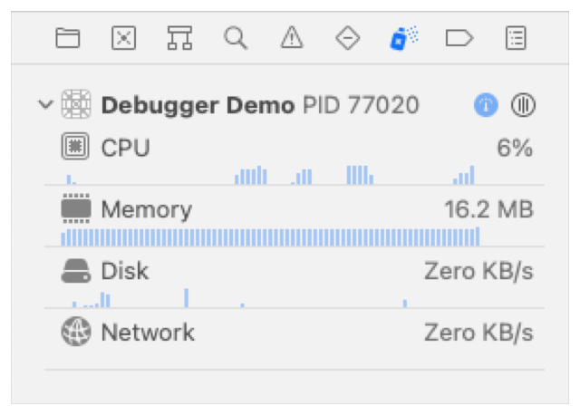
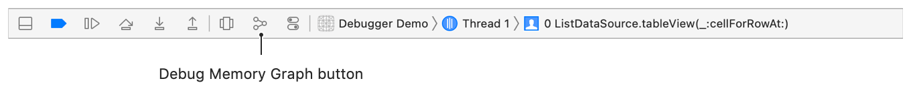
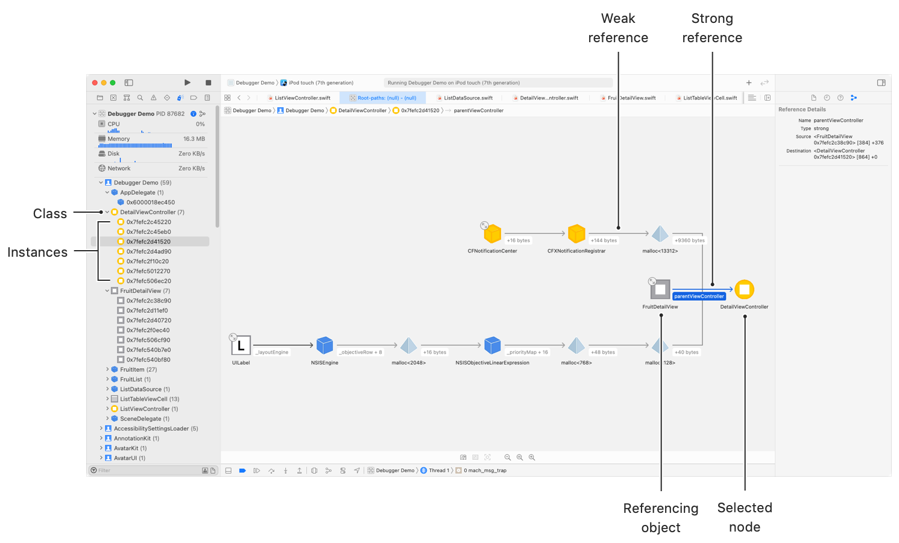

> 导航：[技术](../technologies.md) · [Xcode](../xcode.md) · [调试](debugging.md)

# 诊断并解决运行中 App 的错误

文章

检查你的 App，以隔离错误、定位崩溃、识别过量的系统资源使用、直观呈现内存错误，并调查其外观问题。

## 概述

单元测试可以确定代码产生的结果是否符合预期，但当结果不符合预期时，它无法解释原因。若要诊断错误，请附加调试器、重现错误，然后在 App 通过断点运行时检查代码关键位置的变量，逐步缩小根本原因的范围。如果你使用「Info」设置中的「Debug executable」复选框配置方案（scheme）的运行操作以进行调试，App 使用该方案时会自动附加到调试器。若要将调试器附加到已经运行的进程，请选择「Debug」→「Attach to Process」，然后从列表中选择你的 App 进程。请遵循相同的过程诊断并解决代码错误、崩溃、内存泄漏和布局问题。

### 暂停 App 以检查变量并隔离错误

若要修复错误，首先需要了解其原因。若要缩小错误原因的范围，请制定一组能够可靠重现错误的步骤：

1. 确定错误发生在源代码的哪个位置。
2. 在你认为错误发生点之前的源代码中设置断点，以暂停 App。
3. 查看变量并确认它们具有预期的值。如果没有，请从第 1 步重新开始。
4. 逐步执行代码并观察变量变化。记录变量在何处出现意外值。
5. 分析代码以确定修复方案。

确定可能的修复方案后，请更改代码并重新测试能否重现错误，以确认诊断结果。如果更改解决了问题，说明你已经修复错误。如果更改没有解决问题，请重新考虑错误可能发生的位置，并重复这些步骤来隔离和修复错误。

有关设置断点和检查变量的更多信息，请参阅[设置断点以暂停正在运行的 App](setting-breakpoints-to-pause-your-running-app.md)和[逐步执行代码并检查变量以隔离错误](stepping-through-code-and-inspecting-variables-to-isolate-bugs.md)。

### 定位崩溃、异常和运行时问题

当 App 遇到崩溃、异常或运行时问题时，可能很难精确定位引起问题的代码，因为崩溃的栈回溯并不总是指向导致崩溃的代码行。使用以下准则识别问题特征，然后设置正确类型的断点：

- 停在 `main` 或高亮标记 `AppDelegate` 的崩溃通常是 Objective-C 异常。
- 由运行时问题引发的崩溃也会停在 `main` 或高亮标记 `AppDelegate`，并且可能显示类似“Thread 8: EXC_BAD_INSTRUCTION (code=…)”的消息。
- 停在未捕获或未处理 Swift 错误处的崩溃会显示致命错误消息，并指出一个 Swift 错误。

根据问题特征在代码中的相应位置添加断点，然后在 App 停在断点时检查代码执行状态。有关设置断点和识别崩溃的更多信息，请参阅[设置断点以暂停正在运行的 App](setting-breakpoints-to-pause-your-running-app.md)和[识别常见崩溃的原因](identifying-the-cause-of-common-crashes.md)。

> [!note] 注意
> 当 Swift 代码使用来自 Objective-C 模块的代码时，它可能会收到 Objective-C 异常。

### 在不暂停的情况下检查变量和执行序列

开发代码时，记录操作和变量值有助于理解代码如何运行，以及变量在 App 不同位置具有什么值。开发_并发代码（concurrent code）_（即在多个队列或线程上同时执行的代码）时尤其如此，因为错误可能间歇出现且难以重现。你经常能在正常执行时重现错误，却无法在调试器中逐步执行时重现，因为正常执行与调试的时序不同。调试器提供了一些工具，可在不暂停且不扰乱并发代码时序的情况下检查变量。

开发者通常会添加 `print` 或 `NSLog` 语句来查看变量值。这种技术虽然有效，但会添加开发完成后不再有用的额外代码，还会让 App 的控制台充满干扰信息，使后续错误更难诊断。请改用断点操作来了解 App 中事件发生的时间，并在不暂停的情况下检查变量值。

若要以最小的时序影响确定代码是否执行，请使用断点操作播放声音并继续执行。如果运行 App 时调试器到达断点，它就会播放声音并确认代码已经执行。

若要在不暂停的情况下将变量值记录到控制台，请添加一个具有「Debugger Command」操作的断点，使用 `po` 打印对象的求值结果，或使用 `v` 将变量值打印到控制台。为断点选择「Automatically continue after evaluating actions」选项，以防止暂停。

若要将自定文本记录到控制台，并为变量值添加上下文，请添加一个具有「Log Message」操作的断点。指定你的自定文本，并加入表达式、断点名称或断点命中次数，以提供更多信息。

> [!note] 注意
> 因为 `po` 会动态编译代码来求表达式的值，所以对变量求值并将其记录到控制台所需的时间更长。若要减少时序问题，请改用 `v` 记录变量值。

使用其他断点操作可以执行 AppleScript 或 shell 脚本，或者捕捉 GPU 帧。

有关检查变量的更多信息，请参阅[设置断点以暂停正在运行的 App](setting-breakpoints-to-pause-your-running-app.md)和[逐步执行代码并检查变量以隔离错误](stepping-through-code-and-inspecting-variables-to-isolate-bugs.md)。

### 识别 CPU 和内存的潜在过度使用

开发和测试中一个容易忽视且十分常见的问题是过度使用 CPU 和内存。Xcode 调试器在调试导览器中提供仪表，帮助调查潜在问题。测试 App 时请监视这些仪表，以发现异常使用情况。点按仪表可查看更详细的信息。

CPU 仪表显示 App 随时间推移处理指令所需的 CPU 用量。当 App 绘制用户界面、处理从网络检索的数据或执行计算时，CPU 用量在短时间内升至相当高的数值是正常的。当这些任务完成，App 空闲并等待用户执行操作时，CPU 用量应为零或很低。如果 CPU 用量出现以下情况，请进一步分析：

- App 看似空闲时仍持续高于零。
- 超过 100% 的状态持续时间并非非常短暂。
- 用量非常高，且用户界面中出现卡顿（hitch）。

有关提升性能的更多信息，请参阅[提升你的 App 的性能](improving-your-app-s-performance.md)。

内存仪表显示 App 随时间推移使用了多少内存。首次启动 App 时，它从一个相当小的数值开始，低于 10 MB；随着用户在用户界面中导览，该数值会增加。如果你从网络获取、处理并存储数据，或者执行复杂计算，它也可能增加。处理完成后，它会随之降低。在 App 中导览时观察仪表，并记录内存用量何时升高和降低。呈现模态视图或向导览控制器（navigation controller）添加视图时，内存用量会增加；关闭这些视图或从中导览离开时，内存用量会降低。如果用量持续增加且从不降低，请调查是否存在内存泄漏或遗弃内存。有关减少内存使用和解决内存泄漏的更多信息，请参阅下文[直观呈现并诊断不断增加的内存用量](diagnosing-and-resolving-bugs-in-your-running-app.md#Visualize-and-diagnose-increasing-memory-usage)一节和[减少你的 App 的内存使用](reducing-your-app-s-memory-use.md)。

### 检测频繁的磁盘访问和网络使用

请注意因频繁访问磁盘和网络资源而产生的问题。你同样可以使用 Xcode 调试器中的仪表监视这些资源。Disk I/O 仪表显示 App 随时间推移从磁盘读取和向磁盘写入多少数据。该仪表会显示你是否：

- 存储用户在 App 中生成的数据。
- 将数据存储在用户偏好设置中。
- 从网络获取并存储数据。
- 从 App 包或 App 目录读取数据。

相比在内存中存储和读取数据，频繁在磁盘上执行这些操作会消耗更多电量，也会增加用户设备的磨损。若要了解磁盘使用是否异常，你需要了解正在存储和读取的数据大小，并将其与你在仪表中观察到的情况进行比较。例如，如果你下载并存储一个 5 MB 的图形文件，以便在经常使用的视图中显示，但它写入的数据超过 50 MB，请调查远程图像是否频繁变化，或者是否需要配置网络以避免重复下载同一个图像。如果从磁盘读取的数据多于预期，请调查内存缓存解决方案是否有帮助，或者是否从 App 或视图生命周期中的错误位置发起数据读取，导致读取过于频繁。有关减少磁盘写入的更多信息，请参阅[减少磁盘写入](reducing-disk-writes.md)。

Network I/O 仪表显示 App 随时间推移从网络读取和向网络写入多少数据。如果 App 只使用本地资源，它可能不会从网络读取或向网络写入任何数据。通过网络传输数据会消耗电量并缩短设备电池续航时间，因此请尽可能减少数据传输。若要了解 App 的网络使用情况，请在 App 通过网络发送或接收数据时观察 Network I/O 仪表。例如，如果你为下载的图像实现了缓存系统，而访问这些图像时网络用量却增加，请确认 App 和服务器上的缓存设置正确。如果你正在上传用户生成的内容，而网络状况不佳时频繁上传失败导致网络用量很高，请实现一个从失败位置恢复并重新开始上传的系统，而不是重新上传整个文件。

### 直观呈现并诊断不断增加的内存用量

使用内存图诊断内存泄漏和遗弃内存的原因。内存泄漏可观察到的症状是：即使 App 中的情况表明内存用量应当降低，内存用量仍会随时间推移持续增加。内存泄漏可能发生在_保留循环（retain cycle）_中，也就是多个对象彼此保持强引用，但 App 已不再引用它们。这些对象仍留在内存中，App 无法将其移除。_遗弃内存（abandoned memory）_发生在你创建了对象且代码仍引用它们，但 App 已不再需要或使用它们时。

若要在调试器中查看内存图，请在断点处暂停 App，并点按调试栏中的「Debug Memory Graph」按钮。或者，在 App 运行时点按「Debug Memory Graph」按钮，以暂停 App 并显示内存图。

内存图视图会在调试导览器中将栈回溯替换为按库组织的类型列表，其中每种类型都具有一个名为_节点（node）_的实例列表。选择节点可查看其内存图。

节点的内存图会显示对该节点的所有内存引用，并高亮标记强引用。按住 Control 键点按图中的任何节点可执行更多操作，例如访问快速查看或将描述打印到控制台。选择「Focus on Node」可显示所选节点的图。点按引用可查看其详细信息，包括变量名称、引用类型（reference type）以及内存中的来源对象和目标对象。

Xcode 显示内存图，其中高亮标记了一个 DetailViewController 实例。调试导览器显示有七个 DetailViewController 实例和七个 FruitDetailView 实例。图中显示一个 FruitDetailView 实例对 DetailViewController 具有强引用。内存检查器显示 FruitDetailView 对 DetailViewController 的引用详情。

若要解决保留循环造成的内存泄漏：

1. 在 App 中导览时观察 Memory 仪表。
2. 记录 App 实例化对象时内存用量增加、但系统应当解除分配该对象时内存用量未降低的情况。
3. 检查内存图，查看该对象的实例数量是否异常，或者是否存在对它的不恰当强引用。
4. 如果存在对该对象的强引用，请按住 Control 键点按具有强引用的节点，然后选择「Focus on Node」查看其图。如果该节点也被该对象强引用，就形成了保留循环。
5. 通过将关系的一侧改为使用弱声明来引用另一个对象，或者移除对另一个对象的所有依赖以彻底移除引用，来解决保留循环。重新测试以确认更改解决了问题。

若要解决遗弃内存问题，请确定 App 生命周期中不再需要遗弃对象的时间点，并移除对它的所有引用。

### 检查并解决外观和布局问题

App 的某些外观或布局问题只会在你将系统配置为特定界面样式、动态文本大小，或 App 使用特定辅助功能时出现。以 iOS、iPadOS、macOS 和 tvOS App 为目标时，请使用环境覆盖在这些环境中测试界面。若要了解与视图位置或大小有关的问题，你可能需要在其他图层中各个视图的上下文里检查它们。以 iOS、iPadOS、macOS、tvOS 和 watchOS App 为目标时，请使用视图调试器；它会以分层方式显示视图层级结构（view hierarchy）的 3D 表示，帮助诊断这些问题。visionOS App 中的实体及其周围环境有时会以意外方式相互交互。启用可视化来表示坐标轴、边界框和其他通常不可见的信息，有助于了解这些交互。

有关使用这些功能调试 App 外观的信息，请参阅[诊断运行中 App 的外观问题](diagnosing-issues-in-the-appearance-of-your-running-app.md)。
